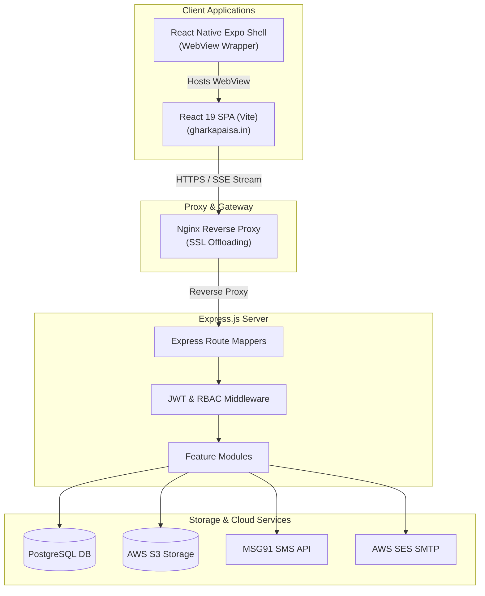
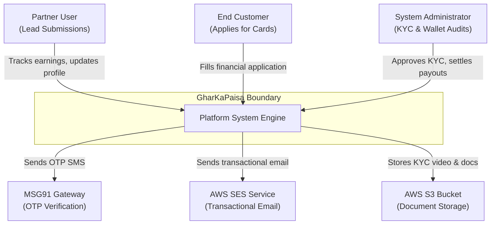
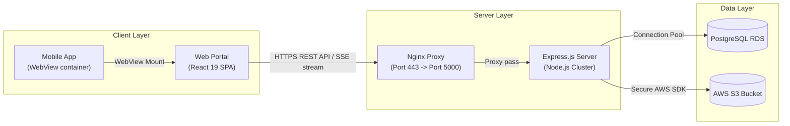
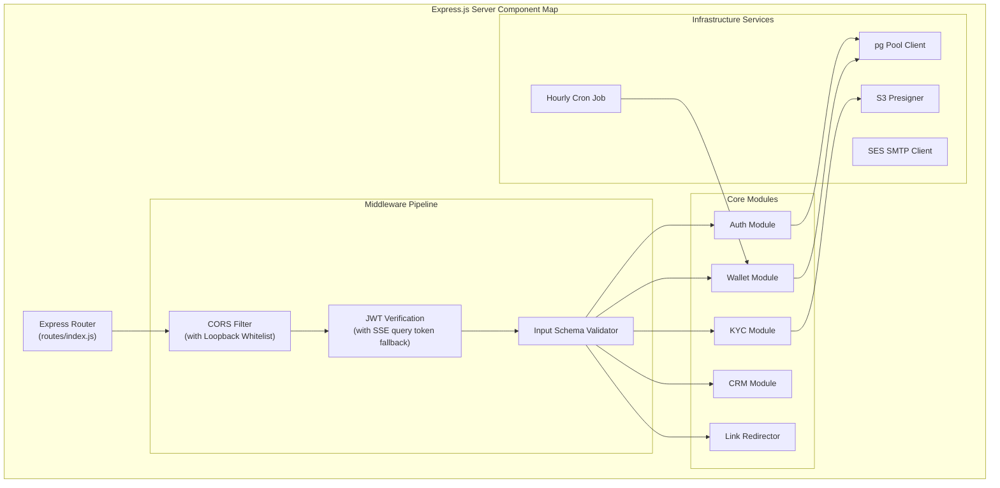
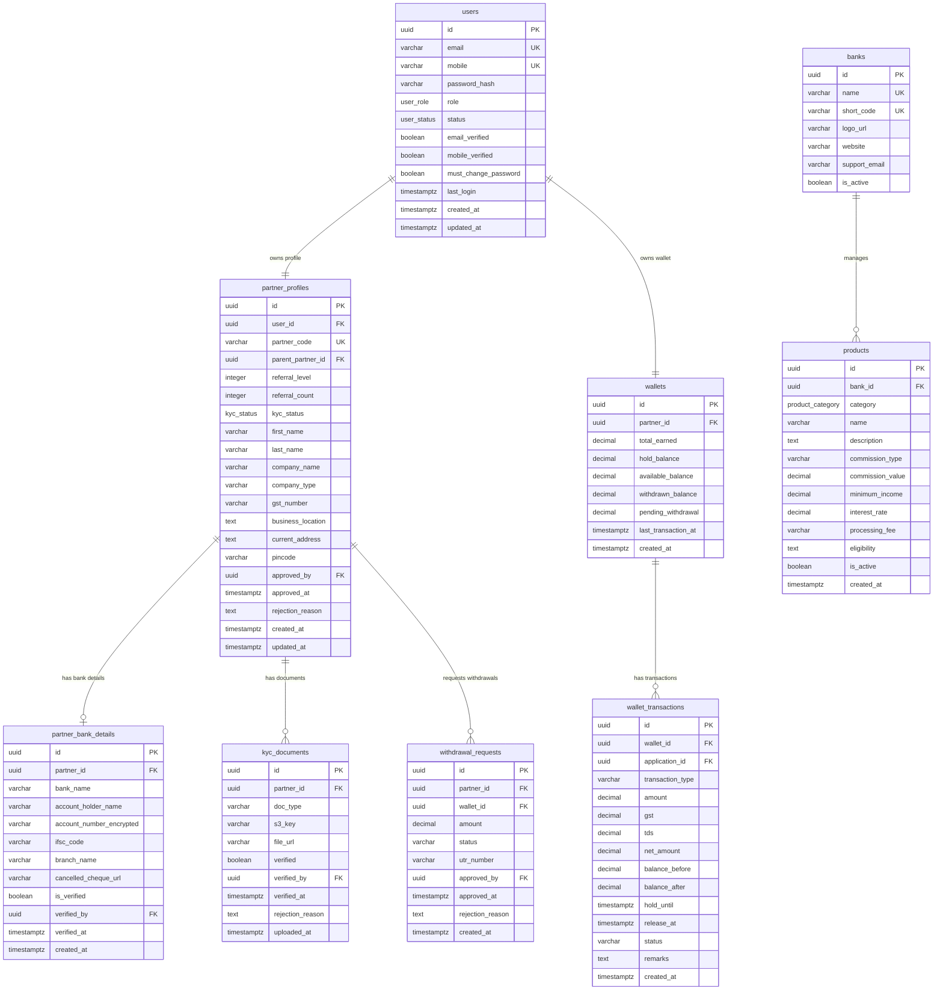
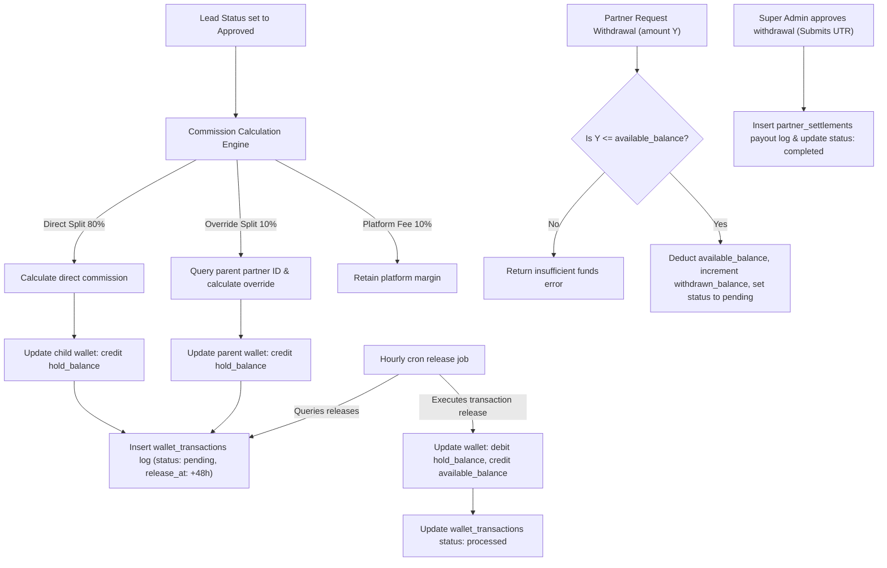
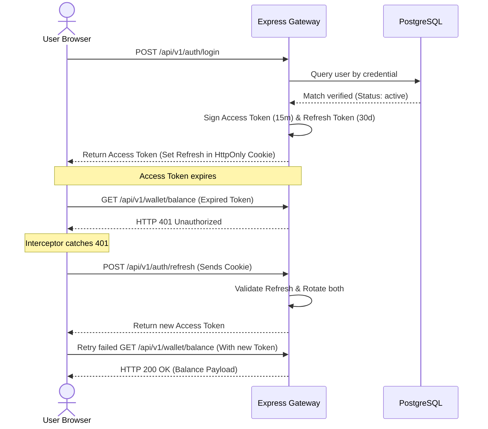
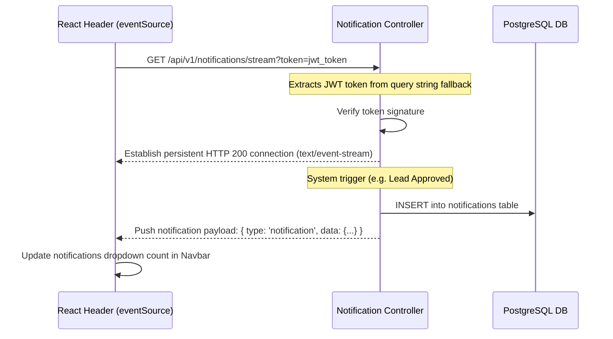

# GharKaPaisa - Enterprise Architecture & Software Design Specification

This document provides the definitive, reverse-engineered technical architecture and system design specification for the **GharKaPaisa** fintech platform.

---

## 1. System Overview & Technology Stack

GharKaPaisa is an enterprise-grade fintech platform designed for credit card lead attribution, loan applications, and multi-tier sub-partner commission settlements. The system is split into three main parts:

### Core Technologies
*   **Web Client**: React 19.2.6, Vite 8.0.12, Zustand 5.0.14 (state management), i18next 26.3.1 (multi-language), and Vanilla CSS variables.
*   **Backend Server**: Node.js, Express 4.18.2, pg 8.11.3 (Postgres pool), jsonwebtoken 9.0.3, and bcryptjs 3.0.3.
*   **Mobile Client**: Expo 54.0.33 / React Native 0.81.5 hosting a fullscreen `react-native-webview` component pointing to the responsive web portal.
*   **Cloud Integrations**: AWS S3 (documents, images, videos), AWS SES (transactional emails), and MSG91 (SMS OTPs).

---

## 2. C4 Model Specification

### Level 1: System Context Diagram
Shows how the system interacts with partners, customers, admins, and cloud providers.

### Level 2: Container Diagram
Details the runtime containers, protocols, and data pathways.

### Level 3: Component Diagram
Illustrates the internal controllers, services, and middleware layers within the backend container.

---

## 3. Database Schema (ERD)

The relational database is built on **PostgreSQL**. All enum alterations are executed idempotently by querying the `pg_enum` and `pg_type` catalogs before modifying types.

### Compatibility Views
To bridge legacy code column references with the enterprise schema, the migrations register database views:
*   **`referral_tree`**: Mapped directly to `partner_team_relationships` (`SELECT id, parent_partner_id, child_partner_id, level, created_at AS joined_at`).
*   **`cms_sections`**: Mapped directly to `homepage_sections` (`SELECT id, key AS section_key, title, items AS content, is_active, updated_at`).

---

## 4. Wallet Ledger & Multi-Tier Commission Flow

### TDS & GST Deductions
During withdrawal settlements:
*   **TDS (Tax Deducted at Source)**: 5% is deducted from the withdrawal amount if the partner lacks a corporate registration, or as configured.
*   **GST**: Deducted/applied dynamically depending on corporate GST availability.
*   **Net Settlement**: Net amount is calculated as `Gross - TDS - GST` and logged into the double-entry transaction record.

---

## 5. Sequence Flows

### A. Authentication & Session Security (JWT Rotation)
Browser-native `EventSource` connections cannot transmit headers. The standard resolution is passing the token as a query string parameter (`?token=...`) and letting the auth middleware verify it.

### B. Real-Time Notification Stream (SSE)

---

## 6. Security Analysis & Controls

1.  **JWT Authentication & Custom Guards**: Implements route-level role checkers (e.g. `authorize('ADMIN', 'SUPER_ADMIN')` and ownership locks `selfOrAdmin('PartnerId')`).
2.  **CORS Loopback Whitelist**: Configured to whitelist production domains while dynamically matching loopback addresses (`localhost` and `127.0.0.1`) on *any* port. This supports local developer test suites and WebView clients without exposing the API server to wildcard CORS hazards.
3.  **Bank Detail Encryption**: Sensitive banking information is run through AES-256-CBC encryption algorithms (`encrypt`/`decrypt` helpers) before writing database values, protecting user details in the database.
4.  **SQL Protection**: Database requests are executed via parameterized queries in the connection pool (`query('SELECT ... WHERE id = $1', [id])`) preventing SQL injection exploits.
