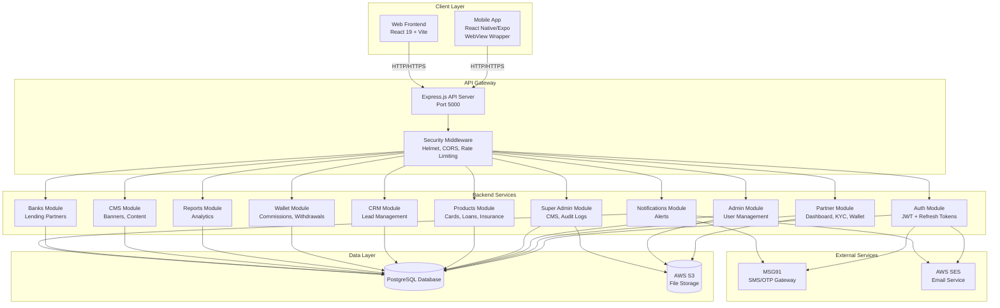
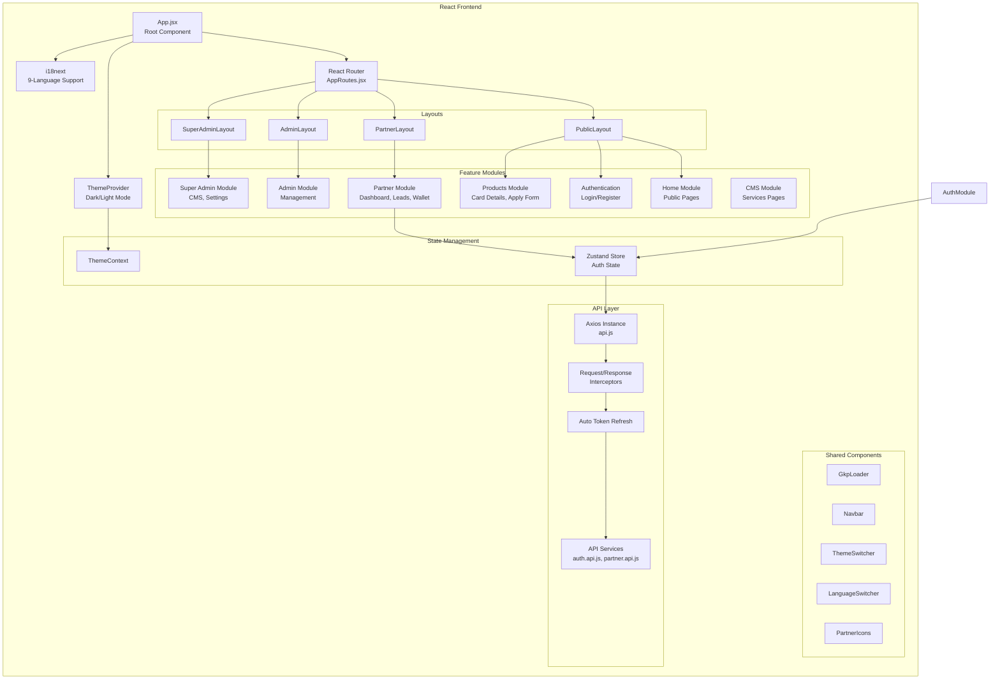
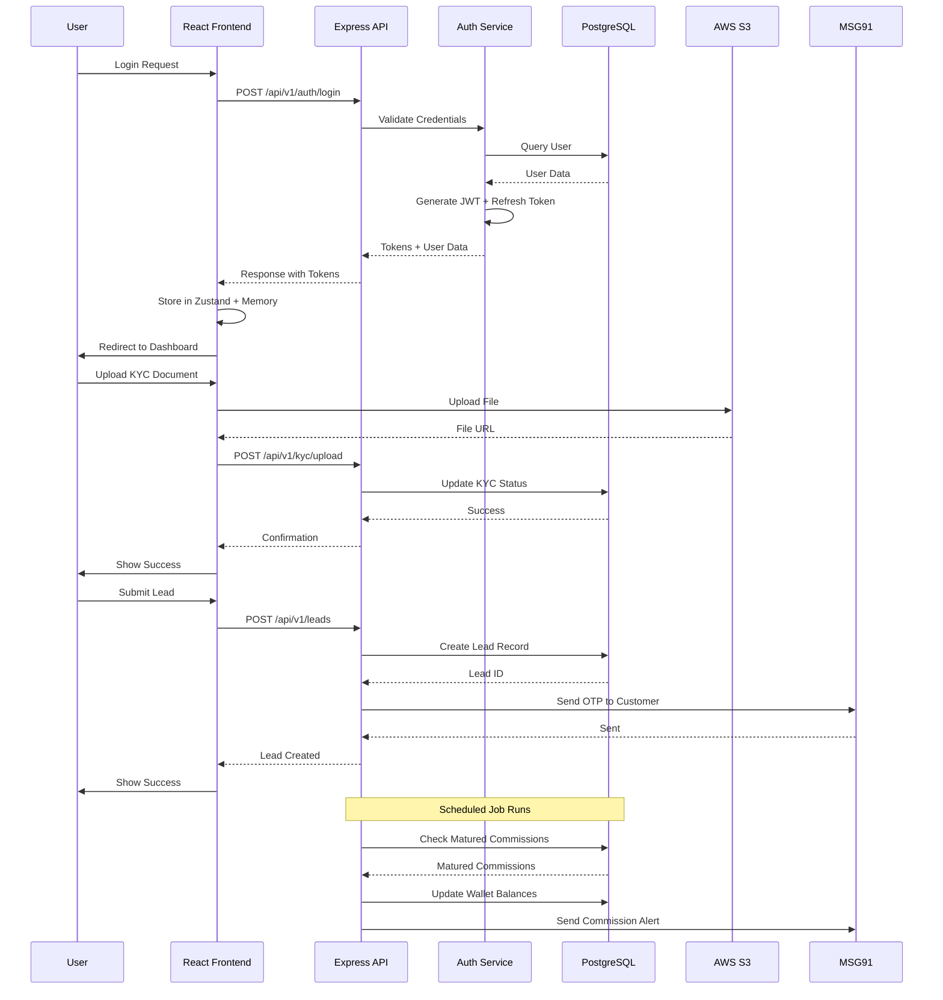
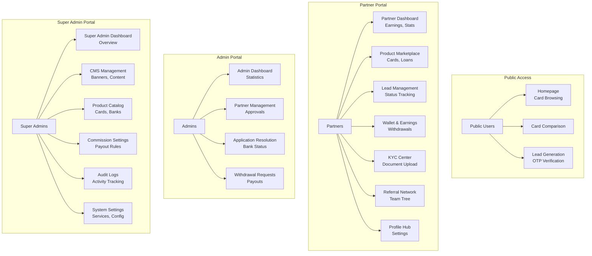

# GharKaPaisa Architecture Diagram

## High-Level System Architecture



## Frontend Architecture



## Backend Architecture

```mermaid
graph TB
    subgraph "Express.js Server"
        Server[server.js<br/>Entry Point]
        
        subgraph "Middleware"
            Security[Security Middleware<br/>Helmet, CORS, XSS Clean]
            RateLimit[Rate Limiting]
            BodyParser[Body Parser<br/>JSON, URL-encoded]
            Sanitizer[Data Sanitizer<br/>Mongo Sanitize]
            Logger[Morgan Logger<br/>Winston]
            Error[Error Handler]
        end
        
        subgraph "Routes"
            APIRouter[/api/v1 Router]
            AuthRoute[/auth Routes]
            PartnerRoute[/Partners Routes]
            AdminRoute[/admin Routes]
            SuperAdminRoute[/superadmin Routes]
            ProductRoute[/products Routes]
            WalletRoute[/wallet Routes]
            CRMRoute[/leads, applications Routes]
            CMSRoute[/cms, services Routes]
        end
        
        subgraph "Controllers"
            AuthController[Auth Controller]
            PartnerController[Partner Controller]
            AdminController[Admin Controller]
            SuperAdminController[Super Admin Controller]
            ProductController[Product Controller]
            WalletController[Wallet Controller]
            CRMController[CRM Controller]
            CMSController[CMS Controller]
        end
        
        subgraph "Services"
            AuthService[Auth Service]
            PartnerService[Partner Service]
            WalletService[Wallet Service]
            CommissionService[Commission Service]
            KYCService[KYC Service]
            NotificationService[Notification Service]
            ReportService[Report Service]
        end
        
        subgraph "Database Layer"
            DBConfig[Database Config<br/>Connection Pool]
            Migrations[Migrations]
            Seeders[Seeders]
            Procedures[Stored Procedures]
            Triggers[Triggers]
            Views[Views]
        end
        
        subgraph "Scheduled Jobs"
            CommissionJob[Commission Release Job]
            ReportJob[Report Generation Job]
        end
    end
    
    Server --> Security
    Security --> RateLimit
    RateLimit --> BodyParser
    BodyParser --> Sanitizer
    Sanitizer --> Logger
    Logger --> APIRouter
    APIRouter --> AuthRoute
    APIRouter --> PartnerRoute
    APIRouter --> AdminRoute
    APIRouter --> SuperAdminRoute
    APIRouter --> ProductRoute
    APIRouter --> WalletRoute
    APIRouter --> CRMRoute
    APIRouter --> CMSRoute
    
    AuthRoute --> AuthController
    PartnerRoute --> PartnerController
    AdminRoute --> AdminController
    SuperAdminRoute --> SuperAdminController
    ProductRoute --> ProductController
    WalletRoute --> WalletController
    CRMRoute --> CRMController
    CMSRoute --> CMSController
    
    AuthController --> AuthService
    PartnerController --> PartnerService
    WalletController --> WalletService
    WalletController --> CommissionService
    PartnerController --> KYCService
    SuperAdminController --> NotificationService
    AdminController --> ReportService
    
    AuthService --> DBConfig
    PartnerService --> DBConfig
    WalletService --> DBConfig
    CommissionService --> DBConfig
    KYCService --> DBConfig
    NotificationService --> DBConfig
    ReportService --> DBConfig
    
    DBConfig --> Migrations
    DBConfig --> Seeders
    DBConfig --> Procedures
    DBConfig --> Triggers
    DBConfig --> Views
    
    Server --> CommissionJob
    Server --> ReportJob
    CommissionJob --> DBConfig
    ReportJob --> DBConfig
    
    Error --> Server
```

## Data Flow Diagram



## User Role & Access Control



## Technology Stack Summary

### Frontend
- **Framework**: React 19.2.6 with Vite 8.0.12
- **Routing**: React Router DOM 7.17.0
- **State Management**: Zustand 5.0.14
- **HTTP Client**: Axios 1.17.0 with interceptors
- **Internationalization**: i18next 26.3.1 (9 languages)
- **Charts**: Recharts 3.8.1
- **Icons**: React Icons 5.4.0
- **Security**: React Google reCAPTCHA 3.1.0

### Backend
- **Runtime**: Node.js with Express 4.18.2
- **Database**: PostgreSQL 8.11.3 (pg driver)
- **Authentication**: JWT 9.0.3 + bcrypt 6.0.0
- **File Upload**: Multer 1.4.5-lts.1 with AWS S3
- **Security**: Helmet 7.1.0, CORS 2.8.5, express-rate-limit 7.1.5
- **Validation**: express-validator 7.3.2
- **Logging**: Winston 3.11.0 + Morgan 1.10.0
- **Email**: Nodemailer 6.9.7 + AWS SES
- **SMS**: Twilio 6.0.2 + MSG91
- **Scheduling**: node-cron 4.2.1
- **Date/Time**: dayjs 1.11.10

### Mobile
- **Framework**: React Native 0.81.5 with Expo 54.0.33
- **Navigation**: React Navigation 7.x
- **WebView**: react-native-webview 14.0.1
- **OTP**: @msg91comm/sendotp-react-native 2.1.0

### Infrastructure
- **Storage**: AWS S3 (documents, images, banners)
- **Email**: AWS SES / Nodemailer
- **SMS**: MSG91 / Twilio
- **Database**: PostgreSQL (relational data)

## Key Features by Module

### Authentication Module
- JWT-based authentication with refresh token rotation
- Role-based access control (PARTNER, ADMIN, SUPER_ADMIN)
- OTP verification via MSG91
- Password reset functionality
- Session management with auto-refresh

### Partner Module
- Dashboard with earnings analytics
- Lead management and tracking
- Wallet and commission system
- KYC document upload and verification
- Referral network management
- Profile and settings

### Admin Module
- Partner approval workflow
- Application status management
- Withdrawal request processing
- Lead resolution and tracking

### Super Admin Module
- CMS for banners and content
- Product and bank management
- Commission configuration
- Audit logging
- System settings
- Report generation

### CRM Module
- Lead generation from public site
- Customer relationship management
- Application status tracking
- Bank integration

### External Integrations
- MSG91: SMS OTP verification
- AWS S3: Secure file storage
- AWS SES: Email notifications
- PostgreSQL: Persistent data storage
