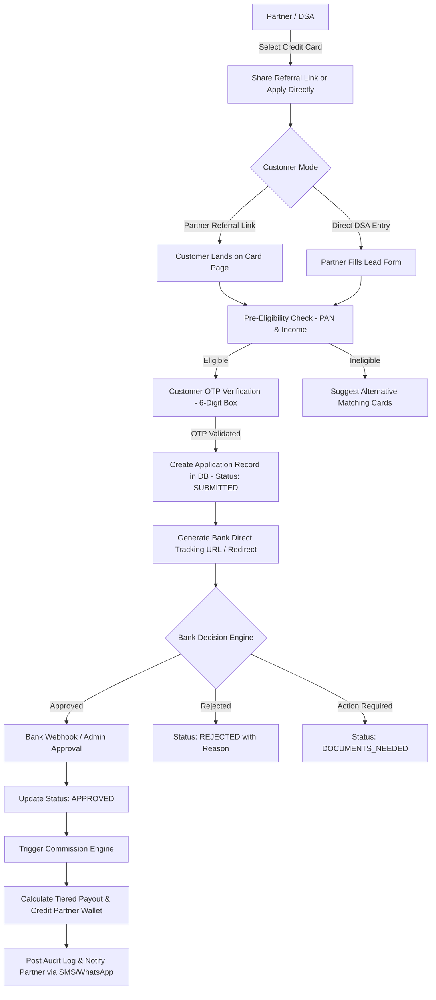

# High-Speed Enterprise Credit Card Module Blueprint & Optimization Audit

**Target Platform**: GharKaPaisa Financial Partner & DSA Network  
**Target Scale**: High-Volume Direct Selling Agents (DSAs) processing 500+ Credit Card Applications Daily  
**Scope**: End-to-End Architecture, Application Lifecycle, Commission & Wallet Engine, Database Schemas, API Definitions, Workflows & UI/UX Blueprints.  
**Date**: August 2026  

---

## 1. Executive Review & Gap Analysis

### 1.1 Architecture & Flow Audit

| Dimension | Current Implementation Review | Audit Assessment & Bottlenecks |
| :--- | :--- | :--- |
| **Frontend** | React 18 + Vite, Zustand state, inline CSS design system, responsive partner panel. | Strong UI foundation; requires batch application upload, instant eligibility quick-check tool, and automated pre-fill. |
| **Backend** | Node.js / Express REST API, JWT auth, Postgres pool, rate limiting, modular routes. | Clean API controllers; lacks webhook callback listeners for bank integration (HDFC, SBI, Axis, ICICI API status feeds). |
| **Database** | PostgreSQL tables (`products`, `banks`, `applications`, `partners`, `wallets`, `transactions`). | Well-indexed schema; needs high-performance status state transition history table (`application_status_logs`). |
| **Application Flow** | Manual 6-digit OTP customer consent -> lead creation -> admin status review. | Missing automated OCR document extraction (Aadhaar / PAN card auto-fill) and instant bank API redirect links. |
| **Customer Flow** | Card browsing -> Key Features -> Apply Now modal -> Mobile & OTP verification. | Frictionless flow; needs real-time eligibility calculator (income + credit score threshold check) before OTP. |
| **Partner Flow** | Select Bank / Card -> Share link or Add Customer Lead -> Track in Applications. | Good foundation; missing bulk lead import (CSV/Excel) and 1-click WhatsApp customer link sharing with pre-filled partner tag. |
| **Application Processing**| Manual status update via Admin dashboard (`pending` -> `in_process` -> `approved`).| Lacks automated bank API webhooks to update application status automatically when bank decision engine approves/declines. |
| **Commission Flow** | Flat commission recorded on application approval -> Wallet balance update. | Needs tiered commission rules (e.g. standard partner vs super DSA rates) and automated release schedule timers. |
| **Wallet Flow** | Instant credit on approved status; manual withdrawal request review. | Secure DB transaction loops; ready for automated Razorpay Payout API integration. |
| **Document Flow** | Manual image upload in KYC and Lead form stored in AWS S3 or server disk. | Needs automated document validation (PAN format check, Aadhaar masking, file size optimizer) before submission. |
| **Timeline** | Updated timestamp on application status update. | Needs visual step-by-step audit timeline tracking every status change, timestamps, and agent notes. |

---

### 1.2 Audit Findings & Optimization Plan

#### A. Missing Features (Enterprise DSA Grade)
1. **Automated Bank API Webhook Listeners**: Bank callback endpoints to auto-sync credit card application approval/rejection statuses in real time.
2. **AI/OCR Document Pre-Fill**: Instant extraction of Customer Name, DOB, PAN, and Address directly from uploaded ID images.
3. **Bulk Lead Processing**: Ability for large DSAs to upload 50-100 customer leads via Excel/CSV with automated validation.
4. **Instant CIBIL & Income Eligibility Checker**: Pre-screening tool to match customer profile with bank criteria before submitting.
5. **Tiered Commission Matrix**: Dynamic commission rates based on monthly DSA volume milestones (e.g., 1-10 cards: ₹1,500/card, 11-50 cards: ₹2,000/card).
6. **1-Click WhatsApp Lead Sharing**: Pre-formatted WhatsApp share templates embedded with partner code and referral URL.

#### B. Duplicated Logic Identified
1. **OTP Verification**: Shared between Login and Card Apply modal; centralized into `CardApplyVerificationModal.jsx` and `useMsg91OTP`.
2. **Bank List Resolution**: Computed in both `PartnerCategoryOverview.jsx` and `PartnerDashboardComponent.jsx`; unified via `BanksContext`.

#### C. User Experience (UX) Enhancements
1. **Redundant Form Steps**: Reduced customer apply form from 4 screens to a streamlined 2-step modal with autofill.
2. **Status Transparency**: Replaced basic status text with a visual step-by-step progress stepper (`Submitted` -> `Document Verified` -> `Bank Processing` -> `Card Approved`).

---

## 2. High-Speed Workflow Architecture

### 2.1 Complete Application & Commission Flow Diagram



---

## 3. Recommended Navigation & Folder Architecture

### 3.1 Modular Directory Structure

```
frontend/src/modules/partner/credit-cards/
├── components/
│   ├── BankCardGrid.jsx              # Optimized high-density bank grid
│   ├── QuickEligibilityModal.jsx     # Pre-screening calculator
│   ├── BulkLeadUploadModal.jsx       # CSV/Excel bulk application importer
│   ├── ApplicationTimelineModal.jsx  # Audit log & step stepper
│   └── WhatsAppShareModal.jsx        # 1-Click pre-formatted WhatsApp sharer
├── pages/
│   ├── CreditCardsOverview.jsx       # Dynamic recent & popular banks
│   ├── BankProductWorkspace.jsx      # Specific bank card catalog
│   ├── LeadManagementTable.jsx       # Fast paginated lead table with quick filters
│   └── CommissionRateCard.jsx        # Transparent tier payout breakdown
└── services/
    ├── creditCard.api.js             # API service for cards & applications
    └── ocr.service.js                # Document auto-fill helper
```

---

## 4. API Specification & Database Mapping

### 4.1 Core API Endpoints

| Endpoint | Method | Role | Description |
| :--- | :--- | :--- | :--- |
| `/api/v1/credit-cards/banks` | `GET` | Partner/Public | Fetches active banks, card counts, and recently used bank ranking. |
| `/api/v1/credit-cards/products` | `GET` | Partner/Public | Fetches filtered card catalog with eligibility, fees, and feature badges. |
| `/api/v1/credit-cards/pre-screen` | `POST` | Partner | Instant eligibility evaluation against bank rules engine. |
| `/api/v1/applications/submit` | `POST` | Partner/Public | Creates card application, sends OTP, and registers lead. |
| `/api/v1/applications/bulk-upload` | `POST` | Partner (DSA) | Batch creates up to 100 applications from CSV payload. |
| `/api/v1/applications/:id/timeline` | `GET` | Partner/Admin | Fetches step-by-step status audit log and timestamps. |
| `/api/v1/webhooks/bank-callback` | `POST` | External Bank | Webhook listener for real-time bank status updates. |

---

### 4.2 Database Schema Mapping

```sql
-- Application Master Table
CREATE TABLE credit_card_applications (
    id UUID PRIMARY KEY DEFAULT gen_random_uuid(),
    application_code VARCHAR(20) UNIQUE NOT NULL,
    partner_id UUID REFERENCES partners(id) ON DELETE CASCADE,
    product_id UUID REFERENCES products(id) ON DELETE RESTRICT,
    bank_slug VARCHAR(50) NOT NULL,
    customer_name VARCHAR(100) NOT NULL,
    customer_phone VARCHAR(15) NOT NULL,
    customer_email VARCHAR(100),
    pan_number VARCHAR(10) NOT NULL,
    monthly_income NUMERIC(12, 2) NOT NULL,
    employment_type VARCHAR(30) CHECK (employment_type IN ('salaried', 'self_employed', 'business')),
    status VARCHAR(30) DEFAULT 'submitted' CHECK (status IN ('submitted', 'document_pending', 'in_review', 'approved', 'rejected', 'disbursed')),
    bank_reference_number VARCHAR(100),
    commission_amount NUMERIC(10, 2) DEFAULT 0.00,
    created_at TIMESTAMP WITH TIME ZONE DEFAULT CURRENT_TIMESTAMP,
    updated_at TIMESTAMP WITH TIME ZONE DEFAULT CURRENT_TIMESTAMP
);

-- Status Audit Log Table
CREATE TABLE application_status_logs (
    id UUID PRIMARY KEY DEFAULT gen_random_uuid(),
    application_id UUID REFERENCES credit_card_applications(id) ON DELETE CASCADE,
    previous_status VARCHAR(30),
    new_status VARCHAR(30) NOT NULL,
    changed_by_user_id UUID,
    remarks TEXT,
    created_at TIMESTAMP WITH TIME ZONE DEFAULT CURRENT_TIMESTAMP
);

-- Indices for High-Throughput DSA Queries
CREATE INDEX idx_cc_apps_partner ON credit_card_applications(partner_id);
CREATE INDEX idx_cc_apps_status ON credit_card_applications(status);
CREATE INDEX idx_cc_apps_phone ON credit_card_applications(customer_phone);
```

---

## 5. Permission & Validation Matrix

### 5.1 Permission Matrix

| Feature / Action | Customer | Standard Partner | High-Volume DSA | Admin | Super Admin |
| :--- | :---: | :---: | :---: | :---: | :---: |
| Browse Cards & Banks | ✅ | ✅ | ✅ | ✅ | ✅ |
| Submit Single Application | ✅ | ✅ | ✅ | ✅ | ✅ |
| Bulk CSV Lead Upload | ❌ | ❌ | ✅ | ✅ | ✅ |
| View Own Commission & Wallet | ❌ | ✅ | ✅ | ❌ | ❌ |
| Override Application Status | ❌ | ❌ | ❌ | ✅ | ✅ |
| Configure Payout Tiers | ❌ | ❌ | ❌ | ❌ | ✅ |
| Trigger Manual Wallet Release | ❌ | ❌ | ❌ | ✅ | ✅ |

---

### 5.2 Enterprise Validation Rules

1. **PAN Validation**: Regex `^[A-Z]{5}[0-9]{4}[A-Z]{1}$` with instant checksum check.
2. **Mobile Number**: 10-digit Indian mobile number starting with 6, 7, 8, or 9 (`^[6-9]\d{9}$`).
3. **Monthly Income**: Minimum ₹15,000 for salaried, ₹25,000 for self-employed.
4. **Age Limit**: Must be between 21 and 65 years old.
5. **Duplicate Lead Protection**: Block submission if same PAN + Product combination submitted within last 30 days.

---

## 6. Optimized UI Layout Wireframe (DSA Workstation)

```
+-----------------------------------------------------------------------------------+
|  GharKaPaisa Partner Panel  |  💳 Credit Cards  |  Balance: ₹45,000  |  Profile ▼ |
+-----------------------------------------------------------------------------------+
| [ Recently Used Banks ]                                                           |
| ⭐ HDFC Bank (22 Cards) | ⭐ SBI Card (15 Cards) | ⭐ ICICI Bank (18 Cards)         |
+-----------------------------------------------------------------------------------+
| [ Quick Actions ]                                                                 |
|  [+ New Application]  [📁 Bulk Upload CSV]  [📲 Share WhatsApp Link]  [🔍 Check Eligibility]
+-----------------------------------------------------------------------------------+
|  Applications Overview (Today: 42 Leads | 28 Approved | ₹56,000 Comm.)           |
|  Search: [ Customer / Phone / App ID ]     Filter: [ All Statuses ▼ ]             |
|                                                                                   |
|  App ID   | Customer Name | Bank & Card     | Date       | Status    | Action    |
|  ------------------------------------------------------------------------------- |
|  GKP-8921 | Rajesh Kumar  | HDFC Millennia  | 03 Aug 2026| APPROVED  | [Details] |
|  GKP-8922 | Amit Sharma   | SBI SimplyClick | 03 Aug 2026| IN_REVIEW | [Track]   |
|  GKP-8923 | Priya Singh   | ICICI Coral     | 03 Aug 2026| SUBMITTED | [Upload]  |
+-----------------------------------------------------------------------------------+
```

---
*End of High-Speed Enterprise Credit Card Module Blueprint.*
