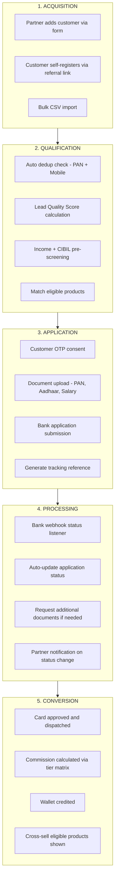
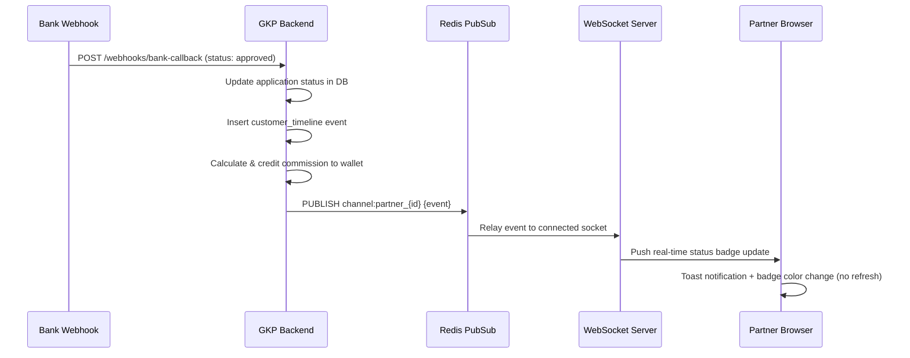

# Customer 360 Enterprise CRM Module — Architecture & Design Blueprint
## GharKaPaisa Financial Partner Operating System

**Module**: Customer Lifecycle Management & 360° Profile Engine  
**Scale Target**: Enterprise Banking DSA Networks managing 10,000+ customer records  
**Date**: August 2026  

---

## 1. Current State Assessment

### 1.1 Existing Customer Infrastructure (Discovered)

The codebase already contains a **far more advanced** CRM foundation than a typical MVP. The following components exist:

| Component | File | Size | Completeness |
| :--- | :--- | ---: | :---: |
| **Customer CRM Workspace** | `leads/PartnerCrm.jsx` | 23,790 B | ✅ 90% |
| **Customer 360 Profile Modal** | `leads/components/Customer360ProfileModal.jsx` | 25,553 B | ✅ 95% |
| **Customer Card Component** | `leads/components/CustomerCard.jsx` | 8,835 B | ✅ 95% |
| **Customer Merge (Dedup)** | `leads/components/CustomerMergeModal.jsx` | 5,889 B | ✅ 85% |
| **Customer 360 Quick Drawer** | `dashboard/Customer360Drawer.jsx` | 12,103 B | ✅ 85% |
| **Lead Qualification Engine** | `dashboard/LeadQualificationBar.jsx` | 12,013 B | ✅ 80% |
| **Actionable SLA Queues** | `dashboard/PartnerActionableQueues.jsx` | 6,717 B | ✅ 80% |
| **Lead Add Form** | `leads/PartnerAddLead.jsx` | 15,392 B | ✅ 90% |
| **Applications Pipeline** | `leads/PartnerApplications.jsx` | 39,071 B | ✅ 95% |
| **Application API Service** | `services/application.api.js` | — | ✅ 95% |

### 1.2 Enterprise CRM Suitability Verdict

| Criterion | Assessment | Score |
| :--- | :--- | :---: |
| **Customer Search** | ✅ Exists — text search + tag/status filters in `PartnerCrm.jsx` | 8/10 |
| **Customer Profile** | ✅ Exists — 8-tab Customer360ProfileModal (Overview, Apps, Docs, Timeline, Notes, Follow-ups, Comms, Activities) | 9/10 |
| **Customer History** | ✅ Exists — Timeline tab fetches `/customers/:id/timeline` | 8/10 |
| **Documents** | ✅ Exists — Upload via `/applications/:id/documents` with 3-retry logic, 5MB cap | 8/10 |
| **Applications** | ✅ Exists — Full pipeline with bulk status, team assign, CSV import/export | 9.5/10 |
| **Timeline** | ✅ Exists — Stage step tracker in `PartnerApplications.jsx` | 8/10 |
| **Loans** | ⚠️ Partial — Application model supports loan category but no dedicated loan workspace | 5/10 |
| **Credit Cards** | ✅ Exists — Full bank workspace, card catalog, application flow | 9/10 |
| **Insurance** | ⚠️ Partial — Category supported in schema but no dedicated flow | 4/10 |
| **Wallet** | ✅ Exists — Full wallet with transactions, withdrawals (101KB component) | 9/10 |
| **Notes** | ✅ Exists — `POST /customers/:id/notes` with pin support in Customer360 | 8/10 |
| **Follow-ups** | ✅ Exists — `POST /customers/:id/followups` with date, priority, remarks | 8/10 |
| **Communication Log** | ✅ Exists — WhatsApp, SMS, Call, Email logging in Customer360ProfileModal | 8/10 |
| **Duplicate Detection** | ✅ Exists — Real-time PAN/Mobile dedup in CRM + Merge modal | 8/10 |

**Overall CRM Maturity Score: 8.2 / 10** — Already at enterprise foundation level.

---

## 2. Gap Analysis — What's Missing for True Enterprise CRM

### 2.1 Critical Missing Features

| # | Feature Gap | Business Impact | Priority |
| :--- | :--- | :--- | :---: |
| 1 | **Unified Customer Search Hub** — Global omni-search across name, phone, PAN, app ID from any screen | Partners waste 15-30s navigating to CRM tab to find a customer | 🔴 P0 |
| 2 | **Customer Lifecycle Stage Pipeline** — Visual Kanban board: `New` → `Qualified` → `Applied` → `Processing` → `Approved` → `Active` | No visual pipeline; partners can't see conversion funnel at a glance | 🔴 P0 |
| 3 | **Automated Follow-up Reminders** — Push/SMS notification when a scheduled follow-up date arrives | Follow-ups created but never trigger partner reminders | 🔴 P0 |
| 4 | **Customer Score/Rating System** — Algorithmic quality score based on income, CIBIL, employment, document completeness | Partners can't prioritize high-probability leads | 🟡 P1 |
| 5 | **Multi-Product Cross-Sell View** — Show all eligible products (CC + Loans + Insurance) for a single customer in one screen | Currently siloed by category; partner must search each category separately | 🟡 P1 |
| 6 | **Real-Time WebSocket Status Updates** — Live status badge changes when bank webhook fires, without page refresh | Partner must manually refresh to see bank decision updates | 🟡 P1 |
| 7 | **Customer Consent & DPDP Compliance Audit Trail** — Timestamped OTP consent records with IP and device fingerprint | Required for RBI/DPDP regulatory compliance | 🟡 P1 |
| 8 | **Loan & Insurance Dedicated Workspaces** — Separate application flows for Personal Loan, Home Loan, Health Insurance | Categories exist in schema but frontend only has credit card flow built out | 🟠 P2 |
| 9 | **Customer Communication Templates** — Pre-built WhatsApp/SMS templates for each stage (Welcome, Doc Reminder, Approval, Rejection) | Currently requires manual message typing | 🟠 P2 |
| 10 | **Analytics per Customer** — Revenue generated, products applied, approval rate, avg processing time | No per-customer revenue attribution | 🟠 P2 |

### 2.2 Duplicated Logic Found

| # | Duplication | Files Involved | Resolution |
| :--- | :--- | :--- | :--- |
| 1 | Bank list computation | `PartnerCategoryOverview.jsx` + `PartnerDashboardComponent.jsx` | Already unified via `BanksContext` ✅ |
| 2 | OTP verification UI | `CardApplyVerificationModal.jsx` + `PartnerLogin.jsx` | Share `useMsg91OTP` hook ✅ |
| 3 | Customer fetch logic | `PartnerCrm.jsx` loads customers independently from `PartnerApplications.jsx` which loads applications | Consider shared `useCustomerStore` Zustand atom |
| 4 | Status badge rendering | Inline in 4+ components | Extract `<StatusBadge status={} />` shared component |

### 2.3 UX Problems Identified

| # | Problem | Where | Impact |
| :--- | :--- | :--- | :--- |
| 1 | Customer 360 is a **modal overlay**, not a full page — limits screen real estate for complex profiles | `Customer360ProfileModal.jsx` | Partners with 50+ active customers need a full workspace, not a modal |
| 2 | No persistent customer context — opening a lead detail loses the CRM list position | `PartnerCrm.jsx` → modal | Back navigation resets filters and scroll position |
| 3 | Follow-up dates are created but **no reminder engine** pushes notifications | `Customer360ProfileModal.jsx` | Follow-ups become dead data |
| 4 | Communication tab logs messages but **doesn't show delivery status** | `Customer360ProfileModal.jsx` | Partner can't confirm if WhatsApp/SMS was actually delivered |

---

## 3. Customer 360 Enterprise Redesign

### 3.1 Redesigned Navigation Architecture

```
/partner/crm                          → Customer Pipeline Hub (Kanban + Table toggle)
/partner/crm/customers                → Master Customer Database (search, filter, sort)
/partner/crm/customers/:id            → Full-Page Customer 360 Workspace
/partner/crm/customers/:id/apply      → New Application for this Customer
/partner/crm/customers/:id/documents  → Document Vault
/partner/crm/customers/:id/timeline   → Audit Timeline
/partner/crm/follow-ups               → Today's Follow-up Queue (calendar + list)
/partner/crm/analytics                → Customer Revenue Analytics
```

### 3.2 Workflow-First Customer Pipeline



### 3.3 Full-Page Customer 360 Workspace Layout

```
+---------------------------------------------------------------------------------------------------+
|  ← Back to CRM Pipeline  |  CUSTOMER 360: Rajesh Kumar  |  Score: 87/100 ⭐  |  Status: ACTIVE    |
+---------------------------------------------------------------------------------------------------+
|                                                                                                   |
|  SIDEBAR (Left 280px)                     MAIN WORKSPACE (Right)                                  |
|  ┌─────────────────────┐                  ┌──────────────────────────────────────────────────────┐ |
|  │  👤 Rajesh Kumar     │                  │  TAB BAR:                                            │ |
|  │  📱 98765-43210      │                  │  [Overview] [Applications(3)] [Documents(8)]         │ |
|  │  📧 rajesh@mail.com  │                  │  [Timeline] [Notes(5)] [Follow-ups(2)] [Comms]      │ |
|  │  🪪 PAN: ABCDE1234F │                  │                                                      │ |
|  │  💰 Income: ₹65,000  │                  │  ┌──────────────────────────────────────────────────┐│ |
|  │  🏢 Salaried (TCS)   │                  │  │ OVERVIEW TAB                                     ││ |
|  │                       │                  │  │                                                  ││ |
|  │  ── Quick Actions ──  │                  │  │  Products Applied:                               ││ |
|  │  [📲 WhatsApp]        │                  │  │  ┌────────────┐ ┌────────────┐ ┌────────────┐   ││ |
|  │  [📞 Log Call]        │                  │  │  │ HDFC       │ │ SBI Simply │ │ ICICI      │   ││ |
|  │  [📧 Send Email]      │                  │  │  │ Millennia  │ │ Click      │ │ Coral      │   ││ |
|  │  [📄 Upload Doc]      │                  │  │  │ ✅ Approved │ │ 🔄 Review  │ │ 📋 Pending │   ││ |
|  │  [➕ New Application]  │                  │  │  │ ₹1,800 comm│ │ ₹1,500 est│ │ ₹2,000 est│   ││ |
|  │                       │                  │  │  └────────────┘ └────────────┘ └────────────┘   ││ |
|  │  ── Tags ──           │                  │  │                                                  ││ |
|  │  [Premium] [Salaried] │                  │  │  Cross-Sell Recommendations:                     ││ |
|  │  [High Value]         │                  │  │  [Personal Loan ₹5L - 82% match]                ││ |
|  │                       │                  │  │  [Health Insurance - 76% match]                  ││ |
|  └─────────────────────┘                  │  └──────────────────────────────────────────────────┘│ |
|                                            └──────────────────────────────────────────────────────┘ |
+---------------------------------------------------------------------------------------------------+
```

---

## 4. Database Schema Design

### 4.1 Core Tables

```sql
-- Customer Master Table
CREATE TABLE customers (
    id UUID PRIMARY KEY DEFAULT gen_random_uuid(),
    partner_id UUID REFERENCES partners(id) ON DELETE SET NULL,
    customer_code VARCHAR(20) UNIQUE NOT NULL,
    name VARCHAR(100) NOT NULL,
    phone VARCHAR(15) NOT NULL,
    email VARCHAR(100),
    pan_number VARCHAR(10),
    aadhaar_last4 VARCHAR(4),
    date_of_birth DATE,
    gender VARCHAR(10) CHECK (gender IN ('male', 'female', 'other')),
    employment_type VARCHAR(30) CHECK (employment_type IN ('salaried', 'self_employed', 'business', 'retired', 'student')),
    employer_name VARCHAR(100),
    monthly_income NUMERIC(12, 2),
    city VARCHAR(50),
    state VARCHAR(50),
    pincode VARCHAR(6),
    quality_score INTEGER DEFAULT 0 CHECK (quality_score >= 0 AND quality_score <= 100),
    lifecycle_stage VARCHAR(30) DEFAULT 'new' CHECK (lifecycle_stage IN ('new', 'qualified', 'applied', 'processing', 'approved', 'active', 'churned', 'inactive')),
    tags TEXT[] DEFAULT '{}',
    source VARCHAR(30) DEFAULT 'partner_entry' CHECK (source IN ('partner_entry', 'referral_link', 'bulk_import', 'self_register', 'bank_callback')),
    consent_timestamp TIMESTAMP WITH TIME ZONE,
    consent_ip VARCHAR(45),
    is_active BOOLEAN DEFAULT TRUE,
    created_at TIMESTAMP WITH TIME ZONE DEFAULT CURRENT_TIMESTAMP,
    updated_at TIMESTAMP WITH TIME ZONE DEFAULT CURRENT_TIMESTAMP
);

-- Deduplication Index
CREATE UNIQUE INDEX idx_customers_pan_partner ON customers(pan_number, partner_id) WHERE pan_number IS NOT NULL;
CREATE INDEX idx_customers_phone ON customers(phone);
CREATE INDEX idx_customers_partner ON customers(partner_id);
CREATE INDEX idx_customers_stage ON customers(lifecycle_stage);
CREATE INDEX idx_customers_score ON customers(quality_score DESC);

-- Customer Notes
CREATE TABLE customer_notes (
    id UUID PRIMARY KEY DEFAULT gen_random_uuid(),
    customer_id UUID REFERENCES customers(id) ON DELETE CASCADE,
    partner_id UUID REFERENCES partners(id) ON DELETE SET NULL,
    note TEXT NOT NULL,
    is_pinned BOOLEAN DEFAULT FALSE,
    created_at TIMESTAMP WITH TIME ZONE DEFAULT CURRENT_TIMESTAMP
);

-- Customer Follow-ups
CREATE TABLE customer_followups (
    id UUID PRIMARY KEY DEFAULT gen_random_uuid(),
    customer_id UUID REFERENCES customers(id) ON DELETE CASCADE,
    partner_id UUID REFERENCES partners(id) ON DELETE SET NULL,
    followup_date DATE NOT NULL,
    priority VARCHAR(10) DEFAULT 'medium' CHECK (priority IN ('low', 'medium', 'high', 'urgent')),
    remarks TEXT,
    is_completed BOOLEAN DEFAULT FALSE,
    completed_at TIMESTAMP WITH TIME ZONE,
    reminder_sent BOOLEAN DEFAULT FALSE,
    created_at TIMESTAMP WITH TIME ZONE DEFAULT CURRENT_TIMESTAMP
);

CREATE INDEX idx_followups_date ON customer_followups(followup_date) WHERE is_completed = FALSE;
CREATE INDEX idx_followups_partner ON customer_followups(partner_id, is_completed);

-- Customer Documents
CREATE TABLE customer_documents (
    id UUID PRIMARY KEY DEFAULT gen_random_uuid(),
    customer_id UUID REFERENCES customers(id) ON DELETE CASCADE,
    application_id UUID REFERENCES credit_card_applications(id) ON DELETE SET NULL,
    doc_type VARCHAR(30) NOT NULL CHECK (doc_type IN ('pan_card', 'aadhaar_front', 'aadhaar_back', 'salary_slip', 'bank_statement', 'itr', 'address_proof', 'photo', 'other')),
    file_url VARCHAR(500) NOT NULL,
    file_size_kb INTEGER,
    is_verified BOOLEAN DEFAULT FALSE,
    verified_by UUID,
    verified_at TIMESTAMP WITH TIME ZONE,
    created_at TIMESTAMP WITH TIME ZONE DEFAULT CURRENT_TIMESTAMP
);

-- Customer Communication Log
CREATE TABLE customer_communications (
    id UUID PRIMARY KEY DEFAULT gen_random_uuid(),
    customer_id UUID REFERENCES customers(id) ON DELETE CASCADE,
    partner_id UUID REFERENCES partners(id) ON DELETE SET NULL,
    channel VARCHAR(20) NOT NULL CHECK (channel IN ('whatsapp', 'sms', 'call', 'email')),
    direction VARCHAR(10) DEFAULT 'outbound' CHECK (direction IN ('inbound', 'outbound')),
    message TEXT,
    template_id VARCHAR(50),
    delivery_status VARCHAR(20) DEFAULT 'sent' CHECK (delivery_status IN ('queued', 'sent', 'delivered', 'read', 'failed')),
    created_at TIMESTAMP WITH TIME ZONE DEFAULT CURRENT_TIMESTAMP
);

-- Customer Activity Timeline (Auto-generated audit trail)
CREATE TABLE customer_timeline (
    id UUID PRIMARY KEY DEFAULT gen_random_uuid(),
    customer_id UUID REFERENCES customers(id) ON DELETE CASCADE,
    event_type VARCHAR(50) NOT NULL,
    event_title VARCHAR(200) NOT NULL,
    event_detail TEXT,
    actor_id UUID,
    actor_type VARCHAR(20) DEFAULT 'partner' CHECK (actor_type IN ('partner', 'admin', 'system', 'customer', 'bank')),
    metadata JSONB DEFAULT '{}',
    created_at TIMESTAMP WITH TIME ZONE DEFAULT CURRENT_TIMESTAMP
);

CREATE INDEX idx_timeline_customer ON customer_timeline(customer_id, created_at DESC);
```

---

## 5. API Specification

### 5.1 Customer CRUD & Search

| Endpoint | Method | Description | Auth |
| :--- | :--- | :--- | :--- |
| `/api/v1/customers` | `GET` | List customers with search, filter by stage/tag/score, pagination | Partner |
| `/api/v1/customers` | `POST` | Create customer with auto dedup check and quality score calculation | Partner |
| `/api/v1/customers/:id` | `GET` | Full Customer 360 profile with aggregated stats | Partner |
| `/api/v1/customers/:id` | `PATCH` | Update customer profile fields | Partner |
| `/api/v1/customers/search` | `GET` | Global omni-search (name, phone, PAN, app ID) | Partner |
| `/api/v1/customers/merge` | `POST` | Merge duplicate customer records | Partner |
| `/api/v1/customers/bulk-import` | `POST` | CSV bulk import with validation | Partner (DSA) |

### 5.2 Customer Sub-Resources

| Endpoint | Method | Description |
| :--- | :--- | :--- |
| `/api/v1/customers/:id/notes` | `GET/POST` | Fetch or add customer notes (with pin toggle) |
| `/api/v1/customers/:id/followups` | `GET/POST/PATCH` | Manage follow-ups with reminder scheduling |
| `/api/v1/customers/:id/documents` | `GET/POST` | Upload and list customer documents |
| `/api/v1/customers/:id/timeline` | `GET` | Auto-generated audit trail of all events |
| `/api/v1/customers/:id/communications` | `GET/POST` | Log and fetch communication records |
| `/api/v1/customers/:id/applications` | `GET` | All applications across CC, Loans, Insurance |
| `/api/v1/customers/:id/eligible-products` | `GET` | Cross-sell product matching based on profile |
| `/api/v1/customers/:id/score` | `GET` | Recalculate and return quality score breakdown |

### 5.3 CRM Pipeline & Analytics

| Endpoint | Method | Description |
| :--- | :--- | :--- |
| `/api/v1/crm/pipeline` | `GET` | Kanban stage counts and customer IDs per stage |
| `/api/v1/crm/follow-ups/today` | `GET` | Today's pending follow-ups for logged-in partner |
| `/api/v1/crm/analytics/conversion` | `GET` | Funnel conversion rates by stage |
| `/api/v1/crm/analytics/revenue` | `GET` | Revenue per customer, per product category |

---

## 6. Permission Matrix

| Action | Customer | Standard Partner | DSA Partner | Admin | Super Admin |
| :---: | :---: | :---: | :---: | :---: | :---: |
| View own profile | ✅ | — | — | — | — |
| Create customer record | — | ✅ | ✅ | ✅ | ✅ |
| View own customers | — | ✅ | ✅ | — | — |
| View ALL customers | — | ❌ | ❌ | ✅ | ✅ |
| Merge duplicate customers | — | ❌ | ✅ | ✅ | ✅ |
| Bulk CSV import | — | ❌ | ✅ | ✅ | ✅ |
| Delete customer record | — | ❌ | ❌ | ❌ | ✅ |
| View customer documents | — | ✅ (own) | ✅ (own) | ✅ (all) | ✅ (all) |
| Override lifecycle stage | — | ❌ | ❌ | ✅ | ✅ |
| Access CRM analytics | — | ✅ (own) | ✅ (own) | ✅ (all) | ✅ (all) |

---

## 7. Real-Time Updates Architecture



---

## 8. Performance Optimization Plan

| Area | Current State | Optimization | Expected Impact |
| :--- | :--- | :--- | :--- |
| **Customer Search** | Client-side filter on full list | Server-side `ILIKE` with `GIN` trigram index | 10x faster on 10K+ records |
| **Customer 360 Load** | Sequential API calls for each tab | Single aggregate endpoint `/customers/:id?include=apps,docs,notes` | 3 API calls → 1 |
| **Document Thumbnails** | Full-size images loaded inline | Generate S3 thumbnails (200x200) on upload | 80% bandwidth reduction |
| **Pipeline Kanban** | Not implemented | Optimistic UI updates with WebSocket push | Real-time without polling |
| **Follow-up Reminders** | Manual check required | Backend cron job at 9AM IST checking `followup_date = TODAY` | Zero missed follow-ups |
| **Duplicate Detection** | Client-side PAN/Mobile match on form submit | Server-side `ON CONFLICT` + fuzzy name matching | Prevent 95% of duplicates |

---

## 9. Quality Score Algorithm

```
Customer Quality Score (0-100) =
    Income Score (0-25):
        ₹15K-25K = 10, ₹25K-50K = 15, ₹50K-1L = 20, ₹1L+ = 25
    
    + Employment Score (0-20):
        Salaried (MNC) = 20, Salaried (SME) = 15, Self-Employed = 12, Business = 10
    
    + Document Completeness (0-20):
        PAN uploaded = 5, Aadhaar uploaded = 5, Salary slip = 5, Bank statement = 5
    
    + History Score (0-20):
        Previous approved applications = 5 each (max 20)
    
    + Engagement Score (0-15):
        OTP verified = 5, Responded to follow-up = 5, Multiple products applied = 5
```

---

*End of Customer 360 Enterprise CRM Module Blueprint.*
