# GharKaPaisa Enterprise Architecture Documentation

## Table of Contents
1. [C4 Model](#c4-model)
2. [UML Diagrams](#uml-diagrams)
3. [Database ER Diagram](#database-er-diagram)
4. [REST API Architecture](#rest-api-architecture)
5. [Folder Dependency Graph](#folder-dependency-graph)
6. [Frontend Component Tree](#frontend-component-tree)
7. [Backend Module Dependency Tree](#backend-module-dependency-tree)
8. [Complete API Call Flow](#complete-api-call-flow)
9. [Authentication Flow Diagram](#authentication-flow-diagram)
10. [User Journey Diagrams](#user-journey-diagrams)
11. [Wallet & Commission Engine](#wallet--commission-engine)
12. [Product Lifecycle](#product-lifecycle)
13. [Deployment Diagram](#deployment-diagram)
14. [Architectural Issues & Improvements](#architectural-issues--improvements)

---

## C4 Model

### 1. Context Diagram

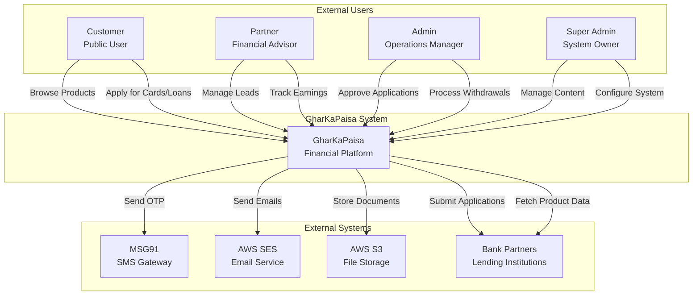

**Explanation**: The context diagram shows the GharKaPaisa system as a single entity interacting with external users and systems. This is the highest-level view showing system boundaries and relationships.

---

### 2. Container Diagram

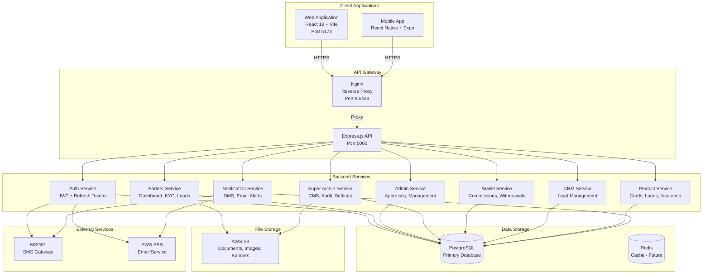

**Explanation**: The container diagram breaks down the system into major containers (web app, mobile app, API server, databases, external services). Each container is a deployable unit.

---

### 3. Component Diagram

```mermaid
graph TB
    subgraph "Web Application"
        subgraph "Frontend Components"
            Router[React Router<br/>AppRoutes.jsx]
            Layouts[Layout Components<br/>PublicLayout, PartnerLayout, etc.]
            Pages[Page Components<br/>Home, Dashboard, KYC, etc.]
            Shared[Shared Components<br/>Navbar, Loader, Icons]
            State[Zustand Stores<br/>Auth, Partner, Search]
            API[Axios API Client<br/>api.js with interceptors]
            Theme[Theme Context<br/>Dark/Light Mode]
            I18n[i18next<br/>9-Language Support]
        end
    end
    
    subgraph "API Server"
        subgraph "Express.js"
            Server[server.js<br/>Entry Point]
            
            subgraph "Middleware Layer"
                Security[Security Middleware<br/>Helmet, CORS, Rate Limit]
                Auth[Authentication Middleware<br/>JWT Validation]
                Validation[Validation Middleware<br/>express-validator]
                Error[Error Handler<br/>Centralized Error Handling]
            end
            
            subgraph "Route Layer"
                AuthRoutes[/api/v1/auth Routes]
                PartnerRoutes[/api/v1/partner Routes]
                AdminRoutes[/api/v1/admin Routes]
                SuperAdminRoutes[/api/v1/superadmin Routes]
                ProductRoutes[/api/v1/products Routes]
                WalletRoutes[/api/v1/wallet Routes]
                CRMRoutes[/api/v1/leads Routes]
                CMSRoutes[/api/v1/cms Routes]
            end
            
            subgraph "Controller Layer"
                AuthController[Auth Controller]
                PartnerController[Partner Controller]
                AdminController[Admin Controller]
                SuperAdminController[Super Admin Controller]
                ProductController[Product Controller]
                WalletController[Wallet Controller]
                CRMController[CRM Controller]
                CMSController[CMS Controller]
            end
            
            subgraph "Service Layer"
                AuthService[Auth Service]
                PartnerService[Partner Service]
                WalletService[Wallet Service]
                CommissionService[Commission Service]
                KYCService[KYC Service]
                NotificationService[Notification Service]
                ReportService[Report Service]
            end
            
            subgraph "Repository Layer"
                DB[Database Query<br/>PostgreSQL Client]
                S3Client[AWS S3 Client<br/>File Operations]
                MSG91Client[MSG91 Client<br/>SMS Operations]
                SESClient[SES Client<br/>Email Operations]
            end
        end
    end
    
    Router --> Layouts
    Layouts --> Pages
    Pages --> Shared
    Pages --> State
    Pages --> API
    Pages --> Theme
    Pages --> I18n
    API --> Server
    
    Server --> Security
    Security --> Auth
    Auth --> AuthRoutes
    Auth --> PartnerRoutes
    Auth --> AdminRoutes
    Auth --> SuperAdminRoutes
    Auth --> ProductRoutes
    Auth --> WalletRoutes
    Auth --> CRMRoutes
    Auth --> CMSRoutes
    
    AuthRoutes --> AuthController
    PartnerRoutes --> PartnerController
    AdminRoutes --> AdminController
    SuperAdminRoutes --> SuperAdminController
    ProductRoutes --> ProductController
    WalletRoutes --> WalletController
    CRMRoutes --> CRMController
    CMSRoutes --> CMSController
    
    AuthController --> AuthService
    PartnerController --> PartnerService
    WalletController --> WalletService
    WalletController --> CommissionService
    PartnerController --> KYCService
    SuperAdminController --> NotificationService
    AdminController --> ReportService
    
    AuthService --> DB
    PartnerService --> DB
    WalletService --> DB
    CommissionService --> DB
    KYCService --> DB
    NotificationService --> DB
    ReportService --> DB
    
    PartnerService --> S3Client
    SuperAdminController --> S3Client
    AuthService --> MSG91Client
    NotificationService --> MSG91Client
    AuthService --> SESClient
    NotificationService --> SESClient
```

**Explanation**: The component diagram shows the internal structure of each container, including the layered architecture (middleware, routes, controllers, services, repositories).

---

### 4. Code Diagram

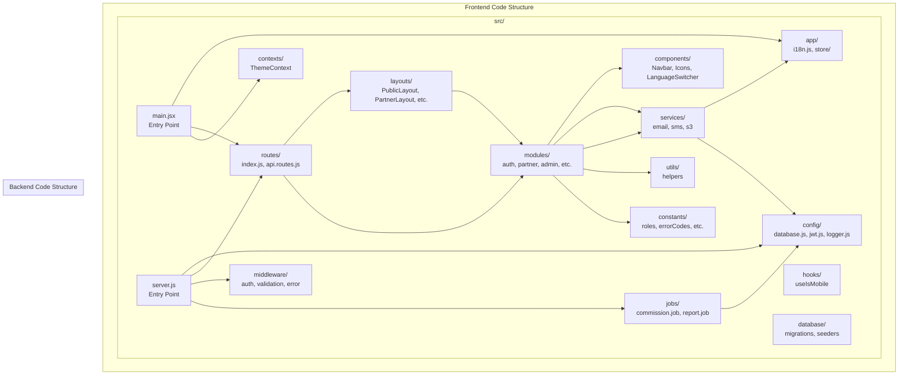

**Explanation**: The code diagram shows the actual file/folder structure of the frontend and backend codebases.

---

## UML Diagrams

### 1. Class Diagram

```mermaid
classDiagram
    class User {
        +UUID id
        +String firebase_uid
        +String email
        +String mobile
        +UserRole role
        +UserStatus status
        +String password_hash
        +String full_name
        +String employee_id
        +String department
        +String designation
        +Boolean is_active
        +UUID created_by
        +DateTime created_at
        +DateTime updated_at
        +DateTime last_login
        +Boolean email_verified
        +String verification_token
        +DateTime verification_token_expires_at
        +String reset_token
        +DateTime reset_token_expires_at
        +Boolean must_change_password
        +validateCredentials()
        +generateTokens()
        +updateLastLogin()
    }
    
    class PartnerProfile {
        +UUID id
        +UUID user_id
        +String partner_code
        +String first_name
        +String last_name
        +String profile_photo_url
        +String current_address
        +String business_location
        +String company_name
        +String company_type
        +String gst_number
        +String pincode
        +KYCStatus kyc_status
        +UUID approved_by
        +DateTime approved_at
        +String rejection_reason
        +String aadhar_url
        +String pan_url
        +String gst_cert_url
        +String cancel_cheque_url
        +DateTime created_at
        +DateTime updated_at
        +uploadDocument()
        +submitKYC()
        +updateProfile()
    }
    
    class Product {
        +UUID id
        +String bank_name
        +String name
        +ProductCategory category
        +String description
        +String bank_code
        +Boolean is_active
        +Decimal interest_rate
        +String processing_fee
        +String tenure
        +String eligibility
        +String documents_required
        +String features
        +DateTime created_at
        +DateTime updated_at
        +activate()
        +deactivate()
        +updateDetails()
    }
    
    class Lead {
        +UUID id
        +UUID partner_id
        +UUID customer_id
        +UUID product_id
        +String customer_name
        +String customer_mobile
        +String customer_email
        +LeadStatus status
        +String application_number
        +DateTime created_at
        +DateTime updated_at
        +createLead()
        +updateStatus()
        +assignToPartner()
    }
    
    class Application {
        +UUID id
        +UUID lead_id
        +UUID partner_id
        +UUID product_id
        +ApplicationStatus status
        +String bank_reference_id
        +String bank_status
        +Decimal loan_amount
        +String remarks
        +DateTime created_at
        +DateTime updated_at
        +submitToBank()
        +updateBankStatus()
        +trackProgress()
    }
    
    class Wallet {
        +UUID id
        +UUID partner_id
        +Decimal available_balance
        +Decimal hold_balance
        +Decimal total_earned
        +Decimal total_withdrawn
        +DateTime created_at
        +DateTime updated_at
        +credit()
        +debit()
        +hold()
        +release()
    }
    
    class WalletTransaction {
        +UUID id
        +UUID wallet_id
        +WalletTxnType type
        +WalletTxnStatus status
        +Decimal amount
        +String description
        +UUID related_lead_id
        +DateTime release_at
        +DateTime created_at
        +DateTime processed_at
        +process()
        +hold()
        +release()
    }
    
    class WithdrawalRequest {
        +UUID id
        +UUID wallet_id
        +UUID partner_id
        +Decimal amount
        +WithdrawalStatus status
        +String bank_account_number
        +String ifsc_code
        +String bank_name
        +String account_holder_name
        +String rejection_reason
        +DateTime created_at
        +DateTime processed_at
        +submit()
        +approve()
        +reject()
    }
    
    class KYCDocument {
        +UUID id
        +UUID partner_id
        +String doc_type
        +String file_url
        +Boolean verified
        +DateTime uploaded_at
        +DateTime verified_at
        +UUID verified_by
        +upload()
        +verify()
        +reject()
    }
    
    class CommissionStructure {
        +UUID id
        +UUID product_id
        +CommissionType type
        +Decimal commission_rate
        +Decimal commission_amount
        +Integer holding_period_days
        +Boolean is_active
        +DateTime created_at
        +DateTime updated_at
        +calculateCommission()
        +activate()
        +deactivate()
    }
    
    class Notification {
        +UUID id
        +UUID user_id
        +String type
        +String title
        +String message
        +Boolean is_read
        +String action_link
        +DateTime created_at
        +DateTime read_at
        +send()
        +markAsRead()
    }
    
    class Banner {
        +UUID id
        +String title
        +String image_url
        +String link_url
        +Integer display_order
        +Boolean is_active
        +DateTime start_date
        +DateTime end_date
        +DateTime created_at
        +DateTime updated_at
        +activate()
        +deactivate()
    }
    
    class CMSSection {
        +UUID id
        +String section_key
        +String title
        +JSONB content
        +Boolean is_active
        +DateTime created_at
        +DateTime updated_at
        +updateContent()
        +activate()
        +deactivate()
    }
    
    User "1" --> "1" PartnerProfile
    PartnerProfile "1" --> "*" KYCDocument
    PartnerProfile "1" --> "1" Wallet
    Wallet "1" --> "*" WalletTransaction
    Wallet "1" --> "*" WithdrawalRequest
    PartnerProfile "1" --> "*" Lead
    Lead "1" --> "1" Product
    Lead "1" --> "1" Application
    Product "1" --> "*" CommissionStructure
    CommissionStructure "1" --> "*" WalletTransaction
    User "1" --> "*" Notification
    SuperAdmin "1" --> "*" Banner
    SuperAdmin "1" --> "*" CMSSection
```

**Explanation**: The class diagram shows the core domain entities and their relationships, including attributes and methods.

---

### 2. Sequence Diagrams

#### 2.1 Authentication Sequence

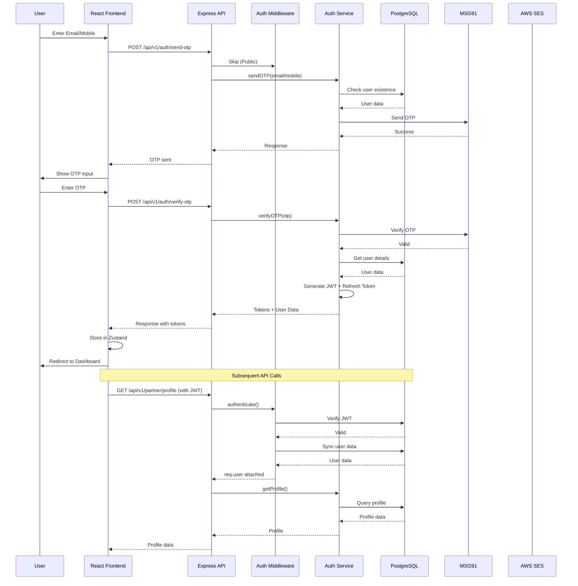

#### 2.2 Lead Submission Sequence

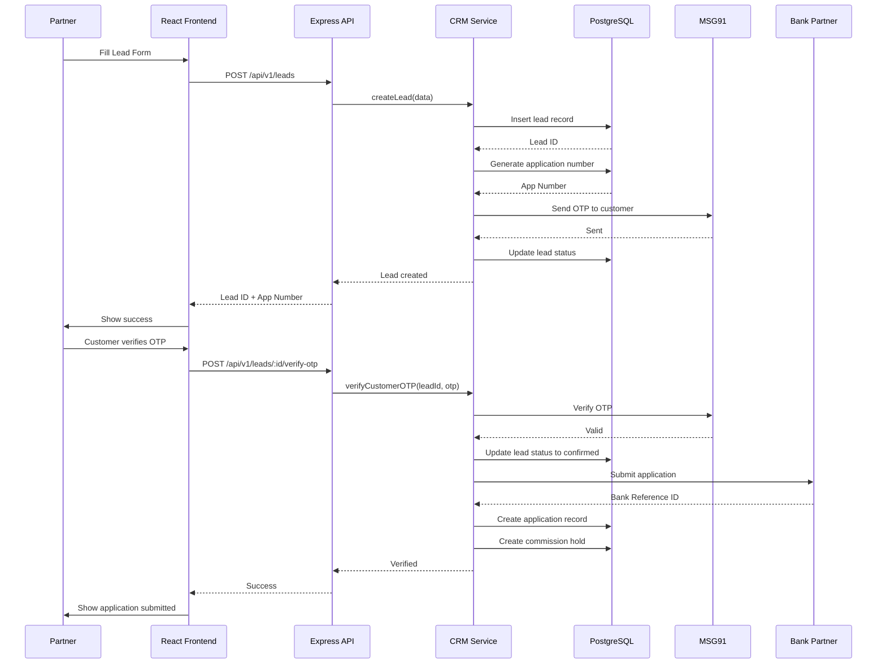

#### 2.3 Commission Release Sequence

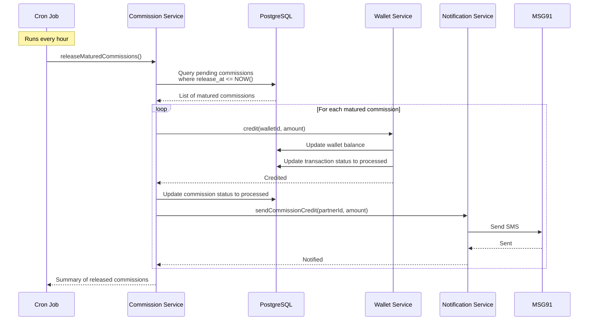

---

### 3. Activity Diagrams

#### 3.1 Partner Registration Activity

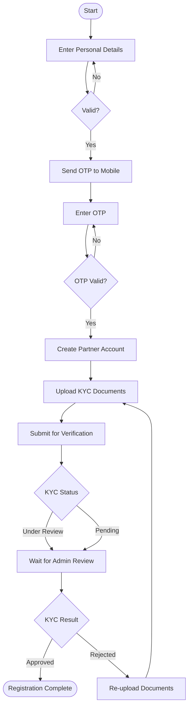

#### 3.2 Withdrawal Request Activity

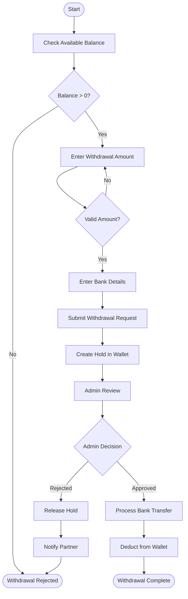

---

### 4. Use Case Diagram

```mermaid
graph TB
    subgraph "Actors"
        Customer[Customer]
        Partner[Partner]
        Admin[Admin]
        SuperAdmin[Super Admin]
    end
    
    subgraph "Public Features"
        UC1[Browse Products]
        UC2[Compare Products]
        UC3[Submit Lead]
        UC4[Track Application]
    end
    
    subgraph "Partner Features"
        UC5[View Dashboard]
        UC6[Manage Leads]
        UC7[Track Earnings]
        UC8[Request Withdrawal]
        UC9[Upload KYC Documents]
        UC10[Manage Profile]
        UC11[View Referral Network]
        UC12[Access Training Materials]
    end
    
    subgraph "Admin Features"
        UC13[Approve Partners]
        UC14[Review Applications]
        UC15[Process Withdrawals]
        UC16[Resolve Leads]
        UC17[View Reports]
    end
    
    subgraph "Super Admin Features"
        UC18[Manage CMS Content]
        UC19[Configure Products]
        UC20[Set Commission Rates]
        UC21[Manage Banks]
        UC22[View Audit Logs]
        UC23[Configure System Settings]
        UC24[Manage Admins]
    end
    
    Customer --> UC1
    Customer --> UC2
    Customer --> UC3
    Customer --> UC4
    
    Partner --> UC5
    Partner --> UC6
    Partner --> UC7
    Partner --> UC8
    Partner --> UC9
    Partner --> UC10
    Partner --> UC11
    Partner --> UC12
    
    Admin --> UC13
    Admin --> UC14
    Admin --> UC15
    Admin --> UC16
    Admin --> UC17
    
    SuperAdmin --> UC18
    SuperAdmin --> UC19
    SuperAdmin --> UC20
    SuperAdmin --> UC21
    SuperAdmin --> UC22
    SuperAdmin --> UC23
    SuperAdmin --> UC24
```

---

### 5. State Diagram

#### 5.1 Application State Machine

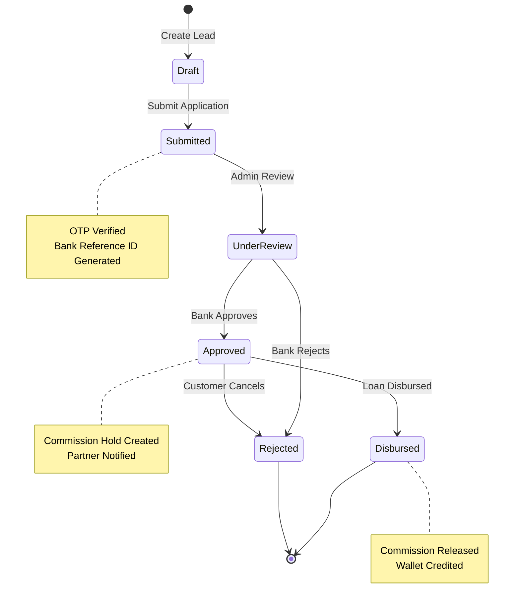

#### 5.2 KYC State Machine

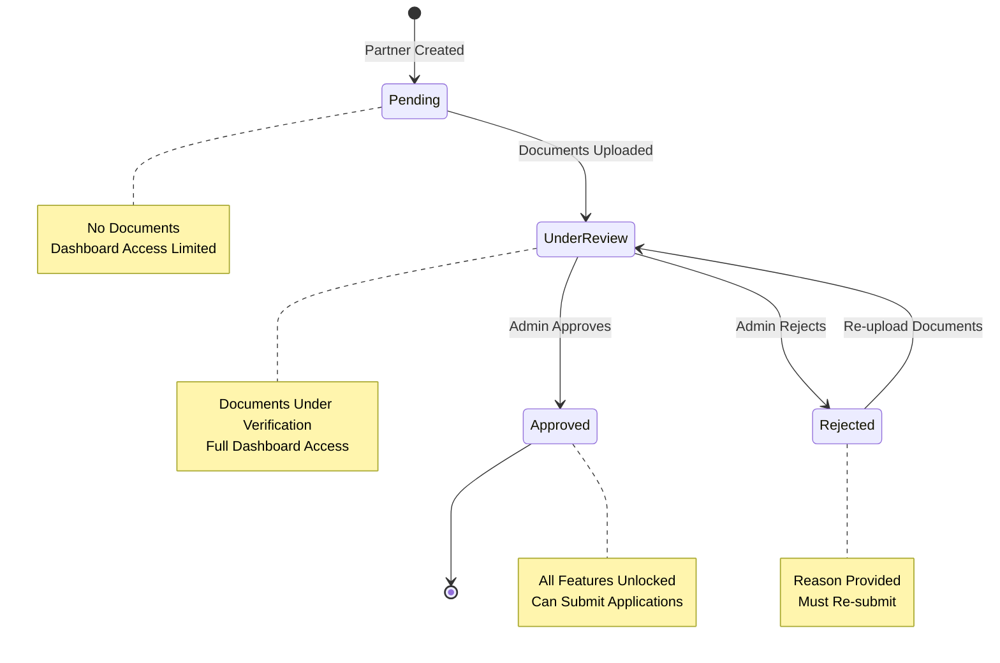

---

## Database ER Diagram

```mermaid
erDiagram
    USERS ||--|| PARTNER_PROFILES : "has"
    USERS ||--o{ NOTIFICATIONS : "receives"
    USERS ||--o{ AUDIT_LOGS : "performs"
    USERS ||--o{ REFRESH_TOKENS : "has"
    
    PARTNER_PROFILES ||--o{ LEADS : "generates"
    PARTNER_PROFILES ||--|| WALLETS : "owns"
    PARTNER_PROFILES ||--o{ KYC_DOCUMENTS : "submits"
    PARTNER_PROFILES ||--o{ WITHDRAWAL_REQUESTS : "requests"
    
    WALLETS ||--o{ WALLET_TRANSACTIONS : "has"
    WALLETS ||--o{ WITHDRAWAL_REQUESTS : "linked to"
    
    LEADS ||--o| APPLICATIONS : "converts to"
    LEADS ||--o{ COMMISSIONS : "generates"
    
    APPLICATIONS ||--|| PRODUCTS : "for"
    APPLICATIONS ||--o{ COMMISSIONS : "linked to"
    
    PRODUCTS ||--o{ COMMISSION_STRUCTURES : "has"
    PRODUCTS ||--|| BANKS : "belongs to"
    
    BANKS ||--o{ PRODUCTS : "offers"
    
    SUPER_ADMINS ||--o{ BANNERS : "manages"
    SUPER_ADMINS ||--o{ CMS_SECTIONS : "manages"
    SUPER_ADMINS ||--o{ SYSTEM_SETTINGS : "configures"
    
    USERS {
        UUID id PK
        VARCHAR firebase_uid UK
        VARCHAR email UK
        VARCHAR mobile UK
        user_role role
        user_status status
        VARCHAR password_hash
        VARCHAR full_name
        VARCHAR employee_id UK
        VARCHAR department
        VARCHAR designation
        BOOLEAN is_active
        UUID created_by FK
        TIMESTAMPTZ created_at
        TIMESTAMPTZ updated_at
        TIMESTAMPTZ last_login
        BOOLEAN email_verified
        TEXT verification_token
        TIMESTAMPTZ verification_token_expires_at
        TEXT reset_token
        TIMESTAMPTZ reset_token_expires_at
        BOOLEAN must_change_password
    }
    
    PARTNER_PROFILES {
        UUID id PK
        UUID user_id FK UK
        VARCHAR partner_code UK
        VARCHAR first_name
        VARCHAR last_name
        VARCHAR profile_photo_url
        TEXT current_address
        TEXT business_location
        VARCHAR company_name
        VARCHAR company_type
        VARCHAR gst_number
        VARCHAR pincode
        kyc_status kyc_status
        UUID approved_by FK
        TIMESTAMPTZ approved_at
        TEXT rejection_reason
        VARCHAR aadhar_url
        VARCHAR pan_url
        VARCHAR gst_cert_url
        VARCHAR cancel_cheque_url
        TIMESTAMPTZ created_at
        TIMESTAMPTZ updated_at
    }
    
    PRODUCTS {
        UUID id PK
        VARCHAR bank_name
        VARCHAR name
        product_category category
        TEXT description
        VARCHAR bank_code
        BOOLEAN is_active
        DECIMAL interest_rate
        VARCHAR processing_fee
        VARCHAR tenure
        TEXT eligibility
        TEXT documents_required
        JSONB features
        TIMESTAMPTZ created_at
        TIMESTAMPTZ updated_at
    }
    
    BANKS {
        UUID id PK
        VARCHAR name
        VARCHAR short_code UK
        VARCHAR logo_url
        TEXT description
        BOOLEAN is_active
        TIMESTAMPTZ created_at
        TIMESTAMPTZ updated_at
    }
    
    LEADS {
        UUID id PK
        UUID partner_id FK
        UUID customer_id FK
        UUID product_id FK
        VARCHAR customer_name
        VARCHAR customer_mobile
        VARCHAR customer_email
        lead_status status
        VARCHAR application_number
        TIMESTAMPTZ created_at
        TIMESTAMPTZ updated_at
    }
    
    APPLICATIONS {
        UUID id PK
        UUID lead_id FK UK
        UUID partner_id FK
        UUID product_id FK
        application_status status
        VARCHAR bank_reference_id
        VARCHAR bank_status
        DECIMAL loan_amount
        TEXT remarks
        TIMESTAMPTZ created_at
        TIMESTAMPTZ updated_at
    }
    
    WALLETS {
        UUID id PK
        UUID partner_id FK UK
        DECIMAL available_balance
        DECIMAL hold_balance
        DECIMAL total_earned
        DECIMAL total_withdrawn
        TIMESTAMPTZ created_at
        TIMESTAMPTZ updated_at
    }
    
    WALLET_TRANSACTIONS {
        UUID id PK
        UUID wallet_id FK
        wallet_txn_type type
        wallet_txn_status status
        DECIMAL amount
        TEXT description
        UUID related_lead_id FK
        TIMESTAMPTZ release_at
        TIMESTAMPTZ created_at
        TIMESTAMPTZ processed_at
    }
    
    WITHDRAWAL_REQUESTS {
        UUID id PK
        UUID wallet_id FK
        UUID partner_id FK
        DECIMAL amount
        withdrawal_status status
        VARCHAR bank_account_number
        VARCHAR ifsc_code
        VARCHAR bank_name
        VARCHAR account_holder_name
        TEXT rejection_reason
        TIMESTAMPTZ created_at
        TIMESTAMPTZ processed_at
    }
    
    KYC_DOCUMENTS {
        UUID id PK
        UUID partner_id FK
        VARCHAR doc_type
        VARCHAR file_url
        BOOLEAN verified
        TIMESTAMPTZ uploaded_at
        TIMESTAMPTZ verified_at
        UUID verified_by FK
    }
    
    COMMISSIONS {
        UUID id PK
        UUID lead_id FK
        UUID application_id FK
        UUID partner_id FK
        commission_status status
        DECIMAL amount
        TIMESTAMPTZ release_at
        TIMESTAMPTZ created_at
        TIMESTAMPTZ processed_at
    }
    
    COMMISSION_STRUCTURES {
        UUID id PK
        UUID product_id FK
        commission_type type
        DECIMAL commission_rate
        DECIMAL commission_amount
        INTEGER holding_period_days
        BOOLEAN is_active
        TIMESTAMPTZ created_at
        TIMESTAMPTZ updated_at
    }
    
    NOTIFICATIONS {
        UUID id PK
        UUID user_id FK
        VARCHAR type
        VARCHAR title
        TEXT message
        BOOLEAN is_read
        VARCHAR action_link
        TIMESTAMPTZ created_at
        TIMESTAMPTZ read_at
    }
    
    BANNERS {
        UUID id PK
        VARCHAR title
        VARCHAR image_url
        VARCHAR link_url
        INTEGER display_order
        BOOLEAN is_active
        TIMESTAMPTZ start_date
        TIMESTAMPTZ end_date
        TIMESTAMPTZ created_at
        TIMESTAMPTZ updated_at
    }
    
    CMS_SECTIONS {
        UUID id PK
        VARCHAR section_key UK
        VARCHAR title
        JSONB content
        BOOLEAN is_active
        TIMESTAMPTZ created_at
        TIMESTAMPTZ updated_at
    }
    
    AUDIT_LOGS {
        UUID id PK
        UUID user_id FK
        VARCHAR action
        TEXT details
        VARCHAR ip_address
        TIMESTAMPTZ created_at
    }
    
    REFRESH_TOKENS {
        UUID id PK
        UUID user_id FK
        TEXT token
        TIMESTAMPTZ expires_at
        TIMESTAMPTZ created_at
    }
    
    SYSTEM_SETTINGS {
        VARCHAR key PK
        TEXT value
        TEXT description
        TIMESTAMPTZ updated_at
    }
```

---

## REST API Architecture

```mermaid
graph TB
    subgraph "API Endpoints Structure"
        API[/api/v1]
        
        subgraph "Authentication"
            AUTH[auth]
            POST_LOGIN[POST /login]
            POST_REGISTER[POST /register]
            POST_SEND_OTP[POST /send-otp]
            POST_VERIFY_OTP[POST /verify-otp]
            POST_REFRESH[POST /refresh]
            POST_LOGOUT[POST /logout]
            POST_RESET[POST /reset-password]
        end
        
        subgraph "Partner"
            PARTNER[partner]
            GET_PROFILE[GET /profile]
            PUT_PROFILE[PUT /profile]
            GET_DASHBOARD[GET /dashboard]
            GET_LEADS[GET /leads]
            POST_LEADS[POST /leads]
            GET_WALLET[GET /wallet]
            POST_WITHDRAW[POST /wallet/withdraw]
            GET_KYC[GET /kyc]
            POST_KYC[POST /kyc/upload]
            GET_REFERRAL[GET /referral]
        end
        
        subgraph "Admin"
            ADMIN[admin]
            GET_PARTNERS[GET /partners]
            PUT_PARTNER_APPROVE[PUT /partners/:id/approve]
            GET_APPLICATIONS[GET /applications]
            PUT_APPLICATION[PUT /applications/:id]
            GET_WITHDRAWALS[GET /withdrawals]
            PUT_WITHDRAWAL[PUT /withdrawals/:id]
        end
        
        subgraph "Super Admin"
            SUPERADMIN[superadmin]
            GET_DASHBOARD[GET /dashboard]
            GET_BANNERS[GET /banners]
            POST_BANNER[POST /banners]
            PUT_BANNER[PUT /banners/:id]
            GET_CMS[GET /cms]
            POST_CMS[POST /cms]
            GET_PRODUCTS[GET /products]
            POST_PRODUCT[POST /products]
            GET_COMMISSIONS[GET /commissions]
            POST_COMMISSION[POST /commissions]
            GET_AUDIT[GET /audit-logs]
            GET_SETTINGS[GET /settings]
            POST_SETTINGS[POST /settings]
        end
        
        subgraph "Public"
            PRODUCTS[products]
            GET_PRODUCTS_PUBLIC[GET /products]
            GET_PRODUCT_DETAIL[GET /products/:id]
            SERVICES[services]
            GET_SERVICES[GET /services]
        end
    end
    
    API --> AUTH
    API --> PARTNER
    API --> ADMIN
    API --> SUPERADMIN
    API --> PRODUCTS
    API --> SERVICES
    
    AUTH --> POST_LOGIN
    AUTH --> POST_REGISTER
    AUTH --> POST_SEND_OTP
    AUTH --> POST_VERIFY_OTP
    AUTH --> POST_REFRESH
    AUTH --> POST_LOGOUT
    AUTH --> POST_RESET
    
    PARTNER --> GET_PROFILE
    PARTNER --> PUT_PROFILE
    PARTNER --> GET_DASHBOARD
    PARTNER --> GET_LEADS
    PARTNER --> POST_LEADS
    PARTNER --> GET_WALLET
    PARTNER --> POST_WITHDRAW
    PARTNER --> GET_KYC
    PARTNER --> POST_KYC
    PARTNER --> GET_REFERRAL
    
    ADMIN --> GET_PARTNERS
    ADMIN --> PUT_PARTNER_APPROVE
    ADMIN --> GET_APPLICATIONS
    ADMIN --> PUT_APPLICATION
    ADMIN --> GET_WITHDRAWALS
    ADMIN --> PUT_WITHDRAWAL
    
    SUPERADMIN --> GET_DASHBOARD
    SUPERADMIN --> GET_BANNERS
    SUPERADMIN --> POST_BANNER
    SUPERADMIN --> PUT_BANNER
    SUPERADMIN --> GET_CMS
    SUPERADMIN --> POST_CMS
    SUPERADMIN --> GET_PRODUCTS
    SUPERADMIN --> POST_PRODUCT
    SUPERADMIN --> GET_COMMISSIONS
    SUPERADMIN --> POST_COMMISSION
    SUPERADMIN --> GET_AUDIT
    SUPERADMIN --> GET_SETTINGS
    SUPERADMIN --> POST_SETTINGS
    
    PRODUCTS --> GET_PRODUCTS_PUBLIC
    PRODUCTS --> GET_PRODUCT_DETAIL
    SERVICES --> GET_SERVICES
```

---

## Folder Dependency Graph

### Frontend Folder Dependencies

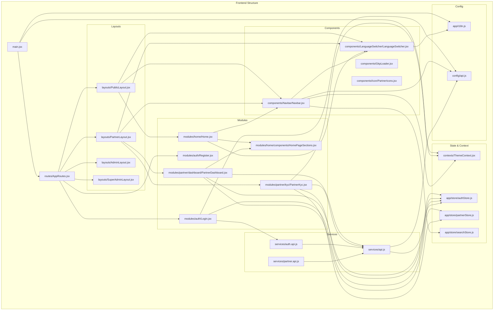

### Backend Folder Dependencies

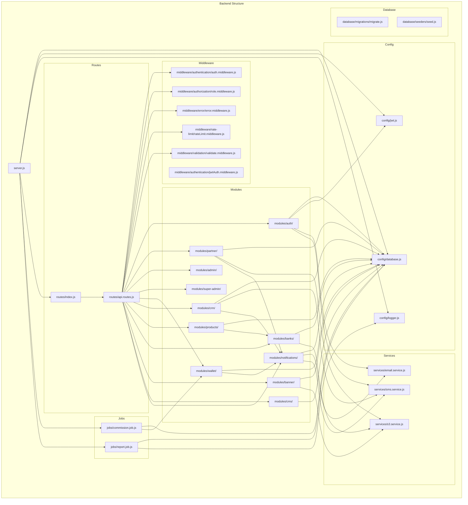

---

## Frontend Component Tree

```mermaid
graph TB
    App[App.jsx]
    
    subgraph "Layout Components"
        PublicLayout[PublicLayout]
        PartnerLayout[PartnerLayout]
        AdminLayout[AdminLayout]
        SuperAdminLayout[SuperAdminLayout]
    end
    
    subgraph "Public Pages"
        Home[Home]
        ProductDetail[ProductDetail]
        ServicePage[ServicePage]
        ComparePage[ComparePage]
    end
    
    subgraph "Auth Pages"
        PartnerLogin[PartnerLogin]
        PartnerRegister[PartnerRegister]
        AdminLogin[AdminLogin]
    end
    
    subgraph "Partner Pages"
        PartnerDashboard[PartnerDashboard]
        PartnerKyc[PartnerKyc]
        PartnerWallet[PartnerWallet]
        PartnerLeads[PartnerLeads]
        PartnerProfile[PartnerProfile]
        PartnerReferral[PartnerReferral]
        PartnerVault[PartnerVault]
        PartnerMarketplace[PartnerMarketplace]
        PartnerCreditCenter[PartnerCreditCenter]
        PartnerCRM[PartnerCRM]
        PartnerTraining[PartnerTraining]
        PartnerMarketing[PartnerMarketing]
        PartnerTravel[PartnerTravel]
        PartnerSupport[PartnerSupport]
        PartnerSettings[PartnerSettings]
    end
    
    subgraph "Admin Pages"
        AdminDashboard[AdminDashboard]
        AdminPartners[AdminPartners]
        AdminApplications[AdminApplications]
        AdminLeads[AdminLeads]
        AdminWithdrawals[AdminWithdrawals]
    end
    
    subgraph "Super Admin Pages"
        SuperAdminDashboard[SuperAdminDashboard]
        SuperAdminBanners[SuperAdminBanners]
        SuperAdminCMS[SuperAdminCMS]
        SuperAdminProducts[SuperAdminProducts]
        SuperAdminBanks[SuperAdminBanks]
        SuperAdminCommissions[SuperAdminCommissions]
        SuperAdminAudit[SuperAdminAudit]
        SuperAdminSettings[SuperAdminSettings]
        SuperAdminServices[SuperAdminServices]
        SuperAdminReports[SuperAdminReports]
    end
    
    subgraph "Shared Components"
        Navbar[Navbar]
        LanguageSwitcher[LanguageSwitcher]
        ThemeToggle[ThemeToggle]
        GkpLoader[GkpLoader]
        PartnerIcons[PartnerIcons]
        ForcePasswordChangeModal[ForcePasswordChangeModal]
    end
    
    subgraph "Home Page Components"
        HeroBannerCarousel[HeroBannerCarousel]
        CreditCardsSection[CreditCardsSection]
        LoansSection[LoansSection]
        InsuranceSection[InsuranceSection]
        TravelServicesSection[TravelServicesSection]
        UtilityServicesSection[UtilityServicesSection]
        BankLogosSection[BankLogosSection]
        WhyChooseUsSection[WhyChooseUsSection]
        PartnerReferralBanner[PartnerReferralBanner]
        TestimonialsSection[TestimonialsSection]
        FAQSection[FAQSection]
        LatestOffersSection[LatestOffersSection]
    end
    
    App --> PublicLayout
    App --> PartnerLayout
    App --> AdminLayout
    App --> SuperAdminLayout
    
    PublicLayout --> Home
    PublicLayout --> ProductDetail
    PublicLayout --> ServicePage
    PublicLayout --> ComparePage
    PublicLayout --> PartnerLogin
    PublicLayout --> PartnerRegister
    PublicLayout --> AdminLogin
    
    PartnerLayout --> PartnerDashboard
    PartnerLayout --> PartnerKyc
    PartnerLayout --> PartnerWallet
    PartnerLayout --> PartnerLeads
    PartnerLayout --> PartnerProfile
    PartnerLayout --> PartnerReferral
    PartnerLayout --> PartnerVault
    PartnerLayout --> PartnerMarketplace
    PartnerLayout --> PartnerCreditCenter
    PartnerLayout --> PartnerCRM
    PartnerLayout --> PartnerTraining
    PartnerLayout --> PartnerMarketing
    PartnerLayout --> PartnerTravel
    PartnerLayout --> PartnerSupport
    PartnerLayout --> PartnerSettings
    
    AdminLayout --> AdminDashboard
    AdminLayout --> AdminPartners
    AdminLayout --> AdminApplications
    AdminLayout --> AdminLeads
    AdminLayout --> AdminWithdrawals
    
    SuperAdminLayout --> SuperAdminDashboard
    SuperAdminLayout --> SuperAdminBanners
    SuperAdminLayout --> SuperAdminCMS
    SuperAdminLayout --> SuperAdminProducts
    SuperAdminLayout --> SuperAdminBanks
    SuperAdminLayout --> SuperAdminCommissions
    SuperAdminLayout --> SuperAdminAudit
    SuperAdminLayout --> SuperAdminSettings
    SuperAdminLayout --> SuperAdminServices
    SuperAdminLayout --> SuperAdminReports
    
    PublicLayout --> Navbar
    PartnerLayout --> Navbar
    PartnerLayout --> LanguageSwitcher
    PartnerLayout --> ThemeToggle
    PartnerLayout --> ForcePasswordChangeModal
    
    Home --> HeroBannerCarousel
    Home --> CreditCardsSection
    Home --> LoansSection
    Home --> InsuranceSection
    Home --> TravelServicesSection
    Home --> UtilityServicesSection
    Home --> BankLogosSection
    Home --> WhyChooseUsSection
    Home --> PartnerReferralBanner
    Home --> TestimonialsSection
    Home --> FAQSection
    Home --> LatestOffersSection
    
    PartnerDashboard --> HeroBannerCarousel
    PartnerDashboard --> CreditCardsSection
    PartnerDashboard --> LoansSection
    PartnerDashboard --> InsuranceSection
    PartnerDashboard --> TravelServicesSection
    PartnerDashboard --> UtilityServicesSection
    PartnerDashboard --> BankLogosSection
    PartnerDashboard --> WhyChooseUsSection
    PartnerDashboard --> PartnerReferralBanner
    PartnerDashboard --> TestimonialsSection
    PartnerDashboard --> FAQSection
    PartnerDashboard --> LatestOffersSection
```

---

## Backend Module Dependency Tree

```mermaid
graph TB
    subgraph "Core Modules"
        Auth[Auth Module]
        Database[Database Module]
        Logger[Logger Module]
        JWT[JWT Module]
    end
    
    subgraph "Business Modules"
        Partner[Partner Module]
        Wallet[Wallet Module]
        CRM[CRM Module]
        Products[Products Module]
        Banks[Banks Module]
    end
    
    subgraph "Admin Modules"
        Admin[Admin Module]
        SuperAdmin[Super Admin Module]
    end
    
    subgraph "Content Modules"
        Banner[Banner Module]
        CMS[CMS Module]
        Notifications[Notifications Module]
    end
    
    subgraph "Reporting Modules"
        Reports[Reports Module]
        Analytics[Analytics Module]
    end
    
    subgraph "External Services"
        Email[Email Service]
        SMS[SMS Service]
        S3[S3 Service]
    end
    
    subgraph "Scheduled Jobs"
        CommissionJob[Commission Job]
        ReportJob[Report Job]
    end
    
    Auth --> Database
    Auth --> JWT
    Auth --> Logger
    Auth --> Email
    Auth --> SMS
    
    Partner --> Database
    Partner --> Auth
    Partner --> Logger
    Partner --> S3
    Partner --> Notifications
    
    Wallet --> Database
    Partner --> Wallet
    Wallet --> Logger
    Wallet --> Notifications
    
    CRM --> Database
    CRM --> Auth
    CRM --> Logger
    CRM --> SMS
    CRM --> Notifications
    
    Products --> Database
    Products --> Logger
    Products --> Banks
    
    Banks --> Database
    Banks --> Logger
    Banks --> S3
    
    Admin --> Database
    Admin --> Auth
    Admin --> Logger
    Admin --> Partner
    Admin --> CRM
    Admin --> Wallet
    
    SuperAdmin --> Database
    SuperAdmin --> Auth
    SuperAdmin --> Logger
    SuperAdmin --> Banner
    SuperAdmin --> CMS
    SuperAdmin --> Products
    SuperAdmin --> Banks
    SuperAdmin --> Reports
    SuperAdmin --> Analytics
    
    Banner --> Database
    Banner --> Logger
    Banner --> S3
    
    CMS --> Database
    CMS --> Logger
    
    Notifications --> Database
    Notifications --> Logger
    Notifications --> Email
    Notifications --> SMS
    
    Reports --> Database
    Reports --> Logger
    
    Analytics --> Database
    Analytics --> Logger
    
    CommissionJob --> Database
    CommissionJob --> Logger
    CommissionJob --> Wallet
    CommissionJob --> Notifications
    
    ReportJob --> Database
    ReportJob --> Logger
    ReportJob --> Reports
```

---

## Complete API Call Flow

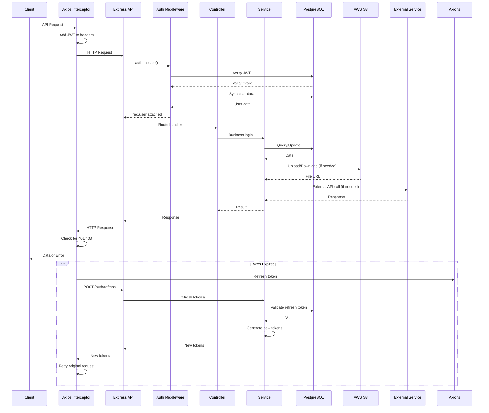

---

## Authentication Flow Diagram

```mermaid
flowchart TD
    Start([User Login]) --> Method{Auth Method}
    
    Method -->|OTP| SendOTP[Send OTP via MSG91]
    Method -->|Password| CheckPassword[Verify Password Hash]
    
    SendOTP --> EnterOTP[User Enters OTP]
    EnterOTP --> VerifyOTP{OTP Valid?}
    VerifyOTP -->|No| EnterOTP
    VerifyOTP -->|Yes| GetUser[Fetch User from DB]
    
    CheckPassword --> PasswordValid{Password Correct?}
    PasswordValid -->|No| Error([Invalid Credentials])
    PasswordValid -->|Yes| GetUser
    
    GetUser --> CheckStatus{User Status}
    CheckStatus -->|Blocked| Blocked([Account Blocked])
    CheckStatus -->|Suspended| Suspended([Account Suspended])
    CheckStatus -->|Inactive| Inactive([Account Inactive])
    CheckStatus -->|Active| CheckRole
    
    CheckRole --> Role{User Role}
    Role -->|PARTNER| CheckKYC
    Role -->|ADMIN| AdminDashboard
    Role -->|SUPER_ADMIN| SuperAdminDashboard
    
    CheckKYC --> KYCStatus{KYC Status}
    KYCStatus -->|Approved| GenerateTokens
    KYCStatus -->|Pending| PendingKYC[Pending KYC - Limited Access]
    KYCStatus -->|Rejected| RejectedKYC[Rejected KYC - Redirect to KYC]
    KYCStatus -->|Under Review| UnderReviewKYC[Under Review - Full Access]
    
    PendingKYC --> GenerateTokens
    UnderReviewKYC --> GenerateTokens
    RejectedKYC --> GenerateTokens
    
    GenerateTokens[Generate JWT + Refresh Token] --> StoreTokens[Store in Zustand + Memory]
    StoreTokens --> Redirect[Redirect to Dashboard]
    
    Redirect --> AdminDashboard
    Redirect --> SuperAdminDashboard
    Redirect --> PartnerDashboard
    
    PartnerDashboard([Partner Dashboard])
    AdminDashboard([Admin Dashboard])
    SuperAdminDashboard([Super Admin Dashboard])
    
    Blocked --> End([End])
    Suspended --> End
    Inactive --> End
    Error --> End
```

---

## User Journey Diagrams

### Partner Journey

```mermaid
journey
    title Partner Onboarding & Usage Journey
    section Registration
      Visit Website: 5: Partner
      Register Account: 4: Partner
      Verify OTP: 3: Partner
      Fill Profile Details: 4: Partner
    section KYC Process
      Upload Documents: 3: Partner
      Submit for Verification: 3: Partner
      Wait for Approval: 2: Partner
      Receive Approval: 5: Partner
    section Dashboard
      View Dashboard: 5: Partner
      Browse Products: 4: Partner
      Generate Lead Link: 4: Partner
    section Lead Management
      Submit Customer Lead: 4: Partner
      Track Application Status: 5: Partner
      Receive Commission: 5: Partner
    section Wallet
      View Earnings: 5: Partner
      Request Withdrawal: 4: Partner
      Receive Payout: 5: Partner
```

### Super Admin Journey

```mermaid
journey
    title Super Admin Management Journey
    section Login
      Login with Credentials: 5: Super Admin
      Access Dashboard: 5: Super Admin
    section Content Management
      Manage Banners: 4: Super Admin
      Update CMS Content: 4: Super Admin
      Configure Services: 3: Super Admin
    section Product Management
      Add New Products: 4: Super Admin
      Update Product Details: 4: Super Admin
      Manage Bank Partners: 3: Super Admin
    section Commission Setup
      Configure Commission Rates: 4: Super Admin
      Set Holding Periods: 3: Super Admin
      Monitor Payouts: 5: Super Admin
    section System Management
      View Audit Logs: 5: Super Admin
      Manage Admins: 4: Super Admin
      Configure Settings: 3: Super Admin
      View Reports: 5: Super Admin
```

### Customer Journey

```mermaid
journey
    title Customer Application Journey
    section Discovery
      Visit Website: 5: Customer
      Browse Products: 4: Customer
      Compare Options: 4: Customer
    section Application
      Select Product: 5: Customer
      Fill Application Form: 4: Customer
      Verify OTP: 3: Customer
      Submit Application: 5: Customer
    section Processing
      Receive Application ID: 5: Customer
      Track Status: 4: Customer
      Receive Updates: 4: Customer
    section Completion
      Get Approved: 5: Customer
      Receive Disbursement: 5: Customer
```

---

## Wallet & Commission Engine

```mermaid
graph TB
    subgraph "Lead Generation"
        Lead[Lead Created]
        App[Application Submitted]
    end
    
    subgraph "Commission Calculation"
        Calc[Calculate Commission]
        Structure[Commission Structure]
        Rate[Commission Rate/Amount]
        HoldPeriod[Holding Period]
    end
    
    subgraph "Commission Hold"
        CreateHold[Create Hold Transaction]
        HoldTxn[Wallet Transaction - Hold]
        ReleaseDate[Set Release Date]
    end
    
    subgraph "Commission Release"
        CheckMaturity[Cron Job Check]
        IsMatured{Release Date <= Now?}
        ReleaseHold[Release Hold]
        Credit[Credit to Available Balance]
        UpdateStatus[Update Transaction Status]
    end
    
    subgraph "Withdrawal"
        Request[Withdrawal Request]
        Validate[Validate Balance]
        CreateWithdrawalHold[Create Withdrawal Hold]
        AdminApprove[Admin Approval]
        ProcessTransfer[Bank Transfer]
        Deduct[Deduct from Balance]
    end
    
    subgraph "Notifications"
        LeadNotify[Lead Created Notification]
        HoldNotify[Commission Hold Notification]
        ReleaseNotify[Commission Credit Notification]
        WithdrawNotify[Withdrawal Notification]
    end
    
    Lead --> App
    App --> Calc
    Calc --> Structure
    Structure --> Rate
    Structure --> HoldPeriod
    Rate --> HoldPeriod
    HoldPeriod --> CreateHold
    CreateHold --> HoldTxn
    HoldTxn --> ReleaseDate
    ReleaseDate --> CheckMaturity
    
    CheckMaturity --> IsMatured
    IsMatured -->|Yes| ReleaseHold
    IsMatured -->|No| CheckMaturity
    ReleaseHold --> Credit
    Credit --> UpdateStatus
    UpdateStatus --> ReleaseNotify
    
    Request --> Validate
    Validate --> CreateWithdrawalHold
    CreateWithdrawalHold --> AdminApprove
    AdminApprove --> ProcessTransfer
    ProcessTransfer --> Deduct
    Deduct --> WithdrawNotify
    
    Lead --> LeadNotify
    HoldTxn --> HoldNotify
    Credit --> ReleaseNotify
```

---

## Product Lifecycle

```mermaid
stateDiagram-v2
    [*] --> Draft: Super Admin Creates
    Draft --> Active: Super Admin Activates
    Active --> Inactive: Super Admin Deactivates
    Inactive --> Active: Super Admin Reactivates
    Active --> Archived: Product Discontinued
    Archived --> [*]
    
    note right of Draft
        - Basic Details
        - Bank Information
        - Commission Structure
        - Not Visible to Partners
    end note
    
    note right of Active
        - Visible to Partners
        - Partners Can Generate Leads
        - Commission Calculations Active
        - Can Be Applied For
    end note
    
    note right of Inactive
        - Not Visible to Partners
        - Existing Leads Continue
        - No New Leads
        - Can Be Reactivated
    end note
    
    note right of Archived
        - Historical Data Only
        - No New Leads
        - Cannot Be Reactivated
        - Reports Still Available
    end note
```

---

## Deployment Diagram

```mermaid
graph TB
    subgraph "AWS Cloud"
        subgraph "Frontend Deployment"
            S3Frontend[S3 Bucket<br/>Static React Build]
            CloudFront[CloudFront CDN<br/>Global Distribution]
            Route53[Route 53<br/>DNS Management]
            ACM[ACM<br/>SSL Certificates]
        end
        
        subgraph "Backend Deployment"
            EC2[EC2 Instance<br/>Ubuntu Server]
            Nginx[Nginx<br/>Reverse Proxy]
            PM2[PM2<br/>Process Manager]
            NodeJS[Node.js<br/>Express API]
        end
        
        subgraph "Database"
            RDS[(Amazon RDS<br/>PostgreSQL)]
            ElastiCache[(ElastiCache<br/>Redis - Future)]
        end
        
        subgraph "File Storage"
            S3Docs[S3 Bucket<br/>Documents & Images]
        end
        
        subgraph "External Services"
            MSG91[MSG91<br/>SMS Gateway]
            SES[AWS SES<br/>Email Service]
        end
    end
    
    subgraph "Development"
        LocalDev[Local Development<br/>React + Express]
        Git[Git Repository<br/>GitHub/GitLab]
        CI[CI/CD Pipeline<br/>GitHub Actions]
    end
    
    LocalDev --> Git
    Git --> CI
    CI --> S3Frontend
    CI --> EC2
    
    Route53 --> CloudFront
    CloudFront --> S3Frontend
    
    User[User Browser] --> Route53
    Route53 --> CloudFront
    CloudFront --> S3Frontend
    
    User --> Nginx
    Nginx --> NodeJS
    NodeJS --> PM2
    PM2 --> NodeJS
    
    NodeJS --> RDS
    NodeJS --> S3Docs
    NodeJS --> MSG91
    NodeJS --> SES
    
    NodeJS --> ElastiCache
```

---

## Architectural Issues & Improvements

### 🔴 Critical Issues

#### 1. **Missing Redis Cache Layer**
- **Issue**: No caching mechanism for frequently accessed data (products, banners, partner profiles)
- **Impact**: High database load, slow response times
- **Recommendation**: Implement Redis caching with TTL for:
  - Product catalog (1 hour TTL)
  - Banners (30 minutes TTL)
  - CMS content (1 hour TTL)
  - Partner dashboard stats (5 minutes TTL)

#### 2. **No Rate Limiting Per User**
- **Issue**: Global rate limiting only, no per-user limits
- **Impact**: Single user can abuse API endpoints
- **Recommendation**: Implement per-user rate limiting using Redis:
  ```javascript
  rateLimit({
    windowMs: 15 * 60 * 1000,
    max: 100,
    keyGenerator: (req) => req.user?.id || req.ip
  })
  ```

#### 3. **Missing Database Connection Pooling Configuration**
- **Issue**: Default PostgreSQL connection pool settings
- **Impact**: Connection exhaustion under high load
- **Recommendation**: Configure connection pool in `config/database.js`:
  ```javascript
  pool: {
    max: 20,
    min: 5,
    idle: 10000,
    acquire: 30000
  }
  ```

#### 4. **No Request Validation Middleware**
- **Issue**: Inconsistent validation across endpoints
- **Impact**: Security vulnerabilities, invalid data in database
- **Recommendation**: Implement centralized validation middleware using express-validator

#### 5. **Missing API Versioning Strategy**
- **Issue**: All endpoints under `/api/v1` without version management
- **Impact**: Breaking changes affect all clients
- **Recommendation**: Implement proper API versioning with deprecation timeline

### 🟡 Medium Priority Issues

#### 6. **Duplicate Code in Layout Components**
- **Issue**: Similar sidebar/header code across PartnerLayout, AdminLayout, SuperAdminLayout
- **Impact**: Maintenance overhead, inconsistent updates
- **Recommendation**: Extract common layout components:
  - `Sidebar` component
  - `Header` component
  - `MobileNav` component

#### 7. **Inconsistent Error Handling**
- **Issue**: Some controllers use try-catch, others don't
- **Impact**: Unhandled exceptions, poor error messages
- **Recommendation**: Standardize error handling with async wrapper:
  ```javascript
  const asyncHandler = (fn) => (req, res, next) => {
    Promise.resolve(fn(req, res, next)).catch(next);
  };
  ```

#### 8. **Missing Request/Response Logging**
- **Issue**: No structured logging for API requests
- **Impact**: Difficult debugging, no audit trail
- **Recommendation**: Implement request logging middleware with correlation IDs

#### 9. **No Background Job Queue**
- **Issue**: Cron jobs run directly, no queue management
- **Impact**: Job failures not retried, no monitoring
- **Recommendation**: Implement Bull queue with Redis:
  - Commission release jobs
  - Email sending jobs
  - SMS sending jobs

#### 10. **Missing File Upload Validation**
- **Issue**: Limited file type/size validation
- **Impact**: Security risks, storage costs
- **Recommendation**: Implement strict validation:
  - File type whitelist
  - File size limits (5MB max)
  - Virus scanning integration

### 🟢 Low Priority Improvements

#### 11. **No GraphQL API**
- **Issue**: REST API only, over-fetching/under-fetching
- **Impact**: Inefficient data transfer
- **Recommendation**: Consider adding GraphQL for mobile clients

#### 12. **Missing WebSocket Support**
- **Issue**: No real-time notifications
- **Impact**: Polling required for updates
- **Recommendation**: Implement Socket.io for:
  - Real-time commission updates
  - Live lead status changes
  - Instant notifications

#### 13. **No API Documentation**
- **Issue**: No Swagger/OpenAPI documentation
- **Impact**: Difficult for frontend developers
- **Recommendation**: Implement Swagger with JSDoc comments

#### 14. **Missing Unit Tests**
- **Issue**: No test coverage
- **Impact**: Regression bugs, deployment risks
- **Recommendation**: Implement Jest for:
  - Unit tests for services
  - Integration tests for controllers
  - E2E tests with Playwright

#### 15. **No Database Backup Strategy**
- **Issue**: No automated backups documented
- **Impact**: Data loss risk
- **Recommendation**: Implement:
  - Daily automated backups
  - Point-in-time recovery
  - Backup verification

### 📊 Orphan Files & Unused Code

#### Orphan Files
- `scratch_login.txt` - Development test file
- `scratch_translate.js` - Translation test file
- `~$arKaPaisaReport.docx` - Temporary Office file

#### Unused APIs
- Firebase integration code exists but not fully utilized
- MSG91 integration has fallback to Twilio but Twilio not configured

#### Duplicated Code
- Partner icons defined in multiple files
- Validation logic repeated across controllers
- Database query patterns duplicated

### 🔧 SQL Inconsistencies

#### 1. **Enum Value Inconsistencies**
- `user_status` enum has both 'inactive' and 'pending_verification'
- Some tables use `status` column, others use `is_active`
- **Recommendation**: Standardize status enums across all tables

#### 2. **Missing Indexes**
- No indexes on frequently queried columns:
  - `partner_profiles.kyc_status`
  - `leads.status`
  - `applications.status`
  - `wallet_transactions.created_at`
- **Recommendation**: Add composite indexes for common query patterns

#### 3. **No Foreign Key Constraints**
- Some relationships lack proper FK constraints
- **Recommendation**: Add FK constraints with ON DELETE CASCADE/SET NULL

#### 4. **Inconsistent Timestamps**
- Some tables use `created_at`, others use `timestamp`
- **Recommendation**: Standardize on `created_at` and `updated_at` naming

### 🚀 Architectural Improvements

#### 1. **Implement Microservices Architecture**
- Split monolith into:
  - Auth Service
  - Partner Service
  - Product Service
  - Wallet Service
  - Notification Service

#### 2. **Add API Gateway**
- Implement Kong or AWS API Gateway for:
  - Rate limiting
  - Authentication
  - Load balancing
  - Request transformation

#### 3. **Implement Event-Driven Architecture**
- Use message queue (RabbitMQ/SQS) for:
  - Commission events
  - Notification events
  - Lead events

#### 4. **Add Monitoring & Observability**
- Implement:
  - Prometheus + Grafana for metrics
  - ELK Stack for logging
  - Sentry for error tracking
  - APM (New Relic/DataDog)

#### 5. **Implement CQRS Pattern**
- Separate read and write operations for:
  - Dashboard analytics
  - Reporting
  - Audit logs

#### 6. **Add Database Read Replicas**
- Implement read replicas for:
  - Reporting queries
  - Analytics dashboards
  - Reduced load on primary

#### 7. **Implement Feature Flags**
- Add feature flag system for:
  - Gradual rollouts
  - A/B testing
  - Emergency kill switches

#### 8. **Add Multi-tenancy Support**
- Implement tenant isolation for:
  - White-label deployments
  - Partner-specific configurations
  - Data segregation

---

## Summary

This enterprise architecture document provides a comprehensive overview of the GharKaPaisa financial platform, covering:

- **C4 Model**: System context, containers, components, and code structure
- **UML Diagrams**: Class, sequence, activity, use case, and state diagrams
- **Database Design**: Complete ER diagram with all entities and relationships
- **API Architecture**: RESTful endpoint structure and dependencies
- **Code Structure**: Frontend and backend folder dependencies
- **Component Trees**: React component hierarchy
- **Module Dependencies**: Backend module relationships
- **API Flows**: Complete request/response lifecycle
- **Authentication**: Detailed auth flow with status handling
- **User Journeys**: Partner, Super Admin, and Customer experiences
- **Business Logic**: Wallet/commission engine and product lifecycle
- **Deployment**: AWS infrastructure diagram
- **Issues**: Critical, medium, and low priority improvements

The architecture follows a traditional monolithic pattern with clear separation of concerns through layered architecture (middleware, routes, controllers, services, repositories). The system is ready for scaling through the recommended improvements including caching, queue systems, and potential microservices migration.
