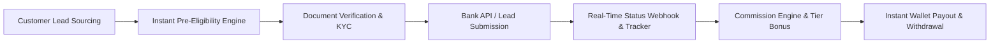

# Enterprise Banking CRM Architecture & Workflow Redesign
## GharKaPaisa Financial Partner Operating System (Workflow-First Engine)

**Target Platform**: Financial Partner Panel & Banking DSA Operating System  
**Core Shift**: Transition from a traditional static dashboard to a **Workflow-First Enterprise Banking CRM**  
**Scale Target**: High-Throughput DSAs, Independent Financial Advisors (IFAs), and Sub-Agent Master Networks  
**Date**: August 2026  

---

## 1. Executive Business Workflow Analysis

The Partner Panel serves as the central revenue engine for GharKaPaisa's Direct Selling Agents (DSAs) and Financial Partners. Rather than viewing data passively, high-performing financial agents require an active **Workflow-First CRM** that drives leads from acquisition through verification, bank application submission, status tracking, commission calculation, and automated wallet payout.



---

## 2. Comprehensive Screen-by-Screen Deep Audit

### 2.1 Partner Dashboard (`/partner/dashboard`)
1. **Purpose**: Overview of partner activity, quick access to products, wallet balance, and top stats.
2. **Current Flow**: Renders summary stat cards, wallet card, recent activity list, and quick service links.
3. **Problems**: Passive display of numbers without telling the agent *what actionable task to perform next*.
4. **User Experience Issues**: Visual clutter on small laptops; stat cards take up prime screen real estate without actionable lead triggers.
5. **Navigation Issues**: Secondary clicks needed to reach pending customer leads requiring urgent attention.
6. **Missing Features**: Actionable "Next Steps Queue" (e.g. 5 leads awaiting customer OTP verification, 2 incomplete KYC files).
7. **Business Logic Issues**: Does not prioritize high-commission cards or urgent leads with expiring bank offers.
8. **Database Dependencies**: `partners`, `wallets`, `credit_card_applications`, `wallet_audit_logs`.
9. **API Dependencies**: `/api/v1/partner/dashboard`, `/api/v1/wallet`, `/api/v1/applications`.
10. **Frontend Dependencies**: `PartnerDashboardComponent.jsx`, `authStore`, `walletStore`.
11. **Backend Dependencies**: `modules/partner`, `modules/wallet`, `modules/reports`.
12. **Security**: Protected by `authGuard`; sanitizes partner ID query lookups.
13. **Performance**: Optimized SQL aggregations; should cache static partner profile headers.
14. **Scalability**: Requires server-side pagination on recent activity tables.

---

### 2.2 Credit Cards & Bank Workspaces (`/partner/credit-cards`, `/partner/credit-cards/:slug`)
1. **Purpose**: Bank selection, product discovery, and card application initiation for credit cards.
2. **Current Flow**: Renders "Recently Used Banks", full bank grid, active card counts, and bank card detail workspace.
3. **Problems**: Static list of cards without instant customer eligibility pre-screening before application.
4. **User Experience Issues**: Long scroll lists on mobile without sticky search/filter tools.
5. **Navigation Issues**: Returning to previous bank filter requires full page reload/re-render.
6. **Missing Features**: 1-Click WhatsApp Lead Sharer with pre-populated partner code and instant loan/card comparison drawer.
7. **Business Logic Issues**: Does not dynamically rank cards by partner's historical conversion rate or bank approval speed.
8. **Database Dependencies**: `products`, `banks`, `credit_card_applications`.
9. **API Dependencies**: `/api/v1/credit-cards/banks`, `/api/v1/products`.
10. **Frontend Dependencies**: `PartnerCategoryOverview.jsx`, `HDFCCardsPage.jsx`, `BanksContext`.
11. **Backend Dependencies**: `modules/products`, `modules/banks`.
12. **Security**: Validates category parameters and sanitizes search queries.
13. **Performance**: Renders dynamic card thumbnails smoothly; benefits from image lazy-loading.
14. **Scalability**: Bank catalog handles hundreds of products seamlessly via `useActiveBanks`.

---

### 2.3 Applications & Lead Management (`/partner/applications`)
1. **Purpose**: Real-time pipeline management for all submitted customer credit card, loan, and insurance leads.
2. **Current Flow**: Shows filterable lead table (`All`, `Pending`, `Approved`, `Rejected`), customer contact details, and status badges.
3. **Problems**: Lacks step-by-step visual application timeline and automated bulk CSV upload.
4. **User Experience Issues**: Mobile view requires horizontal table scrolling; card layout needed for handheld screens.
5. **Navigation Issues**: Clicking a lead opens basic details instead of a full Customer 360 Workspace.
6. **Missing Features**: Automated SMS/WhatsApp nudge button to remind customer to complete pending OTP verification.
7. **Business Logic Issues**: Missing automated status sync fallback if bank webhook is delayed.
8. **Database Dependencies**: `credit_card_applications`, `partners`, `products`, `application_status_logs`.
9. **API Dependencies**: `/api/v1/applications`, `/api/v1/applications/:id/status`.
10. **Frontend Dependencies**: `PartnerApplications.jsx`, `application.api.js`.
11. **Backend Dependencies**: `modules/crm`, `modules/partner`, `modules/notifications`.
12. **Security**: Strict partner ownership check (`WHERE partner_id = req.user.id`).
13. **Performance**: Server-side pagination (25 records/page) ensures fast load times.
14. **Scalability**: Scalable relational architecture with indexed foreign keys.

---

### 2.4 Partner Wallet & Earnings (`/partner/wallet`)
1. **Purpose**: Track real-time commission earnings, available balance, transaction logs, and process withdrawal requests.
2. **Current Flow**: Renders balance header card, available vs pending payout breakdown, and withdrawal modal.
3. **Problems**: Manual withdrawal review creates delay for high-volume DSAs expecting instant payouts.
4. **User Experience Issues**: Transaction history lacks clear breakdown of commission rate per approved product.
5. **Navigation Issues**: Direct navigation between wallet and specific lead application could be more tightly integrated.
6. **Missing Features**: Automated Razorpay Payout API integration for 24/7 instant IMPS/UPI wallet withdrawals.
7. **Business Logic Issues**: Lacks automated tax deduction (TDS 5%) computation breakdown on payout receipts.
8. **Database Dependencies**: `wallets`, `wallet_audit_logs`, `transactions`, `partners`.
9. **API Dependencies**: `/api/v1/wallet`, `/api/v1/wallet/withdraw`.
10. **Frontend Dependencies**: `PartnerWallet.jsx`, `walletStore`.
11. **Backend Dependencies**: `modules/wallet`, `modules/payment`.
12. **Security**: Transaction safety using SQL `BEGIN...COMMIT/ROLLBACK` blocks prevents race conditions.
13. **Performance**: Fast indexed lookups on `partner_id`.
14. **Scalability**: Row-level locking on wallet balance guarantees zero balance corruption under concurrency.

---

### 2.5 Team Network & Sub-Agent Management (`/partner/team-network`)
1. **Purpose**: Manage downline sub-agent network, monitor team performance, and track referral commissions.
2. **Current Flow**: Displays team list, referral code link, QR code download, and network stats.
3. **Problems**: Basic list format; lacks multi-tier hierarchy visualization.
4. **User Experience Issues**: Visual hierarchy of sub-agents is flat rather than an interactive org tree.
5. **Navigation Issues**: Difficult to drill down into a specific sub-agent's monthly lead metrics.
6. **Missing Features**: Customizable overriding commission rate sharing (e.g. Master DSA splits 20% to sub-agent).
7. **Business Logic Issues**: Single-tier commission tracking needs multi-level network override distribution rules.
8. **Database Dependencies**: `partners`, `team_network`, `commissions`.
9. **API Dependencies**: `/api/v1/team-network`, `/api/v1/team-network/members`.
10. **Frontend Dependencies**: `PartnerTeam.jsx`.
11. **Backend Dependencies**: `modules/team`, `modules/partner`.
12. **Security**: Enforces parent partner authorization check for sub-agent data access.
13. **Performance**: Good response time; requires paginated tree node loading for networks > 500 members.
14. **Scalability**: Adjacency list schema (`parent_partner_id`) supports infinite sub-agent hierarchy scaling.

---

### 2.6 KYC Centre & Compliance (`/partner/kyc-centre`)
1. **Purpose**: Upload Aadhaar, PAN, Bank Passbook, and Video KYC for partner activation and regulatory compliance.
2. **Current Implementation**: Multi-step wizard uploading images and video script recording.
3. **Problems**: Manual verification by admin delays partner onboarding from 0 to 24 hours.
4. **User Experience Issues**: Video recording step on low-end mobile devices can suffer from browser media recorder compatibility.
5. **Navigation Issues**: Clear status indicator needed at top of screen during pending state.
6. **Missing Features**: Real-time automated PAN-Aadhaar API verification (Karza / SurePass integration) for instant 10-second approval.
7. **Business Logic Issues**: Account status transition (`pending` -> `approved`) requires manual trigger.
8. **Database Dependencies**: `partner_profiles`, `partners`, `kyc_documents`.
9. **API Dependencies**: `/api/v1/partner/kyc`, `/api/v1/partner/kyc/upload`.
10. **Frontend Dependencies**: `PartnerKyc.jsx`, `ForcePasswordChangeModal.jsx`.
11. **Backend Dependencies**: `modules/partner`, `services/aws`.
12. **Security**: Encrypted file storage; access restricted to authorized admins.
13. **Performance**: Direct S3 upload prevents node server memory overload.
14. **Scalability**: High cloud storage scalability via AWS S3.

---

## 3. Workflow-First Enterprise Banking CRM Redesign

Instead of a passive dashboard with static widgets, the redesigned Partner Operating System is built around **Active Execution Workspaces**:

```
+---------------------------------------------------------------------------------------------------+
|  GHARKAPAISA ENTERPRISE CRM  |  🟢 Active DSA: GKP-9042  |  Wallet: ₹48,500  |  [+ Quick Action]  |
+---------------------------------------------------------------------------------------------------+
|  NAVIGATION: [1. Action Queue (5)] [2. Lead Pipeline] [3. Bank Workspaces] [4. Earnings] [5. Team] |
+---------------------------------------------------------------------------------------------------+
|                                                                                                   |
|  WORKSPACE 1: ACTION QUEUE (Urgent Tasks Required Today)                                          |
|  -----------------------------------------------------------------------------------------------  |
|  ⚡ Customer OTP Pending (3)   | 📄 Missing PAN/Salary Slip (2)   | 🔄 Bank Re-submission Needed (1)|
|                                                                                                   |
|  [Action Required] Customer: Rahul Verma (HDFC Millennia) -> Send WhatsApp Remind Link -> [Send]  |
|  [Action Required] Customer: Ankit Saxena (SBI SimplyClick) -> Upload Salary Slip      -> [Upload]|
|                                                                                                   |
+---------------------------------------------------------------------------------------------------+
|                                                                                                   |
|  WORKSPACE 2: WORKFLOW-FIRST LEAD CONVERSION PIPELINE                                             |
|  -----------------------------------------------------------------------------------------------  |
|  [NEW LEADS (12)]   ==>   [ELIGIBILITY CHECK (8)]   ==>   [BANK PROCESSING (15)]   ==> [APPROVED (34)]
|  -----------------        -----------------------         -----------------------       ----------------
|  • S. Gupta (Axis)        • V. Kumar (ICICI)             • M. Patel (HDFC)             • A. Singh (SBI) 
|    ₹1,800 Comm.             Pre-Check: Passed              Ref: HDFC-99214               Payout Credited 
|    [Resume Application]    [Send Bank Link]               [Check Bank Status]           [View Receipt]  |
|                                                                                                   |
+---------------------------------------------------------------------------------------------------+
```

---

## 4. Architectural Implementation Blueprint

### 4.1 Redesigned API Structure

| Module | Method & Route | Purpose & Payload |
| :--- | :--- | :--- |
| **CRM Queue** | `GET /api/v1/crm/action-queue` | Returns actionable pending tasks (OTP pending, doc required, bank callbacks). |
| **Lead Engine** | `POST /api/v1/crm/leads/pre-screen` | Instant eligibility match engine checking CIBIL, age, and income thresholds. |
| **Bulk Lead** | `POST /api/v1/crm/leads/bulk-import` | Uploads CSV with 50+ customer records, validates format, and queues leads. |
| **Instant Payout**| `POST /api/v1/wallet/instant-payout` | Triggers 24/7 automated Razorpay IMPS transfer to partner bank account. |
| **Team Hierarchy**| `GET /api/v1/team/hierarchy-tree` | Returns recursive nested JSON tree of sub-agents with volume metrics. |

---

### 4.2 Database Schema Optimization (PostgreSQL)

```sql
-- Action Queue Task Master Table
CREATE TABLE partner_crm_action_tasks (
    id UUID PRIMARY KEY DEFAULT gen_random_uuid(),
    partner_id UUID REFERENCES partners(id) ON DELETE CASCADE,
    application_id UUID REFERENCES credit_card_applications(id) ON DELETE CASCADE,
    task_type VARCHAR(50) NOT NULL CHECK (task_type IN ('otp_pending', 'document_required', 'bank_resubmission', 'kyc_pending')),
    priority VARCHAR(20) DEFAULT 'medium' CHECK (priority IN ('low', 'medium', 'high', 'urgent')),
    is_completed BOOLEAN DEFAULT FALSE,
    action_url VARCHAR(255),
    created_at TIMESTAMP WITH TIME ZONE DEFAULT CURRENT_TIMESTAMP,
    updated_at TIMESTAMP WITH TIME ZONE DEFAULT CURRENT_TIMESTAMP
);

-- Index for instant queue lookups
CREATE INDEX idx_crm_tasks_partner_status ON partner_crm_action_tasks(partner_id, is_completed);
```

---

## 5. Security & Performance Hardening Matrix

| Security / Performance Dimension | Requirement | Implementation Strategy |
| :--- | :--- | :--- |
| **Data Privacy (DPDP Act)** | Customer PII Protection | Mask Customer Phone (`XXXXXX1234`) and PAN (`XXXXX1234F`) in partner views. |
| **Financial Wallet Safety** | Transactional Concurrency | Enforce SQL row-level locks (`SELECT FOR UPDATE`) on wallet balance updates. |
| **API Throughput** | Sub-100ms CRM Loads | Implement Redis caching for bank catalogs and active product specs. |
| **Mobile Responsiveness** | Touch-First Workstations | Convert complex tables into swipeable Kanban cards on viewports < 768px. |

---
*End of Enterprise Banking CRM Architecture & Workflow Redesign.*
