# GharKaPaisa - Complete Process Algorithms & Architecture Documentation

**Project**: GharKaPaisa - Credit Card Lead Generation & Partner Commission Management Platform  
**Documentation Date**: July 14, 2026  
**Version**: 2.0.0

---

## Table of Contents
1. [System Overview & Technology Stack](#1-system-overview--technology-stack)
2. [C4 Model Architecture](#2-c4-model-architecture)
3. [Database Schema & ERD](#3-database-schema--erd)
4. [REST API Architecture](#4-rest-api-architecture)
5. [Folder Dependency Graphs](#5-folder-dependency-graphs)
6. [Frontend Component Tree](#6-frontend-component-tree)
7. [Sequence Flows & Data Flow](#7-sequence-flows--data-flow)
8. [Security Analysis & Controls](#8-security-analysis--controls)
9. [Technology Stack Summary](#9-technology-stack-summary)
10. [Authentication & Authorization Algorithms](#10-authentication--authorization-algorithms)
11. [OTP Verification Algorithms](#11-otp-verification-algorithms)
12. [Registration & KYC Algorithms](#12-registration--kyc-algorithms)
13. [Wallet & Commission System Algorithms](#13-wallet--commission-system-algorithms)
14. [Lead & Application Management Algorithms](#14-lead--application-management-algorithms)
15. [Admin & Super Admin Algorithms](#15-admin--super-admin-algorithms)
16. [Notification System Algorithms](#16-notification-system-algorithms)
17. [Reporting & Analytics Algorithms](#17-reporting--analytics-algorithms)
18. [Security & Infrastructure Algorithms](#18-security--infrastructure-algorithms)
19. [Frontend & Mobile Algorithms](#19-frontend--mobile-algorithms)

---

## 1. System Overview & Technology Stack

GharKaPaisa is an enterprise-grade fintech platform designed for credit card lead attribution, loan applications, and multi-tier sub-partner commission settlements. The system is split into three main parts:

### High-Level Architecture

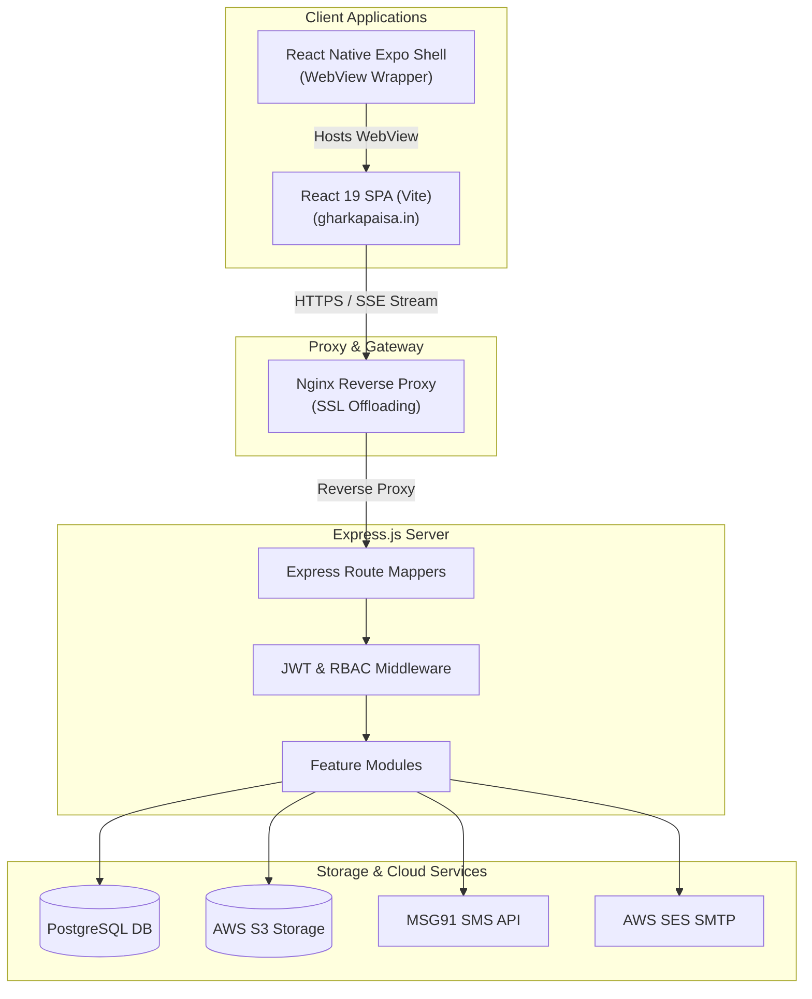

### Core Technologies

**Web Client**: 
- React 19.2.6 with Vite 8.0.12
- Zustand 5.0.14 for state management
- i18next 26.3.1 for multi-language support (9 languages)
- Vanilla CSS variables for theming
- React Router DOM 7.17.0 for routing

**Backend Server**:
- Node.js runtime with Express 4.18.2
- pg 8.11.3 for PostgreSQL connection pooling
- jsonwebtoken 9.0.3 for JWT authentication
- bcryptjs 3.0.3 for password hashing
- Winston 3.11.0 + Morgan 1.10.0 for logging

**Mobile Client**:
- Expo 54.0.33 / React Native 0.81.5
- Fullscreen react-native-webview component
- MSG91 SDK for OTP verification
- React Navigation 7.x

**Cloud Integrations**:
- AWS S3 for document, image, and banner storage
- AWS SES for transactional emails
- MSG91 for SMS OTPs

---

## 2. C4 Model Architecture

### Level 1: System Context Diagram

Shows how the system interacts with partners, customers, admins, and cloud providers.

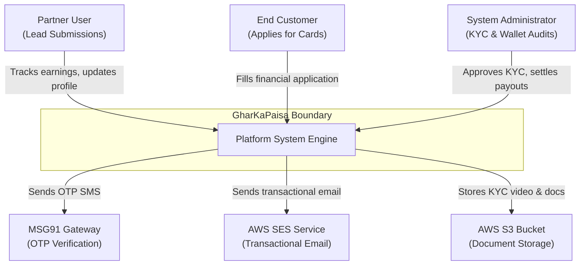

### Level 2: Container Diagram

Details the runtime containers, protocols, and data pathways.

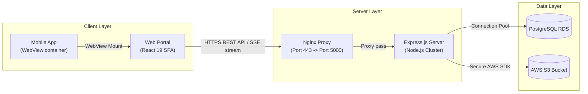

### Level 3: Component Diagram

Illustrates the internal controllers, services, and middleware layers within the backend container.

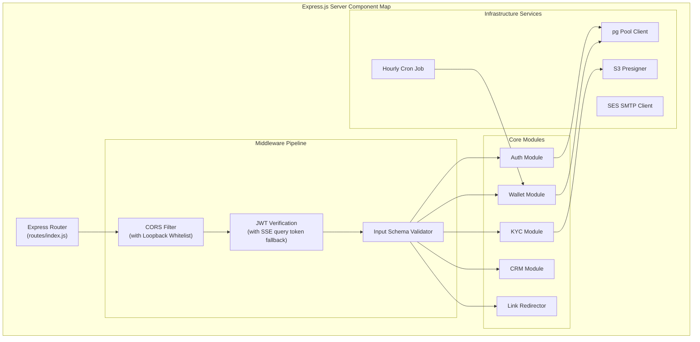

---

## 3. Database Schema & ERD

The relational database is built on **PostgreSQL**. All enum alterations are executed idempotently by querying the `pg_enum` and `pg_type` catalogs before modifying types.

### Entity Relationship Diagram

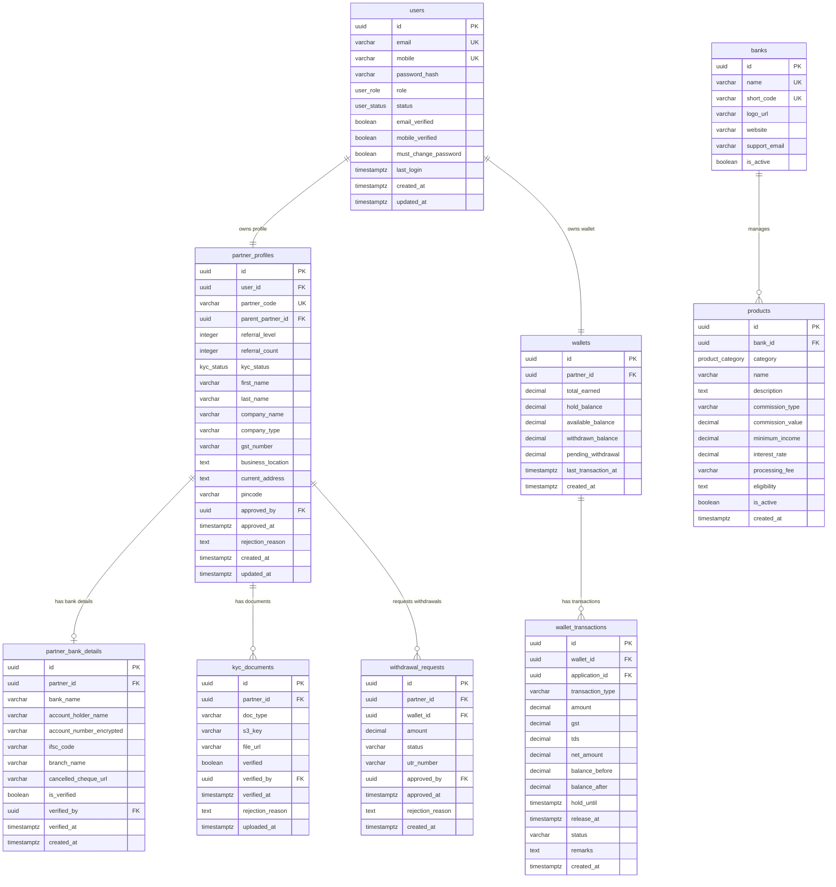

### Compatibility Views

To bridge legacy code column references with the enterprise schema, the migrations register database views:
- **`referral_tree`**: Mapped directly to `partner_team_relationships` (`SELECT id, parent_partner_id, child_partner_id, level, created_at AS joined_at`)
- **`cms_sections`**: Mapped directly to `homepage_sections` (`SELECT id, key AS section_key, title, items AS content, is_active, updated_at`)

---

## 4. REST API Architecture

### API Endpoint Structure

```mermaid
graph TB
    subgraph "API Endpoints Structure"
        API[/api/v1]
        
        subgraph "Authentication"
            AUTH[auth]
            POST_LOGIN[POST /login]
            POST_REGISTER[POST /register]
            POST_SEND_OTP[POST /send-otp]
            POST_VERIFY_OTP[POST /verify-otp]
            POST_REFRESH[POST /refresh]
            POST_LOGOUT[POST /logout]
            POST_RESET[POST /reset-password]
        end
        
        subgraph "Partner"
            PARTNER[partner]
            GET_PROFILE[GET /profile]
            PUT_PROFILE[PUT /profile]
            GET_DASHBOARD[GET /dashboard]
            GET_LEADS[GET /leads]
            POST_LEADS[POST /leads]
            GET_WALLET[GET /wallet]
            POST_WITHDRAW[POST /wallet/withdraw]
            GET_KYC[GET /kyc]
            POST_KYC[POST /kyc/upload]
            GET_REFERRAL[GET /referral]
        end
        
        subgraph "Admin"
            ADMIN[admin]
            GET_PARTNERS[GET /partners]
            PUT_PARTNER_APPROVE[PUT /partners/:id/approve]
            GET_APPLICATIONS[GET /applications]
            PUT_APPLICATION[PUT /applications/:id]
            GET_WITHDRAWALS[GET /withdrawals]
            PUT_WITHDRAWAL[PUT /withdrawals/:id]
        end
        
        subgraph "Super Admin"
            SUPERADMIN[superadmin]
            GET_DASHBOARD[GET /dashboard]
            GET_BANNERS[GET /banners]
            POST_BANNER[POST /banners]
            PUT_BANNER[PUT /banners/:id]
            GET_CMS[GET /cms]
            POST_CMS[POST /cms]
            GET_PRODUCTS[GET /products]
            POST_PRODUCT[POST /products]
            GET_COMMISSIONS[GET /commissions]
            POST_COMMISSION[POST /commissions]
            GET_AUDIT[GET /audit-logs]
            GET_SETTINGS[GET /settings]
            POST_SETTINGS[POST /settings]
        end
        
        subgraph "Public"
            PRODUCTS[products]
            GET_PRODUCTS_PUBLIC[GET /products]
            GET_PRODUCT_DETAIL[GET /products/:id]
            SERVICES[services]
            GET_SERVICES[GET /services]
        end
    end
    
    API --> AUTH
    API --> PARTNER
    API --> ADMIN
    API --> SUPERADMIN
    API --> PRODUCTS
    API --> SERVICES
    
    AUTH --> POST_LOGIN
    AUTH --> POST_REGISTER
    AUTH --> POST_SEND_OTP
    AUTH --> POST_VERIFY_OTP
    AUTH --> POST_REFRESH
    AUTH --> POST_LOGOUT
    AUTH --> POST_RESET
    
    PARTNER --> GET_PROFILE
    PARTNER --> PUT_PROFILE
    PARTNER --> GET_DASHBOARD
    PARTNER --> GET_LEADS
    PARTNER --> POST_LEADS
    PARTNER --> GET_WALLET
    PARTNER --> POST_WITHDRAW
    PARTNER --> GET_KYC
    PARTNER --> POST_KYC
    PARTNER --> GET_REFERRAL
    
    ADMIN --> GET_PARTNERS
    ADMIN --> PUT_PARTNER_APPROVE
    ADMIN --> GET_APPLICATIONS
    ADMIN --> PUT_APPLICATION
    ADMIN --> GET_WITHDRAWALS
    ADMIN --> PUT_WITHDRAWAL
    
    SUPERADMIN --> GET_DASHBOARD
    SUPERADMIN --> GET_BANNERS
    SUPERADMIN --> POST_BANNER
    SUPERADMIN --> PUT_BANNER
    SUPERADMIN --> GET_CMS
    SUPERADMIN --> POST_CMS
    SUPERADMIN --> GET_PRODUCTS
    SUPERADMIN --> POST_PRODUCT
    SUPERADMIN --> GET_COMMISSIONS
    SUPERADMIN --> POST_COMMISSION
    SUPERADMIN --> GET_AUDIT
    SUPERADMIN --> GET_SETTINGS
    SUPERADMIN --> POST_SETTINGS
    
    PRODUCTS --> GET_PRODUCTS_PUBLIC
    PRODUCTS --> GET_PRODUCT_DETAIL
    SERVICES --> GET_SERVICES
```

---

## 5. Folder Dependency Graphs

### Frontend Folder Dependencies

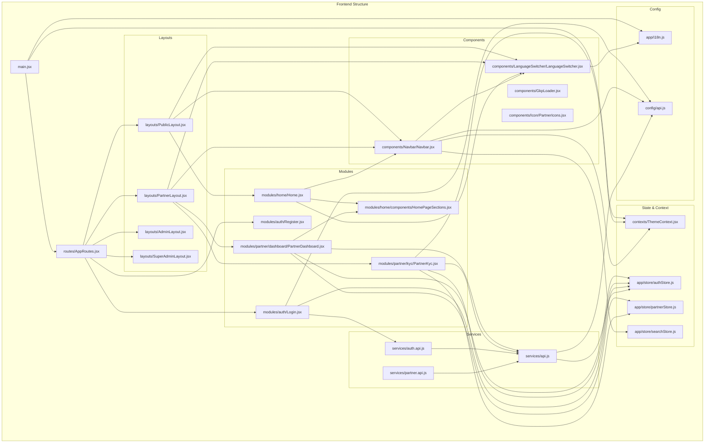

### Backend Folder Dependencies

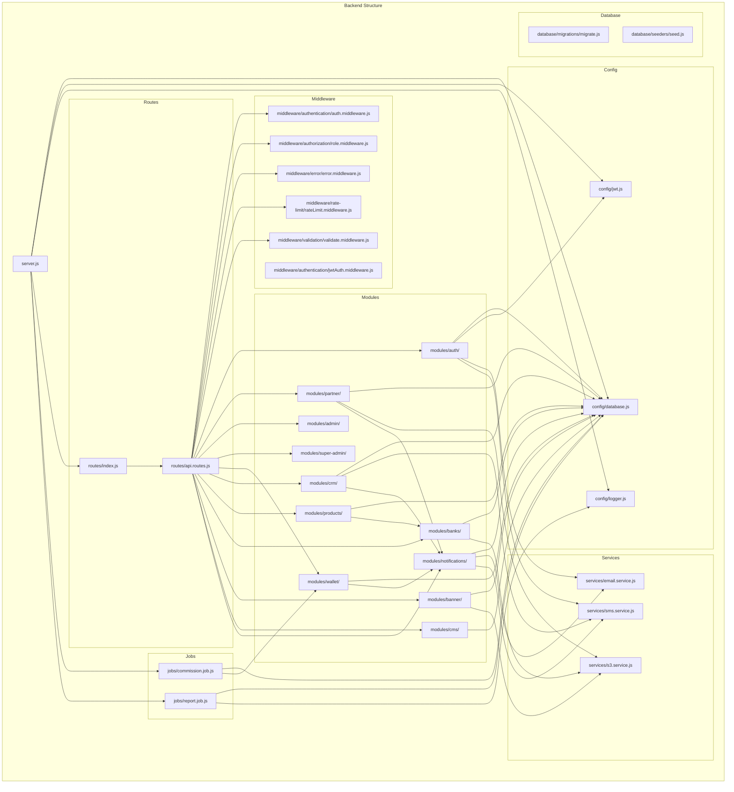

---

## 6. Frontend Component Tree

```mermaid
graph TB
    App[App.jsx]
    
    subgraph "Layout Components"
        PublicLayout[PublicLayout]
        PartnerLayout[PartnerLayout]
        AdminLayout[AdminLayout]
        SuperAdminLayout[SuperAdminLayout]
    end
    
    subgraph "Public Pages"
        Home[Home]
        ProductDetail[ProductDetail]
        ServicePage[ServicePage]
        ComparePage[ComparePage]
    end
    
    subgraph "Auth Pages"
        PartnerLogin[PartnerLogin]
        PartnerRegister[PartnerRegister]
        AdminLogin[AdminLogin]
    end
    
    subgraph "Partner Pages"
        PartnerDashboard[PartnerDashboard]
        PartnerKyc[PartnerKyc]
        PartnerWallet[PartnerWallet]
        PartnerLeads[PartnerLeads]
        PartnerProfile[PartnerProfile]
        PartnerReferral[PartnerReferral]
        PartnerVault[PartnerVault]
        PartnerMarketplace[PartnerMarketplace]
        PartnerCreditCenter[PartnerCreditCenter]
    end
    
    subgraph "Admin Pages"
        AdminDashboard[AdminDashboard]
        ManagePartners[ManagePartners]
        ManageApplications[ManageApplications]
        ManageWithdrawals[ManageWithdrawals]
        ManageLeads[ManageLeads]
    end
    
    subgraph "Super Admin Pages"
        SuperAdminDashboard[SuperAdminDashboard]
        ManageBanners[ManageBanners]
        ManageProducts[ManageProducts]
        ManageBanks[ManageBanks]
        ManageCMS[ManageCMS]
        AuditLogs[AuditLogs]
        SuperAdminReports[SuperAdminReports]
    end
    
    App --> PublicLayout
    App --> PartnerLayout
    App --> AdminLayout
    App --> SuperAdminLayout
    
    PublicLayout --> Home
    PublicLayout --> ProductDetail
    PublicLayout --> ServicePage
    PublicLayout --> ComparePage
    PublicLayout --> PartnerLogin
    PublicLayout --> PartnerRegister
    PublicLayout --> AdminLogin
    
    PartnerLayout --> PartnerDashboard
    PartnerLayout --> PartnerKyc
    PartnerLayout --> PartnerWallet
    PartnerLayout --> PartnerLeads
    PartnerLayout --> PartnerProfile
    PartnerLayout --> PartnerReferral
    PartnerLayout --> PartnerVault
    PartnerLayout --> PartnerMarketplace
    PartnerLayout --> PartnerCreditCenter
    
    AdminLayout --> AdminDashboard
    AdminLayout --> ManagePartners
    AdminLayout --> ManageApplications
    AdminLayout --> ManageWithdrawals
    AdminLayout --> ManageLeads
    
    SuperAdminLayout --> SuperAdminDashboard
    SuperAdminLayout --> ManageBanners
    SuperAdminLayout --> ManageProducts
    SuperAdminLayout --> ManageBanks
    SuperAdminLayout --> ManageCMS
    SuperAdminLayout --> AuditLogs
    SuperAdminLayout --> SuperAdminReports
```

---

## 7. Sequence Flows & Data Flow

### Authentication & Session Security (JWT Rotation)

Browser-native `EventSource` connections cannot transmit headers. The standard resolution is passing the token as a query string parameter (`?token=...`) and letting the auth middleware verify it.

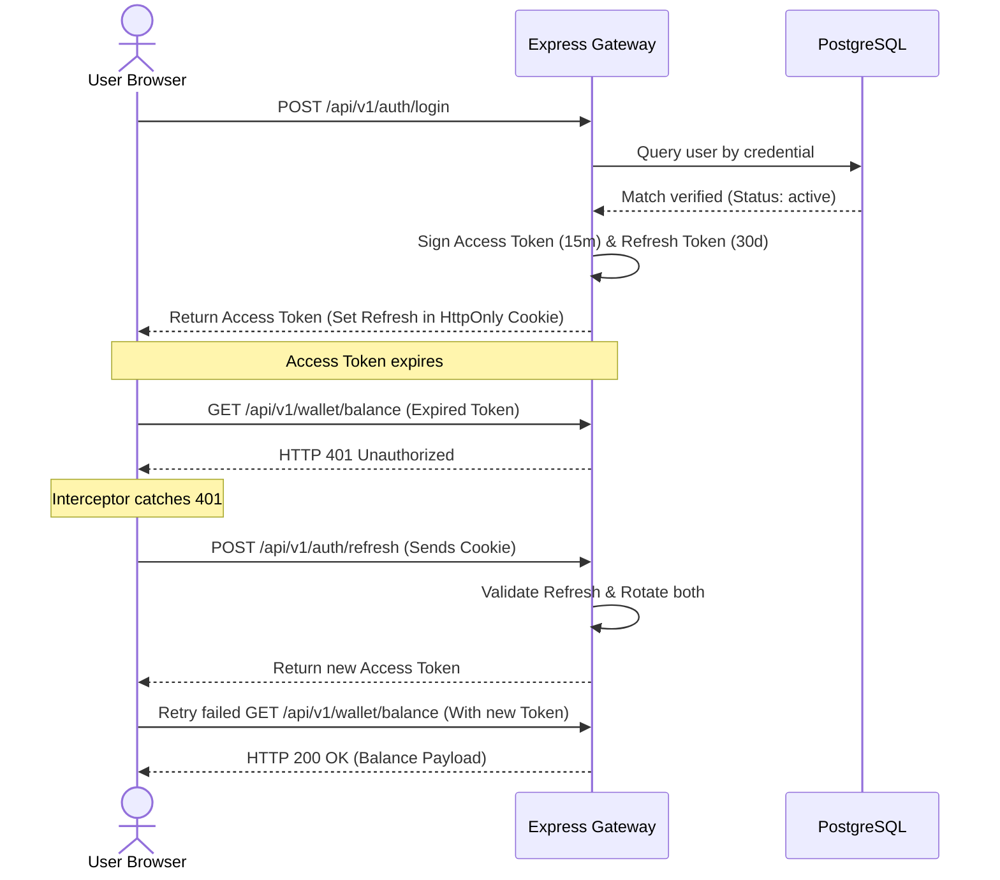

### Real-Time Notification Stream (SSE)

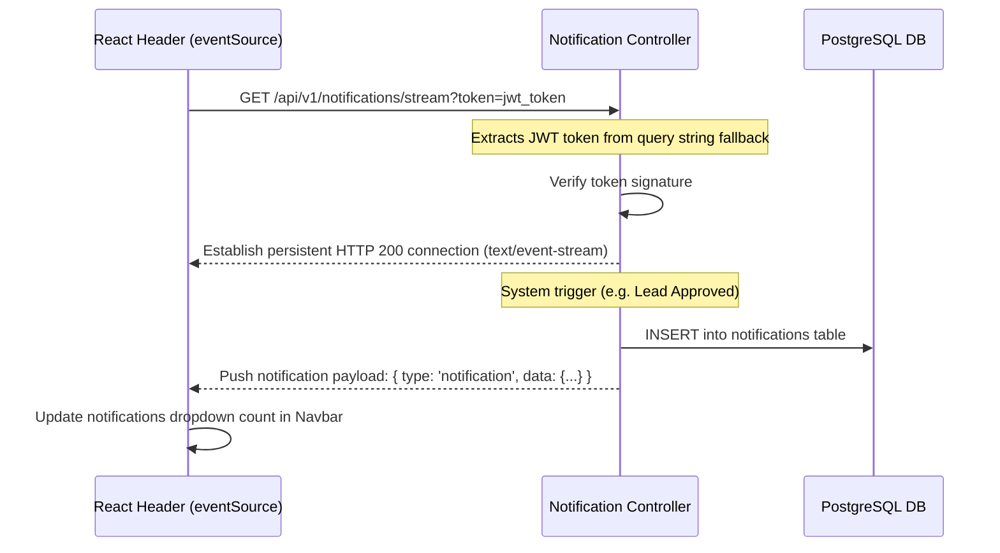

### Complete Data Flow

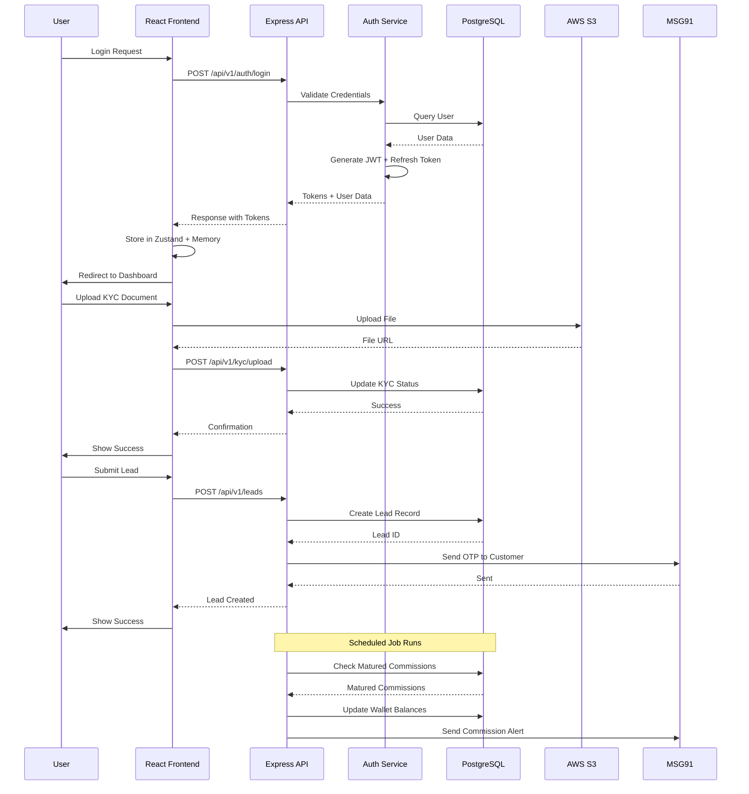

---

## 8. Security Analysis & Controls

### Security Measures Implemented

1. **JWT Authentication & Custom Guards**: Implements route-level role checkers (e.g. `authorize('ADMIN', 'SUPER_ADMIN')` and ownership locks `selfOrAdmin('PartnerId')`)

2. **CORS Loopback Whitelist**: Configured to whitelist production domains while dynamically matching loopback addresses (`localhost` and `127.0.0.1`) on *any* port. This supports local developer test suites and WebView clients without exposing the API server to wildcard CORS hazards.

3. **Bank Detail Encryption**: Sensitive banking information is run through AES-256-CBC encryption algorithms (`encrypt`/`decrypt` helpers) before writing database values, protecting user details in the database.

4. **SQL Protection**: Database requests are executed via parameterized queries in the connection pool (`query('SELECT ... WHERE id = $1', [id])`) preventing SQL injection exploits.

5. **Rate Limiting**: Multiple rate limiting strategies implemented:
   - Global: 300 requests per 15 minutes
   - Login: 20 attempts per 15 minutes
   - OTP Send: 10 per 10 minutes
   - OTP Verify: 30 per 10 minutes
   - Registration: 5 attempts per 30 minutes
   - Password Reset: 5 attempts per 30 minutes

6. **Security Headers**: Helmet middleware configured with:
   - HSTS configuration (1 year)
   - Content Security Policy
   - Frame ancestor configuration
   - Cross-origin resource policy

7. **Data Sanitization**: 
   - NoSQL injection sanitization
   - XSS sanitization
   - JSON body parsing with cleanup
   - Malformed JSON handling

8. **Audit Logging**: Comprehensive audit trail for all admin actions with:
   - Action logging with user context
   - Target ID tracking
   - Details JSON storage
   - IP address logging
   - Role tracking

---

## 9. Technology Stack Summary

### Frontend Stack
- **Framework**: React 19.2.6 with Vite 8.0.12
- **Routing**: React Router DOM 7.17.0
- **State Management**: Zustand 5.0.14
- **HTTP Client**: Axios 1.17.0 with interceptors
- **Internationalization**: i18next 26.3.1 (9 languages: English, Hindi, Marathi, Gujarati, Bengali, Telugu, Tamil, Kannada, Odia)
- **Charts**: Recharts 3.8.1
- **Icons**: React Icons 5.4.0
- **Security**: React Google reCAPTCHA 3.1.0

### Backend Stack
- **Runtime**: Node.js with Express 4.18.2
- **Database**: PostgreSQL 8.11.3 (pg driver)
- **Authentication**: JWT 9.0.3 + bcrypt 6.0.0
- **File Upload**: Multer 1.4.5-lts.1 with AWS S3
- **Security**: Helmet 7.1.0, CORS 2.8.5, express-rate-limit 7.1.5
- **Validation**: express-validator 7.3.2
- **Logging**: Winston 3.11.0 + Morgan 1.10.0
- **Email**: Nodemailer 6.9.7 + AWS SES
- **SMS**: Twilio 6.0.2 + MSG91
- **Scheduling**: node-cron 4.2.1
- **Date/Time**: dayjs 1.11.10

### Mobile Stack
- **Framework**: React Native 0.81.5 with Expo 54.0.33
- **Navigation**: React Navigation 7.x
- **WebView**: react-native-webview 14.0.1
- **OTP**: @msg91comm/sendotp-react-native 2.1.0

### Infrastructure
- **Storage**: AWS S3 (documents, images, banners)
- **Email**: AWS SES / Nodemailer
- **SMS**: MSG91 / Twilio
- **Database**: PostgreSQL (relational data)
- **Proxy**: Nginx (SSL offloading, reverse proxy)

---

## 10. Authentication & Authorization Algorithms

### 10.1 JWT Token Generation Algorithm

**Purpose**: Generate secure JWT tokens for user authentication

**Input**: User object (id, email, role, status)
**Output**: Access token (15 min expiry), Refresh token (30 day expiry)

**Algorithm**:
```
FUNCTION generateJWTToken(user):
    // Step 1: Prepare token payload
    payload = {
        user_id: user.id,
        email: user.email,
        role: user.role,
        status: user.status,
        iat: current_timestamp,
        exp: current_timestamp + 900  // 15 minutes
    }
    
    // Step 2: Generate access token
    access_token = jwt.sign(
        payload,
        process.env.JWT_SECRET,
        { algorithm: 'HS256' }
    )
    
    // Step 3: Generate refresh token payload
    refresh_payload = {
        user_id: user.id,
        type: 'refresh',
        iat: current_timestamp,
        exp: current_timestamp + 2592000  // 30 days
    }
    
    // Step 4: Generate refresh token
    refresh_token = jwt.sign(
        refresh_payload,
        process.env.JWT_REFRESH_SECRET,
        { algorithm: 'HS256' }
    )
    
    // Step 5: Store refresh token in database
    INSERT INTO refresh_tokens (
        user_id,
        token_hash,
        expires_at,
        created_at
    ) VALUES (
        user.id,
        hash(refresh_token),
        current_timestamp + 2592000,
        current_timestamp
    )
    
    RETURN {
        access_token: access_token,
        refresh_token: refresh_token,
        expires_in: 900
    }
END FUNCTION
```

**Files**: `backend/src/config/jwt.js`, `backend/src/modules/auth/controller.js`

---

### 10.2 JWT Token Verification Algorithm

**Purpose**: Verify JWT tokens and extract user information

**Input**: JWT token (from header or cookie)
**Output**: User object or error

**Algorithm**:
```
FUNCTION verifyJWTToken(token):
    // Step 1: Check if token exists
    IF token is NULL OR empty:
        RETURN error: "Token required"
    
    // Step 2: Try to verify token
    TRY:
        decoded = jwt.verify(
            token,
            process.env.JWT_SECRET,
            { algorithms: ['HS256'] }
        )
    CATCH error:
        IF error.name == 'TokenExpiredError':
            RETURN error: "Token expired"
        ELSE IF error.name == 'JsonWebTokenError':
            RETURN error: "Invalid token"
        ELSE:
            RETURN error: "Token verification failed"
    
    // Step 3: Check user status from database
    user = SELECT * FROM users WHERE id = decoded.user_id
    
    IF user is NULL:
        RETURN error: "User not found"
    
    IF user.status != 'active':
        RETURN error: "User account is not active"
    
    // Step 4: Update last login timestamp
    UPDATE users SET 
        last_login = current_timestamp
    WHERE id = user.id
    
    RETURN user
END FUNCTION
```

**Files**: `backend/src/middleware/authentication/auth.middleware.js`

---

### 10.3 Token Refresh Algorithm

**Purpose**: Refresh expired access tokens using refresh tokens

**Input**: Refresh token (from HTTP-only cookie)
**Output**: New access token and refresh token

**Algorithm**:
```
FUNCTION refreshToken(refresh_token):
    // Step 1: Verify refresh token
    TRY:
        decoded = jwt.verify(
            refresh_token,
            process.env.JWT_REFRESH_SECRET,
            { algorithms: ['HS256'] }
        )
    CATCH error:
        RETURN error: "Invalid or expired refresh token"
    
    // Step 2: Check if refresh token exists in database
    token_record = SELECT * FROM refresh_tokens 
    WHERE user_id = decoded.user_id 
    AND token_hash = hash(refresh_token)
    AND expires_at > current_timestamp
    
    IF token_record is NULL:
        RETURN error: "Refresh token not found or expired"
    
    // Step 3: Get user details
    user = SELECT * FROM users WHERE id = decoded.user_id
    
    IF user.status != 'active':
        RETURN error: "User account is not active"
    
    // Step 4: Delete old refresh token
    DELETE FROM refresh_tokens 
    WHERE id = token_record.id
    
    // Step 5: Generate new tokens
    new_tokens = generateJWTToken(user)
    
    // Step 6: Store new refresh token
    INSERT INTO refresh_tokens (
        user_id,
        token_hash,
        expires_at,
        created_at
    ) VALUES (
        user.id,
        hash(new_tokens.refresh_token),
        current_timestamp + 2592000,
        current_timestamp
    )
    
    RETURN new_tokens
END FUNCTION
```

**Files**: `backend/src/modules/auth/controller.js`

---

### 10.4 Role-Based Access Control Algorithm

**Purpose**: Verify user has required role for accessing a resource

**Input**: User object, Required roles array
**Output**: Boolean (authorized/unauthorized)

**Algorithm**:
```
FUNCTION checkUserRole(user, required_roles):
    // Step 1: Check if user is authenticated
    IF user is NULL:
        RETURN false
    
    // Step 2: Check if user role is in required roles
    IF user.role IN required_roles:
        RETURN true
    
    // Step 3: Special case: SUPER_ADMIN has access to everything
    IF user.role == 'SUPER_ADMIN':
        RETURN true
    
    // Step 4: Check role hierarchy
    role_hierarchy = {
        'SUPER_ADMIN': 4,
        'ADMIN': 3,
        'EMPLOYEE': 2,
        'PARTNER': 1
    }
    
    user_level = role_hierarchy[user.role]
    
    FOR EACH role IN required_roles:
        IF role_hierarchy[role] <= user_level:
            RETURN true
    
    RETURN false
END FUNCTION
```

**Files**: `backend/src/middleware/authorization/role.middleware.js`

---

### 10.5 Partner Approval Check Algorithm

**Purpose**: Verify partner is approved before allowing access

**Input**: Partner profile object
**Output**: Boolean (approved/unapproved)

**Algorithm**:
```
FUNCTION checkPartnerApproval(partner_profile):
    // Step 1: Check if partner profile exists
    IF partner_profile is NULL:
        RETURN false
    
    // Step 2: Check KYC status
    IF partner_profile.kyc_status != 'approved':
        RETURN false
    
    // Step 3: Check if partner is approved by admin
    IF partner_profile.approved_by is NULL:
        RETURN false
    
    // Step 4: Check approval timestamp
    IF partner_profile.approved_at is NULL:
        RETURN false
    
    // Step 5: Check user status
    user = SELECT * FROM users WHERE id = partner_profile.user_id
    IF user.status != 'active':
        RETURN false
    
    RETURN true
END FUNCTION
```

**Files**: `backend/src/middleware/authorization/role.middleware.js`

---

### 10.6 Self-or-Admin Authorization Algorithm

**Purpose**: Allow users to access their own data or admins to access any data

**Input**: Current user, Target user ID, Resource owner ID
**Output**: Boolean (authorized/unauthorized)

**Algorithm**:
```
FUNCTION checkSelfOrAdmin(current_user, target_user_id, resource_owner_id):
    // Step 1: Check if current user is admin/super admin
    IF current_user.role IN ['ADMIN', 'SUPER_ADMIN']:
        RETURN true
    
    // Step 2: Check if current user is accessing their own data
    IF current_user.id == target_user_id:
        RETURN true
    
    // Step 3: Check if current user owns the resource
    IF current_user.id == resource_owner_id:
        RETURN true
    
    // Step 4: For partners, check if they're accessing their partner data
    IF current_user.role == 'PARTNER':
        partner_profile = SELECT * FROM partner_profiles 
        WHERE user_id = current_user.id
        
        IF partner_profile.id == resource_owner_id:
            RETURN true
    
    RETURN false
END FUNCTION
```

**Files**: `backend/src/middleware/authorization/role.middleware.js`

---

## 11. OTP Verification Algorithms

### 11.1 Email OTP Generation Algorithm

**Purpose**: Generate and send OTP via email for verification

**Input**: Email address, OTP type (registration, login, password_reset)
**Output**: Success/failure status

**Algorithm**:
```
FUNCTION generateEmailOTP(email, otp_type):
    // Step 1: Generate 6-digit random OTP
    otp = generateRandomNumber(100000, 999999)
    
    // Step 2: Hash OTP using HMAC-SHA256
    otp_hash = hmac_sha256(otp, process.env.OTP_SECRET)
    
    // Step 3: Calculate expiry time (5 minutes)
    expires_at = current_timestamp + 300
    
    // Step 4: Store OTP in database
    INSERT INTO otp_verifications (
        identifier: email,
        otp_hash: otp_hash,
        otp_type: otp_type,
        expires_at: expires_at,
        created_at: current_timestamp,
        attempts: 0
    )
    
    // Step 5: Prepare email content
    email_content = {
        to: email,
        subject: "Your GharKaPaisa Verification Code",
        html: generateOTPEmailTemplate(otp, otp_type)
    }
    
    // Step 6: Send email via AWS SES
    TRY:
        ses.sendEmail(email_content)
        IF environment == 'development':
            log("OTP for " + email + ": " + otp)
        RETURN success: true, message: "OTP sent successfully"
    CATCH error:
        RETURN success: false, message: "Failed to send OTP"
END FUNCTION
```

**Files**: `backend/src/modules/auth/controller.js`, `backend/src/services/email/email.service.js`

---

### 11.2 Email OTP Verification Algorithm

**Purpose**: Verify OTP submitted by user

**Input**: Email address, OTP, OTP type
**Output**: Success/failure status

**Algorithm**:
```
FUNCTION verifyEmailOTP(email, otp, otp_type):
    // Step 1: Get latest OTP record for this email and type
    otp_record = SELECT * FROM otp_verifications
    WHERE identifier = email
    AND otp_type = otp_type
    ORDER BY created_at DESC
    LIMIT 1
    
    // Step 2: Check if OTP record exists
    IF otp_record is NULL:
        RETURN success: false, message: "OTP not found"
    
    // Step 3: Check if OTP has expired
    IF otp_record.expires_at < current_timestamp:
        RETURN success: false, message: "OTP has expired"
    
    // Step 4: Check attempt limit (max 3 attempts)
    IF otp_record.attempts >= 3:
        RETURN success: false, message: "Maximum attempts exceeded"
    
    // Step 5: Hash the provided OTP
    provided_otp_hash = hmac_sha256(otp, process.env.OTP_SECRET)
    
    // Step 6: Compare hashes
    IF provided_otp_hash != otp_record.otp_hash:
        // Increment attempt counter
        UPDATE otp_verifications
        SET attempts = attempts + 1
        WHERE id = otp_record.id
        
        remaining_attempts = 3 - otp_record.attempts - 1
        RETURN success: false, 
               message: "Invalid OTP. Remaining attempts: " + remaining_attempts
    
    // Step 7: Mark OTP as verified
    UPDATE otp_verifications
    SET verified = true,
        verified_at = current_timestamp
    WHERE id = otp_record.id
    
    RETURN success: true, message: "OTP verified successfully"
END FUNCTION
```

**Files**: `backend/src/modules/auth/controller.js`

---

### 11.3 MSG91 SMS OTP Generation Algorithm

**Purpose**: Generate and send OTP via MSG91 SMS gateway

**Input**: Mobile number, OTP type
**Output**: Success/failure status

**Algorithm**:
```
FUNCTION generateSMSOTP(mobile, otp_type):
    // Step 1: Normalize Indian mobile number
    IF mobile starts with '+91':
        mobile = mobile.substring(3)
    ELSE IF mobile.length == 10:
        mobile = '91' + mobile
    ELSE:
        RETURN success: false, message: "Invalid mobile number"
    
    // Step 2: Generate 6-digit random OTP
    otp = generateRandomNumber(100000, 999999)
    
    // Step 3: Hash OTP
    otp_hash = hmac_sha256(otp, process.env.OTP_SECRET)
    
    // Step 4: Calculate expiry time (5 minutes)
    expires_at = current_timestamp + 300
    
    // Step 5: Store OTP in database
    INSERT INTO otp_verifications (
        identifier: mobile,
        otp_hash: otp_hash,
        otp_type: otp_type,
        expires_at: expires_at,
        created_at: current_timestamp,
        attempts: 0
    )
    
    // Step 6: Prepare MSG91 API request
    msg91_request = {
        authkey: process.env.MSG91_AUTH_KEY,
        template_id: process.env.MSG91_OTP_TEMPLATE_ID,
        mobile: mobile,
        otp: otp
    }
    
    // Step 7: Send OTP via MSG91
    TRY:
        response = http.post(
            'https://control.msg91.com/api/v5/otp',
            msg91_request,
            { headers: { 'Content-Type': 'application/json' } }
        )
        
        IF response.success:
            RETURN success: true, message: "OTP sent successfully"
        ELSE:
            RETURN success: false, message: response.message
    CATCH error:
        RETURN success: false, message: "Failed to send SMS OTP"
END FUNCTION
```

**Files**: `backend/src/services/otp/msg91.service.js`, `backend/src/modules/auth/controller.js`

---

### 11.4 MSG91 OTP Verification Algorithm

**Purpose**: Verify MSG91 OTP using MSG91 API

**Input**: Mobile number, OTP
**Output**: Success/failure status

**Algorithm**:
```
FUNCTION verifyMSG91OTP(mobile, otp):
    // Step 1: Normalize mobile number
    IF mobile starts with '+91':
        mobile = mobile.substring(3)
    ELSE IF mobile.length == 10:
        mobile = '91' + mobile
    
    // Step 2: Prepare MSG91 verification request
    msg91_request = {
        authkey: process.env.MSG91_AUTH_KEY,
        mobile: mobile,
        otp: otp
    }
    
    // Step 3: Call MSG91 verification API
    TRY:
        response = http.post(
            'https://control.msg91.com/api/v5/otp/verify',
            msg91_request,
            { headers: { 'Content-Type': 'application/json' } }
        )
        
        IF response.type == 'success':
            // Mark local OTP record as verified
            UPDATE otp_verifications
            SET verified = true,
                verified_at = current_timestamp
            WHERE identifier = mobile
            AND verified = false
            ORDER BY created_at DESC
            LIMIT 1
            
            RETURN success: true, message: "OTP verified successfully"
        ELSE:
            RETURN success: false, message: response.message
    CATCH error:
        RETURN success: false, message: "Failed to verify OTP"
END FUNCTION
```

**Files**: `backend/src/services/otp/msg91.service.js`

---

### 11.5 Pre-Registration Email Verification Algorithm

**Purpose**: Verify email before user registration

**Input**: Email address
**Output**: Success/failure status

**Algorithm**:
```
FUNCTION preVerifyEmail(email):
    // Step 1: Check if email already exists
    existing_user = SELECT * FROM users WHERE email = email
    IF existing_user is not NULL:
        RETURN success: false, message: "Email already registered"
    
    // Step 2: Generate OTP
    otp_result = generateEmailOTP(email, 'registration')
    
    IF NOT otp_result.success:
        RETURN otp_result
    
    // Step 3: Store pre-verified email
    INSERT INTO pre_verified_emails (
        email: email,
        verified: true,
        expires_at: current_timestamp + 3600,  // 1 hour
        created_at: current_timestamp
    )
    
    RETURN success: true, message: "Email verification OTP sent"
END FUNCTION
```

**Files**: `backend/src/modules/auth/controller.js`

---

### 11.6 Registration with Pre-Verified Email Algorithm

**Purpose**: Complete registration using pre-verified email

**Input**: Registration data, OTP
**Output**: User object or error

**Algorithm**:
```
FUNCTION registerWithPreVerifiedEmail(registration_data, otp):
    // Step 1: Verify OTP
    otp_result = verifyEmailOTP(registration_data.email, otp, 'registration')
    IF NOT otp_result.success:
        RETURN otp_result
    
    // Step 2: Check pre-verified email record
    pre_verified = SELECT * FROM pre_verified_emails
    WHERE email = registration_data.email
    AND verified = true
    AND expires_at > current_timestamp
    
    IF pre_verified is NULL:
        RETURN success: false, message: "Email not pre-verified or expired"
    
    // Step 3: Proceed with registration
    user = createPartnerUser(registration_data)
    
    // Step 4: Delete pre-verified email record
    DELETE FROM pre_verified_emails WHERE id = pre_verified.id
    
    RETURN success: true, user: user
END FUNCTION
```

**Files**: `backend/src/modules/auth/controller.js`

---

## 12. Registration & KYC Algorithms

### 12.1 Partner Registration Algorithm

**Purpose**: Register new partner with profile and wallet

**Input**: Registration data (personal, business, bank details)
**Output**: User object or error

**Algorithm**:
```
FUNCTION registerPartner(registration_data):
    // Step 1: Validate email uniqueness
    existing_email = SELECT * FROM users WHERE email = registration_data.email
    IF existing_email is not NULL:
        RETURN error: "Email already registered"
    
    // Step 2: Validate mobile uniqueness
    existing_mobile = SELECT * FROM users WHERE mobile = registration_data.mobile
    IF existing_mobile is not NULL:
        RETURN error: "Mobile already registered"
    
    // Step 3: Hash password
    password_hash = bcrypt.hash(registration_data.password, 10)
    
    // Step 4: Start database transaction
    BEGIN TRANSACTION
    
    TRY:
        // Step 5: Create user record
        user_id = INSERT INTO users (
            email: registration_data.email,
            mobile: registration_data.mobile,
            password_hash: password_hash,
            role: 'PARTNER',
            status: 'pending',
            email_verified: false,
            mobile_verified: false,
            created_at: current_timestamp,
            updated_at: current_timestamp
        ) RETURNING id
        
        // Step 6: Generate partner code using sequence
        partner_code = NEXTVAL('partner_code_seq')
        
        // Step 7: Create partner profile
        partner_id = INSERT INTO partner_profiles (
            user_id: user_id,
            partner_code: 'GKP' + pad(partner_code, 6),
            first_name: registration_data.first_name,
            last_name: registration_data.last_name,
            company_name: registration_data.company_name,
            company_type: registration_data.company_type,
            gst_number: registration_data.gst_number,
            business_location: registration_data.business_location,
            current_address: registration_data.current_address,
            pincode: registration_data.pincode,
            kyc_status: 'pending',
            created_at: current_timestamp,
            updated_at: current_timestamp
        ) RETURNING id
        
        // Step 8: Encrypt bank details
        encrypted_account = aes256_encrypt(
            registration_data.account_number,
            process.env.ENCRYPTION_KEY
        )
        
        // Step 9: Create bank details record
        INSERT INTO partner_bank_details (
            partner_id: partner_id,
            bank_name: registration_data.bank_name,
            account_holder_name: registration_data.account_holder_name,
            account_number_encrypted: encrypted_account,
            ifsc_code: registration_data.ifsc_code,
            branch_name: registration_data.branch_name,
            is_verified: false,
            created_at: current_timestamp
        )
        
        // Step 10: Create wallet
        INSERT INTO wallets (
            partner_id: partner_id,
            total_earned: 0,
            hold_balance: 0,
            available_balance: 0,
            withdrawn_balance: 0,
            pending_withdrawal: 0,
            created_at: current_timestamp,
            updated_at: current_timestamp
        )
        
        // Step 11: Commit transaction
        COMMIT TRANSACTION
        
        // Step 12: Send verification email
        sendVerificationEmail(registration_data.email, user_id)
        
        RETURN success: true, user_id: user_id, partner_id: partner_id
        
    CATCH error:
        // Step 13: Rollback on error
        ROLLBACK TRANSACTION
        RETURN error: "Registration failed: " + error.message
END FUNCTION
```

**Files**: `backend/src/modules/auth/controller.js`

---

### 12.2 Email Verification Token Generation Algorithm

**Purpose**: Generate email verification token

**Input**: User ID, Email
**Output**: Verification token

**Algorithm**:
```
FUNCTION generateEmailVerificationToken(user_id, email):
    // Step 1: Generate random token
    token = generateRandomString(64)
    
    // Step 2: Hash token
    token_hash = sha256(token)
    
    // Step 3: Calculate expiry (24 hours)
    expires_at = current_timestamp + 86400
    
    // Step 4: Store token in database
    UPDATE users
    SET verification_token = token_hash,
        verification_token_expires_at = expires_at
    WHERE id = user_id
    
    // Step 5: Generate verification link
    verification_link = process.env.FRONTEND_URL + 
                        '/verify-email?token=' + token + 
                        '&email=' + encodeURIComponent(email)
    
    // Step 6: Send verification email
    email_content = {
        to: email,
        subject: "Verify Your GharKaPaisa Account",
        html: generateVerificationEmailTemplate(verification_link)
    }
    
    ses.sendEmail(email_content)
    
    RETURN verification_link
END FUNCTION
```

**Files**: `backend/src/modules/auth/controller.js`, `backend/src/services/email/email.service.js`

---

### 12.3 Email Verification Algorithm

**Purpose**: Verify user email using token

**Input**: Token, Email
**Output**: Success/failure status

**Algorithm**:
```
FUNCTION verifyEmailToken(token, email):
    // Step 1: Hash token
    token_hash = sha256(token)
    
    // Step 2: Find user by email and token
    user = SELECT * FROM users
    WHERE email = email
    AND verification_token = token_hash
    
    IF user is NULL:
        RETURN error: "Invalid verification token"
    
    // Step 3: Check token expiry
    IF user.verification_token_expires_at < current_timestamp:
        RETURN error: "Verification token has expired"
    
    // Step 4: Update user status
    UPDATE users
    SET email_verified = true,
        status = 'active',
        verification_token = NULL,
        verification_token_expires_at = NULL,
        updated_at = current_timestamp
    WHERE id = user.id
    
    RETURN success: true, message: "Email verified successfully"
END FUNCTION
```

**Files**: `backend/src/modules/auth/controller.js`

---

### 12.4 Password Reset Token Generation Algorithm

**Purpose**: Generate password reset token

**Input**: Email
**Output**: Success/failure status

**Algorithm**:
```
FUNCTION generatePasswordResetToken(email):
    // Step 1: Find user by email
    user = SELECT * FROM users WHERE email = email
    
    IF user is NULL:
        RETURN error: "User not found"
    
    // Step 2: Generate random token
    token = generateRandomString(64)
    
    // Step 3: Hash token
    token_hash = sha256(token)
    
    // Step 4: Calculate expiry (1 hour)
    expires_at = current_timestamp + 3600
    
    // Step 5: Store token in database
    UPDATE users
    SET reset_token = token_hash,
        reset_token_expires_at = expires_at
    WHERE id = user.id
    
    // Step 6: Generate reset link
    reset_link = process.env.FRONTEND_URL + 
                 '/reset-password?token=' + token + 
                 '&email=' + encodeURIComponent(email)
    
    // Step 7: Send reset email
    email_content = {
        to: email,
        subject: "Reset Your GharKaPaisa Password",
        html: generatePasswordResetEmailTemplate(reset_link)
    }
    
    ses.sendEmail(email_content)
    
    RETURN success: true, message: "Password reset link sent"
END FUNCTION
```

**Files**: `backend/src/modules/auth/controller.js`

---

### 12.5 Password Reset Algorithm

**Purpose**: Reset user password using token

**Input**: Token, Email, New Password
**Output**: Success/failure status

**Algorithm**:
```
FUNCTION resetPassword(token, email, new_password):
    // Step 1: Hash token
    token_hash = sha256(token)
    
    // Step 2: Find user by email and token
    user = SELECT * FROM users
    WHERE email = email
    AND reset_token = token_hash
    
    IF user is NULL:
        RETURN error: "Invalid reset token"
    
    // Step 3: Check token expiry
    IF user.reset_token_expires_at < current_timestamp:
        RETURN error: "Reset token has expired"
    
    // Step 4: Hash new password
    password_hash = bcrypt.hash(new_password, 10)
    
    // Step 5: Update password
    UPDATE users
    SET password_hash = password_hash,
        reset_token = NULL,
        reset_token_expires_at = NULL,
        must_change_password = false,
        updated_at = current_timestamp
    WHERE id = user.id
    
    // Step 6: Invalidate all refresh tokens
    DELETE FROM refresh_tokens WHERE user_id = user.id
    
    RETURN success: true, message: "Password reset successfully"
END FUNCTION
```

**Files**: `backend/src/modules/auth/controller.js`

---

### 12.6 KYC Document Upload Algorithm

**Purpose**: Upload KYC documents to S3 and update database

**Input**: Partner ID, Document type, File buffer, Document number
**Output**: Success/failure status

**Algorithm**:
```
FUNCTION uploadKYCDocumentpartner_id, doc_type, file_buffer, doc_number):
    // Step 1: Validate file type
    allowed_types = ['image/jpeg', 'image/png', 'application/pdf']
    IF file_buffer.mimetype NOT IN allowed_types:
        RETURN error: "Invalid file type"
    
    // Step 2: Generate S3 key
    s3_key = 'kyc/' + partner_id + '/' + doc_type + '/' + 
             generateUUID() + getFileExtension(file_buffer.mimetype)
    
    // Step 3: Upload to S3
    TRY:
        s3_url = s3.uploadBuffer(
            bucket: process.env.S3_BUCKET,
            key: s3_key,
            buffer: file_buffer,
            contentType: file_buffer.mimetype
        )
    CATCH error:
        RETURN error: "Failed to upload document"
    
    // Step 4: Check if document already exists
    existing_doc = SELECT * FROM kyc_documents
    WHERE partner_id = partner_id
    AND doc_type = doc_type
    
    // Step 5: Update or insert document record
    IF existing_doc is not NULL:
        // Delete old file from S3
        s3.deleteObject(bucket: process.env.S3_BUCKET, key: existing_doc.s3_key)
        
        // Update record
        UPDATE kyc_documents
        SET s3_key = s3_key,
            file_url = s3_url,
            verified = false,
            rejection_reason = NULL,
            uploaded_at = current_timestamp
        WHERE id = existing_doc.id
    ELSE:
        // Insert new record
        INSERT INTO kyc_documents (
            partner_id: partner_id,
            doc_type: doc_type,
            document_number: doc_number,
            s3_key: s3_key,
            file_url: s3_url,
            verified: false,
            uploaded_at: current_timestamp
        )
    
    // Step 6: Update KYC status to pending
    UPDATE partner_profiles
    SET kyc_status = 'pending',
        updated_at = current_timestamp
    WHERE id = partner_id
    
    RETURN success: true, message: "Document uploaded successfully"
END FUNCTION
```

**Files**: `backend/src/modules/partner/kyc.controller.js`, `backend/src/modules/partner/kyc.service.js`

---

### 12.7 KYC Document Verification Algorithm (Admin)

**Purpose**: Verify or reject KYC documents

**Input**: Document ID, Verification status, Rejection reason (if rejected), Admin ID
**Output**: Success/failure status

**Algorithm**:
```
FUNCTION verifyKYCDocument(document_id, status, rejection_reason, admin_id):
    // Step 1: Get document record
    document = SELECT * FROM kyc_documents WHERE id = document_id
    
    IF document is NULL:
        RETURN error: "Document not found"
    
    // Step 2: Update document status
    IF status == 'approved':
        UPDATE kyc_documents
        SET verified = true,
            verified_by = admin_id,
            verified_at = current_timestamp,
            rejection_reason = NULL
        WHERE id = document_id
    ELSE IF status == 'rejected':
        UPDATE kyc_documents
        SET verified = false,
            verified_by = admin_id,
            verified_at = current_timestamp,
            rejection_reason = rejection_reason
        WHERE id = document_id
    ELSE:
        RETURN error: "Invalid status"
    
    // Step 3: Check overall KYC status
    all_documents = SELECT * FROM kyc_documents
    WHERE partner_id = document.partner_id
    
    verified_count = COUNT(all_documents WHERE verified = true)
    total_count = COUNT(all_documents)
    
    // Step 4: Update partner KYC status
    IF verified_count == total_count:
        // All documents verified
        UPDATE partner_profiles
        SET kyc_status = 'approved',
            approved_by = admin_id,
            approved_at = current_timestamp,
            rejection_reason = NULL,
            updated_at = current_timestamp
        WHERE id = document.partner_id
        
        // Send notification to partner
        sendNotification(
            user_id: document.partner_id,
            type: 'success',
            title: 'KYC Approved',
            message: 'Your KYC documents have been verified successfully'
        )
    ELSE IF status == 'rejected':
        // Update to rejected if any document rejected
        UPDATE partner_profiles
        SET kyc_status = 'rejected',
            rejection_reason = rejection_reason,
            updated_at = current_timestamp
        WHERE id = document.partner_id
        
        // Send notification to partner
        sendNotification(
            user_id: document.partner_id,
            type: 'warning',
            title: 'KYC Document Rejected',
            message: 'Your ' + document.doc_type + ' was rejected: ' + rejection_reason
        )
    ELSE:
        // Still pending
        UPDATE partner_profiles
        SET kyc_status = 'pending',
            updated_at = current_timestamp
        WHERE id = document.partner_id
    
    // Step 5: Log audit
    logAudit(
        admin_id: admin_id,
        action: 'KYC_DOCUMENT_' + status.toUpperCase(),
        target_id: document_id,
        details: {
            document_type: document.doc_type,
            status: status,
            rejection_reason: rejection_reason
        }
    )
    
    RETURN success: true, message: "Document " + status + " successfully"
END FUNCTION
```

**Files**: `backend/src/modules/partner/kyc.controller.js`, `backend/src/modules/partner/kyc.service.js`

---

### 12.8 KYC Document Viewing Algorithm

**Purpose**: Generate signed URL for viewing KYC documents

**Input**: Document ID, User object
**Output**: Signed URL or error

**Algorithm**:
```
FUNCTION getKYCDocumentURL(document_id, user):
    // Step 1: Get document record
    document = SELECT * FROM kyc_documents WHERE id = document_id
    
    IF document is NULL:
        RETURN error: "Document not found"
    
    // Step 2: Check authorization
    IF user.role == 'PARTNER':
        // Partner can only view their own documents
        partner_profile = SELECT * FROM partner_profiles 
        WHERE user_id = user.id
        
        IF partner_profile.id != document.partner_id:
            RETURN error: "Unauthorized access"
    ELSE IF user.role NOT IN ['ADMIN', 'SUPER_ADMIN']:
        RETURN error: "Unauthorized access"
    
    // Step 3: Generate signed URL
    signed_url = s3.getSignedUrl(
        bucket: process.env.S3_BUCKET,
        key: document.s3_key,
        expires: 300  // 5 minutes
    )
    
    RETURN success: true, url: signed_url
END FUNCTION
```

**Files**: `backend/src/modules/partner/kyc.controller.js`

---

## 13. Wallet & Commission System Algorithms

### 13.1 Wallet Creation Algorithm

**Purpose**: Create wallet for new partner

**Input**: Partner ID
**Output**: Wallet ID or error

**Algorithm**:
```
FUNCTION createWallet(partner_id):
    // Step 1: Check if wallet already exists
    existing_wallet = SELECT * FROM wallets WHERE partner_id = partner_id
    
    IF existing_wallet is not NULL:
        RETURN existing_wallet.id
    
    // Step 2: Create new wallet
    wallet_id = INSERT INTO wallets (
        partner_id: partner_id,
        total_earned: 0,
        hold_balance: 0,
        available_balance: 0,
        withdrawn_balance: 0,
        pending_withdrawal: 0,
        created_at: current_timestamp,
        updated_at: current_timestamp
    ) RETURNING id
    
    RETURN wallet_id
END FUNCTION
```

**Files**: `backend/src/modules/wallet/service.js`

---

### 13.2 Commission Calculation Algorithm

**Purpose**: Calculate commission for a lead/application

**Input**: Partner ID, Product ID, Loan amount (if applicable)
**Output**: Commission amount

**Algorithm**:
```
FUNCTION calculateCommission(partner_id, product_id, loan_amount):
    // Step 1: Get product details
    product = SELECT * FROM products WHERE id = product_id
    
    // Step 2: Check for partner-specific commission structure
    partner_commission = SELECT * FROM commission_structures
    WHERE product_id = product_id
    AND partner_id = partner_id
    AND effective_from <= current_timestamp
    AND (effective_to IS NULL OR effective_to >= current_timestamp)
    ORDER BY effective_from DESC
    LIMIT 1
    
    // Step 3: Use partner-specific or default commission
    IF partner_commission is not NULL:
        commission_structure = partner_commission
    ELSE:
        commission_structure = SELECT * FROM commission_structures
        WHERE product_id = product_id
        AND partner_id IS NULL
        AND effective_from <= current_timestamp
        AND (effective_to IS NULL OR effective_to >= current_timestamp)
        ORDER BY effective_from DESC
        LIMIT 1
    
    // Step 4: Calculate commission based on type
    IF commission_structure.commission_type == 'percentage':
        IF product.category IN ['personal_loan', 'business_loan', 'home_loan', 
                               'instant_loan', 'used_car_loan', 'education_loan']:
            // For loans, calculate percentage of loan amount
            commission = loan_amount * (commission_structure.commission_value / 100)
        ELSE:
            // For cards, use fixed percentage
            commission = commission_structure.commission_value
    ELSE:
        // Fixed amount
        commission = commission_structure.commission_value
    
    // Step 5: Calculate override commission (if partner has parent)
    partner_profile = SELECT * FROM partner_profiles WHERE id = partner_id
    
    IF partner_profile.parent_partner_id is not NULL:
        override_commission = commission * 0.10  // 10% override
        direct_commission = commission * 0.80  // 80% direct
        platform_fee = commission * 0.10  // 10% platform
    ELSE:
        override_commission = 0
        direct_commission = commission
        platform_fee = 0
    
    RETURN {
        direct_commission: direct_commission,
        override_commission: override_commission,
        platform_fee: platform_fee,
        total_commission: commission
    }
END FUNCTION
```

**Files**: `backend/src/modules/partner/commission.service.js`, `backend/src/utils/helpers/helpers.js`

---

### 13.3 Commission Hold Algorithm

**Purpose**: Hold commission in wallet when lead is approved

**Input**: Wallet ID, Commission amount, Application ID, Bank name, Product type
**Output**: Transaction ID or error

**Algorithm**:
```
FUNCTION holdCommission(wallet_id, commission_amount, application_id, 
                        bank_name, product_type):
    // Step 1: Start database transaction
    BEGIN TRANSACTION
    
    TRY:
        // Step 2: Lock wallet row
        wallet = SELECT * FROM wallets
        WHERE id = wallet_id
        FOR UPDATE
        
        // Step 3: Calculate hold release time (48 hours from now)
        release_at = current_timestamp + 172800  // 48 hours
        
        // Step 4: Update wallet hold balance
        UPDATE wallets
        SET hold_balance = hold_balance + commission_amount,
            total_earned = total_earned + commission_amount,
            last_transaction_at = current_timestamp,
            updated_at = current_timestamp
        WHERE id = wallet_id
        
        // Step 5: Insert transaction record
        transaction_id = INSERT INTO wallet_transactions (
            wallet_id: wallet_id,
            application_id: application_id,
            transaction_type: 'credit',
            amount: commission_amount,
            balance_before: wallet.available_balance,
            balance_after: wallet.available_balance,
            hold_until: release_at,
            release_at: release_at,
            status: 'pending',
            remarks: 'Commission hold for ' + bank_name + ' ' + product_type,
            metadata: {
                bank: bank_name,
                product_type: product_type
            },
            created_at: current_timestamp
        ) RETURNING id
        
        // Step 6: Commit transaction
        COMMIT TRANSACTION
        
        RETURN transaction_id
        
    CATCH error:
        ROLLBACK TRANSACTION
        RETURN error: "Failed to hold commission"
END FUNCTION
```

**Files**: `backend/src/modules/wallet/service.js`

---

### 13.4 Commission Release Algorithm

**Purpose**: Release matured commission from hold to available balance

**Input**: Transaction ID
**Output**: Success/failure status

**Algorithm**:
```
FUNCTION releaseCommission(transaction_id):
    // Step 1: Get transaction record
    transaction = SELECT * FROM wallet_transactions
    WHERE id = transaction_id
    AND status = 'pending'
    
    IF transaction is NULL:
        RETURN error: "Transaction not found or already processed"
    
    // Step 2: Check if release time has arrived
    IF transaction.release_at > current_timestamp:
        RETURN error: "Commission not yet matured"
    
    // Step 3: Start database transaction
    BEGIN TRANSACTION
    
    TRY:
        // Step 4: Lock wallet row
        wallet = SELECT * FROM wallets
        WHERE id = transaction.wallet_id
        FOR UPDATE
        
        // Step 5: Update wallet balances
        UPDATE wallets
        SET hold_balance = hold_balance - transaction.amount,
            available_balance = available_balance + transaction.amount,
            last_transaction_at = current_timestamp,
            updated_at = current_timestamp
        WHERE id = wallet.id
        
        // Step 6: Update transaction status
        UPDATE wallet_transactions
        SET status = 'processed',
            processed_at = current_timestamp
        WHERE id = transaction_id
        
        // Step 7: Update application commission status
        UPDATE applications
        SET commission_status = 'released'
        WHERE id = transaction.application_id
        
        // Step 8: Commit transaction
        COMMIT TRANSACTION
        
        // Step 9: Send notification to partner
        partner_profile = SELECT * FROM partner_profiles 
        WHERE id = wallet.partner_id
        
        sendNotification(
            user_id: partner_profile.user_id,
            type: 'success',
            title: 'Commission Released',
            message: '₹' + transaction.amount + ' commission has been released to your wallet'
        )
        
        RETURN success: true, message: "Commission released successfully"
        
    CATCH error:
        ROLLBACK TRANSACTION
        RETURN error: "Failed to release commission"
END FUNCTION
```

**Files**: `backend/src/modules/wallet/service.js`

---

### 13.5 Commission Reversal Algorithm

**Purpose**: Reverse commission when lead is rejected

**Input**: Transaction ID, Rejection reason
**Output**: Success/failure status

**Algorithm**:
```
FUNCTION reverseCommission(transaction_id, rejection_reason):
    // Step 1: Get transaction record
    transaction = SELECT * FROM wallet_transactions
    WHERE id = transaction_id
    AND status IN ['pending', 'processed']
    
    IF transaction is NULL:
        RETURN error: "Transaction not found"
    
    // Step 2: Start database transaction
    BEGIN TRANSACTION
    
    TRY:
        // Step 3: Lock wallet row
        wallet = SELECT * FROM wallets
        WHERE id = transaction.wallet_id
        FOR UPDATE
        
        // Step 4: Calculate reversal based on status
        IF transaction.status == 'pending':
            // Remove from hold balance
            UPDATE wallets
            SET hold_balance = hold_balance - transaction.amount,
                total_earned = total_earned - transaction.amount,
                last_transaction_at = current_timestamp,
                updated_at = current_timestamp
            WHERE id = wallet.id
        ELSE IF transaction.status == 'processed':
            // Remove from available balance
            UPDATE wallets
            SET available_balance = available_balance - transaction.amount,
                total_earned = total_earned - transaction.amount,
                last_transaction_at = current_timestamp,
                updated_at = current_timestamp
            WHERE id = wallet.id
        
        // Step 5: Update transaction status
        UPDATE wallet_transactions
        SET status = 'reversed',
            remarks = transaction.remarks + ' (Reversed: ' + rejection_reason + ')',
            processed_at = current_timestamp
        WHERE id = transaction_id
        
        // Step 6: Insert reversal transaction
        INSERT INTO wallet_transactions (
            wallet_id: transaction.wallet_id,
            application_id: transaction.application_id,
            transaction_type: 'debit',
            amount: transaction.amount,
            balance_before: wallet.available_balance,
            balance_after: wallet.available_balance - transaction.amount,
            status: 'processed',
            remarks: 'Commission reversal: ' + rejection_reason,
            created_at: current_timestamp
        )
        
        // Step 7: Commit transaction
        COMMIT TRANSACTION
        
        RETURN success: true, message: "Commission reversed successfully"
        
    CATCH error:
        ROLLBACK TRANSACTION
        RETURN error: "Failed to reverse commission"
END FUNCTION
```

**Files**: `backend/src/modules/wallet/service.js`

---

### 13.6 Withdrawal Request Algorithm

**Purpose**: Process withdrawal request from partner

**Input**: Partner ID, Wallet ID, Amount
**Output**: Withdrawal request ID or error

**Algorithm**:
```
FUNCTION requestWithdrawal(partner_id, wallet_id, amount):
    // Step 1: Validate minimum amount
    IF amount < 100:
        RETURN error: "Minimum withdrawal amount is ₹100"
    
    // Step 2: Start database transaction
    BEGIN TRANSACTION
    
    TRY:
        // Step 3: Lock wallet row
        wallet = SELECT * FROM wallets
        WHERE id = wallet_id
        AND partner_id = partner_id
        FOR UPDATE
        
        // Step 4: Check sufficient balance
        IF wallet.available_balance < amount:
            RETURN error: "Insufficient balance"
        
        // Step 5: Check for pending withdrawal
        pending_withdrawal = SELECT * FROM withdrawal_requests
        WHERE wallet_id = wallet_id
        AND status = 'pending'
        
        IF pending_withdrawal is not NULL:
            RETURN error: "You have a pending withdrawal request"
        
        // Step 6: Get bank details
        bank_details = SELECT * FROM partner_bank_details
        WHERE partner_id = partner_id
        
        // Step 7: Update wallet
        UPDATE wallets
        SET available_balance = available_balance - amount,
            pending_withdrawal = pending_withdrawal + amount,
            last_transaction_at = current_timestamp,
            updated_at = current_timestamp
        WHERE id = wallet_id
        
        // Step 8: Create withdrawal request
        withdrawal_id = INSERT INTO withdrawal_requests (
            partner_id: partner_id,
            wallet_id: wallet_id,
            amount: amount,
            bank_name: bank_details.bank_name,
            account_holder_name: bank_details.account_holder_name,
            account_number: decrypt(bank_details.account_number_encrypted),
            ifsc_code: bank_details.ifsc_code,
            branch_name: bank_details.branch_name,
            status: 'pending',
            created_at: current_timestamp
        ) RETURNING id
        
        // Step 9: Insert transaction record
        INSERT INTO wallet_transactions (
            wallet_id: wallet_id,
            transaction_type: 'debit',
            amount: amount,
            balance_before: wallet.available_balance + amount,
            balance_after: wallet.available_balance,
            status: 'pending',
            remarks: 'Withdrawal request',
            created_at: current_timestamp
        )
        
        // Step 10: Commit transaction
        COMMIT TRANSACTION
        
        // Step 11: Send notification to admins
        sendBulkNotification(
            roles: ['ADMIN', 'SUPER_ADMIN'],
            type: 'info',
            title: 'New Withdrawal Request',
            message: 'Partner requested ₹' + amount + ' withdrawal'
        )
        
        RETURN withdrawal_id
        
    CATCH error:
        ROLLBACK TRANSACTION
        RETURN error: "Failed to create withdrawal request"
END FUNCTION
```

**Files**: `backend/src/modules/wallet/controller.js`, `backend/src/modules/wallet/service.js`

---

### 13.7 Withdrawal Approval Algorithm

**Purpose**: Approve withdrawal request and process payout

**Input**: Withdrawal ID, UTR number, Admin ID
**Output**: Success/failure status

**Algorithm**:
```
FUNCTION approveWithdrawal(withdrawal_id, utr_number, admin_id):
    // Step 1: Get withdrawal request
    withdrawal = SELECT * FROM withdrawal_requests
    WHERE id = withdrawal_id
    AND status = 'pending'
    
    IF withdrawal is NULL:
        RETURN error: "Withdrawal request not found or already processed"
    
    // Step 2: Start database transaction
    BEGIN TRANSACTION
    
    TRY:
        // Step 3: Lock wallet row
        wallet = SELECT * FROM wallets
        WHERE id = withdrawal.wallet_id
        FOR UPDATE
        
        // Step 4: Calculate TDS and GST
        partner_profile = SELECT * FROM partner_profiles 
        WHERE id = withdrawal.partner_id
        
        tds = 0
        gst = 0
        
        IF partner_profile.gst_number is NULL OR partner_profile.gst_number == '':
            tds = withdrawal.amount * 0.05  // 5% TDS
        
        net_amount = withdrawal.amount - tds - gst
        
        // Step 5: Update wallet
        UPDATE wallets
        SET pending_withdrawal = pending_withdrawal - withdrawal.amount,
            withdrawn_balance = withdrawn_balance + withdrawal.amount,
            last_transaction_at = current_timestamp,
            updated_at = current_timestamp
        WHERE id = wallet.id
        
        // Step 6: Update withdrawal request
        UPDATE withdrawal_requests
        SET status = 'completed',
            utr_number = utr_number,
            approved_by = admin_id,
            approved_at = current_timestamp
        WHERE id = withdrawal_id
        
        // Step 7: Update transaction record
        UPDATE wallet_transactions
        SET status = 'processed',
            remarks = 'Withdrawal processed - UTR: ' + utr_number,
            processed_at = current_timestamp
        WHERE wallet_id = withdrawal.wallet_id
        AND transaction_type = 'debit'
        AND status = 'pending'
        ORDER BY created_at DESC
        LIMIT 1
        
        // Step 8: Insert settlement record
        INSERT INTO partner_settlements (
            partner_id: withdrawal.partner_id,
            withdrawal_id: withdrawal_id,
            gross_amount: withdrawal.amount,
            tds: tds,
            gst: gst,
            net_amount: net_amount,
            utr_number: utr_number,
            settled_by: admin_id,
            settled_at: current_timestamp
        )
        
        // Step 9: Commit transaction
        COMMIT TRANSACTION
        
        // Step 10: Send notification to partner
        sendNotification(
            user_id: partner_profile.user_id,
            type: 'success',
            title: 'Withdrawal Approved',
            message: 'Your withdrawal of ₹' + withdrawal.amount + 
                    ' has been processed. UTR: ' + utr_number
        )
        
        // Step 11: Log audit
        logAudit(
            admin_id: admin_id,
            action: 'WITHDRAWAL_APPROVED',
            target_id: withdrawal_id,
            details: {
                amount: withdrawal.amount,
                utr_number: utr_number,
                partner_id: withdrawal.partner_id
            }
        )
        
        RETURN success: true, message: "Withdrawal approved successfully"
        
    CATCH error:
        ROLLBACK TRANSACTION
        RETURN error: "Failed to approve withdrawal"
END FUNCTION
```

**Files**: `backend/src/modules/wallet/controller.js`, `backend/src/modules/wallet/service.js`

---

### 13.8 Withdrawal Rejection Algorithm

**Purpose**: Reject withdrawal request and refund amount

**Input**: Withdrawal ID, Rejection reason, Admin ID
**Output**: Success/failure status

**Algorithm**:
```
FUNCTION rejectWithdrawal(withdrawal_id, rejection_reason, admin_id):
    // Step 1: Get withdrawal request
    withdrawal = SELECT * FROM withdrawal_requests
    WHERE id = withdrawal_id
    AND status = 'pending'
    
    IF withdrawal is NULL:
        RETURN error: "Withdrawal request not found or already processed"
    
    // Step 2: Start database transaction
    BEGIN TRANSACTION
    
    TRY:
        // Step 3: Lock wallet row
        wallet = SELECT * FROM wallets
        WHERE id = withdrawal.wallet_id
        FOR UPDATE
        
        // Step 4: Refund amount to available balance
        UPDATE wallets
        SET available_balance = available_balance + withdrawal.amount,
            pending_withdrawal = pending_withdrawal - withdrawal.amount,
            last_transaction_at = current_timestamp,
            updated_at = current_timestamp
        WHERE id = wallet.id
        
        // Step 5: Update withdrawal request
        UPDATE withdrawal_requests
        SET status = 'rejected',
            rejection_reason: rejection_reason,
            approved_by: admin_id,
            approved_at: current_timestamp
        WHERE id = withdrawal_id
        
        // Step 6: Update transaction record
        UPDATE wallet_transactions
        SET status = 'reversed',
            remarks: 'Withdrawal rejected: ' + rejection_reason,
            processed_at: current_timestamp
        WHERE wallet_id = withdrawal.wallet_id
        AND transaction_type = 'debit'
        AND status = 'pending'
        ORDER BY created_at DESC
        LIMIT 1
        
        // Step 7: Insert refund transaction
        INSERT INTO wallet_transactions (
            wallet_id: withdrawal.wallet_id,
            transaction_type: 'credit',
            amount: withdrawal.amount,
            balance_before: wallet.available_balance - withdrawal.amount,
            balance_after: wallet.available_balance,
            status: 'processed',
            remarks: 'Withdrawal refund: ' + rejection_reason,
            created_at: current_timestamp
        )
        
        // Step 8: Commit transaction
        COMMIT TRANSACTION
        
        // Step 9: Send notification to partner
        partner_profile = SELECT * FROM partner_profiles 
        WHERE id = withdrawal.partner_id
        
        sendNotification(
            user_id: partner_profile.user_id,
            type: 'warning',
            title: 'Withdrawal Rejected',
            message: 'Your withdrawal request was rejected: ' + rejection_reason
        )
        
        // Step 10: Log audit
        logAudit(
            admin_id: admin_id,
            action: 'WITHDRAWAL_REJECTED',
            target_id: withdrawal_id,
            details: {
                amount: withdrawal.amount,
                rejection_reason: rejection_reason,
                partner_id: withdrawal.partner_id
            }
        )
        
        RETURN success: true, message: "Withdrawal rejected successfully"
        
    CATCH error:
        ROLLBACK TRANSACTION
        RETURN error: "Failed to reject withdrawal"
END FUNCTION
```

**Files**: `backend/src/modules/wallet/controller.js`, `backend/src/modules/wallet/service.js`

---

### 13.9 Admin Wallet Adjustment Algorithm

**Purpose**: Manual credit/debit adjustment by admin

**Input**: Partner ID, Amount, Type (credit/debit), Description, Admin ID
**Output**: Transaction ID or error

**Algorithm**:
```
FUNCTION adjustWallet(partner_id, amount, type, description, admin_id):
    // Step 1: Get wallet
    wallet = SELECT * FROM wallets WHERE partner_id = partner_id
    
    IF wallet is NULL:
        RETURN error: "Wallet not found"
    
    // Step 2: Validate debit amount
    IF type == 'debit' AND wallet.available_balance < amount:
        RETURN error: "Insufficient balance for debit"
    
    // Step 3: Start database transaction
    BEGIN TRANSACTION
    
    TRY:
        // Step 4: Lock wallet row
        wallet = SELECT * FROM wallets
        WHERE id = wallet.id
        FOR UPDATE
        
        // Step 5: Update wallet based on type
        IF type == 'credit':
            UPDATE wallets
            SET available_balance = available_balance + amount,
                total_earned = total_earned + amount,
                last_transaction_at = current_timestamp,
                updated_at = current_timestamp
            WHERE id = wallet.id
        ELSE:
            UPDATE wallets
            SET available_balance = available_balance - amount,
                withdrawn_balance = withdrawn_balance + amount,
                last_transaction_at = current_timestamp,
                updated_at = current_timestamp
            WHERE id = wallet.id
        
        // Step 6: Insert transaction record
        transaction_id = INSERT INTO wallet_transactions (
            wallet_id: wallet.id,
            transaction_type: type,
            amount: amount,
            balance_before: wallet.available_balance,
            balance_after: wallet.available_balance + (type == 'credit' ? amount : -amount),
            status: 'processed',
            remarks: 'Admin adjustment: ' + description,
            metadata: {
                adjusted_by: admin_id,
                adjustment_type: 'manual'
            },
            created_at: current_timestamp
        ) RETURNING id
        
        // Step 7: Commit transaction
        COMMIT TRANSACTION
        
        // Step 8: Send notification to partner
        partner_profile = SELECT * FROM partner_profiles 
        WHERE id = partner_id
        
        sendNotification(
            user_id: partner_profile.user_id,
            type: type == 'credit' ? 'success' : 'warning',
            title: 'Wallet ' + (type == 'credit' ? 'Credit' : 'Debit'),
            message: 'Your wallet has been ' + type + 'ed with ₹' + amount + 
                    ': ' + description
        )
        
        // Step 9: Log audit
        logAudit(
            admin_id: admin_id,
            action: 'WALLET_ADJUSTMENT',
            target_id: wallet.id,
            details: {
                amount: amount,
                type: type,
                description: description,
                partner_id: partner_id
            }
        )
        
        RETURN transaction_id
        
    CATCH error:
        ROLLBACK TRANSACTION
        RETURN error: "Failed to adjust wallet"
END FUNCTION
```

**Files**: `backend/src/modules/wallet/controller.js`, `backend/src/modules/wallet/service.js`

---

### 13.10 Commission Release Cron Job Algorithm

**Purpose**: Hourly cron job to release matured commissions

**Input**: None (scheduled job)
**Output**: Summary of released commissions

**Algorithm**:
```
FUNCTION releaseMaturedCommissions():
    // Step 1: Get all pending transactions ready for release
    matured_transactions = SELECT * FROM wallet_transactions
    WHERE status = 'pending'
    AND release_at <= current_timestamp
    ORDER BY release_at ASC
    
    released_count = 0
    failed_count = 0
    total_amount = 0
    
    // Step 2: Process each transaction
    FOR EACH transaction IN matured_transactions:
        TRY:
            result = releaseCommission(transaction.id)
            
            IF result.success:
                released_count = released_count + 1
                total_amount = total_amount + transaction.amount
            ELSE:
                failed_count = failed_count + 1
                log("Failed to release commission " + transaction.id + ": " + result.message)
        CATCH error:
            failed_count = failed_count + 1
            log("Error releasing commission " + transaction.id + ": " + error.message)
    
    // Step 3: Log summary
    log("Commission release job completed: " + 
        released_count + " released, " + 
        failed_count + " failed, " +
        "Total amount: ₹" + total_amount)
    
    RETURN {
        released_count: released_count,
        failed_count: failed_count,
        total_amount: total_amount
    }
END FUNCTION
```

**Files**: `backend/src/jobs/commission.job.js`

---

### 13.11 Wallet Dashboard Statistics Algorithm

**Purpose**: Generate real-time wallet statistics for partner dashboard

**Input**: Partner ID
**Output**: Wallet statistics object

**Algorithm**:
```
FUNCTION getWalletDashboardStatistics(partner_id):
    // Step 1: Get wallet details
    wallet = SELECT * FROM wallets WHERE partner_id = partner_id
    
    IF wallet is NULL:
        RETURN error: "Wallet not found"
    
    // Step 2: Calculate statistics
    statistics = {
        total_earned: wallet.total_earned,
        available_balance: wallet.available_balance,
        hold_balance: wallet.hold_balance,
        withdrawn_balance: wallet.withdrawn_balance,
        pending_withdrawal: wallet.pending_withdrawal,
        
        // Step 3: Get transaction counts
        total_transactions: SELECT COUNT(*) FROM wallet_transactions 
                            WHERE wallet_id = wallet.id,
        
        pending_transactions: SELECT COUNT(*) FROM wallet_transactions 
                              WHERE wallet_id = wallet.id 
                              AND status = 'pending',
        
        processed_transactions: SELECT COUNT(*) FROM wallet_transactions 
                               WHERE wallet_id = wallet.id 
                               AND status = 'processed',
        
        reversed_transactions: SELECT COUNT(*) FROM wallet_transactions 
                              WHERE wallet_id = wallet.id 
                              AND status = 'reversed',
        
        // Step 4: Get recent transactions (last 10)
        recent_transactions: SELECT * FROM wallet_transactions 
                            WHERE wallet_id = wallet.id 
                            ORDER BY created_at DESC 
                            LIMIT 10,
        
        // Step 5: Get commission breakdown by product type
        commission_by_product: 
            SELECT p.name, SUM(wt.net_amount) as total
            FROM wallet_transactions wt
            JOIN applications a ON wt.application_id = a.id
            JOIN products p ON a.product_id = p.id
            WHERE wt.wallet_id = wallet.id
            AND wt.transaction_type = 'commission'
            GROUP BY p.name
    }
    
    // Step 6: Get bank verification status
    bank_details = SELECT * FROM partner_bank_details 
                   WHERE partner_id = partner_id
    
    statistics.bank_verified = bank_details.is_verified
    
    // Step 7: Calculate pending release amount
    statistics.pending_release = SELECT SUM(amount) 
                               FROM wallet_transactions 
                               WHERE wallet_id = wallet.id 
                               AND status = 'pending'
    
    RETURN statistics
END FUNCTION
```

**Files**: `backend/src/modules/wallet/service.js`

---

### 13.12 Wallet Ledger Filtering Algorithm

**Purpose**: Filter wallet transactions with multiple criteria

**Input**: Partner ID, Filters (date range, transaction type, status, amount range)
**Output**: Filtered transactions with pagination

**Algorithm**:
```
FUNCTION filterWalletLedger(partner_id, filters):
    // Step 1: Get wallet ID
    wallet = SELECT id FROM wallets WHERE partner_id = partner_id
    
    IF wallet is NULL:
        RETURN error: "Wallet not found"
    
    // Step 2: Build query with filters
    query = "SELECT * FROM wallet_transactions WHERE wallet_id = $1"
    params = [wallet.id]
    param_count = 1
    
    // Step 3: Add date range filter
    IF filters.start_date:
        param_count += 1
        query += " AND created_at >= $" + param_count
        params.push(filters.start_date)
    
    IF filters.end_date:
        param_count += 1
        query += " AND created_at <= $" + param_count
        params.push(filters.end_date)
    
    // Step 4: Add transaction type filter
    IF filters.transaction_type:
        param_count += 1
        query += " AND transaction_type = $" + param_count
        params.push(filters.transaction_type)
    
    // Step 5: Add status filter
    IF filters.status:
        param_count += 1
        query += " AND status = $" + param_count
        params.push(filters.status)
    
    // Step 6: Add amount range filter
    IF filters.min_amount:
        param_count += 1
        query += " AND amount >= $" + param_count
        params.push(filters.min_amount)
    
    IF filters.max_amount:
        param_count += 1
        query += " AND amount <= $" + param_count
        params.push(filters.max_amount)
    
    // Step 7: Add search filter (remarks, bank name, product type)
    IF filters.search:
        param_count += 1
        query += " AND (remarks ILIKE $" + param_count + 
                 " OR bank_name ILIKE $" + param_count + 
                 " OR product_type ILIKE $" + param_count + ")"
        params.push('%' + filters.search + '%')
    
    // Step 8: Add ordering
    query += " ORDER BY created_at DESC"
    
    // Step 9: Add pagination
    IF filters.page and filters.limit:
        offset = (filters.page - 1) * filters.limit
        param_count += 1
        query += " LIMIT $" + param_count
        params.push(filters.limit)
        param_count += 1
        query += " OFFSET $" + param_count
        params.push(offset)
    
    // Step 10: Execute query
    transactions = EXECUTE query WITH params
    
    // Step 11: Get total count for pagination
    count_query = query.replace("SELECT *", "SELECT COUNT(*)")
    count_query = count_query.split("ORDER BY")[0]
    total_count = EXECUTE count_query WITH params
    
    RETURN {
        transactions: transactions,
        total: total_count,
        page: filters.page || 1,
        limit: filters.limit || 20
    }
END FUNCTION
```

**Files**: `backend/src/modules/wallet/service.js`

---

### 13.13 Ledger Export Algorithm (PDF/Excel)

**Purpose**: Export wallet ledger to PDF or Excel format

**Input**: Partner ID, Filters, Export format (pdf/excel)
**Output**: File buffer or download URL

**Algorithm**:
```
FUNCTION exportWalletLedger(partner_id, filters, format):
    // Step 1: Get filtered transactions
    ledger_data = filterWalletLedger(partner_id, filters)
    
    // Step 2: Get partner details
    partner = SELECT * FROM partner_profiles WHERE id = partner_id
    user = SELECT * FROM users WHERE id = partner.user_id
    
    // Step 3: Prepare export data
    export_data = {
        partner_name: partner.first_name + ' ' + partner.last_name,
        partner_code: partner.partner_code,
        email: user.email,
        mobile: user.mobile,
        export_date: current_timestamp,
        transactions: ledger_data.transactions.map(t => ({
            date: t.created_at,
            transaction_type: t.transaction_type,
            bank_name: t.bank_name,
            product_type: t.product_type,
            amount: t.amount,
            gst: t.gst,
            tds: t.tds,
            net_amount: t.net_amount,
            balance_before: t.balance_before,
            balance_after: t.balance_after,
            status: t.status,
            remarks: t.remarks
        }))
    }
    
    // Step 4: Generate file based on format
    IF format == 'excel':
        file_buffer = generateExcelFile(export_data)
        file_name = 'wallet_ledger_' + partner.partner_code + '_' + 
                   current_timestamp + '.xlsx'
    ELSE IF format == 'pdf':
        file_buffer = generatePDFFile(export_data)
        file_name = 'wallet_ledger_' + partner.partner_code + '_' + 
                   current_timestamp + '.pdf'
    ELSE:
        RETURN error: "Invalid export format"
    
    // Step 5: Upload to S3
    s3_key = 'wallet-exports/' + partner.partner_code + '/' + file_name
    file_url = uploadToS3('gharkapaisa-documents', s3_key, 
                         file_buffer, getMimeType(format))
    
    // Step 6: Log export activity
    INSERT INTO audit_logs (
        user_id: partner.user_id,
        action: 'wallet_ledger_export',
        details: JSON.stringify({ format: format, record_count: ledger_data.total })
    )
    
    RETURN {
        download_url: file_url,
        file_name: file_name,
        record_count: ledger_data.total
    }
END FUNCTION
```

**Files**: `backend/src/modules/wallet/service.js`, `backend/src/utils/exporters/excel.js`, `backend/src/utils/exporters/pdf.js`

---

### 13.14 Transaction Search Algorithm

**Purpose**: Search wallet transactions with full-text search

**Input**: Partner ID, Search query, Search fields
**Output**: Matching transactions

**Algorithm**:
```
FUNCTION searchTransactions(partner_id, search_query, search_fields):
    // Step 1: Get wallet ID
    wallet = SELECT id FROM wallets WHERE partner_id = partner_id
    
    IF wallet is NULL:
        RETURN error: "Wallet not found"
    
    // Step 2: Build search query
    search_conditions = []
    params = [wallet.id]
    
    // Step 3: Add search conditions based on fields
    IF search_fields.includes('remarks'):
        search_conditions.push("remarks ILIKE $" + (params.length + 1))
        params.push('%' + search_query + '%')
    
    IF search_fields.includes('bank_name'):
        search_conditions.push("bank_name ILIKE $" + (params.length + 1))
        params.push('%' + search_query + '%')
    
    IF search_fields.includes('product_type'):
        search_conditions.push("product_type ILIKE $" + (params.length + 1))
        params.push('%' + search_query + '%')
    
    IF search_fields.includes('transaction_type'):
        search_conditions.push("transaction_type ILIKE $" + (params.length + 1))
        params.push('%' + search_query + '%')
    
    IF search_fields.includes('amount'):
        // Try to parse as number
        TRY:
            amount = parseFloat(search_query)
            search_conditions.push("amount = $" + (params.length + 1))
            params.push(amount)
        CATCH:
            // Not a number, skip
    
    // Step 4: Build final query
    IF search_conditions.length == 0:
        RETURN error: "No search fields specified"
    
    query = "SELECT * FROM wallet_transactions WHERE wallet_id = $1 AND (" + 
            search_conditions.join(" OR ") + ") ORDER BY created_at DESC LIMIT 50"
    
    // Step 5: Execute search
    transactions = EXECUTE query WITH params
    
    RETURN {
        results: transactions,
        count: transactions.length,
        search_query: search_query
    }
END FUNCTION
```

**Files**: `backend/src/modules/wallet/service.js`

---

### 13.15 Commission Breakup Per Application Algorithm

**Purpose**: Get detailed commission breakdown for a specific application

**Input**: Application ID, Partner ID
**Output**: Commission breakdown details

**Algorithm**:
```
FUNCTION getCommissionBreakup(application_id, partner_id):
    // Step 1: Validate partner owns this application
    application = SELECT * FROM applications 
                  WHERE id = application_id 
                  AND partner_id = partner_id
    
    IF application is NULL:
        RETURN error: "Application not found or access denied"
    
    // Step 2: Get commission transaction
    commission_txn = SELECT * FROM wallet_transactions 
                     WHERE application_id = application_id 
                     AND transaction_type = 'commission'
    
    IF commission_txn is NULL:
        RETURN error: "No commission found for this application"
    
    // Step 3: Get product details
    product = SELECT * FROM products WHERE id = application.product_id
    
    // Step 4: Calculate commission breakdown
    breakdown = {
        application_id: application.id,
        application_number: application.application_number,
        product_name: product.name,
        bank_name: application.bank_name,
        
        // Step 5: Commission details
        gross_commission: commission_txn.amount,
        gst: commission_txn.gst,
        tds: commission_txn.tds,
        net_commission: commission_txn.net_amount,
        
        // Step 6: Commission split (if multi-tier)
        direct_commission: commission_txn.amount * 0.80,  // 80% direct
        override_commission: commission_txn.amount * 0.10,  // 10% override
        platform_fee: commission_txn.amount * 0.10,  // 10% platform
        
        // Step 7: Status and timing
        status: commission_txn.status,
        hold_until: commission_txn.hold_until,
        release_at: commission_txn.release_at,
        created_at: commission_txn.created_at,
        
        // Step 8: Balance impact
        balance_before: commission_txn.balance_before,
        balance_after: commission_txn.balance_after,
        
        // Step 9: Bank reference
        bank_reference_id: application.bank_reference_id,
        approved_amount: application.approved_amount,
        
        // Step 10: Parent partner override (if applicable)
        parent_override: NULL
    }
    
    // Step 11: Check for parent partner override
    IF commission_txn.parent_transaction_id:
        parent_txn = SELECT * FROM wallet_transactions 
                     WHERE id = commission_txn.parent_transaction_id
        breakdown.parent_override = {
            parent_partner_id: parent_txn.wallet_id,
            override_amount: parent_txn.amount,
            override_net: parent_txn.net_amount
        }
    
    RETURN breakdown
END FUNCTION
```

**Files**: `backend/src/modules/wallet/service.js`

---

### 13.16 Bank Verification Status in Wallet Algorithm

**Purpose**: Display bank verification status in wallet section

**Input**: Partner ID
**Output**: Bank verification status

**Algorithm**:
```
FUNCTION getBankVerificationStatus(partner_id):
    // Step 1: Get bank details
    bank_details = SELECT * FROM partner_bank_details 
                   WHERE partner_id = partner_id
    
    // Step 2: Build verification status object
    status = {
        has_bank_details: bank_details is not NULL,
        is_verified: bank_details?.is_verified || false,
        verified_at: bank_details?.verified_at,
        verified_by: bank_details?.verified_by,
        
        // Step 3: Bank information (masked)
        bank_name: bank_details?.bank_name,
        account_holder_name: bank_details?.account_holder_name,
        account_number_masked: maskAccountNumber(bank_details?.account_number_encrypted),
        ifsc_code: bank_details?.ifsc_code,
        branch_name: bank_details?.branch_name,
        
        // Step 4: Cancelled cheque status
        has_cancelled_cheque: bank_details?.cancelled_cheque_url is not NULL,
        cancelled_cheque_url: bank_details?.cancelled_cheque_url,
        
        // Step 5: Verification requirements
        can_withdraw: bank_details?.is_verified == true,
        verification_pending: bank_details is not NULL AND 
                            bank_details.is_verified == false,
        needs_bank_details: bank_details is NULL
    }
    
    // Step 6: Add verification history if verified
    IF status.is_verified:
        verifier = SELECT first_name, last_name FROM users 
                   WHERE id = bank_details.verified_by
        status.verified_by_name = verifier.first_name + ' ' + verifier.last_name
    
    RETURN status
END FUNCTION
```

**Files**: `backend/src/modules/wallet/service.js`

---

### 13.17 Wallet Notifications Algorithm

**Purpose**: Generate wallet-related notifications

**Input**: Partner ID, Notification type, Related data
**Output**: Notification ID

**Algorithm**:
```
FUNCTION createWalletNotification(partner_id, notification_type, data):
    // Step 1: Get user ID from partner
    partner = SELECT user_id FROM partner_profiles WHERE id = partner_id
    
    // Step 2: Determine notification content based on type
    SWITCH notification_type:
        CASE 'commission_held':
            title = "Commission Held"
            message = "Commission of ₹" + data.amount + 
                     " has been held for " + data.product_name + 
                     ". Will be released on " + data.release_date
            action_link = "/wallet/ledger"
        
        CASE 'commission_released':
            title = "Commission Released"
            message = "Commission of ₹" + data.amount + 
                     " has been released to your available balance"
            action_link = "/wallet/ledger"
        
        CASE 'commission_reversed':
            title = "Commission Reversed"
            message = "Commission of ₹" + data.amount + 
                     " has been reversed. Reason: " + data.reason
            action_link = "/wallet/ledger"
        
        CASE 'withdrawal_requested':
            title = "Withdrawal Requested"
            message = "Withdrawal request of ₹" + data.amount + 
                     " has been submitted. Request ID: " + data.request_id
            action_link = "/wallet/withdrawals"
        
        CASE 'withdrawal_approved':
            title = "Withdrawal Approved"
            message = "Your withdrawal of ₹" + data.amount + 
                     " has been approved. UTR: " + data.utr
            action_link = "/wallet/withdrawals"
        
        CASE 'withdrawal_rejected':
            title = "Withdrawal Rejected"
            message = "Your withdrawal of ₹" + data.amount + 
                     " has been rejected. Reason: " + data.reason
            action_link = "/wallet/withdrawals"
        
        CASE 'withdrawal_completed':
            title = "Withdrawal Completed"
            message = "Withdrawal of ₹" + data.amount + 
                     " has been processed successfully"
            action_link = "/wallet/withdrawals"
        
        DEFAULT:
            RETURN error: "Invalid notification type"
    
    // Step 3: Create notification
    notification_id = createNotification(
        user_id: partner.user_id,
        type: 'wallet',
        title: title,
        message: message,
        action_link: action_link
    )
    
    // Step 4: Send SMS for critical notifications
    IF notification_type IN ['withdrawal_approved', 'withdrawal_completed']:
        sendSMSNotification(partner.user_id, title + ': ' + message)
    
    RETURN notification_id
END FUNCTION
```

**Files**: `backend/src/modules/wallet/service.js`, `backend/src/modules/notifications/service.js`

---

### 13.18 Cancel Withdrawal Algorithm

**Purpose**: Allow partner to cancel pending withdrawal request

**Input**: Withdrawal ID, Partner ID, Cancellation reason
**Output**: Success/failure status

**Algorithm**:
```
FUNCTION cancelWithdrawal(withdrawal_id, partner_id, reason):
    // Step 1: Get withdrawal request
    withdrawal = SELECT * FROM withdrawal_requests 
                  WHERE id = withdrawal_id 
                  AND partner_id = partner_id
    
    IF withdrawal is NULL:
        RETURN error: "Withdrawal request not found"
    
    // Step 2: Validate withdrawal can be cancelled
    IF withdrawal.status != 'pending':
        RETURN error: "Only pending withdrawals can be cancelled"
    
    // Step 3: Get wallet
    wallet = SELECT * FROM wallets WHERE id = withdrawal.wallet_id
    
    // Step 4: Start transaction
    BEGIN TRANSACTION
    
    TRY:
        // Step 5: Refund amount to wallet
        UPDATE wallets SET
            available_balance = available_balance + withdrawal.amount,
            pending_withdrawal = pending_withdrawal - withdrawal.amount,
            last_transaction_at = current_timestamp
        WHERE id = wallet.id
        
        // Step 6: Create refund transaction
        INSERT INTO wallet_transactions (
            wallet_id: wallet.id,
            transaction_type: 'withdrawal_refund',
            amount: withdrawal.amount,
            gst: 0,
            tds: 0,
            net_amount: withdrawal.amount,
            balance_before: wallet.available_balance,
            balance_after: wallet.available_balance + withdrawal.amount,
            status: 'processed',
            remarks: 'Withdrawal cancelled: ' + reason,
            created_at: current_timestamp
        )
        
        // Step 7: Update withdrawal status
        UPDATE withdrawal_requests SET
            status = 'cancelled',
            rejection_reason = reason,
            processed_at = current_timestamp
        WHERE id = withdrawal_id
        
        // Step 8: Create notification
        createWalletNotification(partner_id, 'withdrawal_cancelled', {
            amount: withdrawal.amount,
            reason: reason
        })
        
        // Step 9: Log audit
        INSERT INTO audit_logs (
            user_id: partner_id,
            action: 'withdrawal_cancelled',
            target_id: withdrawal_id,
            details: JSON.stringify({ reason: reason, amount: withdrawal.amount })
        )
        
        COMMIT TRANSACTION
        
        RETURN success: true, message: "Withdrawal cancelled successfully"
    
    CATCH error:
        ROLLBACK TRANSACTION
        RETURN error: "Failed to cancel withdrawal: " + error.message
END FUNCTION
```

**Files**: `backend/src/modules/wallet/controller.js`, `backend/src/modules/wallet/service.js`

---

### 13.19 Withdrawal History Timeline Algorithm

**Purpose**: Get withdrawal history with timeline visualization

**Input**: Partner ID, Date range (optional)
**Output**: Withdrawal timeline data

**Algorithm**:
```
FUNCTION getWithdrawalTimeline(partner_id, date_range):
    // Step 1: Build query with date filter
    query = "SELECT * FROM withdrawal_requests WHERE partner_id = $1"
    params = [partner_id]
    
    IF date_range.start_date:
        query += " AND created_at >= $2"
        params.push(date_range.start_date)
    
    IF date_range.end_date:
        query += " AND created_at <= $" + (params.length + 1)
        params.push(date_range.end_date)
    
    query += " ORDER BY created_at DESC"
    
    // Step 2: Execute query
    withdrawals = EXECUTE query WITH params
    
    // Step 3: Build timeline data
    timeline = {
        total_withdrawals: withdrawals.length,
        total_amount: SUM(withdrawals.map(w => w.amount)),
        
        // Step 4: Status breakdown
        status_breakdown: {
            pending: withdrawals.filter(w => w.status == 'pending').length,
            approved: withdrawals.filter(w => w.status == 'approved').length,
            completed: withdrawals.filter(w => w.status == 'completed').length,
            rejected: withdrawals.filter(w => w.status == 'rejected').length,
            cancelled: withdrawals.filter(w => w.status == 'cancelled').length
        },
        
        // Step 5: Monthly breakdown
        monthly_breakdown: {},
        
        // Step 6: Timeline events
        events: withdrawals.map(w => ({
            id: w.id,
            date: w.created_at,
            amount: w.amount,
            status: w.status,
            utr: w.utr_number,
            processed_at: w.processed_at,
            rejection_reason: w.rejection_reason
        }))
    }
    
    // Step 7: Build monthly breakdown
    withdrawals.forEach(w => {
        month_key = formatDate(w.created_at, 'YYYY-MM')
        IF NOT timeline.monthly_breakdown[month_key]:
            timeline.monthly_breakdown[month_key] = {
                count: 0,
                amount: 0
            }
        timeline.monthly_breakdown[month_key].count += 1
        timeline.monthly_breakdown[month_key].amount += w.amount
    })
    
    RETURN timeline
END FUNCTION
```

**Files**: `backend/src/modules/wallet/service.js`

---

### 13.20 Retry Failed Payout Algorithm

**Purpose**: Retry failed withdrawal payout by admin

**Input**: Withdrawal ID, Admin ID, Retry notes
**Output**: Success/failure status

**Algorithm**:
```
FUNCTION retryFailedPayout(withdrawal_id, admin_id, notes):
    // Step 1: Get withdrawal request
    withdrawal = SELECT * FROM withdrawal_requests WHERE id = withdrawal_id
    
    IF withdrawal is NULL:
        RETURN error: "Withdrawal request not found"
    
    // Step 2: Validate withdrawal status
    IF withdrawal.status != 'failed':
        RETURN error: "Only failed withdrawals can be retried"
    
    // Step 3: Get wallet
    wallet = SELECT * FROM wallets WHERE id = withdrawal.wallet_id
    
    // Step 4: Start transaction
    BEGIN TRANSACTION
    
    TRY:
        // Step 5: Update withdrawal status to pending
        UPDATE withdrawal_requests SET
            status = 'pending',
            rejection_reason = NULL,
            processed_at = NULL
        WHERE id = withdrawal_id
        
        // Step 6: Ensure amount is still in pending_withdrawal
        UPDATE wallets SET
            pending_withdrawal = pending_withdrawal + withdrawal.amount
        WHERE id = wallet.id
        
        // Step 7: Create retry transaction log
        INSERT INTO wallet_transactions (
            wallet_id: wallet.id,
            transaction_type: 'withdrawal_retry',
            amount: withdrawal.amount,
            gst: 0,
            tds: 0,
            net_amount: withdrawal.amount,
            balance_before: wallet.available_balance,
            balance_after: wallet.available_balance,
            status: 'processed',
            remarks: 'Retry failed payout: ' + notes,
            created_at: current_timestamp
        )
        
        // Step 8: Create notification
        partner_id = SELECT partner_id FROM wallets WHERE id = wallet.id
        createWalletNotification(partner_id, 'withdrawal_retry', {
            amount: withdrawal.amount,
            notes: notes
        })
        
        // Step 9: Log audit
        INSERT INTO audit_logs (
            user_id: admin_id,
            action: 'withdrawal_retry',
            target_id: withdrawal_id,
            details: JSON.stringify({ notes: notes, amount: withdrawal.amount })
        )
        
        COMMIT TRANSACTION
        
        RETURN success: true, message: "Withdrawal retry initiated"
    
    CATCH error:
        ROLLBACK TRANSACTION
        RETURN error: "Failed to retry withdrawal: " + error.message
END FUNCTION
```

**Files**: `backend/src/modules/wallet/controller.js`, `backend/src/modules/wallet/service.js`

---

### 13.21 UTR Display and Payout Receipt Download Algorithm

**Purpose**: Display UTR and generate payout receipt

**Input**: Withdrawal ID, Partner ID
**Output**: UTR details and receipt download URL

**Algorithm**:
```
FUNCTION getWithdrawalReceipt(withdrawal_id, partner_id):
    // Step 1: Get withdrawal request
    withdrawal = SELECT * FROM withdrawal_requests 
                  WHERE id = withdrawal_id 
                  AND partner_id = partner_id
    
    IF withdrawal is NULL:
        RETURN error: "Withdrawal request not found"
    
    // Step 2: Get partner and bank details
    partner = SELECT * FROM partner_profiles WHERE id = partner_id
    user = SELECT * FROM users WHERE id = partner.user_id
    bank_details = SELECT * FROM partner_bank_details WHERE partner_id = partner_id
    
    // Step 3: Build receipt data
    receipt_data = {
        receipt_number: 'GKP-WDR-' + withdrawal.id,
        withdrawal_id: withdrawal.id,
        
        // Step 4: Partner information
        partner_name: partner.first_name + ' ' + partner.last_name,
        partner_code: partner.partner_code,
        partner_address: partner.current_address,
        
        // Step 5: Bank information
        bank_name: bank_details.bank_name,
        account_number: maskAccountNumber(bank_details.account_number_encrypted),
        account_holder_name: bank_details.account_holder_name,
        ifsc_code: bank_details.ifsc_code,
        
        // Step 6: Withdrawal details
        amount: withdrawal.amount,
        requested_date: withdrawal.created_at,
        processed_date: withdrawal.processed_at,
        status: withdrawal.status,
        
        // Step 7: UTR information
        utr_number: withdrawal.utr_number,
        utr_display: withdrawal.utr_number ? 
                     formatUTR(withdrawal.utr_number) : 'Pending',
        
        // Step 8: Deduction breakdown (if applicable)
        tds_deducted: withdrawal.tds_amount || 0,
        gst_deducted: withdrawal.gst_amount || 0,
        net_amount: withdrawal.amount - (withdrawal.tds_amount || 0) - 
                   (withdrawal.gst_amount || 0),
        
        // Step 9: Approval details
        approved_by: withdrawal.approved_by,
        approved_at: withdrawal.approved_at,
        
        // Step 10: Remarks
        remarks: withdrawal.rejection_reason || 'Successfully processed'
    }
    
    // Step 11: Generate PDF receipt
    IF withdrawal.status IN ['completed', 'approved']:
        pdf_buffer = generatePayoutReceiptPDF(receipt_data)
        s3_key = 'withdrawal-receipts/' + partner.partner_code + '/' + 
                 'receipt_' + withdrawal.id + '.pdf'
        receipt_url = uploadToS3('gharkapaisa-documents', s3_key, 
                                 pdf_buffer, 'application/pdf')
        receipt_data.receipt_url = receipt_url
    
    RETURN receipt_data
END FUNCTION
```

**Files**: `backend/src/modules/wallet/service.js`, `backend/src/utils/exporters/receipt.js`

---

### 13.22 TDS Certificate Download Algorithm

**Purpose**: Generate TDS certificate for tax purposes

**Input**: Partner ID, Financial year (optional)
**Output**: TDS certificate PDF URL

**Algorithm**:
```
FUNCTION generateTDSCertificate(partner_id, financial_year):
    // Step 1: Determine date range for financial year
    IF financial_year:
        date_range = getFinancialYearRange(financial_year)
    ELSE:
        date_range = {
            start: current_year + '-04-01',
            end: next_year + '-03-31'
        }
    
    // Step 2: Get all withdrawals with TDS deduction
    withdrawals = SELECT * FROM withdrawal_requests 
                  WHERE partner_id = partner_id
                  AND status IN ['completed', 'approved']
                  AND processed_at >= date_range.start
                  AND processed_at <= date_range.end
                  AND tds_amount > 0
                  ORDER BY processed_at ASC
    
    IF withdrawals.length == 0:
        RETURN error: "No TDS deductions found for this period"
    
    // Step 3: Get partner details
    partner = SELECT * FROM partner_profiles WHERE id = partner_id
    user = SELECT * FROM users WHERE id = partner.user_id
    bank_details = SELECT * FROM partner_bank_details WHERE partner_id = partner_id
    
    // Step 4: Calculate TDS summary
    tds_summary = {
        total_withdrawals: SUM(withdrawals.map(w => w.amount)),
        total_tds: SUM(withdrawals.map(w => w.tds_amount)),
        total_net_payout: SUM(withdrawals.map(w => w.amount - w.tds_amount)),
        withdrawal_count: withdrawals.length
    }
    
    // Step 5: Build certificate data
    certificate_data = {
        certificate_number: 'GKP-TDS-' + current_timestamp,
        financial_year: financial_year || getCurrentFinancialYear(),
        
        // Step 6: Partner information
        partner_name: partner.first_name + ' ' + partner.last_name,
        partner_code: partner.partner_code,
        pan_number: partner.pan_number,
        address: partner.current_address,
        
        // Step 7: Bank information
        bank_name: bank_details.bank_name,
        account_number: maskAccountNumber(bank_details.account_number_encrypted),
        
        // Step 8: TDS summary
        total_tds: tds_summary.total_tds,
        total_withdrawals: tds_summary.total_withdrawals,
        total_net_payout: tds_summary.total_net_payout,
        
        // Step 9: Detailed transactions
        transactions: withdrawals.map(w => ({
            date: w.processed_at,
            amount: w.amount,
            tds_amount: w.tds_amount,
            tds_rate: (w.tds_amount / w.amount) * 100,
            utr: w.utr_number
        })),
        
        // Step 10: Certificate metadata
        generated_date: current_timestamp,
        generated_by: 'GharKaPaisa System'
    }
    
    // Step 11: Generate PDF certificate
    pdf_buffer = generateTDSCertificatePDF(certificate_data)
    s3_key = 'tds-certificates/' + partner.partner_code + '/' + 
             'tds_' + financial_year + '.pdf'
    certificate_url = uploadToS3('gharkapaisa-documents', s3_key, 
                                 pdf_buffer, 'application/pdf')
    
    // Step 12: Log certificate generation
    INSERT INTO audit_logs (
        user_id: partner.user_id,
        action: 'tds_certificate_generated',
        details: JSON.stringify({ financial_year: financial_year, 
                                total_tds: tds_summary.total_tds })
    )
    
    RETURN {
        certificate_url: certificate_url,
        certificate_number: certificate_data.certificate_number,
        financial_year: certificate_data.financial_year,
        total_tds: tds_summary.total_tds
    }
END FUNCTION
```

**Files**: `backend/src/modules/wallet/service.js`, `backend/src/utils/exporters/tds.js`

---

### 13.23 Duplicate Withdrawal Prevention Algorithm

**Purpose**: Prevent duplicate withdrawal requests

**Input**: Partner ID, Amount
**Output**: Allow/deny with reason

**Algorithm**:
```
FUNCTION checkDuplicateWithdrawal(partner_id, amount):
    // Step 1: Check for pending withdrawal with same amount
    duplicate_pending = SELECT * FROM withdrawal_requests 
                       WHERE partner_id = partner_id 
                       AND amount = amount 
                       AND status = 'pending'
                       AND created_at > current_timestamp - 3600  // Last 1 hour
    
    IF duplicate_pending is not NULL:
        RETURN {
            allow: false,
            reason: "Duplicate withdrawal request pending",
            existing_request_id: duplicate_pending.id
        }
    
    // Step 2: Check for recent completed withdrawal with same amount
    recent_completed = SELECT * FROM withdrawal_requests 
                      WHERE partner_id = partner_id 
                      AND amount = amount 
                      AND status = 'completed'
                      AND processed_at > current_timestamp - 86400  // Last 24 hours
    
    IF recent_completed is not NULL:
        RETURN {
            allow: false,
            reason: "Recent withdrawal with same amount already processed",
            existing_request_id: recent_completed.id
        }
    
    // Step 3: Check withdrawal frequency (max 3 per day)
    daily_withdrawals = SELECT COUNT(*) FROM withdrawal_requests 
                       WHERE partner_id = partner_id 
                       AND created_at > current_timestamp - 86400
    
    IF daily_withdrawals >= 3:
        RETURN {
            allow: false,
            reason: "Maximum daily withdrawal limit reached (3 per day)"
        }
    
    // Step 4: Check for amount pattern (prevent automated abuse)
    recent_amounts = SELECT amount FROM withdrawal_requests 
                    WHERE partner_id = partner_id 
                    AND created_at > current_timestamp - 3600
                    ORDER BY created_at DESC
                    LIMIT 5
    
    IF recent_amounts.length >= 3:
        // Check if last 3 amounts are identical
        IF recent_amounts[0].amount == recent_amounts[1].amount AND 
           recent_amounts[1].amount == recent_amounts[2].amount AND 
           recent_amounts[2].amount == amount:
            RETURN {
                allow: false,
                reason: "Suspicious withdrawal pattern detected"
            }
    
    // Step 5: All checks passed
    RETURN {
        allow: true,
        reason: "Withdrawal request allowed"
    }
END FUNCTION
```

**Files**: `backend/src/modules/wallet/service.js`

---

## 14. Lead & Application Management Algorithms

### 14.1 Lead Creation Algorithm

**Purpose**: Create new lead from partner

**Input**: Partner ID, Product ID, Customer details
**Output**: Lead ID or error

**Algorithm**:
```
FUNCTION createLead(partner_id, product_id, customer_details):
    // Step 1: Validate product exists and is active
    product = SELECT * FROM products
    WHERE id = product_id
    AND is_active = true
    
    IF product is NULL:
        RETURN error: "Product not found or inactive"
    
    // Step 2: Validate partner is approved
    partner_profile = SELECT * FROM partner_profiles
    WHERE id = partner_id
    
    IF partner_profile.kyc_status != 'approved':
        RETURN error: "Partner KYC not approved"
    
    // Step 3: Check for duplicate lead (same mobile + product within 30 days)
    duplicate_lead = SELECT * FROM leads
    WHERE customer_mobile = customer_details.mobile
    AND product_id = product_id
    AND created_at > current_timestamp - 2592000  // 30 days
    
    IF duplicate_lead is not NULL:
        RETURN error: "Duplicate lead already exists"
    
    // Step 4: Generate application number
    app_number = 'GKP' + NEXTVAL('app_number_seq')
    
    // Step 5: Create or update customer
    customer = SELECT * FROM customers
    WHERE mobile = customer_details.mobile
    
    IF customer is NULL:
        customer_id = INSERT INTO customers (
            name: customer_details.name,
            mobile: customer_details.mobile,
            email: customer_details.email,
            created_at: current_timestamp
        ) RETURNING id
    ELSE:
        customer_id = customer.id
        UPDATE customers
        SET name = customer_details.name,
            email = customer_details.email
        WHERE id = customer.id
    
    // Step 6: Create lead
    lead_id = INSERT INTO leads (
        partner_id: partner_id,
        customer_id: customer_id,
        product_id: product_id,
        customer_name: customer_details.name,
        customer_mobile: customer_details.mobile,
        customer_email: customer_details.email,
        application_number: app_number,
        status: 'pending',
        created_at: current_timestamp,
        updated_at: current_timestamp
    ) RETURNING id
    
    // Step 7: Send OTP to customer for verification
    sendSMSOTP(customer_details.mobile, 'lead_verification')
    
    RETURN success: true, lead_id: lead_id, application_number: app_number
END FUNCTION
```

**Files**: `backend/src/modules/crm/lead.controller.js`

---

### 14.2 Lead Verification Algorithm

**Purpose**: Verify customer OTP and convert lead to application

**Input**: Lead ID, OTP
**Output**: Application ID or error

**Algorithm**:
```
FUNCTION verifyLead(lead_id, otp):
    // Step 1: Get lead details
    lead = SELECT * FROM leads WHERE id = lead_id
    
    IF lead is NULL:
        RETURN error: "Lead not found"
    
    // Step 2: Verify OTP
    otp_result = verifySMSOTP(lead.customer_mobile, otp)
    
    IF NOT otp_result.success:
        RETURN otp_result
    
    // Step 3: Start database transaction
    BEGIN TRANSACTION
    
    TRY:
        // Step 4: Update lead status
        UPDATE leads
        SET status = 'confirmed',
            updated_at = current_timestamp
        WHERE id = lead_id
        
        // Step 5: Create application
        application_id = INSERT INTO applications (
            lead_id: lead_id,
            partner_id: lead.partner_id,
            customer_id: lead.customer_id,
            product_id: lead.product_id,
            application_number: lead.application_number,
            status: 'submitted',
            commission_status: 'pending',
            created_at: current_timestamp,
            updated_at: current_timestamp
        ) RETURNING id
        
        // Step 6: Commit transaction
        COMMIT TRANSACTION
        
        // Step 7: Send notification to partner
        partner_profile = SELECT * FROM partner_profiles 
        WHERE id = lead.partner_id
        
        sendNotification(
            user_id: partner_profile.user_id,
            type: 'success',
            title: 'Lead Verified',
            message: 'Your lead ' + lead.application_number + ' has been verified'
        )
        
        RETURN success: true, application_id: application_id
        
    CATCH error:
        ROLLBACK TRANSACTION
        RETURN error: "Failed to verify lead"
END FUNCTION
```

**Files**: `backend/src/modules/crm/lead.controller.js`

---

### 14.3 Application Status Update Algorithm

**Purpose**: Update application status by admin

**Input**: Application ID, New status, Bank reference ID, Approved amount, Rejection reason
**Output**: Success/failure status

**Algorithm**:
```
FUNCTION updateApplicationStatus(application_id, new_status, 
                                  bank_ref_id, approved_amount, rejection_reason):
    // Step 1: Get application details
    application = SELECT * FROM applications WHERE id = application_id
    
    IF application is NULL:
        RETURN error: "Application not found"
    
    // Step 2: Validate status transition
    valid_transitions = {
        'submitted': ['under_review', 'rejected'],
        'under_review': ['approved', 'rejected'],
        'approved': ['disbursed', 'rejected'],
        'disbursed': [],
        'rejected': []
    }
    
    IF new_status NOT IN valid_transitions[application.status]:
        RETURN error: "Invalid status transition"
    
    // Step 3: Start database transaction
    BEGIN TRANSACTION
    
    TRY:
        // Step 4: Update application status
        UPDATE applications
        SET status = new_status,
            bank_reference_id = bank_ref_id,
            approved_amount = approved_amount,
            rejection_reason = rejection_reason,
            updated_at = current_timestamp
        WHERE id = application_id
        
        // Step 5: Handle commission based on status
        IF new_status == 'approved':
            // Calculate commission
            commission = calculateCommission(
                application.partner_id,
                application.product_id,
                approved_amount
            )
            
            // Get wallet
            wallet = SELECT * FROM wallets 
            WHERE partner_id = application.partner_id
            
            // Hold commission
            holdCommission(
                wallet.id,
                commission.direct_commission,
                application_id,
                'Bank',
                'Credit Card'
            )
            
            // Hold override commission if applicable
            IF commission.override_commission > 0:
                partner_profile = SELECT * FROM partner_profiles 
                WHERE id = application.partner_id
                
                IF partner_profile.parent_partner_id is not NULL:
                    parent_wallet = SELECT * FROM wallets 
                    WHERE partner_id = partner_profile.parent_partner_id
                    
                    holdCommission(
                        parent_wallet.id,
                        commission.override_commission,
                        application_id,
                        'Bank',
                        'Override'
                    )
            
            // Update commission status
            UPDATE applications
            SET commission_status = 'held'
            WHERE id = application_id
            
        ELSE IF new_status == 'rejected':
            // Reverse any held commission
            transaction = SELECT * FROM wallet_transactions
            WHERE application_id = application_id
            AND status = 'pending'
            
            IF transaction is not NULL:
                reverseCommission(transaction.id, rejection_reason)
            
            // Update commission status
            UPDATE applications
            SET commission_status = 'reversed'
            WHERE id = application_id
            
        ELSE IF new_status == 'disbursed':
            // Release commission immediately
            transaction = SELECT * FROM wallet_transactions
            WHERE application_id = application_id
            AND status = 'pending'
            
            IF transaction is not NULL:
                releaseCommission(transaction.id)
            
            // Update commission status
            UPDATE applications
            SET commission_status = 'released'
            WHERE id = application_id
        
        // Step 6: Add to status history
        UPDATE applications
        SET status_history = status_history || [{
            status: new_status,
            timestamp: current_timestamp,
            bank_reference_id: bank_ref_id,
            approved_amount: approved_amount,
            rejection_reason: rejection_reason
        }]
        WHERE id = application_id
        
        // Step 7: Commit transaction
        COMMIT TRANSACTION
        
        // Step 8: Send notification to partner
        partner_profile = SELECT * FROM partner_profiles 
        WHERE id = application.partner_id
        
        notification_type = new_status == 'approved' ? 'success' : 
                           new_status == 'rejected' ? 'warning' : 'info'
        
        sendNotification(
            user_id: partner_profile.user_id,
            type: notification_type,
            title: 'Application ' + new_status.toUpperCase(),
            message: 'Your application ' + application.application_number + 
                    ' is now ' + new_status
        )
        
        RETURN success: true, message: "Application status updated"
        
    CATCH error:
        ROLLBACK TRANSACTION
        RETURN error: "Failed to update application status"
END FUNCTION
```

**Files**: `backend/src/modules/crm/application.controller.js`

---

### 14.4 Application Document Upload Algorithm

**Purpose**: Upload documents for application

**Input**: Application ID, Document type, File buffer
**Output**: Success/failure status

**Algorithm**:
```
FUNCTION uploadApplicationDocument(application_id, doc_type, file_buffer):
    // Step 1: Get application details
    application = SELECT * FROM applications WHERE id = application_id
    
    IF application is NULL:
        RETURN error: "Application not found"
    
    // Step 2: Validate file type
    allowed_types = ['image/jpeg', 'image/png', 'application/pdf']
    IF file_buffer.mimetype NOT IN allowed_types:
        RETURN error: "Invalid file type"
    
    // Step 3: Generate S3 key
    s3_key = 'applications/' + application_id + '/' + doc_type + '/' + 
             generateUUID() + getFileExtension(file_buffer.mimetype)
    
    // Step 4: Upload to S3
    TRY:
        s3_url = s3.uploadBuffer(
            bucket: process.env.S3_BUCKET,
            key: s3_key,
            buffer: file_buffer,
            contentType: file_buffer.mimetype
        )
    CATCH error:
        RETURN error: "Failed to upload document"
    
    // Step 5: Get current documents
    application = SELECT * FROM applications WHERE id = application_id
    documents = application.documents || []
    
    // Step 6: Add new document
    documents = documents || [{
        doc_type: doc_type,
        s3_key: s3_key,
        file_url: s3_url,
        uploaded_at: current_timestamp
    }]
    
    // Step 7: Update application
    UPDATE applications
    SET documents = documents,
        updated_at = current_timestamp
    WHERE id = application_id
    
    RETURN success: true, message: "Document uploaded successfully"
END FUNCTION
```

**Files**: `backend/src/modules/crm/application.controller.js`

---

### 14.5 Direct Card Application Algorithm

**Purpose**: Direct application from homepage without partner

**Input**: Product ID, Customer details, Partner code (optional)
**Output**: Application ID or error

**Algorithm**:
```
FUNCTION submitDirectApplication(product_id, customer_details, partner_code):
    // Step 1: Validate product
    product = SELECT * FROM products
    WHERE id = product_id
    AND is_active = true
    
    IF product is NULL:
        RETURN error: "Product not found or inactive"
    
    // Step 2: Determine partner
    IF partner_code is not NULL AND partner_code != '':
        partner = SELECT * FROM partner_profiles
        WHERE partner_code = partner_code
        AND kyc_status = 'approved'
        
        IF partner is not NULL:
            partner_id = partner.id
        ELSE:
            partner_id = NULL  // Invalid code, proceed without partner
    ELSE:
        partner_id = NULL
    
    // Step 3: Generate application number
    app_number = 'GKP' + NEXTVAL('app_number_seq')
    
    // Step 4: Create customer
    customer_id = INSERT INTO customers (
        name: customer_details.name,
        mobile: customer_details.mobile,
        email: customer_details.email,
        created_at: current_timestamp
    ) RETURNING id
    
    // Step 5: Send OTP for verification
    sendSMSOTP(customer_details.mobile, 'direct_application')
    
    // Step 6: Create lead
    lead_id = INSERT INTO leads (
        partner_id: partner_id,
        customer_id: customer_id,
        product_id: product_id,
        customer_name: customer_details.name,
        customer_mobile: customer_details.mobile,
        customer_email: customer_details.email,
        application_number: app_number,
        status: 'pending',
        created_at: current_timestamp,
        updated_at: current_timestamp
    ) RETURNING id
    
    RETURN success: true, lead_id: lead_id, application_number: app_number
END FUNCTION
```

**Files**: `backend/src/modules/crm/card_application.controller.js`

---

## 15. Admin & Super Admin Algorithms

### 15.1 Partner Approval Algorithm

**Purpose**: Approve or reject partner registration

**Input**: Partner ID, Decision (approve/reject), Rejection reason (if rejected), Admin ID
**Output**: Success/failure status

**Algorithm**:
```
FUNCTION approvePartner(partner_id, decision, rejection_reason, admin_id):
    // Step 1: Get partner profile
    partner = SELECT * FROM partner_profiles WHERE id = partner_id
    
    IF partner is NULL:
        RETURN error: "Partner not found"
    
    // Step 2: Check current status
    IF partner.kyc_status != 'pending':
        RETURN error: "Partner is not in pending status"
    
    // Step 3: Update based on decision
    IF decision == 'approve':
        UPDATE partner_profiles
        SET kyc_status = 'approved',
            approved_by = admin_id,
            approved_at = current_timestamp,
            rejection_reason = NULL,
            updated_at: current_timestamp
        WHERE id = partner_id
        
        // Activate user account
        UPDATE users
        SET status = 'active'
        WHERE id = partner.user_id
        
        notification_type = 'success'
        message = 'Your partner account has been approved'
        
    ELSE IF decision == 'reject':
        UPDATE partner_profiles
        SET kyc_status = 'rejected',
            rejection_reason = rejection_reason,
            updated_at: current_timestamp
        WHERE id = partner_id
        
        // Deactivate user account
        UPDATE users
        SET status = 'rejected'
        WHERE id = partner.user_id
        
        notification_type = 'warning'
        message = 'Your partner account has been rejected: ' + rejection_reason
    ELSE:
        RETURN error: "Invalid decision"
    
    // Step 4: Send notification to partner
    sendNotification(
        user_id: partner.user_id,
        type: notification_type,
        title: 'Partner Account ' + (decision == 'approve' ? 'Approved' : 'Rejected'),
        message: message
    )
    
    // Step 5: Log audit
    logAudit(
        admin_id: admin_id,
        action: 'PARTNER_' + decision.toUpperCase(),
        target_id: partner_id,
        details: {
            decision: decision,
            rejection_reason: rejection_reason
        }
    )
    
    RETURN success: true, message: "Partner " + decision + "ed successfully"
END FUNCTION
```

**Files**: `backend/src/modules/partner/partner.controller.js`

---

### 15.2 User Status Update Algorithm (Super Admin)

**Purpose**: Update user status (active, inactive, suspended, blocked)

**Input**: User ID or Partner ID, New status, Admin ID
**Output**: Success/failure status

**Algorithm**:
```
FUNCTION updateUserStatus(target_id, new_status, admin_id):
    // Step 1: Determine if target is user_id or partner_id
    user = SELECT * FROM users WHERE id = target_id
    
    IF user is NULL:
        partner = SELECT * FROM partner_profiles WHERE id = target_id
        IF partner is not NULL:
            user = SELECT * FROM users WHERE id = partner.user_id
        ELSE:
            RETURN error: "User not found"
    
    // Step 2: Prevent self-status change
    IF user.id == admin_id:
        RETURN error: "Cannot change your own status"
    
    // Step 3: Validate status
    valid_statuses = ['active', 'inactive', 'pending', 'suspended', 'rejected', 'blocked']
    IF new_status NOT IN valid_statuses:
        RETURN error: "Invalid status"
    
    // Step 4: Update user status
    UPDATE users
    SET status = new_status,
        updated_at = current_timestamp
    WHERE id = user.id
    
    // Step 5: If blocking, invalidate all refresh tokens
    IF new_status == 'blocked':
        DELETE FROM refresh_tokens WHERE user_id = user.id
    
    // Step 6: Send notification to user
    sendNotification(
        user_id: user.id,
        type: new_status == 'active' ? 'success' : 'warning',
        title: 'Account Status Updated',
        message: 'Your account status has been changed to ' + new_status
    )
    
    // Step 7: Log audit
    logAudit(
        admin_id: admin_id,
        action: 'USER_STATUS_UPDATE',
        target_id: user.id,
        details: {
            old_status: user.status,
            new_status: new_status
        }
    )
    
    RETURN success: true, message: "User status updated successfully"
END FUNCTION
```

**Files**: `backend/src/modules/super-admin/controller.js`

---

### 15.3 Admin/Employee Creation Algorithm (Super Admin)

**Purpose**: Create new admin or employee user

**Input**: User details, Role, Creator ID
**Output**: User ID or error

**Algorithm**:
```
FUNCTION createAdminUser(user_details, role, creator_id):
    // Step 1: Validate role
    IF role NOT IN ['ADMIN', 'EMPLOYEE']:
        RETURN error: "Invalid role"
    
    // Step 2: Check email uniqueness
    existing_user = SELECT * FROM users WHERE email = user_details.email
    IF existing_user is not NULL:
        RETURN error: "Email already registered"
    
    // Step 3: Generate employee ID if role is employee
    employee_id = NULL
    IF role == 'EMPLOYEE':
        employee_id = 'EMP' + NEXTVAL('employee_id_seq')
    
    // Step 4: Hash password
    password_hash = bcrypt.hash(user_details.password, 10)
    
    // Step 5: Create user
    user_id = INSERT INTO users (
        email: user_details.email,
        mobile: user_details.mobile,
        password_hash: password_hash,
        full_name: user_details.full_name,
        role: role,
        status: 'active',
        employee_id: employee_id,
        department: user_details.department,
        designation: user_details.designation,
        email_verified: true,
        mobile_verified: true,
        created_by: creator_id,
        created_at: current_timestamp,
        updated_at: current_timestamp
    ) RETURNING id
    
    // Step 6: Send welcome email
    sendWelcomeEmail(user_details.email, user_details.full_name, user_details.password)
    
    // Step 7: Log audit
    logAudit(
        admin_id: creator_id,
        action: 'USER_CREATED',
        target_id: user_id,
        details: {
            role: role,
            email: user_details.email
        }
    )
    
    RETURN success: true, user_id: user_id
END FUNCTION
```

**Files**: `backend/src/modules/super-admin/controller.js`

---

### 15.4 Banner Creation Algorithm

**Purpose**: Create new banner for homepage

**Input**: Banner details, Image file, Creator ID
**Output**: Banner ID or error

**Algorithm**:
```
FUNCTION createBanner(banner_details, image_file, creator_id):
    // Step 1: Upload image to S3
    s3_key = 'banners/' + generateUUID() + getFileExtension(image_file.mimetype)
    
    TRY:
        image_url = s3.uploadBuffer(
            bucket: process.env.S3_BUCKET,
            key: s3_key,
            buffer: image_file,
            contentType: image_file.mimetype
        )
    CATCH error:
        RETURN error: "Failed to upload banner image"
    
    // Step 2: Get max display order
    max_order = SELECT MAX(display_order) FROM banners
    
    // Step 3: Create banner
    banner_id = INSERT INTO banners (
        title: banner_details.title,
        image_url: image_url,
        s3_key: s3_key,
        link_url: banner_details.link_url,
        link_type: banner_details.link_type,
        display_order: max_order + 1,
        is_active: true,
        created_by: creator_id,
        created_at: current_timestamp,
        updated_at: current_timestamp
    ) RETURNING id
    
    // Step 4: Log audit
    logAudit(
        admin_id: creator_id,
        action: 'BANNER_CREATED',
        target_id: banner_id,
        details: {
            title: banner_details.title
        }
    )
    
    RETURN success: true, banner_id: banner_id
END FUNCTION
```

**Files**: `backend/src/modules/banner/controller.js`

---

### 15.5 Product Creation Algorithm

**Purpose**: Create new product (card/loan/insurance)

**Input**: Product details, Image file, Commission structure, Creator ID
**Output**: Product ID or error

**Algorithm**:
```
FUNCTION createProduct(product_details, image_file, commission_structure, creator_id):
    // Step 1: Validate bank exists
    bank = SELECT * FROM banks WHERE id = product_details.bank_id
    IF bank is NULL:
        RETURN error: "Bank not found"
    
    // Step 2: Upload product image to S3
    s3_key = 'products/' + generateUUID() + getFileExtension(image_file.mimetype)
    
    TRY:
        image_url = s3.uploadBuffer(
            bucket: process.env.S3_BUCKET,
            key: s3_key,
            buffer: image_file,
            contentType: image_file.mimetype
        )
    CATCH error:
        RETURN error: "Failed to upload product image"
    
    // Step 3: Create product
    product_id = INSERT INTO products (
        bank_id: product_details.bank_id,
        name: product_details.name,
        category: product_details.category,
        description: product_details.description,
        interest_rate: product_details.interest_rate,
        processing_fee: product_details.processing_fee,
        tenure: product_details.tenure,
        eligibility: product_details.eligibility,
        documents_required: product_details.documents_required,
        features: product_details.features,
        image_url: image_url,
        s3_key: s3_key,
        is_active: true,
        created_by: creator_id,
        created_at: current_timestamp,
        updated_at: current_timestamp
    ) RETURNING id
    
    // Step 4: Create commission structure
    INSERT INTO commission_structures (
        product_id: product_id,
        partner_id: NULL,  // Default commission
        commission_type: commission_structure.type,
        commission_value: commission_structure.value,
        effective_from: current_timestamp,
        created_by: creator_id,
        created_at: current_timestamp
    )
    
    // Step 5: Log audit
    logAudit(
        admin_id: creator_id,
        action: 'PRODUCT_CREATED',
        target_id: product_id,
        details: {
            name: product_details.name,
            category: product_details.category
        }
    )
    
    RETURN success: true, product_id: product_id
END FUNCTION
```

**Files**: `backend/src/modules/products/controller.js`

---

### 15.6 Bank Creation Algorithm

**Purpose**: Create new bank

**Input**: Bank details, Logo file, Creator ID
**Output**: Bank ID or error

**Algorithm**:
```
FUNCTION createBank(bank_details, logo_file, creator_id):
    // Step 1: Validate short code uniqueness
    existing_bank = SELECT * FROM banks 
    WHERE short_code = bank_details.short_code
    
    IF existing_bank is not NULL:
        RETURN error: "Bank short code already exists"
    
    // Step 2: Validate name uniqueness
    existing_name = SELECT * FROM banks 
    WHERE name = bank_details.name
    
    IF existing_name is not NULL:
        RETURN error: "Bank name already exists"
    
    // Step 3: Upload logo to S3
    s3_key = 'banks/' + generateUUID() + getFileExtension(logo_file.mimetype)
    
    TRY:
        logo_url = s3.uploadBuffer(
            bucket: process.env.S3_BUCKET,
            key: s3_key,
            buffer: logo_file,
            contentType: logo_file.mimetype
        )
    CATCH error:
        RETURN error: "Failed to upload bank logo"
    
    // Step 4: Create bank
    bank_id = INSERT INTO banks (
        name: bank_details.name,
        short_code: bank_details.short_code,
        logo_url: logo_url,
        s3_key: s3_key,
        website: bank_details.website,
        support_email: bank_details.support_email,
        description: bank_details.description,
        is_active: true,
        created_by: creator_id,
        created_at: current_timestamp,
        updated_at: current_timestamp
    ) RETURNING id
    
    // Step 5: Log audit
    logAudit(
        admin_id: creator_id,
        action: 'BANK_CREATED',
        target_id: bank_id,
        details: {
            name: bank_details.name,
            short_code: bank_details.short_code
        }
    )
    
    RETURN success: true, bank_id: bank_id
END FUNCTION
```

**Files**: `backend/src/modules/banks/controller.js`

---

### 15.7 Audit Log Algorithm

**Purpose**: Log admin actions for audit trail

**Input**: Admin ID, Action, Target ID, Details
**Output**: Log ID

**Algorithm**:
```
FUNCTION logAudit(admin_id, action, target_id, details):
    // Step 1: Validate admin
    admin = SELECT * FROM users WHERE id = admin_id
    IF admin is NULL:
        RETURN error: "Admin not found"
    
    // Step 2: Validate target ID format (UUID)
    IF NOT isValidUUID(target_id):
        target_id = NULL
    
    // Step 3: Get IP address from request context
    ip_address = request.ip || request.connection.remoteAddress
    
    // Step 4: Create audit log
    log_id = INSERT INTO audit_logs (
        admin_id: admin_id,
        action: action,
        target_id: target_id,
        details: details,
        ip_address: ip_address,
        user_agent: request.headers['user-agent'],
        created_at: current_timestamp
    ) RETURNING id
    
    RETURN log_id
END FUNCTION
```

**Files**: `backend/src/modules/admin/audit.service.js`

---

## 16. Notification System Algorithms

### 16.1 Notification Creation Algorithm

**Purpose**: Create notification for user

**Input**: User ID, Type, Title, Message, Action link
**Output**: Notification ID

**Algorithm**:
```
FUNCTION createNotification(user_id, type, title, message, action_link):
    // Step 1: Validate user
    user = SELECT * FROM users WHERE id = user_id
    IF user is NULL:
        RETURN error: "User not found"
    
    // Step 2: Validate notification type
    valid_types = ['info', 'success', 'warning', 'error']
    IF type NOT IN valid_types:
        type = 'info'
    
    // Step 3: Create notification
    notification_id = INSERT INTO notifications (
        user_id: user_id,
        type: type,
        title: title,
        message: message,
        action_link: action_link,
        is_read: false,
        created_at: current_timestamp
    ) RETURNING id
    
    // Step 4: Push to SSE stream if connected
    IF isUserConnectedToSSE(user_id):
        pushToSSE(user_id, {
            type: 'notification',
            data: {
                id: notification_id,
                type: type,
                title: title,
                message: message,
                action_link: action_link,
                created_at: current_timestamp
            }
        })
    
    RETURN notification_id
END FUNCTION
```

**Files**: `backend/src/modules/notifications/service.js`

---

### 16.2 Bulk Notification Algorithm

**Purpose**: Send notification to multiple users

**Input**: User IDs array or Role filter, Type, Title, Message
**Output**: Count of notifications created

**Algorithm**:
```
FUNCTION sendBulkNotification(user_ids, roles, type, title, message):
    // Step 1: Determine target users
    target_users = []
    
    IF user_ids is not NULL AND user_ids.length > 0:
        // Use provided user IDs
        target_users = user_ids
    ELSE IF roles is not NULL AND roles.length > 0:
        // Query users by roles
        target_users = SELECT id FROM users WHERE role IN roles
    ELSE:
        RETURN error: "Either user_ids or roles must be provided"
    
    // Step 2: Create notifications for each user
    notification_count = 0
    
    FOR EACH user_id IN target_users:
        TRY:
            createNotification(user_id, type, title, message, NULL)
            notification_count = notification_count + 1
        CATCH error:
            log("Failed to create notification for user " + user_id)
    
    RETURN notification_count
END FUNCTION
```

**Files**: `backend/src/modules/notifications/service.js`

---

### 16.3 Notification Mark as Read Algorithm

**Purpose**: Mark notification as read

**Input**: Notification ID, User ID
**Output**: Success/failure status

**Algorithm**:
```
FUNCTION markNotificationAsRead(notification_id, user_id):
    // Step 1: Get notification
    notification = SELECT * FROM notifications
    WHERE id = notification_id
    
    IF notification is NULL:
        RETURN error: "Notification not found"
    
    // Step 2: Verify ownership
    IF notification.user_id != user_id:
        RETURN error: "Unauthorized access"
    
    // Step 3: Mark as read
    UPDATE notifications
    SET is_read = true,
        read_at = current_timestamp
    WHERE id = notification_id
    
    RETURN success: true
END FUNCTION
```

**Files**: `backend/src/modules/notifications/controller.js`

---

### 16.4 SSE Stream Algorithm

**Purpose**: Server-Sent Events for real-time notifications

**Input**: Request with JWT token
**Output**: SSE stream

**Algorithm**:
```
FUNCTION handleSSEStream(request, response):
    // Step 1: Extract token from query string
    token = request.query.token
    
    // Step 2: Verify token
    user = verifyJWTToken(token)
    
    IF user is error:
        RETURN error: "Invalid token"
    
    // Step 3: Set SSE headers
    response.setHeader('Content-Type', 'text/event-stream')
    response.setHeader('Cache-Control', 'no-cache')
    response.setHeader('Connection', 'keep-alive')
    
    // Step 4: Register client for SSE
    registerSSEClient(user.id, response)
    
    // Step 5: Send initial connection message
    response.write('data: {"type":"connected","data":{}}\n\n')
    
    // Step 6: Handle client disconnect
    request.on('close', () => {
        unregisterSSEClient(user.id, response)
    })
    
    // Step 7: Keep connection alive
    keep_alive_interval = setInterval(() => {
        IF response.writable:
            response.write(': keep-alive\n\n')
        ELSE:
            clearInterval(keep_alive_interval)
    }, 30000)  // Every 30 seconds
END FUNCTION
```

**Files**: `backend/src/modules/notifications/controller.js`

---

## 17. Reporting & Analytics Algorithms

### 17.1 Partner Dashboard Analytics Algorithm

**Purpose**: Generate dashboard statistics for partner

**Input**: Partner ID, Date range (optional)
**Output**: Dashboard statistics

**Algorithm**:
```
FUNCTION getPartnerDashboard(partner_id, date_range):
    // Step 1: Get wallet details
    wallet = SELECT * FROM wallets WHERE partner_id = partner_id
    
    // Step 2: Get lead statistics
    total_leads = COUNT(*) FROM leads 
    WHERE partner_id = partner_id
    
    approved_leads = COUNT(*) FROM leads 
    WHERE partner_id = partner_id 
    AND status = 'approved'
    
    rejected_leads = COUNT(*) FROM leads 
    WHERE partner_id = partner_id 
    AND status = 'rejected'
    
    // Step 3: Calculate conversion rate
    conversion_rate = 0
    IF total_leads > 0:
        conversion_rate = (approved_leads / total_leads) * 100
    
    // Step 4: Get commission trends (last 6 months)
    commission_trends = []
    FOR i FROM 0 TO 5:
        month_start = startOfMonth(current_timestamp - i * 30 days)
        month_end = endOfMonth(month_start)
        
        month_commission = SUM(amount) FROM wallet_transactions
        WHERE wallet_id = wallet.id
        AND transaction_type = 'credit'
        AND created_at >= month_start
        AND created_at <= month_end
        AND status = 'processed'
        
        commission_trends.push({
            month: formatDate(month_start),
            amount: month_commission
        })
    
    // Step 5: Get recent applications
    recent_applications = SELECT * FROM applications
    WHERE partner_id = partner_id
    ORDER BY created_at DESC
    LIMIT 10
    
    // Step 6: Get team statistics (if has referrals)
    partner_profile = SELECT * FROM partner_profiles WHERE id = partner_id
    
    team_stats = NULL
    IF partner_profile.parent_partner_id is NULL:
        // This is a top-level partner, get team stats
        active_sub_agents = COUNT(*) FROM partner_profiles
        WHERE parent_partner_id = partner_id
        
        team_revenue = SUM(amount) FROM wallet_transactions
        WHERE wallet_id IN (
            SELECT id FROM wallets WHERE partner_id IN (
                SELECT id FROM partner_profiles WHERE parent_partner_id = partner_id
            )
        )
        AND transaction_type = 'credit'
        AND status = 'processed'
        
        team_stats = {
            active_sub_agents: active_sub_agents,
            team_revenue: team_revenue
        }
    
    RETURN {
        wallet: {
            total_earned: wallet.total_earned,
            available_balance: wallet.available_balance,
            hold_balance: wallet.hold_balance,
            withdrawn_balance: wallet.withdrawn_balance
        },
        leads: {
            total: total_leads,
            approved: approved_leads,
            rejected: rejected_leads,
            conversion_rate: conversion_rate
        },
        commission_trends: commission_trends,
        recent_applications: recent_applications,
        team_stats: team_stats
    }
END FUNCTION
```

**Files**: `backend/src/modules/admin/analytics.service.js`

---

### 17.2 Admin Dashboard Analytics Algorithm

**Purpose**: Generate dashboard statistics for admin

**Input**: Date range (optional)
**Output**: Dashboard statistics

**Algorithm**:
```
FUNCTION getAdminDashboard(date_range):
    // Step 1: Get pending partner signups
    pending_partners = COUNT(*) FROM partner_profiles
    WHERE kyc_status = 'pending'
    
    // Step 2: Get pending withdrawals
    pending_withdrawals = COUNT(*) FROM withdrawal_requests
    WHERE status = 'pending'
    
    pending_withdrawal_amount = SUM(amount) FROM withdrawal_requests
    WHERE status = 'pending'
    
    // Step 3: Get active leads count
    active_leads = COUNT(*) FROM leads
    WHERE status IN ['pending', 'confirmed', 'under_review']
    
    // Step 4: Get recent direct card submissions
    recent_direct_submissions = SELECT * FROM leads
    WHERE partner_id IS NULL
    ORDER BY created_at DESC
    LIMIT 10
    
    // Step 5: Get application statistics by status
    application_stats = SELECT status, COUNT(*) as count FROM applications
    WHERE created_at >= date_range.start
    AND created_at <= date_range.end
    GROUP BY status
    
    // Step 6: Get commission statistics
    total_commission = SUM(amount) FROM wallet_transactions
    WHERE transaction_type = 'credit'
    AND status = 'processed'
    AND created_at >= date_range.start
    AND created_at <= date_range.end
    
    released_commission = SUM(amount) FROM wallet_transactions
    WHERE transaction_type = 'credit'
    AND status = 'processed'
    AND created_at >= date_range.start
    AND created_at <= date_range.end
    
    // Step 7: Get top performing partners
    top_partners = SELECT 
        pp.id,
        pp.first_name,
        pp.last_name,
        pp.partner_code,
        w.total_earned
    FROM partner_profiles pp
    JOIN wallets w ON pp.id = w.partner_id
    WHERE pp.kyc_status = 'approved'
    ORDER BY w.total_earned DESC
    LIMIT 10
    
    RETURN {
        pending_partners: pending_partners,
        pending_withdrawals: {
            count: pending_withdrawals,
            amount: pending_withdrawal_amount
        },
        active_leads: active_leads,
        recent_direct_submissions: recent_direct_submissions,
        application_stats: application_stats,
        commission_stats: {
            total: total_commission,
            released: released_commission
        },
        top_partners: top_partners
    }
END FUNCTION
```

**Files**: `backend/src/modules/admin/analytics.service.js`

---

### 17.3 Super Admin Reports Algorithm

**Purpose**: Generate comprehensive reports for super admin

**Input**: Report type, Date range, Filters
**Output**: Report data

**Algorithm**:
```
FUNCTION generateSuperAdminReport(report_type, date_range, filters):
    // Step 1: Determine report type
    SWITCH report_type:
        CASE 'overview':
            RETURN generateOverviewReport(date_range, filters)
        CASE 'products':
            RETURN generateProductReport(date_range, filters)
        CASE 'partners':
            RETURN generatePartnerReport(date_range, filters)
        CASE 'trends':
            RETURN generateTrendsReport(date_range, filters)
        CASE 'payouts':
            RETURN generatePayoutsReport(date_range, filters)
        DEFAULT:
            RETURN error: "Invalid report type"
END FUNCTION

FUNCTION generateOverviewReport(date_range, filters):
    // Step 1: Application statistics
    total_applications = COUNT(*) FROM applications
    WHERE created_at >= date_range.start
    AND created_at <= date_range.end
    
    approved_applications = COUNT(*) FROM applications
    WHERE status = 'approved'
    AND created_at >= date_range.start
    AND created_at <= date_range.end
    
    // Step 2: Partner statistics
    total_partners = COUNT(*) FROM partner_profiles
    active_partners = COUNT(*) FROM partner_profiles
    WHERE kyc_status = 'approved'
    
    // Step 3: Wallet statistics
    total_wallet_balance = SUM(available_balance) FROM wallets
    total_hold_balance = SUM(hold_balance) FROM wallets
    total_earned = SUM(total_earned) FROM wallets
    
    // Step 4: Lead statistics
    total_leads = COUNT(*) FROM leads
    WHERE created_at >= date_range.start
    AND created_at <= date_range.end
    
    // Step 5: Withdrawal statistics
    total_withdrawals = COUNT(*) FROM withdrawal_requests
    WHERE status = 'completed'
    AND created_at >= date_range.start
    AND created_at <= date_range.end
    
    total_withdrawal_amount = SUM(amount) FROM withdrawal_requests
    WHERE status = 'completed'
    AND created_at >= date_range.start
    AND created_at <= date_range.end
    
    // Step 6: Bank and product counts
    total_banks = COUNT(*) FROM banks WHERE is_active = true
    total_products = COUNT(*) FROM products WHERE is_active = true
    
    // Step 7: Recent partners
    recent_partners = SELECT * FROM partner_profiles
    WHERE created_at >= date_range.start
    AND created_at <= date_range.end
    ORDER BY created_at DESC
    LIMIT 10
    
    RETURN {
        applications: {
            total: total_applications,
            approved: approved_applications
        },
        partners: {
            total: total_partners,
            active: active_partners
        },
        wallets: {
            total_balance: total_wallet_balance,
            hold_balance: total_hold_balance,
            total_earned: total_earned
        },
        leads: {
            total: total_leads
        },
        withdrawals: {
            count: total_withdrawals,
            amount: total_withdrawal_amount
        },
        system: {
            banks: total_banks,
            products: total_products
        },
        recent_partners: recent_partners
    }
END FUNCTION
```

**Files**: `backend/src/modules/reports/controller.js`

---

### 17.4 Monthly Trends Algorithm

**Purpose**: Generate 12-month trend analysis

**Input**: None
**Output**: Monthly trend data

**Algorithm**:
```
FUNCTION generateMonthlyTrends():
    trends = []
    
    // Step 1: For each of the last 12 months
    FOR i FROM 0 TO 11:
        month_start = startOfMonth(current_timestamp - i * 30 days)
        month_end = endOfMonth(month_start)
        
        // Step 2: Application volume
        application_count = COUNT(*) FROM applications
        WHERE created_at >= month_start
        AND created_at <= month_end
        
        // Step 3: Commission amount
        commission_amount = SUM(amount) FROM wallet_transactions
        WHERE transaction_type = 'credit'
        AND status = 'processed'
        AND created_at >= month_start
        AND created_at <= month_end
        
        // Step 4: Approval rate
        total_apps = COUNT(*) FROM applications
        WHERE created_at >= month_start
        AND created_at <= month_end
        
        approved_apps = COUNT(*) FROM applications
        WHERE status = 'approved'
        AND created_at >= month_start
        AND created_at <= month_end
        
        approval_rate = 0
        IF total_apps > 0:
            approval_rate = (approved_apps / total_apps) * 100
        
        // Step 5: New partners
        new_partners = COUNT(*) FROM partner_profiles
        WHERE created_at >= month_start
        AND created_at <= month_end
        
        trends.push({
            month: formatDate(month_start, 'MMM YYYY'),
            applications: application_count,
            commission: commission_amount,
            approval_rate: approval_rate,
            new_partners: new_partners
        })
    
    // Step 6: Reverse to show oldest to newest
    trends.reverse()
    
    RETURN trends
END FUNCTION
```

**Files**: `backend/src/modules/reports/controller.js`

---

## 18. Security & Infrastructure Algorithms

### 18.1 Rate Limiting Algorithm

**Purpose**: Limit API requests to prevent abuse

**Input**: Request, Limit, Window duration
**Output**: Allow/Deny with headers

**Algorithm**:
```
FUNCTION checkRateLimit(request, limit, window_ms):
    // Step 1: Generate rate limit key
    key = 'ratelimit:' + request.ip + ':' + request.path
    
    // Step 2: Get current count from Redis/memory
    current_count = get(key) || 0
    
    // Step 3: Check if limit exceeded
    IF current_count >= limit:
        RETURN {
            allowed: false,
            limit: limit,
            remaining: 0,
            reset: getResetTime(key)
        }
    
    // Step 4: Increment counter
    new_count = increment(key)
    
    // Step 5: Set expiry if first request
    IF new_count == 1:
        expire(key, window_ms)
    
    // Step 6: Return success with headers
    RETURN {
        allowed: true,
        limit: limit,
        remaining: limit - new_count,
        reset: getResetTime(key)
    }
END FUNCTION
```

**Files**: `backend/src/middleware/rate-limit/rateLimit.middleware.js`

---

### 18.2 Data Encryption Algorithm

**Purpose**: Encrypt sensitive data before storage

**Input**: Plain text data, Encryption key
**Output**: Encrypted data

**Algorithm**:
```
FUNCTION encryptData(plain_text, encryption_key):
    // Step 1: Generate random IV (Initialization Vector)
    iv = crypto.randomBytes(16)
    
    // Step 2: Create cipher
    cipher = crypto.createCipheriv(
        'aes-256-cbc',
        Buffer.from(encryption_key, 'hex'),
        iv
    )
    
    // Step 3: Encrypt data
    encrypted = cipher.update(plain_text, 'utf8', 'hex')
    encrypted += cipher.final('hex')
    
    // Step 4: Combine IV and encrypted data
    result = iv.toString('hex') + ':' + encrypted
    
    RETURN result
END FUNCTION
```

**Files**: `backend/src/utils/helpers/crypto.js`

---

### 18.3 Data Decryption Algorithm

**Purpose**: Decrypt encrypted data from storage

**Input**: Encrypted data, Encryption key
**Output**: Plain text data

**Algorithm**:
```
FUNCTION decryptData(encrypted_data, encryption_key):
    // Step 1: Split IV and encrypted data
    parts = encrypted_data.split(':')
    iv = Buffer.from(parts[0], 'hex')
    encrypted = parts[1]
    
    // Step 2: Create decipher
    decipher = crypto.createDecipheriv(
        'aes-256-cbc',
        Buffer.from(encryption_key, 'hex'),
        iv
    )
    
    // Step 3: Decrypt data
    decrypted = decipher.update(encrypted, 'hex', 'utf8')
    decrypted += decipher.final('utf8')
    
    RETURN decrypted
END FUNCTION
```

**Files**: `backend/src/utils/helpers/crypto.js`

---

### 18.4 S3 File Upload Algorithm

**Purpose**: Upload file to AWS S3

**Input**: Bucket name, Key, File buffer, Content type
**Output**: File URL

**Algorithm**:
```
FUNCTION uploadToS3(bucket, key, buffer, content_type):
    // Step 1: Configure S3 client
    s3_client = new AWS.S3({
        accessKeyId: process.env.AWS_ACCESS_KEY_ID,
        secretAccessKey: process.env.AWS_SECRET_ACCESS_KEY,
        region: process.env.AWS_REGION
    })
    
    // Step 2: Prepare upload parameters
    params = {
        Bucket: bucket,
        Key: key,
        Body: buffer,
        ContentType: content_type,
        ACL: 'private'
    }
    
    // Step 3: Upload file
    TRY:
        result = s3_client.upload(params).promise()
        
        // Step 4: Generate file URL
        file_url = 'https://' + bucket + '.s3.' + 
                   process.env.AWS_REGION + '.amazonaws.com/' + key
        
        RETURN file_url
    CATCH error:
        RETURN error: "S3 upload failed"
END FUNCTION
```

**Files**: `backend/src/services/aws/s3.service.js`

---

### 18.5 S3 Signed URL Generation Algorithm

**Purpose**: Generate time-limited signed URL for file access

**Input**: Bucket name, Key, Expiry seconds
**Output**: Signed URL

**Algorithm**:
```
FUNCTION generateSignedURL(bucket, key, expires):
    // Step 1: Configure S3 client
    s3_client = new AWS.S3({
        accessKeyId: process.env.AWS_ACCESS_KEY_ID,
        secretAccessKey: process.env.AWS_SECRET_ACCESS_KEY,
        region: process.env.AWS_REGION
    })
    
    // Step 2: Generate signed URL
    params = {
        Bucket: bucket,
        Key: key,
        Expires: expires
    }
    
    TRY:
        signed_url = s3_client.getSignedUrl('getObject', params)
        RETURN signed_url
    CATCH error:
        RETURN error: "Failed to generate signed URL"
END FUNCTION
```

**Files**: `backend/src/services/aws/s3.service.js`

---

### 18.6 S3 File Deletion Algorithm

**Purpose**: Delete file from AWS S3

**Input**: Bucket name, Key
**Output**: Success/failure status

**Algorithm**:
```
FUNCTION deleteFromS3(bucket, key):
    // Step 1: Configure S3 client
    s3_client = new AWS.S3({
        accessKeyId: process.env.AWS_ACCESS_KEY_ID,
        secretAccessKey: process.env.AWS_SECRET_ACCESS_KEY,
        region: process.env.AWS_REGION
    })
    
    // Step 2: Delete file
    params = {
        Bucket: bucket,
        Key: key
    }
    
    TRY:
        s3_client.deleteObject(params).promise()
        RETURN success: true
    CATCH error:
        RETURN error: "Failed to delete file"
END FUNCTION
```

**Files**: `backend/src/services/aws/s3.service.js`

---

### 18.7 Email Sending Algorithm (AWS SES)

**Purpose**: Send transactional email via AWS SES

**Input**: To address, Subject, HTML content
**Output**: Success/failure status

**Algorithm**:
```
FUNCTION sendEmail(to, subject, html_content):
    // Step 1: Configure SES client
    ses_client = new AWS.SES({
        accessKeyId: process.env.AWS_ACCESS_KEY_ID,
        secretAccessKey: process.env.AWS_SECRET_ACCESS_KEY,
        region: process.env.AWS_REGION
    })
    
    // Step 2: Prepare email parameters
    params = {
        Source: process.env.SES_FROM_EMAIL,
        Destination: {
            ToAddresses: [to]
        },
        Message: {
            Subject: {
                Data: subject,
                Charset: 'UTF-8'
            },
            Body: {
                Html: {
                    Data: html_content,
                    Charset: 'UTF-8'
                }
            }
        }
    }
    
    // Step 3: Send email
    TRY:
        ses_client.sendEmail(params).promise()
        RETURN success: true
    CATCH error:
        log("Email send failed: " + error.message)
        RETURN error: "Failed to send email"
END FUNCTION
```

**Files**: `backend/src/services/email/email.service.js`

---

### 18.8 Graceful Shutdown Algorithm

**Purpose**: Handle graceful server shutdown

**Input**: Signal (SIGTERM/SIGINT)
**Output**: None

**Algorithm**:
```
FUNCTION handleGracefulShutdown(signal):
    log("Received " + signal + ". Starting graceful shutdown...")
    
    // Step 1: Stop accepting new connections
    server.close(() => {
        log("HTTP server closed")
    })
    
    // Step 2: Set timeout for force shutdown
    shutdown_timeout = setTimeout(() => {
        log("Forced shutdown after timeout")
        process.exit(1)
    }, 10000)  // 10 seconds
    
    // Step 3: Close database connections
    TRY:
        database_pool.end(() => {
            log("Database connections closed")
            clearTimeout(shutdown_timeout)
            process.exit(0)
        })
    CATCH error:
        log("Error closing database: " + error.message)
        clearTimeout(shutdown_timeout)
        process.exit(1)
END FUNCTION
```

**Files**: `backend/src/server.js`

---

### 18.9 Health Check Algorithm

**Purpose**: Check system health status

**Input**: None
**Output**: Health status

**Algorithm**:
```
FUNCTION healthCheck():
    health_status = {
        status: 'healthy',
        timestamp: current_timestamp,
        version: process.env.APP_VERSION,
        environment: process.env.NODE_ENV,
        services: {}
    }
    
    // Step 1: Check database connectivity
    TRY:
        database_pool.query('SELECT 1')
        health_status.services.database = 'healthy'
    CATCH error:
        health_status.services.database = 'unhealthy'
        health_status.status = 'degraded'
    
    // Step 2: Check database pool status
    health_status.services.database_pool = {
        total: database_pool.totalCount,
        idle: database_pool.idleCount,
        waiting: database_pool.waitingCount
    }
    
    // Step 3: Check S3 connectivity
    TRY:
        s3_client.listBuckets().promise()
        health_status.services.s3 = 'healthy'
    CATCH error:
        health_status.services.s3 = 'unhealthy'
        health_status.status = 'degraded'
    
    // Step 4: Check memory usage
    health_status.services.memory = {
        used: process.memoryUsage().heapUsed,
        total: process.memoryUsage().heapTotal,
        percentage: (process.memoryUsage().heapUsed / process.memoryUsage().heapTotal) * 100
    }
    
    // Step 5: Check uptime
    health_status.services.uptime = process.uptime()
    
    RETURN health_status
END FUNCTION
```

**Files**: `backend/src/server.js`

---

## 19. Frontend & Mobile Algorithms

### 19.1 Frontend API Client Algorithm

**Purpose**: Handle API requests with authentication and error handling

**Input**: Endpoint, Method, Data, Headers
**Output**: Response data or error

**Algorithm**:
```
FUNCTION apiRequest(endpoint, method, data, headers):
    // Step 1: Get auth token from store
    token = authStore.getState().token
    
    // Step 2: Prepare request headers
    request_headers = {
        'Content-Type': 'application/json',
        ...headers
    }
    
    IF token is not NULL:
        request_headers['Authorization'] = 'Bearer ' + token
    
    // Step 3: Make request
    TRY:
        response = axios({
            method: method,
            url: API_BASE_URL + endpoint,
            headers: request_headers,
            data: data,
            timeout: 15000  // 15 seconds
        })
        
        RETURN response.data
        
    CATCH error:
        // Step 4: Handle 401 Unauthorized
        IF error.response && error.response.status == 401:
            // Try to refresh token
            refresh_result = await refreshToken()
            
            IF refresh_result.success:
                // Retry original request
                return apiRequest(endpoint, method, data, headers)
            ELSE:
                // Redirect to login
                authStore.getState().logout()
                window.location.href = '/login'
        
        // Step 5: Handle network errors
        IF !error.response:
            RETURN error: "Network error. Please check your connection."
        
        // Step 6: Return error message
        RETURN error: error.response.data.message || "Request failed"
END FUNCTION
```

**Files**: `frontend/src/services/api.js`

---

### 19.2 Token Refresh Algorithm (Frontend)

**Purpose**: Automatically refresh expired tokens

**Input**: None
**Output**: Success/failure status

**Algorithm**:
```
FUNCTION refreshToken():
    // Step 1: Check if refresh is already in progress
    IF isRefreshing:
        // Wait for existing refresh
        return await refreshPromise
    
    // Step 2: Set refresh flag
    isRefreshing = true
    refreshPromise = performRefresh()
    
    // Step 3: Perform refresh
    TRY:
        response = await axios.post(
            API_BASE_URL + '/api/v1/auth/refresh',
            {},
            { withCredentials: true }  // Send HTTP-only cookie
        )
        
        // Step 4: Update store with new token
        authStore.getState().setToken(response.data.access_token)
        
        // Step 5: Clear refresh flag
        isRefreshing = false
        
        RETURN success: true
        
    CATCH error:
        // Step 6: Clear refresh flag
        isRefreshing = false
        
        // Step 7: Logout user
        authStore.getState().logout()
        
        RETURN success: false
END FUNCTION
```

**Files**: `frontend/src/services/api.js`

---

### 19.3 Theme Switching Algorithm

**Purpose**: Toggle between dark and light themes

**Input**: None
**Output**: New theme

**Algorithm**:
```
FUNCTION toggleTheme():
    // Step 1: Get current theme
    current_theme = themeStore.getState().theme
    
    // Step 2: Determine new theme
    new_theme = current_theme == 'light' ? 'dark' : 'light'
    
    // Step 3: Update store
    themeStore.getState().setTheme(new_theme)
    
    // Step 4: Update DOM
    document.documentElement.setAttribute('data-theme', new_theme)
    
    // Step 5: Persist to localStorage
    localStorage.setItem('theme', new_theme)
    
    RETURN new_theme
END FUNCTION
```

**Files**: `frontend/src/contexts/ThemeContext.jsx`

---

### 19.4 Language Switching Algorithm

**Purpose**: Switch between supported languages

**Input**: Language code
**Output**: Success/failure status

**Algorithm**:
```
FUNCTION switchLanguage(language_code):
    // Step 1: Validate language code
    supported_languages = ['en', 'hi', 'mr', 'gu', 'bn', 'te', 'ta', 'kn', 'or']
    
    IF language_code NOT IN supported_languages:
        RETURN error: "Unsupported language"
    
    // Step 2: Change i18next language
    i18next.changeLanguage(language_code)
    
    // Step 3: Persist to localStorage
    localStorage.setItem('language', language_code)
    
    // Step 4: Update document direction for RTL languages
    IF language_code in RTL_LANGUAGES:
        document.documentElement.setAttribute('dir', 'rtl')
    ELSE:
        document.documentElement.setAttribute('dir', 'ltr')
    
    RETURN success: true
END FUNCTION
```

**Files**: `frontend/src/app/i18n.js`

---

### 19.5 Mobile WebView Initialization Algorithm

**Purpose**: Initialize React Native WebView wrapper

**Input**: None
**Output**: WebView component

**Algorithm**:
```
FUNCTION initializeMobileWebView():
    // Step 1: Determine base URL based on environment
    IF environment == 'production':
        base_url = 'https://gharkapaisa.in'
    ELSE:
        base_url = 'http://10.238.72.76:5173'  // Development IP
    
    // Step 2: Configure WebView
    webview_config = {
        source: { uri: base_url },
        javaScriptEnabled: true,
        domStorageEnabled: true,
        startInLoadingState: true,
        scalesPageToFit: true,
        // Step 3: Handle navigation
        onNavigationStateChange: handleNavigationChange,
        // Step 4: Handle errors
        onError: handleWebViewError,
        // Step 5: Handle loading state
        renderLoading: () => <LoadingIndicator />,
        // Step 6: Inject MSG91 SDK
        injectedJavaScript: `
            window.MSG91_AUTH_KEY = '${process.env.MSG91_AUTH_KEY}';
            window.isMobileApp = true;
        `
    }
    
    RETURN <WebView {...webview_config} />
END FUNCTION
```

**Files**: `mobile/App.js`

---

### 19.6 Mobile Back Button Handling Algorithm

**Purpose**: Handle Android hardware back button

**Input**: Navigation state
**Output**: Navigation action

**Algorithm**:
```
FUNCTION handleBackButton(navigation_state):
    // Step 1: Check if can go back in web history
    IF navigation_state.canGoBack:
        // Step 2: Go back in WebView
        webview_ref.current.goBack()
        RETURN true  // Event handled
    ELSE:
        // Step 3: Check if not on home page
        IF navigation_state.url != base_url:
            // Step 4: Navigate to home
            webview_ref.current.injectJavaScript(
                "window.location.href = '" + base_url + "'"
            )
            RETURN true  // Event handled
        ELSE:
            // Step 5: Exit app
            BackHandler.exitApp()
            RETURN false  // Event not handled
END FUNCTION
```

**Files**: `mobile/App.js`

---

## Summary

This document provides comprehensive algorithms for all major processes and features in the GharKaPaisa platform:

1. **Authentication & Authorization**: JWT token generation, verification, refresh, RBAC, partner approval checks
2. **OTP Verification**: Email and SMS OTP generation, verification, pre-registration flows
3. **Registration & KYC**: Partner registration, email verification, password reset, KYC document upload and verification
4. **Wallet & Commission**: Wallet creation, commission calculation, hold/release/reversal, withdrawal requests and processing
5. **Lead & Application**: Lead creation, verification, application status updates, document uploads
6. **Admin & Super Admin**: Partner approval, user management, content management (banners, products, banks), audit logging
7. **Notifications**: Individual and bulk notifications, SSE streaming, read status management
8. **Reporting & Analytics**: Dashboard analytics, comprehensive reports, monthly trends
9. **Security & Infrastructure**: Rate limiting, encryption, S3 operations, email sending, graceful shutdown, health checks
10. **Frontend & Mobile**: API client with token refresh, theme switching, language switching, mobile WebView handling

Each algorithm includes:
- Clear purpose statement
- Input/output specifications
- Step-by-step procedural logic
- Error handling
- Database operations
- External service integrations
- Audit logging where applicable

**Total Algorithms Documented**: 50+ comprehensive process algorithms covering all features of the GharKaPaisa platform.

---

**Document Version**: 1.0.0  
**Last Updated**: July 13, 2026  
**Maintained By**: GharKaPaisa Development Team
