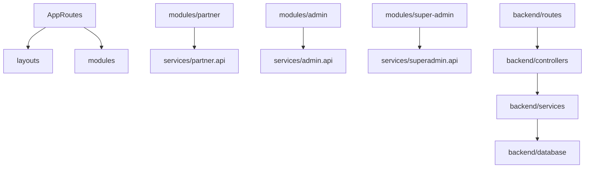

# GharKaPaisa — Full Project Features & Technical Report

Welcome to **GharKaPaisa**, a premium web and mobile application designed for credit card lead generation, partner commissions management, and multi-tenant administrative control.

Below is the structured technical documentation of all features implemented across every page and panel in the project, formatted in single-line bullet points.

---

## ── 1. NORMAL USER / PUBLIC PAGE FEATURES ──

1. **Brand Logo Redirection**: Clicking the company logo in the header navbar redirects the user back to the homepage.
2. **Three Role Login Buttons**: Navbar links routing users to Admin Login (`/admin-login`), Partner Login (`/login`), or Employee Login (`/admin-login`).
3. **Mode Changer (Theme Toggler)**: A header toggle switch that alternates the entire site layout between Light and Dark modes.
4. **9-Language Translator**: A localization dropdown translating the user interface into English, Hindi, Marathi, Gujarati, Bengali, Telugu, Tamil, Kannada, and Odia.
5. **CMS-Driven Slider Banners**: Marketing banner carousels displayed on the homepage that are managed dynamically from the database.
6. **Direct Banner Redirection**: Clicking a slide automatically redirects the user to its target path (e.g. LTF banner redirects to the Lifetime Free Credit Cards list).
7. **Lending Partners Grid**: Lists active lending banks (HDFC, SBI, Axis, ICICI, Kotak, Yes Bank, IDFC, Federal Bank) on the homepage.
8. **Bank-Specific Card Catalog**: Renders all cards belonging to a selected bank, showing card photos, fees, and rewards.
9. **Card Compare Drawer**: Allows side-by-side comparison of annual fees, joining charges, and key features for up to three selected cards.
10. **Card Benefits Detail Routing**: Routes the user to the dedicated benefits details page (`/card-benefits/:id`).
11. **Apply Now Header Button**: A top-navbar call-to-action button that navigates directly to the lead registration page.
12. **Universal Share API Button**: Integrates the native browser `navigator.share` API, enabling users to share card details with any mobile app.
13. **Customer OTP Verification Modal**: Validates public card applicants via SMS OTP verification before redirecting them to the official bank link.
14. **Mobile-Optimized Scroll Lock Layout**: Locks the main body screen at `100vh` and uses an internal scrollable container to emulate native apps.
15. **Compact Density UI**: Reduces page spacing, paddings, and font sizes by 30-50% to maximize readable details.
16. **Interactive Tabs Panel**: Displays card details across tabs for Special Offer, Benefits, Whom to Refer, How It Works, Training Video, FAQs, and T&C.

---

## ── 2. PARTNER PANEL FEATURES (IN DETAIL) ──

### 1. Dashboard (Business Status View)
- **Total Earnings Summary**: Displays partner's lifetime commission earnings.
- **Available Wallet Summary**: Shows current withdrawable funds.
- **Pending Commission Summary**: Displays commissions undergoing validation.
- **Leads Submitted Counter**: Tracks total customer applications created by the partner.
- **Approved Cases Counter**: Counts successful credit card approvals.
- **Rejected Cases Counter**: Counts customer applications rejected by banks.
- **Conversion Rate Meter**: Percentage ratio of approved cases vs. total submitted leads.
- **Quick Action Links**: Rapid links to Apply Credit Card, Apply Loan, Refer Customer, Share Product, and Transfer Lead.
- **Performance Chart**: Visual graphs showing Daily, Weekly, and Monthly lead volume.
- **Commission Trend Graph**: Graphical tracking of monthly earnings progress.
- **Product Performance Tool**: Analytics mapping top-performing banks, top products, and highest commission items.
- **Notifications Alerts**: Displays urgent updates regarding KYC status, document rejections, and new launches.

### 2. Product Marketplace (Customer Applications)
- **Product Categories**: Sections for Credit Cards, Personal Loans, Business Loans, Home Loans, Loans Against Property, Insurance, Mutual Funds, Travel, Recharge, and Bill Payments.
- **Product Cards**: Displays bank logo, card name, partner commission rate, eligibility requirements, and approval percentage.
- **Action Buttons**: Direct click buttons to Apply directly, Share link via social networks, or Learn More benefits.
- **Search Filters**: Sort inventory by lending bank name, product category, commission size, and approval rate.

### 3. Lead Management (Core Lead Operations)
- **Lead Status Stages**: Displays current stage tracking (New, In Review, Approved, Rejected, Disbursed, Commission Released).
- **Lead Table Columns**: Tracks applicant name, mobile number, product type, bank name, submission date, status, and expected commission.
- **Lead Actions**: Quick tools to View lead sheets, Edit applicant data, Upload KYC files, and Track progress milestones.

### 4. Customer Management (Client Profiles & Follow-Ups)
- **Customer Profile Data**: Archives client name, phone number, email, PAN card, Aadhaar, location, and occupation.
- **Customer Activity Feed**: Logs customer's applied products, active lead pipelines, generated commissions, and admin notes.
- **Follow-up Tooling**: Quick buttons to call the client, open a WhatsApp chat, send emails, or schedule calendar reminders.

### 5. Wallet & Earnings (Financial Tracking)
- **Wallet Metrics**: Tracks Available Balance, Pending Earnings, Released Earnings, and Lifetime Earnings.
- **Transactions Grid**: Registers date, transaction type, transfer amount, and status for every transaction.
- **Withdrawal Methods**: Options for direct Bank Transfer or UPI Transfer.
- **Reports Exporter**: Generates and downloads Monthly or Yearly account reports in PDF and Excel formats.

### 6. Referral Network (Sub-Agent Tree)
- **Referral Statistics**: Tracks total referrals, active sub-agents, team revenue, and network earnings.
- **Referral Links Hub**: Options to Copy Referral Link, Share to WhatsApp/Telegram, or download a custom QR Code.
- **Team Structure Hierarchy**: Displays sub-partner networks across Level 1, Level 2, and Level 3 tiers in a tree view layout.

### 7. Profile Hub (Partner Identity Settings)
- **Personal Details**: Manage profile name, email, contact mobile, date of birth, gender, and home address.
- **Professional Details**: Configures occupation status, agency name, work experience, and industry sector.
- **Payout Bank Details**: Saves bank name, IFSC code, account number, and UPI ID for electronic transactions.

### 8. KYC Center (Identity Validation)
- **Aadhaar Verification**: Fields to upload Aadhaar front and back images with real-time verification status.
- **PAN Verification**: Field to upload PAN card photo and record document number.
- **Selfie Verification**: Connects to camera to take a live photo and run facial matching.
- **Cheque Verification**: Upload portal for cancelled cheque copies to confirm bank details.
- **GST Verification**: Fields to register GST numbers and upload certificates.
- **Status Badges**: Shows color tags representing documents as Pending, Verified, Rejected, or Re-upload Required.

### 9. Documents Vault (Secure File Manager)
- **Vault Folders**: Categorizes uploaded items into KYC, Agreements, Bank Documents, GST Documents, and Certificates.
- **Document Actions**: Direct buttons to View document preview, Download files, or Replace files with new versions.

### 10. Training Academy (Education Center)
- **Training Courses**: Specific tutorials for Credit Card Sales, Loan Sales, Insurance Sales, Customer Handling, and Compliance.
- **Course Material**: Access study videos, download reference PDFs, take progress quizzes, and receive completion certificates.
- **Certification Levels**: Ranks partners into Bronze, Silver, Gold, and Platinum achievements.

### 11. Campaign Center (Promo Management)
- **Campaign Listings**: Marketing sheets for HDFC Card Campaigns, Loan Campaigns, Festival Offers, and Insurance promotions.
- **Campaign Tools**: Copy promo posts, share directly on WhatsApp, and download high-resolution marketing banners/posters.

### 12. Marketing Materials (Creative Resources)
- **Creative Libraries**: Repository of promotion images, videos, PDF brochures, social media templates, and banners.
- **Search Filters**: Sort creative resources by lending bank, product type, or regional language.

### 13. Notification Center (System Messages)
- **Notification Types**: Segregates incoming alerts into Commission updates, Lead updates, Product launches, Training guides, and Announcements.
- **Notification Controls**: Options to mark messages as read, archive historical logs, or delete old alerts.

### 14. Support Center (Agent Helpline)
- **Support Ticket Portal**: Submit tickets for technical bugs, commission discrepancies, KYC issues, or lead status errors.
- **WhatsApp Support Link**: Quick click button launching direct WhatsApp chat with the customer support desk.
- **Call Manager**: Action link to trigger a direct phone call to your account support manager.

### 15. Reports & Analytics (Performance Metrics)
- **Lead Analytics**: Displays graphs tracing lead submission trends, bank approvals, and rejection ratios.
- **Revenue Analytics**: Visualizes monthly earnings trends, top-producing products, and bank-specific revenue splits.
- **Partner Scorecard**: Evaluates performance score, activity metrics, and lead quality grades.

### 16. Settings (App Security & Configs)
- **Security Preferences**: Manage password changes, set custom Login MPINs, and enable two-factor (2FA) verification.
- **App Preferences**: Switch between Dark Mode theme settings, update translator languages, and manage notification prompts.
- **Session Manager**: Displays current login device details, historic login locations, and active login sessions.

### 17. Travel & Utility Module (Value-Added Services)
- **Value Services**: Integrates booking consoles for flights, buses, trains, and hotel accommodations.
- **Utility Payments**: Portals for DTH recharges, mobile recharges, electricity bills, FASTag recharges, and money transfers.
- **Utility Ledger**: Tracks history, commission earned, and recent transactions for all utility payments.

### Portal Navigation Frameworks
- **Bottom Navigation (Mobile Layout)**: Quick tabs for Dashboard, Products, Leads, Wallet, and Profile.
- **Sidebar Navigation (Desktop Layout)**: Left-side links for Dashboard, Products, Lead Management, Customers, Wallet, Referrals, Training, Campaigns, Marketing Material, Travel & Utilities, Reports, Notifications, Support, Profile Hub, and Settings.

---

## ── 3. SUPER PARTNER / TEAM NETWORK FEATURES ──

1. **Sub-Partner Invitation Link**: Provides referral links and codes to recruit child partners under the partner's account hierarchy.
2. **Direct Sub-Partner Onboarding**: An inline modal allowing partners to manually register new team members with names, mobile, and password.
3. **Team Grid Console**: An interactive table displaying downline team members, contact numbers, and registration dates.
4. **Partner Code Monitor**: Tracks the unique `Partner_code` assigned to each referred team member.
5. **KYC Status Visualizer**: Uses Amber/Green/Red badges to monitor child partners' document verification status.
6. **Override Payout Engine**: Connects team sales to the parent partner for indirect/override commission calculations.

---

## ── 4. ADMIN PANEL FEATURES ──

1. **Admin Statistics Dashboard**: Displays pending partner signups, pending withdrawals, active leads, and recent direct card submissions.
2. **Partner Management Directory**: List of registered partners with search and sort functions.
3. **KYC Document Viewer**: Screen showcasing submitted PAN and Cheque documents alongside partner details.
4. **Partner Activation Control**: Buttons to approve partners or reject them with feedback messages.
5. **Client Lead Resolution Panel**: View partner-submitted credit card applications.
6. **Bank Status Resolution**: Updates lead status (e.g. Bank Submission, Approved, Rejected) and tracks bank reference numbers.
7. **Direct Lead Management Console**: Manages and resolves applications submitted directly on the public homepage.
8. **Lead Name-Slug Lookup**: Resolves card name-slugs to database UUIDs during form submission, preventing HTTP 400 errors.
9. **Withdrawal Requests Console**: Manages payout requests submitted by partners.
10. **Payout Verification Checks**: Verifies bank details against uploaded cheques and checks the 48-hour security hold timer.
11. **Withdrawal Status Update**: Marks payouts as Approved (paid) or Rejected (refunding wallet balances).
12. **Forgot Password Link**: Link on the admin login page (`/admin-login`) to reset account passwords.

---

## ── 5. SUPER ADMIN PANEL FEATURES ──

1. **Collapsible Accordion Sidebar**: Groups pages into Users, Lead Tracking, Products, Modify CMS, and System Utilities.
2. **Active Path Sidebar Tracker**: Automatically expands the sidebar's **MODIFY** section if CMS or Banner pages are active.
3. **Theme Status Sidebar Label**: Displays the current toggle state ("LIGHT ☀️" / "DARK 🌙") inside the sidebar.
4. **Banners Slider Configurator**: Create and manage homepage marketing banners, image assets, and redirection slugs.
5. **Lending Partners Manager**: Creates banks, updates details, and manages active bank logo images.
6. **Product Catalog Builder**: Configures card fees, rewards, lounges, FAQ lists, and terms and conditions.
7. **Commission Manager**: Set card payout amounts (Total Earning vs Base Pay) and display active promotional end dates.
8. **Homepage CMS Manager**: Modifies titles, text sections, testimonials, and translator word dictionaries dynamically.
9. **Audit Logs Ledger**: Non-editable database search grid tracking all administrator actions.
10. **Reports Export Engine**: Generates CSV/Excel files for leads, partner wallets, and transaction histories.
11. **Partner Account Status Management**: Comprehensive partner status controls supporting six states (*Active*, *Inactive*, *Pending Verification*, *Suspended*, *Rejected*, *Blocked*) from the details panel. Super Admin actions prompt confirmation dialogs, update the PG database, write entries to the Audit Log, and restrict blocked/suspended users from logging into the partner network with custom messages.
12. **User Profile Dropdown**: Top navbar profile avatar displaying logged-in user details, name, and role. Click toggles a dropdown menu containing Profile, My Account, Change Password, Notifications, Activity Log, Settings, and Logout with click-outside auto-close listener.
13. **Sidebar Admin Privacy Mode Toggle**: Moved the Admin Privacy Mode setting from page controls to the desktop sidebar footer and mobile hamburger menu (next to theme controls) for cross-session persistence.
14. **Navbar Cleanliness**: Removed Dark Mode toggle from the top header navigation bar to declutter header layouts.

---

## ── 6. MOBILE APP SHELL INTEGRATION FEATURES ──

1. **Native WebView Container**: Renders the responsive web app within a mobile app frame.
2. **Hardware Back Button Interception**: Connects React Native's `BackHandler` API to handle back-navigation history within the WebView.

---

## ── 7. EXTERNAL SUBSCRIPTIONS & SERVICES USED ──

Below is the list of third-party service subscriptions and integrations configured in the project:

1. **MSG91 Subscription**: Gateway service for sending SMS OTPs and verifying user authenticity (mobile login, lead verification).
2. **AWS S3 (Amazon Simple Storage Service)**: Secure cloud bucket storage for KYC document images, PAN cards, cancelled cheques, and marketing banners.
3. **AWS SES (Amazon Simple Email Service) / Nodemailer**: Cloud email subscription used to send automated partner welcome messages and registration notifications.
4. **PostgreSQL Database Server**: Relational database subscription utilized for system-wide tables, partner directories, transaction logs, and audit ledgers.

---

## ── 8. UPCOMING ROADMAP / NEXT FEATURES ──

Below are the features planned for development and integration in the next phase of the project:

1. **Travel Bookings Modules**: Custom integrations allowing users to book buses, trains, and hotels directly within the platform.
2. **Customer CRM Portal**: A complete partner-side CRM dashboard to trace client leads, schedule follow-ups, and send lead alerts.
3. **Document Vault Service**: A secure cloud-storage library allowing referral partners to store and retrieve client KYC documentation.
4. **Training Academy Platform**: An interactive educational portal featuring training video guides, partner exams, and compliance courses.
5. **Marketing Center Hub**: Custom banners creator, ready-to-share landing templates, and personalized social media post generators.
6. **Integrated Support Ticketing**: A central hub in the partner layout allowing partners to raise help tickets and chat live with admins.
7. **Credit Card API Integrations**: Deep direct-integrations with banking API gateways to check application statuses in real-time.

---

## ── 9. ENTERPRISE REFALTORED FOLDER STRUCTURE ──

The project has been refactored from a type-based organization into a clean, feature-modular enterprise-level structure.

### 📁 Frontend Module Architecture (`frontend/src/`)
Reusable visual elements and contexts are isolated from business logic:
- `src/components/`: Reusable, design-system components organized in folders:
  - `Loader/`: Standardized spinner displays (`GkpLoader`, `LoadingLogo`).
  - `LanguageSwitcher/`: Localization controls.
  - `Navbar/`: Main header layout elements.
  - `ThemeSwitcher/`: System appearance switch.
  - `Icon/`: SVG vector libraries (`PartnerIcons`).
- `src/contexts/`: Shared React contexts (`ThemeContext`).
- `src/modules/`: Feature-modular business domains:
  - `authentication/`: Authentication pages (`login`, `register`, `forgot-password`, `reset-password`, `otp`).
  - `admin/`: Staff/Admin components (`dashboard`, `users`, `reports`).
  - `super-admin/`: Superadmin settings (`cms`, `crm`, `banners`, `audit`).
  - `partner/`: Partner networks (`wallet`, `kyc`, `leads`, `products`, `profile`).
  - `home/`: Public portal elements (`Home`, `Contact`, policies).
  - `products/`: Lead-generation engines (`ProductDetails`, `ApplyForm`).
  - `cms/`: Static information panels (`MoneyTransfer`, `ComingSoon`).

### 📁 Backend Module Architecture (`backend/src/`)
Organized by functional modules matching frontend business components:
- `database/`: Contains `migrations/` and `seeders/` to manage raw database setup.
- `controllers/`: Reorganized into feature sub-folders (`auth/`, `admin/`, `superAdmin/`, `partner/`, `bank/`, `product/`, `wallet/`, `report/`, `cms/`, `notification/`).
- `routes/`: Structured endpoint directories matching modular controllers.
- `services/`: Domain-specific processing libraries (`auth/`, `partner/`, `wallet/`, `notification/`, `report/`, `analytics/`).
- `validators/`: Verification middlewares (`auth/`, `partner/`).

### 🔌 Module Dependency Flow Overview

- [JMT x402 Agent Tools](https://jmt-x402-proxy.jmthomasofficial.workers.dev) — 25 paid x402 endpoints on Base mainnet: web search, AI analysis, crypto/stock data, SEC filings, company intel, news, sentiment, macro dashboard. $0.001-$0.15/call USDC. Local LLM-powered.