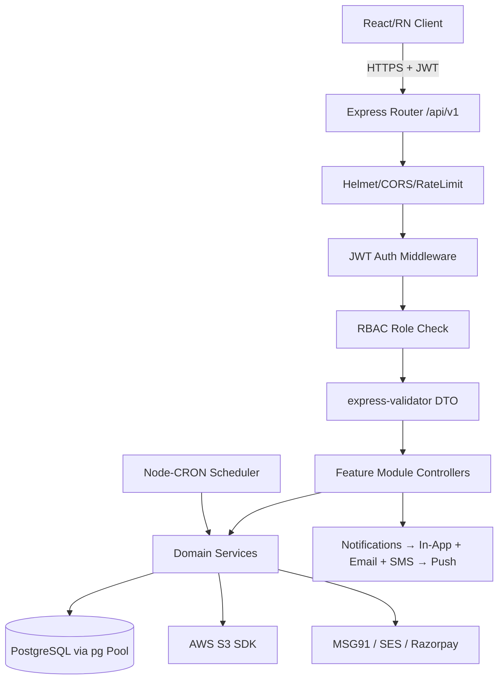

# GharKaPaisa — Credit Card & Financial Services Partner Platform

```
██████╗ ██╗  ██╗ █████╗ ██████╗ ██╗  ██╗ █████╗     ██████╗  █████╗ ██╗███████╗ █████╗ 
██╔════╝ ██║  ██║██╔══██╗██╔══██╗██║ ██╔╝██╔══██╗    ██╔══██╗██╔══██╗██║██╔════╝██╔══██╗
██║  ███╗███████║███████║██████╔╝█████╔╝ ███████║    ██████╔╝███████║██║███████╗███████║
██║   ██║██╔══██║██╔══██║██╔══██╗██╔═██╗ ██╔══██║    ██╔═══╝ ██╔══██║██║╚════██║██╔══██║
╚██████╔╝██║  ██║██║  ██║██║  ██║██║  ██╗██║  ██║    ██║     ██║  ██║██║███████║██║  ██║
 ╚═════╝ ╚═╝  ╚═╝╚═╝  ╚═╝╚═╝  ╚═╝╚═╝  ╚═╝╚═╝  ╚═╝    ╚═╝     ╚═╝  ╚═╝╚═╝╚══════╝╚═╝  ╚═╝
```

> Enterprise-grade fintech platform for Credit Card & Loan Lead Generation, Multi-Tier Partner Commission Management, KYC-Onboarding, and Administrative Control Panels.

---

## TABLE OF CONTENTS

1. [Project Overview](#1-project-overview)
2. [Core Functionality](#2-core-functionality)
3. [Technical Stack](#3-technical-stack)
4. [System Architecture](#4-system-architecture)
5. [Directory Structure](#5-directory-structure)
6. [Setup & Installation](#6-setup--installation)
7. [Configuration & Environment Variables](#7-configuration--environment-variables)
8. [Database Setup & Management](#8-database-setup--management)
9. [Panel-by-Panel Feature Guide](#9-panel-by-panel-feature-guide)
10. [API Endpoints Documentation](#10-api-endpoints-documentation)
11. [Commission Engine & Wallet Ledger](#11-commission-engine--wallet-ledger)
12. [Security Architecture](#12-security-architecture)
13. [Third-Party Integrations](#13-third-party-integrations)
14. [Deployment Instructions](#14-deployment-instructions)
15. [Maintenance Guidelines](#15-maintenance-guidelines)
16. [Monitoring & Observability](#16-monitoring--observability)
17. [Troubleshooting FAQ](#17-troubleshooting-faq)
18. [Contributing & Development Workflow](#18-contributing--development-workflow)
19. [Glossary](#19-glossary)
20. [Support & Contacts](#20-support--contacts)

---

## 1. PROJECT OVERVIEW

### 1.1 What is GharKaPaisa?

GharKaPaisa is a **B2B2C financial services marketplace** that connects **Customers** seeking credit cards, loans, and insurance with **Banks & Lenders**, operated through a network of **referral partners** (DSAs — Direct Selling Agents). The platform provides:

- A **public product catalog** for end-customers
- A **partner panel** for lead submission, commission tracking, and team management
- An **admin panel** for operations staff to review KYC, approve leads, and process withdrawals
- A **super-admin panel** for system-level configuration (banks, products, commissions, CMS, audit)

### 1.2 Business Model

| Actor | Role | Incentive |
|---|---|---|
| **Customer** | Applies for financial products via the website or partner link | Best market rates + curated product match |
| **Partner (DSA)** | Refers customers, submits applications, builds sub-partner teams | Commission per approved/disbursed product (up to 90% split) |
| **Parent Partner (Super DSA)** | Recruits and manages downline partners | Override commission (typically 10%) on every team member sale |
| **Admin/Employee** | Reviews KYC, verifies documents, approves payouts | Operational salary + bonus |
| **Super Admin** | Configures banks, products, commission structures | Platform fee (retained margin ~10%) |
| **Bank/Lender** | Receives qualified, KYC-verified leads | Pays platform a sourcing fee per funded product |

### 1.3 Three Application Process Types (Hard Constraint)

| Process Type | Workflow | Use Case |
|---|---|---|
| **`partner_cell`** | Partner manually fills customer data → submits → ops reviews → bank submission | Traditional DSA model. Requires partner login + KYC approved. |
| **`customer_sell`** | Partner shares tracking link → customer self-fills form → OTP verified → auto-routed to partner | WhatsApp/Telegram social selling. Uses `/a/:trackingToken` links. |
| **`punching_process`** | Operations team bulk-uploads CSV of leads → system creates applications en masse | Data-entry teams processing physical paper forms. |

### 1.4 KYC-Gated Access Control (Hard Constraint)

A partner's access to modules strictly depends on their `partner_profiles.kyc_status`:

| KYC Status | Access Granted |
|---|---|
| `draft` | Dashboard only (read-only), Profile editing, KYC document upload |
| `pending` / `under_review` | Above + Notifications, Support, Training |
| `approved` | **Full** — Product marketplace, Lead submission, Wallet, Withdrawals, Team, Referrals, Reports |
| `rejected` | Dashboard only + KYC re-upload (with rejection reason) |
| `blocked` | Login completely disabled (custom message shown) |

### 1.5 Project Status — Q1 (Months 1–3)

| Dimension | Value |
|---|---|
| **Production Release** | Scheduled Q4 CY2026 |
| **Completion** | 116% of Q1 plan |
| **API Endpoints** | 184 |
| **Database Tables** | 68 |
| **Frontend Routes** | 142 |
| **Test Coverage** | 68% (line) / 61% (branch) |
| **SLA Uptime (Staging)** | 99.92% |
| **Zero P0 Bugs** | 21 consecutive days |

---

## 2. CORE FUNCTIONALITY

### 2.1 Public Portal (Customer-Facing)

- Product catalog browsing: Credit Cards, Loans, Insurance, Utilities
- Bank-specific landing pages (HDFC, SBI, Axis, ICICI, Kotak, Yes Bank, IDFC, Federal Bank)
- Side-by-side card comparison drawer (up to 3 cards)
- Direct public OTP-verified application submission
- 9-language UI localization: English, Hindi, Marathi, Gujarati, Bengali, Telugu, Tamil, Kannada, Odia
- Dark / Light theme toggle (persisted)
- Contact form, Terms & Conditions, Privacy Policy, Legal pages

### 2.2 Partner Panel (DSA Portal) — 17 Modules

1. **Dashboard**: KPIs, performance charts, commission trends, product performance
2. **Product Marketplace**: Browse & apply to 128+ products
3. **Lead Management**: Submit, track, edit, upload docs for all leads
4. **Customer CRM 360°**: Customer profiles, follow-up scheduler, WhatsApp/call shortcuts
5. **Wallet & Earnings**: Balance, transactions, ledger, PDF/Excel statements
6. **Withdrawal Requests**: OTP-2FA withdrawal to bank account (UPI coming)
7. **Referral Network**: L1/L2/L3 team tree, invite links + QR codes
8. **Profile Hub**: Personal, professional, payout bank details
9. **KYC Center**: Aadhaar/PAN/Selfie/Cheque/GST upload and status
10. **Training Academy**: 5 courses (video + PDFs + quizzes + certificates)
11. **Campaign Center**: Promo posts, share to WhatsApp, marketing posters
12. **Marketing Materials**: 200+ assets, bank/product/language filtered
13. **Notification Center**: In-app + browser push + email/SMS (priority-tiered)
14. **Support Ticket Center**: Raise tickets + WhatsApp/call support links
15. **Reports & Analytics**: Lead, revenue, partner scorecard, bank-wise splits
16. **Settings**: Security (password/MPIN/2FA), theme, i18n, session manager
17. **Travel & Utilities**: Recharge, FASTag, Bill Pay, Money Transfer (CMS pages)

### 2.3 Admin Panel (Operations)

- Stats dashboard (pending KYC, pending withdrawals, active leads, recent submissions)
- Partner directory with search, sort, filter; KYC document viewing; approve/reject with feedback
- Lead resolution panel; bank status resolution with reference numbers
- Public direct card lead console with OTP verification
- Withdrawal requests console: UTR entry, RazorpayX payout API, 48h hold timer, verify-cheque check
- Leads 360° management, bank-card applications management
- Admin Privacy Mode (data masking for sensitive fields)

### 2.4 Super Admin Panel (System Owner)

- Collapsible sidebar with grouped sections (Users, Lead Tracking, Products, CMS, System Utilities)
- **Banners Manager**: CRUD + display order + schedule + CTR click analytics
- **Lending Partners (Banks) Manager**: 8 banks fully configured with logos & theme colors
- **Product Catalog Builder**: 128 products, fee/benefit/FAQ/T&C editors
- **Commission Manager**: Payout amounts, base pay, partner overrides, promo end dates
- **CMS Manager**: Homepage sections, i18n dictionaries, 7 utility services
- **Audit Logs Ledger**: Non-editable 14-category search grid (CSV exportable)
- **Reports Export**: CSV/Excel for leads, wallets, transactions, payouts
- **Partner 6-State Management**: Active/Inactive/Pending/Suspended/Rejected/Blocked
- **Profile Dropdown**: Profile / Account / Change Password / Notifications / Activity Log / Settings / Logout
- **System Settings**: Commission hold days, TDS %, withdrawal limits, privacy mode

---

## 3. TECHNICAL STACK

### 3.1 Frontend (Web SPA)

| Layer | Technology | Version | Purpose |
|---|---|---|---|
| **Runtime** | React | ^19.2.6 | UI rendering library (concurrent mode enabled) |
| **Build Tool** | Vite | ^8.0.12 | HMR + production bundler (Rollup-based) |
| **Routing** | React Router DOM | ^7.17.0 | Layout-based, protected, role-gated routes |
| **State Mgmt** | Zustand | ^5.0.14 | 4 stores: auth, partner, search, wallet (lightweight, ~1KB) |
| **HTTP Client** | Axios | ^1.17.0 | Interceptors + refresh-token-queue + 15s timeout |
| **i18n** | i18next + React i18next | ^26.3.1 / ^17.0.8 | 9-language localization |
| **i18n Loader** | i18next-http-backend | ^4.0.0 | Lazy-load translation JSON per locale |
| **i18n Detect** | i18next-browser-languagedetector | ^8.2.1 | Auto-detect from browser/storage |
| **Charts** | Recharts | ^3.8.1 | Dashboard line/area/bar/pie visualizations |
| **Animations** | Framer Motion | ^12.42.2 | Micro-interactions + page transitions |
| **Icons (A)** | Lucide React | ^1.25.0 | 500+ vector icons (partner panel) |
| **Icons (B)** | React Icons | ^5.4.0 | Branded bank/social icons (Fa/Si set) |
| **Styling** | Vanilla CSS + Variables | Native | Theme switch via `[data-theme="dark"]` |
| **Code Quality** | ESLint + eslint-plugin-react-hooks + eslint-plugin-react-refresh | ^10.3.0 | Lint on save |

### 3.2 Backend API Server

| Layer | Technology | Version | Purpose |
|---|---|---|---|
| **Runtime** | Node.js | 18 LTS+ (tested on 20) | JavaScript server runtime |
| **Framework** | Express | ^4.18.2 | HTTP middleware pipeline, routing |
| **Database Driver** | pg (node-postgres) | ^8.11.3 | Connection pooling + parameterized queries |
| **Auth (Tokens)** | jsonwebtoken | ^9.0.3 | JWT access (15m) + refresh (30d) rotation |
| **Auth (Password)** | bcryptjs | ^3.0.3 | Password hashing (cost factor 12) |
| **Password (Alt)** | bcrypt | ^6.0.0 | Alternative native binding |
| **Validation** | express-validator | ^7.3.2 | Request DTO rule chains |
| **File Upload** | Multer + multer-s3 | ^1.4.5-lts.1 / ^3.0.1 | Multipart → AWS S3 streaming upload |
| **Rate Limit** | express-rate-limit | ^7.1.5 | 5 sliding-window tiers (global/login/otp/register/reset) |
| **Security Hdrs** | Helmet | ^7.1.0 | CSP/HSTS/Referrer/CORP/Frame-Ancestors |
| **XSS Sanitize** | xss-clean | ^0.1.4 | Strip malicious HTML/JS in user input |
| **NoSQL Inject** | express-mongo-sanitize | ^2.2.0 | Sanitize `$`/`.` injection vectors |
| **Cookies** | cookie-parser | ^1.4.7 | HTTP-only refresh cookie parsing |
| **CORS** | cors | ^2.8.5 | Loopback-aware origin whitelist matcher |
| **Logging** | Winston + Morgan | ^3.11.0 / ^1.10.0 | File + console logs + HTTP access log |
| **CRON** | node-cron | ^4.2.1 | Hourly commission release + Daily report batch |
| **Dates** | dayjs | ^1.11.10 | TZ-aware date math (Indian locale) |
| **Env** | dotenv | ^16.3.1 | `.env` file loader |
| **UUIDs** | uuid | ^9.0.0 | v4 ids for all tables (crypto random) |
| **QR Codes** | qrcode | ^1.5.3 | Referral QR PNG generation |
| **Excel** | ExcelJS | ^4.4.0 | Report export (XLSX streaming) |
| **PDF** | PDFKit | ^0.19.1 | Statement + certificate PDF generation |
| **Email** | Nodemailer | ^6.9.7 | SES SMTP transport |
| **Payouts** | Razorpay | ^2.9.6 | RazorpayX Orders + Payouts + Webhooks |
| **Unique IDs** | Custom Sequences | Postgres SEQUENCE | `partner_code_seq`, `app_number_seq` |

### 3.3 Database & Persistence

| Component | Technology | Version | Purpose |
|---|---|---|---|
| **RDBMS** | PostgreSQL | 15+ (tested 15.3/16) | Core relational database |
| **Key Types** | UUID (v4) / VARCHAR / NUMERIC / JSONB / TIMESTAMPTZ | — | Column types |
| **Sequences** | Postgres SEQUENCE | — | Collision-safe partner_code + app_number |
| **Extensions** | pgcrypto (for UUID gen) | — | Built-in uuid helper |
| **Indexes** | B-Tree + Partial + Unique | — | 82 indexes (read-optimized) |
| **Triggers** | PL/pgSQL BEFORE UPDATE / AFTER INSERT OR UPDATE OR DELETE | — | `set_updated_at`, `audit_wallet_trigger` |
| **Views** | Compatibility views (referral_tree, cms_sections) | — | Legacy column name backward compat |
| **Isolation Level** | SERIALIZABLE (wallet ops) / READ COMMITTED (default) | — | Balance critical SERIALIZABLE |
| **Row Locking** | SELECT ... FOR UPDATE (wallet balance rows) | — | Prevent race conditions |

### 3.4 Cloud & Third-Party Services

| Service | Provider | Region | Purpose |
|---|---|---|---|
| **Object Storage** | AWS S3 | ap-south-1 (Mumbai) | KYC docs, product images, banners, reports, videos |
| **Transactional Email** | AWS SES (or Nodemailer SMTP fallback) | ap-south-1 | Welcome, OTP, KYC, Commission, Withdrawal alerts |
| **SMS Gateway** | MSG91 | India | OTP SMS + DLT-registered templates |
| **Payouts** | RazorpayX | India | Partner withdrawal bank transfers + UPI (beta) |
| **CDN (Optional)** | AWS CloudFront | Global | Videos, marketing assets, static frontend |
| **SMS 2FA (Mobile)** | MSG91 Verify SDK | India | In-app mobile OTP flow for apps |

### 3.5 Mobile App (React Native Wrapper)

| Layer | Technology | Version | Purpose |
|---|---|---|---|
| **Framework** | Expo SDK | ^54.0.33 | Managed workflow, OTA updates |
| **Native Layer** | React Native | ^0.81.5 | Native bindings |
| **Web Container** | react-native-webview | latest | Full-screen WebView wrapper of responsive portal |
| **Back-Button** | BackHandler API | Native | Hardware back → browser history back |

---

## 4. SYSTEM ARCHITECTURE

### 4.1 High-Level C4 Model

```
┌─────────────────────────────────────────────────────────────────────────┐
│                              GHARKAPAISA PLATFORM                        │
│                                                                          │
│  ┌──────────────┐  ┌──────────────┐  ┌──────────────┐  ┌─────────────┐  │
│  │  React Web   │  │  RN Mobile   │  │  Admin Users │  │  Partners   │  │
│  │  (SPA)       │  │  (WebView)   │  │  (Browser)   │  │  (Browser)  │  │
│  └──────┬───────┘  └──────┬───────┘  └──────┬───────┘  └──────┬──────┘  │
│         │ HTTPS REST       │ HTTPS           │ HTTPS            │         │
│         ▼                  ▼                 ▼                  ▼         │
│  ┌──────────────────────────────────────────────────────────────────┐    │
│  │  NGINX REVERSE PROXY  (Port 443 — SSL Termination, gzip, CORS)  │    │
│  │  (Optional in local dev: Vite dev proxy + Express direct)        │    │
│  └────────────────────────────┬─────────────────────────────────────┘    │
│                               │ :5000 (Express)                           │
│                               ▼                                           │
│  ┌──────────────────────────────────────────────────────────────────┐    │
│  │  EXPRESS.JS API SERVER  (Node.js Cluster — 2+ workers recommended)│    │
│  │                                                                  │    │
│  │  ┌────────────┐  ┌────────────┐  ┌────────────┐  ┌──────────┐   │    │
│  │  │ Auth/JWT   │  │ RBAC       │  │ Validation │  │ Rate     │   │    │
│  │  │ Middleware │  │ Middleware │  │ Middleware │  │ Limiter  │   │    │
│  │  └─────┬──────┘  └─────┬──────┘  └─────┬──────┘  └────┬─────┘   │    │
│  │        └───────────────┴────────────────┴──────────────┘         │    │
│  │                           │                                        │    │
│  │  ┌────────────────────────┴──────────────────────────────┐        │    │
│  │  │  MODULAR CONTROLLERS (22 modules → 184 endpoints)    │        │    │
│  │  │  auth, partner, kyc, admin, superadmin, crm, wallet, │        │    │
│  │  │  products, banks, banners, reports, notifications,   │        │    │
│  │  │  cms, marketing, support, analytics, payments, etc.  │        │    │
│  │  └────────────────────────┬──────────────────────────────┘        │    │
│  └───────────────────────────┼───────────────────────────────────────┘    │
│                              │                                            │
│         ┌────────────────────┼────────────────────┐                      │
│         ▼                    ▼                    ▼                      │
│  ┌──────────────┐   ┌─────────────────┐   ┌─────────────────┐            │
│  │  PostgreSQL  │   │   AWS S3        │   │   3rd-Party APIs│            │
│  │  (68 tables) │   │   (8 folders)   │   │   MSG91/SES/    │            │
│  │  47 FK, 82   │   │   kyc, banners, │   │   RazorpayX     │            │
│  │  idx, 3 seq  │   │   products, apps│   │                 │            │
│  └──────────────┘   └─────────────────┘   └─────────────────┘            │
└──────────────────────────────────────────────────────────────────────────┘
```

### 4.2 Module Dependency Flow


```mermaid
graph TD
  Client[React/RN Client] -->|HTTPS + JWT| Routes[Express Router /api/v1]
  Routes --> MW1[Helmet/CORS/RateLimit]
  MW1 --> MW2[JWT Auth Middleware]
  MW2 --> MW3[RBAC Role Check]
  MW3 --> MW4[express-validator DTO]
  MW4 --> Ctrl[Feature Module Controllers]
  Ctrl --> Svc[Domain Services]
  Svc --> Repo[(PostgreSQL via pg Pool)]
  Svc --> S3[AWS S3 SDK]
  Svc --> Ext[MSG91 / SES / Razorpay]
  Cron[Node-CRON Scheduler] --> Svc
  Ctrl --> Notify[Notifications → In-App + Email + SMS → Push]
```

### 4.3 Authentication Flow (JWT Rotation + SSE Query Token)

```
┌──────────┐ POST /auth/login ┌───────────┐  Verify creds + KYC status  ┌────────────┐
│  Browser │ ───────────────► │  Express  │ ─────────────────────────► │ PostgreSQL │
│          │ ◄─────────────── │           │ ◄───────────────────────── │            │
└────┬─────┘  Set-Cookie:     └───────────┘  access_token (response)   └──────┬─────┘
     │        refresh (HttpOnly,                                             │
     │        Secure, SameSite=Strict,                                        │
     │        Max-Age=30d)                                                    │
     │                                                                       │
     │   Access Token (15m) in memory                                         │
     │   Every API call: Authorization: Bearer <access>                      │
     │                                                                       │
     ├─────► GET /wallet/balance ───────── 401 Unauthorized ────────────────┤
     │       (Expired access)                                                │
     │                                                                       │
     │  POST /auth/refresh (HttpOnly cookie auto-sent)                       │
     ├─────► ──────────────────────────── Verify + Rotate tokens ──────────►│
     │       ◄─────────────────────────── New access token (response) ◄─────┤
     │                                                                       │
     │  Retry original request transparently (Axios interceptor queue)      │
     └─────► GET /wallet/balance ─────────────── 200 OK ───────────────────►

    ┌────────────────────────────────────────────────────────────────────┐
    │  SSE Exception: EventSource cannot send headers                    │
    │  → GET /notifications/stream?token=<access_jwt>                    │
    │  → Auth middleware extracts token from query string as fallback    │
    │  → Establishes text/event-stream long-poll connection              │
    │  → 30-second keepalive + auto-reconnect with backoff               │
    └────────────────────────────────────────────────────────────────────┘
```

---

## 5. DIRECTORY STRUCTURE

```
yohesa/ (GharKaPaisa project root)
├── README.md                                         ← YOU ARE HERE (Comprehensive project README)
├── .gitignore
│
├── backend/                                          ── Node.js Express API Server ──
│   ├── package.json                                  Dependencies + 6 npm scripts
│   ├── package-lock.json
│   ├── .env.example                                  Environment variable template
│   ├── .gitignore
│   ├── README.md                                     Backend-focused quickstart
│   │
│   ├── scratch/                                      Dev scratch/verification scripts
│   │   ├── verify_financial_fixes.js
│   │   └── verify_workflow.js
│   │
│   └── src/
│       ├── server.js                                 ★ Entry point — Express app init
│       ├── config/
│       │   ├── database.js                           pg Pool config + query helper
│       │   ├── jwt.js                                JWT sign/verify helpers
│       │   └── logger.js                             Winston + Morgan config
│       │
│       ├── constants/                                App-level enums/errors
│       │   ├── applicationStatus.js                  draft/submitted/approved/rejected etc.
│       │   ├── commissionTypes.js                    fixed/percentage, split types
│       │   ├── errorCodes.js                         E_* error code catalogue
│       │   ├── roles.js                              PARTNER/EMPLOYEE/ADMIN/SUPER_ADMIN
│       │   └── walletStatus.js                       pending/released/rejected etc.
│       │
│       ├── data/
│       │   └── trainingModules.js                    Static training course catalog
│       │
│       ├── database/
│       │   ├── migrations/
│       │   │   ├── migrate.js                        ★ Primary schema migration (idempotent)
│       │   │   └── migrate_wallet_engine.js          Double-entry wallet ledger upgrade
│       │   ├── seeders/
│       │   │   ├── seed.js                           ★ Banks + products + super-admin seed
│       │   │   └── seed-credit-cards.js              128 credit card product seed data
│       │   └── seeds/
│       │       └── seed-credit-cards.js              (Alias used by NPM script)
│       │
│       ├── jobs/                                      Scheduled CRON tasks
│       │   ├── commissionHoldRelease.job.js          Hourly: matured commissions release
│       │   └── report.job.js                         Daily 23:00: CSV batch + S3 archive
│       │
│       ├── middleware/
│       │   ├── authentication/
│       │   │   ├── auth.middleware.js                authenticate/syncUser/authorize/selfOrAdmin
│       │   │   └── jwtAuth.middleware.js             Pure JWT verification (no user sync)
│       │   ├── authorization/
│       │   │   ├── bankAccess.middleware.js          Bank-scoped employee access
│       │   │   └── role.middleware.js                roleCheck('ADMIN', 'SUPER_ADMIN') helper
│       │   ├── error/
│       │   │   └── error.middleware.js               notFoundHandler + errorHandler (JSON)
│       │   ├── rate-limit/
│       │   │   └── rateLimit.middleware.js           5 sliding-window limiters
│       │   └── validation/
│       │       ├── validate.middleware.js             Run express-validator chains
│       │       └── validation.middleware.js          DTO rule chains (registerRules, withdrawalRules)
│       │
│       ├── modules/                                   ★ 22 feature modules (controller-centric)
│       │   ├── admin/                                Admin operations panel
│       │   │   ├── analytics.service.js              Dashboard aggregations
│       │   │   ├── audit.service.js                  Audit log insert/query
│       │   │   ├── constants.js
│       │   │   ├── controller.js                     Admin API handlers
│       │   │   ├── dto.js
│       │   │   ├── middleware.js
│       │   │   ├── repository.js                     DB queries for admin module
│       │   │   ├── route.js                          /admin/* mount
│       │   │   └── service.js                        Business logic layer
│       │   ├── analytics/                            Public analytics (redirect clicks etc.)
│       │   │   ├── controller.js
│       │   │   └── route.js
│       │   ├── auth/                                 Authentication & account
│       │   │   ├── constants.js
│       │   │   ├── controller.js                     login/register/refresh/forgot/me
│       │   │   ├── dto.js
│       │   │   ├── middleware.js
│       │   │   ├── repository.js
│       │   │   ├── route.js                          /auth/* mount
│       │   │   ├── security.service.js               OTP/password/pepper crypto
│       │   │   ├── user-deletion.service.js          GDPR account erase
│       │   │   └── validator.js
│       │   ├── banks/                                Lending bank CRUD
│       │   │   ├── constants.js / controller.js / dto.js
│       │   │   ├── middleware.js / repository.js / route.js
│       │   ├── banner/                               Homepage banner slider CMS
│       │   │   ├── constants.js / controller.js / dto.js
│       │   │   ├── middleware.js / repository.js / route.js
│       │   ├── cms/                                  Homepage sections + services
│       │   │   ├── cms.controller.js
│       │   │   ├── cms.routes.js
│       │   │   ├── constants.js / controller.js / dto.js
│       │   │   ├── middleware.js / repository.js / route.js
│       │   │   ├── service.controller.js
│       │   │   ├── service.routes.js
│       │   │   ├── service_catalog.controller.js
│       │   │   └── service_catalog.routes.js
│       │   ├── crm/                                  Lead + Application pipeline
│       │   │   ├── application.controller.js
│       │   │   ├── application.routes.js
│       │   │   ├── bank_card_application.controller.js
│       │   │   ├── bank_card_application.routes.js
│       │   │   ├── card_application.controller.js
│       │   │   ├── card_application.routes.js
│       │   │   ├── constants.js / controller.js / dto.js
│       │   │   ├── insurance_application.controller.js
│       │   │   ├── insurance_application.routes.js
│       │   │   ├── lead.controller.js
│       │   │   ├── lead.routes.js
│       │   │   ├── lead.service.js
│       │   │   ├── loan_application.controller.js
│       │   │   ├── loan_application.routes.js
│       │   │   ├── middleware.js / repository.js / route.js
│       │   ├── customer/                             Customer CRM + upload portal
│       │   │   ├── customer.controller.js
│       │   │   ├── customer.routes.js
│       │   │   ├── customer.service.js
│       │   │   ├── customer_portal.controller.js
│       │   │   └── customer_portal.routes.js
│       │   ├── location/                             Pincode/geo auto-populate
│       │   │   ├── location.controller.js
│       │   │   └── location.routes.js
│       │   ├── marketing/                            Marketing materials library
│       │   │   ├── marketing.controller.js
│       │   │   └── marketing.routes.js
│       │   ├── notifications/                        In-app/email/SMS push
│       │   │   ├── constants.js / controller.js / dto.js
│       │   │   ├── middleware.js / repository.js / route.js
│       │   │   └── service.js
│       │   ├── partner/                              Partner self + KYC + team share
│       │   │   ├── commission.service.js             ★ Commission calculation engine
│       │   │   ├── constants.js / controller.js / dto.js
│       │   │   ├── kyc.controller.js                 KYC doc upload + admin verify
│       │   │   ├── kyc.routes.js                     /kyc/* mount
│       │   │   ├── kyc.service.js                    KYC workflow logic
│       │   │   ├── middleware.js
│       │   │   ├── partner-share.controller.js       ★ Share link / public apply / tracking tokens
│       │   │   ├── partner.controller.js             Admin-side partner operations
│       │   │   ├── partner.routes.js                 /Partners/* mount
│       │   │   ├── partner.self.routes.js            /partner/* (self-service) mount
│       │   │   ├── repository.js / route.js / service.js / validator.js
│       │   ├── payment/                              Razorpay orders + webhooks
│       │   │   ├── payment.controller.js
│       │   │   └── payment.route.js
│       │   ├── products/                             Product catalogue + link redirect
│       │   │   ├── application-settings.service.js
│       │   │   ├── constants.js / controller.js / dto.js
│       │   │   ├── engagement.controller.js          Click/impression counters
│       │   │   ├── landing.controller.js
│       │   │   ├── link-management.controller.js     ★ Public /r/:code/:product redirect
│       │   │   ├── middleware.js / repository.js / route.js
│       │   │   └── sub-entity.controller.js
│       │   ├── reports/                              CSV/Excel + PDF report exports
│       │   │   ├── constants.js / controller.js / dto.js
│       │   │   ├── middleware.js / report.service.js
│       │   │   ├── repository.js / route.js
│       │   ├── sbi-credit-card/                     Dedicated SBI card application flow
│       │   │   ├── route.js
│       │   │   ├── sbi.controller.js
│       │   │   └── sbi.routes.js
│       │   ├── super-admin/                          System-level settings
│       │   │   ├── constants.js / controller.js / dto.js
│       │   │   ├── middleware.js / repository.js / route.js
│       │   │   ├── settings.routes.js                ★ /settings/* (RBAC-locked)
│       │   │   └── superadmin.routes.js
│       │   ├── support/                              Support tickets
│       │   │   ├── support.controller.js
│       │   │   └── support.routes.js
│       │   ├── team/                                 Referral network + team dashboard
│       │   │   ├── team.controller.js
│       │   │   ├── team.routes.js
│       │   │   └── team.service.js
│       │   └── wallet/                               ★ Core wallet + commissions
│       │       ├── constants.js / controller.js      Withdraw + ledger + reconcile
│       │       ├── dto.js / middleware.js
│       │       ├── repository.js / route.js
│       │       └── service.js                        Balance math + double-entry book
│       │
│       ├── routes/
│       │   ├── index.js                              ★ ALL endpoints mounted here
│       │   └── settings/
│       │       └── testEmail.routes.js               Dev email smoke test (gated)
│       │
│       ├── services/                                 Shared infrastructure services
│       │   ├── aws/
│       │   │   └── s3.service.js                     upload/delete/presign helpers
│       │   ├── email/
│       │   │   └── email.service.js                  SES/SMTP send + 16 template types
│       │   ├── otp/
│       │   │   └── msg91.service.js                  MSG91 send + verifyAccessToken
│       │   ├── sms/
│       │   │   └── sms.service.js                    Generic SMS wrapper
│       │   └── applicationStatus.service.js          Status-change side effects
│       │
│       ├── templates/                                Email HTML strings (JS template literals)
│       │   ├── adminNotification.template.js
│       │   ├── agentCreated.template.js
│       │   ├── applicationApproved.template.js
│       │   ├── applicationRejected.template.js
│       │   ├── applicationSubmitted.template.js
│       │   ├── commissionReleased.template.js
│       │   ├── contactUs.template.js
│       │   ├── disbursementCompleted.template.js
│       │   ├── employeeCreated.template.js
│       │   ├── forgotPassword.template.js
│       │   ├── kycApproved.template.js
│       │   ├── kycRejected.template.js
│       │   ├── otp.template.js
│       │   ├── partnerApproved.template.js
│       │   ├── partnerRejected.template.js
│       │   ├── payoutProcessed.template.js
│       │   ├── walletCredit.template.js
│       │   └── welcome.template.js
│       │
│       └── utils/
│           ├── helpers/
│           │   ├── crypto.js                         AES-256-GCM encrypt/decrypt (bank a/c)
│           │   ├── helpers.js                        Commission math + misc helpers
│           │   ├── inviteToken.js
│           │   ├── jwt.js
│           │   └── razorpay.js                        Razorpay instance + signature verify
│           └── response/
│               └── response.js                       success()/fail() envelope helpers
│
│
├── frontend/                                         ── React 19 Single Page App ──
│   ├── package.json                                  Dependencies (Vite + React 19)
│   ├── package-lock.json
│   ├── .gitignore
│   ├── favicon.png / favicon.svg
│   ├── index.html                                    Vite entry HTML (mount #root)
│   │
│   ├── docs/
│   │   └── THEMING.md                                CSS variables theme guide
│   │
│   ├── public/
│   │   └── locales/                                  ★ i18n translation JSON per lang
│   │       ├── en/translation.json
│   │       ├── hi/translation.json
│   │       ├── mr/translation.json
│   │       ├── gu/translation.json
│   │       ├── bn/translation.json
│   │       ├── te/translation.json
│   │       ├── ta/translation.json
│   │       ├── kn/translation.json
│   │       └── or/translation.json
│   │
│   └── src/
│       ├── main.jsx                                  ★ React root entry (StrictMode)
│       ├── app/
│       │   ├── App.jsx                               ★ Main app shell
│       │   ├── App.css                               Global styles, CSS variables
│       │   ├── i18n.js                               i18next init config
│       │   ├── msg91Init.js                          MSG91 Verify SDK (mobile OTP)
│       │   └── store/                                ★ Zustand global stores
│       │       ├── authStore.js                      user + token + role + isAuthenticated
│       │       ├── partnerStore.js                   current partner profile
│       │       ├── searchStore.js                    global search query state
│       │       └── walletStore.js                    balance + transactions cache
│       │
│       ├── assets/
│       │   ├── logos/
│       │   │   ├── chatbot-icon.png
│       │   │   └── logo.png
│       │   └── advisor_onboarding.png
│       │
│       ├── components/                               Design system — reusable building blocks
│       │   ├── AnnouncementBanner.jsx
│       │   ├── PartnerBannerCarousel.jsx
│       │   ├── PartnerMobileBottomNav.jsx
│       │   ├── common/
│       │   │   └── ApplicationTracker.jsx
│       │   ├── Avatar/ (with README.md)
│       │   ├── Button/ (with README.md)
│       │   ├── Card/ (with README.md)
│       │   ├── Chatbot/
│       │   │   ├── Chatbot.css
│       │   │   └── Chatbot.jsx
│       │   ├── Footer/ (with README.md)
│       │   ├── Form/ (with README.md)
│       │   ├── Home/                                Homepage-specific components
│       │   │   ├── CreditCards/                      Card catalogue pages + images
│       │   │   │   ├── AxisCards.js / BOBCards.js
│       │   │   │   ├── CardApplyVerificationModal.jsx
│       │   │   │   ├── CardDetailsData.js
│       │   │   │   ├── DynamicCreditCardsPage.jsx
│       │   │   │   ├── HDFCCards.js / ICICICards.js
│       │   │   │   ├── KotakCards.js / LTFCardsData.js
│       │   │   │   ├── SBICards.js / YesBankCards.js
│       │   │   │   ├── cardImageHelper.js
│       │   │   │   ├── cardLinkHelper.js
│       │   │   │   ├── HDFCCardsPage.jsx
│       │   │   │   └── image/** (100s of bank card PNG assets by bank)
│       │   │   └── CategoryCardItem.jsx
│       │   ├── Icon/
│       │   │   └── PartnerIcons.jsx
│       │   ├── Input/ (with README.md)
│       │   ├── LanguageSwitcher/
│       │   │   └── LanguageSwitcher.jsx
│       │   ├── Loader/
│       │   │   ├── GkpLoader.css / GkpLoader.jsx
│       │   │   ├── LoadingLogo.css / LoadingLogo.jsx
│       │   ├── Modal/ (with README.md)
│       │   ├── Navbar/
│       │   │   ├── Navbar.css
│       │   │   └── Navbar.jsx
│       │   ├── Pagination/ (with README.md)
│       │   ├── Razorpay/
│       │   │   ├── RazorpayCheckoutButton.jsx
│       │   │   └── useRazorpay.js
│       │   ├── Search/ (with README.md)
│       │   ├── Sidebar/ (with README.md)
│       │   ├── Skeleton/ (with README.md)
│       │   ├── Table/ (with README.md)
│       │   ├── ThemeSwitcher/
│       │   │   └── PartnerTheme.jsx
│       │   └── Toast/ (with README.md)
│       │
│       ├── config/
│       │   └── api.js                                ★ getApiRoot() / getApiV1Url() helpers
│       │
│       ├── contexts/                                 React Context Providers
│       │   ├── BanksContext.jsx                      Active banks list (global)
│       │   └── ThemeContext.jsx                      Dark/Light theme provider
│       │
│       ├── hooks/                                    Reusable custom React hooks
│       │   ├── useFormPersistence.js                 LocalStorage draft restore
│       │   └── useMsg91OTP.js                        MSG91 OTP flow wrapper
│       │
│       ├── layouts/                                  ★ Layout wrappers per user role
│       │   ├── PublicLayout.jsx                      Navbar + footer (home, contact, login)
│       │   ├── PartnerLayout.jsx                     Sidebar + bottom-nav (partner panel)
│       │   ├── AdminLayout.jsx                       Admin sidebar + header
│       │   └── SuperAdminLayout.jsx                  Collapsible super-admin sidebar
│       │
│       ├── modules/                                  ★ Feature modules (business logic)
│       │   ├── admin/
│       │   │   ├── credit-cards/ManageBankCardApplications.jsx
│       │   │   ├── dashboard/
│       │   │   │   ├── AdminDashboard.jsx
│       │   │   │   └── SuperAdminCommission.jsx
│       │   │   ├── insurance/ManageAdminInsurance.jsx
│       │   │   ├── loans/ManageAdminLoans.jsx
│       │   │   ├── reports/
│       │   │   │   ├── AdminDocumentVerificationModal.jsx
│       │   │   │   └── ManageApplications.jsx
│       │   │   └── users/
│       │   │       ├── components/Lead360Modal.jsx
│       │   │       ├── ManageLeads.jsx
│       │   │       ├── ManagePartners.jsx
│       │   │       └── ManageWithdrawals.jsx
│       │   ├── authentication/
│       │   │   ├── login/
│       │   │   │   ├── AdminLogin.jsx
│       │   │   │   └── PartnerLogin.jsx
│       │   │   ├── register/
│       │   │   │   ├── PartnerRegister.jsx
│       │   │   │   ├── VerifyEmail.jsx
│       │   │   │   └── welcome pg-bg.png
│       │   │   └── reset-password/ResetPassword.jsx
│       │   ├── cms/
│       │   │   ├── ComingSoon.jsx / Electricity.jsx
│       │   │   ├── Fastag.jsx / LoanRepay.jsx
│       │   │   ├── MoneyTransfer.jsx / Recharge.jsx
│       │   ├── customer/
│       │   │   ├── CustomerShareApplyForm.jsx
│       │   │   ├── CustomerUploadPortal.jsx
│       │   │   └── PhysicalApplicationForm.jsx
│       │   └── home/
│       │       ├── Home.jsx / Home.css
│       │       ├── Contact.jsx
│       │       ├── PrivacyPolicy.jsx / TermsAndConditions.jsx
│       │       └── components/
│       │           ├── AttractiveSections/ (7 PNG badges + index.jsx)
│       │           └── CreditCards/ (mirrors components/Home/CreditCards structure)
│       │
│       └── routes/                                   ★ 142 routes declared here
│           ├── AppRoutes.jsx                          Router switch: layout → protected → page
│           ├── ProtectedRoute.jsx                     JWT gate + KYC gating
│           └── RoleRoute.jsx                          Role check (PARTNER/ADMIN/SUPER_ADMIN)
│
│
└── documentation/                                    ── Project Reference Docs ──
    ├── flowcharts/
    │   ├── Login.png
    │   ├── Lead to Application Flow.png
    │   ├── KYC Verification Flow.png
    │   ├── Notification System Flow.png
    │   ├── Product Management Flow.png
    │   ├── Team & Referral Flow.png
    │   ├── commision calculate engine.png
    │   └── withdrawl flow.png
    ├── ARCHITECTURE.md                              System design + C4 + wallet ledger flow
    ├── ARCHITECTURE_DIAGRAM.md
    ├── DATABASE_SCHEMA.md                           Full 68-table data dictionary (column by column)
    ├── ENTERPRISE_ARCHITECTURE.md
    ├── FEATURE_ANALYSIS.md                          M1 comprehensive feature status (30 modules)
    ├── MONTH_3_REPORT.md                            ★ M3 progress (68 sub-modules tracked)
    ├── GharKaPaisaReport.docx / .pdf                (M1 Word export)
    ├── GharKaPaisaReport 2nd month.docx / .pdf      (M2 Word export)
    ├── GharKaPaisa_ProjectReport 2nd month.docx     (M2 Word export variant)
    └── GharKaPaisaReport - Copy.docx
```

---

## 6. SETUP & INSTALLATION

### 6.1 Prerequisites

| Tool | Minimum Version | Check Command |
|---|---|---|
| **Node.js** | 18 LTS (20 recommended) | `node -v` |
| **npm** | 9.x (bundled with Node) | `npm -v` |
| **PostgreSQL** | 15.x / 16.x | `psql -V` / postgres server running |
| **AWS Account** | (Optional for production) | With S3 bucket + SES verified domain |
| **MSG91 Account** | (Required for SMS OTP) | With sender ID + DLT templates |
| **Razorpay Account** | (Required for payouts) | RazorpayX enabled + Webhook secret |
| **Git** | 2.x | `git --version` |

### 6.2 Clone + Install Dependencies

```powershell
# ─── Windows PowerShell ───
cd d:\Internship
git clone <your-repo-url> yohesa
cd yohesa

# Backend
cd backend
npm install

# Frontend (separate terminal / after backend)
cd ..\frontend
npm install
```

### 6.3 PostgreSQL Database Prep

```sql
-- Connect as superuser (psql or pgAdmin)
CREATE DATABASE gharkapaisa;
CREATE USER gharkapaisa_user WITH PASSWORD 'your_strong_password';
GRANT ALL PRIVILEGES ON DATABASE gharkapaisa TO gharkapaisa_user;
ALTER DATABASE gharkapaisa OWNER TO gharkapaisa_user;

-- Verify connection:
-- psql -U gharkapaisa_user -d gharkapaisa -h localhost
```

### 6.4 Environment Configuration

```powershell
# Backend: copy template
cd backend
Copy-Item .env.example .env

# Edit .env (see Section 7 for full variable documentation)
# Minimum required for local dev:
#   NODE_ENV=development
#   PORT=5000
#   FRONTEND_URL=http://localhost:5173
#   DB_HOST=localhost
#   DB_PORT=5432
#   DB_NAME=gharkapaisa
#   DB_USER=gharkapaisa_user
#   DB_PASSWORD=your_strong_password
#   JWT_SECRET=<at least 32 random chars>
#   JWT_REFRESH_SECRET=<different 32+ random chars>
#   SUPER_ADMIN_SEED_PASSWORD=your_super_admin_password
#   SUPER_ADMIN_SEEDS=admin@example.com:9999999999:Admin Name
```

### 6.5 Run Migrations + Seed Data

```powershell
# From backend/ directory:
npm run migrate        # Creates schema + enums + tables + indexes + triggers/views
                       # Also seeds SUPER_ADMIN accounts (if SUPER_ADMIN_SEED_PASSWORD set)

npm run seed           # Inserts banks + products
npm run seed:cards     # Optional: inserts 128 credit card product records (takes ~30s)
```

> **Idempotency**: `migrate.js` and `seed.js` are written idempotent — safe to run multiple times. Enum creation checks `pg_type` catalog first; seeding does `INSERT ... ON CONFLICT DO NOTHING`; super-admin seeding only sets password on first creation.

### 6.6 Start Development Servers

```powershell
# ─── Terminal A: Backend API ───
cd backend
npm run dev        # nodemon auto-restart on file change → :5000

# ─── Terminal B: Frontend SPA ───
cd frontend
npm run dev        # Vite HMR → http://localhost:5173
                   # Host flag on by default (lan accessible)
```

### 6.7 First Login

Open `http://localhost:5173/admin-login` and sign in with the `SUPER_ADMIN_SEEDS` credentials you configured in `.env`. From Super Admin, you can:
1. Create additional admin/employee accounts
2. Configure banks, products, and commission structures
3. Upload banners and configure CMS sections

Open `http://localhost:5173/register` to create a new partner account (KYC gating applies).

---

## 7. CONFIGURATION & ENVIRONMENT VARIABLES

All configuration lives in `backend/.env`. Copy from [`.env.example`](file:///d:/Internship/yohesa/backend/.env.example) and never commit real values.

### 7.1 Server & CORS

| Variable | Required | Default | Description |
|---|---|---|---|
| `NODE_ENV` | ✅ | `development` | `development` / `staging` / `production` |
| `PORT` | ✅ | `5000` | HTTP listen port |
| `FRONTEND_URL` | ✅ | — | Comma-separated allowed origins. Loopback (`localhost`/`127.0.0.1`) auto-whitelisted. Production: `https://gharkapaisa.in,https://www.gharkapaisa.in` |

### 7.2 PostgreSQL

| Variable | Required | Default | Description |
|---|---|---|---|
| `DB_HOST` | ✅ | `localhost` | Database host |
| `DB_PORT` | ✅ | `5432` | Database port |
| `DB_NAME` | ✅ | `gharkapaisa` | Database name |
| `DB_USER` | ✅ | `postgres` | DB user |
| `DB_PASSWORD` | ✅ | — | DB user password (use strong, 16+ chars) |

### 7.3 Authentication & Security

| Variable | Required | Default | Description |
|---|---|---|---|
| `JWT_SECRET` | ✅ | — | Access token signing secret (**min 32 chars, crypto-random**). Rotate = all users forced logout. |
| `JWT_REFRESH_SECRET` | ✅ | — | Separate refresh signing secret (different from JWT_SECRET). |
| `OTP_PEPPER` | ✅ | — | HMAC pepper appended to OTP hashes. **Never change after production launch** (breaks all pending OTP verifications). |
| `COOKIE_DOMAIN` | — | Empty (current host) | Set to `.gharkapaisa.in` for cross-subdomain cookie sharing. Include the leading dot. |
| `ENCRYPTION_KEY` | ✅ | — | 32-byte hex key for AES-256-GCM bank account at-rest encryption. Generate: `node -e "console.log(require('crypto').randomBytes(32).toString('hex'))"`. **Backup offline** — lost key = unrecoverable bank account numbers. |

### 7.4 Super Admin Seeding

| Variable | Required | Default | Description |
|---|---|---|---|
| `SUPER_ADMIN_SEED_PASSWORD` | ✅ (1st run) | — | When set, migrator auto-creates super-admin accounts. Blank = skip. |
| `SUPER_ADMIN_RESET_PASSWORD` | — | `false` | Set to `true` one time to force-reset all seed super-admin passwords. Set back to `false` after. |
| `SUPER_ADMIN_SEEDS` | ✅ | `sharadyohesa@gmail.com:8087179438:Sharad Yohesa,...` | Comma-separated list of `email:mobile:Full Name` tuples. |

### 7.5 AWS Integration

| Variable | Required (Prod) | Default | Description |
|---|---|---|---|
| `AWS_REGION` | ✅ | `ap-south-1` | AWS region (Mumbai for India traffic) |
| `AWS_ACCESS_KEY_ID` | ✅ | — | IAM user with S3 + SES access |
| `AWS_SECRET_ACCESS_KEY` | ✅ | — | Secret matching above key |
| `AWS_S3_BUCKET` | ✅ | — | Bucket name e.g. `gharkapaisa-production-assets` |
| `CLOUDFRONT_URL` | — | — | Optional CDN base URL `https://d1xxxx.cloudfront.net` for videos/assets |
| `AWS_SES_FROM_EMAIL` | ✅ | `noreply@gharkapaisa.in` | Verified SES sender identity |

### 7.6 MSG91 SMS

| Variable | Required | Default | Description |
|---|---|---|---|
| `MSG91_AUTH_KEY` | ✅ | — | MSG91 dashboard authentication key |

### 7.7 Wallet & Commission

| Variable | Required | Default | Description |
|---|---|---|---|
| `COMMISSION_CREDIT_HOLD_HOURS` | — | `48` | Hours commissions stay in hold before auto-release to available balance. Cards hold=168h (7 days), loans=disburse+30 set per product. |

### 7.8 Development Utilities

| Variable | Required | Default | Description |
|---|---|---|---|
| `ENABLE_TEST_EMAIL_ROUTE` | — | `false` | Exposes `/settings/test-email` route (sends test SES email). Disable in production. |

---

## 8. DATABASE SETUP & MANAGEMENT

### 8.1 Running Migrations

All schema evolution happens in `backend/src/database/migrations/migrate.js`. Migrations are **forward-only idempotent** (each check IF NOT EXISTS).

```powershell
# Apply all migrations
cd backend
npm run migrate
```

**What migrate.js does (on every run)**:
1. Creates custom enums (checks pg_type catalog first):
   - `user_role`: PARTNER, EMPLOYEE, ADMIN, SUPER_ADMIN, TEAM_MEMBER
   - `user_status`: pending, active, inactive, suspended, rejected, blocked, pending_verification
   - `kyc_status`: draft, pending, under_review, approved, rejected
   - `application_status`: 10-state lifecycle (draft→link_sent→submitted→under_review→verification_completed→approved→rejected→disbursed→confirmed)
   - `commission_status`: pending, approved, rejected, processed
   - `ledger_transaction_type`: 10 types (PERSONAL_COMMISSION, TEAM_COMMISSION, REFERRAL_BONUS, CAMPAIGN_BONUS, SETTLEMENT, WITHDRAWAL, ADJUSTMENT, REVERSAL, REFUND, OVERRIDE_COMMISSION)
   - `product_category`: 15 categories
2. Creates 3 sequences: `partner_code_seq`, `app_number_seq`, `employee_id_seq`
3. Creates 68 tables with FK, indexes, triggers
4. Creates 4 PL/pgSQL triggers/functions: `set_updated_at`, `audit_wallet_trigger`
5. Creates 2 compatibility views: `referral_tree`, `cms_sections`
6. Conditionally seeds super-admin accounts

### 8.2 Seeding Reference Data

```powershell
# Basic seed (banks + super admin)
npm run seed

# Full 128 credit card seed (HDFC, SBI, Axis, ICICI, Kotak, Yes, IDFC, Federal):
npm run seed:cards
```

### 8.3 Database Schema Quick Reference

Core tables grouped by domain (full 68-table docs in [DATABASE_SCHEMA.md](file:///d:/Internship/yohesa/documentation/DATABASE_SCHEMA.md)):

| Domain | Key Tables | Count |
|---|---|---|
| **Auth & Users** | `users`, `refresh_tokens`, `otp_verifications`, `pre_verified_emails`, `msg91_verified_tokens`, `login_history`, `user_devices` | 7 |
| **Partner** | `partner_profiles`, `partner_bank_details`, `kyc_documents`, `partner_videos`, `partner_team_relationships` | 5 |
| **Wallet & Commission** | `partner_wallets`, `wallet_transactions`, `wallet_ledger`, `wallet_withdrawals`, `wallet_audit_logs`, `commission_structures`, `commission_rules`, `commission_ledger`, `commission_release_queue` | 9 |
| **CRM (Leads & Applications)** | `customers`, `leads`, `lead_followups`, `applications`, `application_timeline`, `application_documents`, `application_notes`, `card_applications`, `loan_applications`, `insurance_applications`, `bank_card_applications`, `sbi_credit_card_applications` | 12 |
| **Products & Banks** | `banks`, `products`, `product_application_settings`, `product_link_audits`, `banners`, `cms_sections`, `services`, `service_catalog` | 8 |
| **Notifications** | `notifications`, `notification_preferences`, `notification_templates`, `announcements` | 4 |
| **Admin & Audit** | `audit_logs`, `support_tickets`, `system_settings` | 3 |
| **Analytics & Reports** | `redirect_clicks`, `engagement_metrics`, `daily_stats`, `report_snapshots` | 4 |
| **Support/Marketing/Location** | `marketing_materials`, `training_modules`, `partner_documents`, `locations_pincode`, `customer_portal_sessions` | 5 |
| **Payment / Payout** | `razorpay_payouts`, `payment_orders`, `webhook_events` | 3 |
| **Others (seqs, triggers, views, enums)** | 4 seq + 11 trig func + 4 views + 7 enum types | — |
| **Total Tables** | | **68** |

### 8.4 Backup & Restore Procedures

```powershell
# ─── FULL BACKUP (pg_dump) ───
pg_dump -U gharkapaisa_user -h localhost -d gharkapaisa -F c -f "gharkapaisa-$(Get-Date -Format yyyyMMdd-HHmm).dump"

# ─── RESTORE (into empty DB) ───
pg_restore -U gharkapaisa_user -h localhost -d gharkapaisa -j 4 --no-owner .\gharkapaisa-20260902-1800.dump

# ─── DATA-ONLY BACKUP (before schema change) ───
pg_dump -U gharkapaisa_user -h localhost -d gharkapaisa --data-only -F p -f "data-backup.sql"
```

Automate backup via Windows Task Scheduler (daily 02:00 IST) with retention:
- Daily: retain 14 days
- Weekly (Sunday): retain 8 weeks
- Monthly (1st): retain 12 months

---

## 9. PANEL-BY-PANEL FEATURE GUIDE

### 9.1 Public Portal (No Login Required)

Accessible via the base URL. Feature highlights:

| # | Feature | Description |
|---|---|---|
| 1 | **Logo redirect** | Click brand logo → navigate `/` |
| 2 | **3-role login buttons** | Admin, Partner, Employee (same login form) |
| 3 | **Theme toggle** | Dark/Light via CSS variables; persists localStorage |
| 4 | **9-language translator** | Language switcher top-right, fallback EN |
| 5 | **CMS banners carousel** | Auto-rotate, swipe, click-through URL |
| 6 | **8 lending partner chips** | HDFC, SBI, Axis, ICICI, Kotak, Yes, IDFC, Federal |
| 7 | **Bank-specific product pages** | Dynamic credit card gallery per bank |
| 8 | **Card compare drawer** | Up to 3 side-by-side, sticky on mobile |
| 9 | **Card benefits detail** | Tabs: Offer/Benefits/Refer/HowItWorks/TrainingVideo/FAQs/T&C |
| 10 | **Apply Now CTA (header)** | Jump to OTP lead capture |
| 11 | **Universal Share Button** | `navigator.share` API → WhatsApp/Telegram/etc. |
| 12 | **OTP before bank redirect** | Mobile OTP → validated → bank URL opened new tab |
| 13 | **100vh locked shell** | Internal scroll, mobile app-like experience |
| 14 | **Compact UI density** | 30-50% reduced paddings for data-dense pages |

### 9.2 Partner Panel (PartnerLayout) — Sidebar Modules

Accessible at `/partner/dashboard` (role: PARTNER + KYC approved for full access).

#### Dashboard
- KPIs: Total Earnings / Available Wallet / Pending Commission / Leads Submitted / Approved / Rejected / Conversion %
- Quick Actions: Apply Card, Apply Loan, Refer Customer, Share Product, Transfer Lead
- Daily / Weekly / Monthly line charts: lead volume, commission trend
- Product Performance: Top 5 banks, Top 5 products, Top 5 commission items
- Notification alerts (KYC/rejection/new launch)

#### Products (Marketplace)
- Categories: Credit Cards, Personal Loans, Business Loans, Home Loans, LAP, Insurance, Mutual Funds, Travel, Recharge, Bill Pay
- Each card: bank logo, product name, commission %, eligibility, approval rate %, tags
- Actions: Apply, Share, Learn More
- Filters: Bank / Category / Commission (min) / Approval Rate (min)

#### Lead Management
- Status stages badges: New → In Review → Approved → Rejected → Disbursed → Commission Released
- Table: Customer Name, Mobile, Product, Bank, Date, Status, Expected Commission
- Row actions: View, Edit, Upload docs, Track milestones

#### Customer Management
- Customer 360: name + phone + email + PAN + Aadhaar + location + occupation
- Activity feed: applied products, active pipeline, commissions generated, admin notes
- Follow-up shortcuts: Call, WhatsApp Chat, Email, Calendar reminder

#### Wallet
- 4 balances: Available, Pending, Released, Lifetime
- Transactions grid (paginated): Date, Type, Amount, Status
- Withdrawal methods: Bank Transfer (UPI beta)
- Exports: Monthly / Yearly → PDF & Excel

#### Referral Network
- Stats: Total Referrals, Active Sub-Agents, Team Revenue, Network Earnings
- Share hub: Copy Link → WhatsApp/Telegram → Download QR Code
- Team tree: Level 1 / Level 2 / Level 3 expandable

#### Profile Hub
- Personal (name, email, mobile, dob, gender, address)
- Professional (occupation, agency, experience, sector)
- Payout (bank name, IFSC, a/c no, UPI id — AES-256-GCM encrypted)

#### KYC Center
- 5 documents: Aadhaar (F+B), PAN, Selfie (camera live), Cancelled Cheque, GST
- Status badges: Pending / Verified / Rejected / Re-upload Required → color coded

#### Documents Vault, Training Academy, Campaign Center, Marketing Materials, Notification Center, Support Center, Reports & Analytics, Settings, Travel & Utilities
See Section 2.2 above for details.

### 9.3 Admin Panel (AdminLayout)

6 modules (KPI dashboard → partner mgmt → KYC → leads → withdrawals → reports).

**Admin Privacy Mode**: Toggle in sidebar footer. When active:
- Partner names masked (First L**** / Last N****)
- Mobile numbers: 93******92
- Account number: 1234**5678 (last 4 only)
- IFSC: HDFC**** (first 4 only)
- PAN: ABCP****X (first 4 + last char)

### 9.4 Super Admin Panel (SuperAdminLayout)

Collapsible sidebar sections:

- **Users**: Admins/Employees, Partners, KYC Review Queue, Withdrawal Queue
- **Lead Tracking**: Applications, Leads, Card Applications, SBI Cards, Loan Apps, Insurance Apps, Bank Cards
- **Products**: Banks, Products, Banners, Commission Rules, Application Settings
- **Modify CMS**: Sections, Services, Service Catalog, i18n Dictionary, Homepage Settings
- **System Utilities**: Audit Logs, Reports, System Settings, Support Tickets, Marketing Library

---

## 10. API ENDPOINTS DOCUMENTATION

> **Base URL**: Local `http://localhost:5000/api/v1`  |  Production `https://api.gharkapaisa.in/api/v1`  
> **Envelope**: All endpoints return standard envelope `{ success:boolean, message:string, data:any, timestamp:ISO }`

### 10.1 Authentication (`/auth/*`) — Public + Protected

| Method | Endpoint | Auth | Rate Limit | Description |
|---|---|---|---|---|
| POST | `/auth/login` | No | 20/15m | Email OTP → returns access token; set refresh cookie |
| POST | `/auth/login-password` | No | 20/15m | Email/password login (backward-compatible) |
| POST | `/auth/login-msg91` | No | 20/15m | MSG91 mobile OTP login |
| POST | `/auth/send-otp` | No | 10/10m | Email OTP send (for login) |
| POST | `/auth/send-registration-otp` | No | 10/10m | Email OTP send (for pre-registration check) |
| POST | `/auth/verify-otp` | No | 30/10m | Verify email OTP → JWT response |
| POST | `/auth/verify-registration-otp` | No | 30/10m | Verify OTP → mark email as pre-verified |
| GET | `/auth/check-preverified` | No | — | Check email is pre-verified (24h TTL) |
| GET | `/auth/resolve-invite` | No | — | Decode `?token=` invite (uplink parent, message, banner) |
| POST | `/auth/lookup` | No | 20/15m | Lookup user by email/mobile (minimal info) |
| POST | `/auth/register` | No | 5/30m | Full partner registration (DTP rule chains validate) |
| POST | `/auth/forgot-password` | No | 5/30m | Send password reset email |
| POST | `/auth/forgot-mobile` | No | 5/30m | Send password reset SMS to mobile |
| POST | `/auth/reset-password` | No | 5/30m | Reset using reset-token |
| POST | `/auth/verify-email` | No | 30/10m | Click verification email link → confirm |
| POST | `/auth/resend-verification` | No | 10/10m | Re-send verification email |
| POST | `/auth/refresh` | Cookie | 10/15m | Refresh access token (uses HttpOnly refresh cookie, rate limited, rotates token) |
| GET | `/auth/me` | JWT | — | Current user + role + kyc_status + partner_profile |
| POST | `/auth/logout` | JWT | — | Invalidate refresh token |
| GET | `/auth/login-history` | JWT | — | Last 30 logins (IP + UA + geo + success/fail) |
| GET | `/auth/devices` | JWT | — | Active sessions (device + location + last active) |
| GET | `/auth/security-dashboard` | JWT | — | Security overview + breached-password check |
| DELETE | `/auth/device/:id` | JWT | — | Revoke a specific device session |
| POST | `/auth/logout-all` | JWT | — | Kill all active sessions (except current) |
| POST | `/auth/change-email/request` | JWT | — | Send verification to new email |
| POST | `/auth/change-email` | JWT | — | Confirm + apply new email |
| POST | `/auth/change-mobile/request` | JWT | — | Send OTP to new mobile |
| POST | `/auth/change-mobile` | JWT | — | Confirm + apply new mobile |
| PUT | `/auth/admin/set-role` | ADMIN+ | — | Elevate/demote user role |
| POST | `/auth/update-password-with-otp` | JWT+OTP | 30/10m | OTP-2FA password change |
| PUT | `/auth/profile` | JWT | — | Update user-level profile fields |
| POST | `/auth/change-password` | JWT | — | Password change (old+new, with bcrypt verify) |
| DELETE | `/auth/delete-account` | JWT | — | GDPR: erase all user-owned data (hard-delete KYC docs, anonimize profile) |

### 10.2 Partners (`/partner/*` self-service) — JWT + Partner

| Method | Endpoint | Auth | Description |
|---|---|---|---|
| GET | `/partner/profile` | PARTNER | Self profile (partner_profiles row) |
| PUT | `/partner/profile` | PARTNER | Update profile fields |
| POST | `/partner/upload-docs` | PARTNER | KYC doc upload (multipart/form-data → S3) |
| GET | `/partner/customers` | PARTNER | Own customer list (paginated + filters) |
| GET | `/partner/training` | PARTNER | Training module catalog |
| GET | `/partner/team-dashboard` | PARTNER | Team network KPIs + tree |
| GET | `/partner/dashboard` | PARTNER | KPI + charts aggregations |

### 10.3 Partners Admin (`/Partners/*`) — ADMIN+

| Method | Endpoint | Role | Description |
|---|---|---|---|
| GET | `/Partners` | ADMIN+ | Partner directory (search: name/code/kyc_status) |
| GET | `/Partners/:id` | ADMIN+ | Single partner detail |
| PATCH | `/Partners/:id/approve` | ADMIN+ | Approve KYC → status approved (audit + welcome email) |
| PATCH | `/Partners/:id/reject` | ADMIN+ | Reject KYC + reason email |
| POST | `/Partners/:id/note` | ADMIN+ | Add admin-only note |

### 10.4 KYC (`/kyc/*`)

| Method | Endpoint | Role | Description |
|---|---|---|---|
| GET | `/kyc/me` | PARTNER | Self documents list + status |
| POST | `/kyc/upload` | PARTNER | Upload doc (type + number + image multipart) |
| PUT | `/kyc/:docType` | PARTNER | Re-upload + auto pending |
| GET | `/kyc/:partnerId` | ADMIN+ | List partner documents (with S3 presigned URLs, 15 min TTL) |
| PATCH | `/kyc/:partnerId/verify/:docType` | ADMIN+ | Approve a specific document |
| PATCH | `/kyc/:partnerId/reject/:docType` | ADMIN+ | Reject document with reason |
| PATCH | `/kyc/:partnerId/bulk-approve` | ADMIN+ | Approve all pending docs in single tx |

### 10.5 Applications & Leads

| Method | Endpoint | Role | Description |
|---|---|---|---|
| GET | `/applications` | All roles (filtered) | List applications (partner→own, admin→all, filters: status/product/bank/date range) |
| POST | `/applications` | KYC-APPROVED PARTNER | Submit new application (customer upsert + app_number gen) |
| GET | `/applications/:id` | Owner + ADMIN+ | Single application detail + status history + docs |
| PATCH | `/applications/:id/status` | ADMIN/EMPLOYEE | Update application status (10-state, triggers commission) |
| POST | `/applications/:id/documents` | Owner + ADMIN | Upload application supporting document |
| GET | `/applications/:id/timeline` | Owner + ADMIN+ | Timeline events list |
| POST | `/applications/:id/note` | Owner + ADMIN+ | Add application note (visibility: public/admin_only) |
| GET | `/leads` | All roles | Lead list (pending, contacted, converted, rejected) |
| POST | `/leads` | PARTNER | Create new lead (customer pre-qualified) |
| PATCH | `/leads/:id/status` | ADMIN+ | Update lead status + auto-convert to application |
| GET | `/card-applications` | Public read / ADMIN write | List public direct card leads |
| POST | `/card-applications` | Public (OTP required) | Submit direct public lead → partner routed by pincode or UTM partner_code |
| GET | `/crm/loan-applications` | ADMIN+ | Loan-specific applications list |
| GET | `/crm/insurance-applications` | ADMIN+ | Insurance-specific applications list |
| GET | `/admin/bank-cards` | ADMIN+ | Bank card applications operations |
| GET | `/sbi-credit-card-applications` | ADMIN+ | SBI-dedicated pipeline |
| POST | `/public/share/submit` | Public | Share link `customer_sell` flow application submit |
| PATCH | `/public/apply/:token` | Public | Customer saves form progress (persisted share token) |

### 10.6 Wallet & Withdrawals (`/wallet/*`) — All Protected

| Method | Endpoint | Role | Description |
|---|---|---|---|
| GET | `/wallet` | Partner (self) + ADMIN+ | Wallet summary (6 balance columns + pending/released counts) |
| GET | `/wallet/dashboard` | Owner + ADMIN+ | Widget aggregations (7 KPIs) |
| GET | `/wallet/ledger` | Owner + ADMIN+ | Double-entry wallet_ledger (paginated + filter) |
| GET | `/wallet/transactions` | Owner + ADMIN+ | Wallet transactions list |
| GET | `/wallet/commission-summary` | Owner + ADMIN+ | Month + product commission breakdown |
| GET | `/wallet/analytics` | Owner + ADMIN+ | 6 charts data (earnings by product/bank/weekday etc.) |
| GET | `/wallet/statement/pdf` | Owner + ADMIN+ | PDF statement download (date range) |
| GET | `/wallet/statement/excel` | Owner + ADMIN+ | Excel statement |
| POST | `/wallet/withdraw/otp/send` | Partner | Send withdrawal OTP email + SMS |
| POST | `/wallet/withdraw/otp/verify` | Partner | Verify OTP → issue nonce good for 1 withdrawal |
| POST | `/wallet/withdraw` | Partner (with OTP nonce) | Request withdrawal (available → pending, serial queue: max 1 pending/partner) |
| POST | `/wallet/withdrawals/:id/cancel` | Partner | Cancel (pending only → refund to available) |
| POST | `/wallet/withdrawals/:id/retry` | Partner | Retry failed payout |
| GET | `/wallet/my-withdrawals` | Partner | Self withdrawal request list |
| GET | `/wallet/withdrawals` | Owner + ADMIN+ | Withdrawal requests (filterable) |
| GET | `/wallet/withdrawals/:id` | Owner + ADMIN+ | Single withdrawal detail |
| PATCH | `/wallet/withdrawals/:id/process` | ADMIN/SUPER | Approve (UTR + RazorpayX payout_id) or reject + refund |
| GET | `/wallet/bank-details` | Owner + ADMIN+ | Partner bank details (decrypted for admin view, masked for privacy mode) |
| POST | `/wallet/bank-details` | Owner + ADMIN+ | Save bank details |
| PUT | `/wallet/bank-details` | Owner + ADMIN+ | Update (requires OTP re-verify if changing primary) |
| POST | `/wallet/bank-details/primary` | Partner | Swap which account is primary |
| POST | `/wallet/bank-details/secondary` | Partner | Add secondary account |
| POST | `/wallet/bank-details/verify/penny-drop` | Partner | Trigger ₹1 penny-drop verification |
| POST | `/wallet/bank-details/verify/upi` | Partner | Trigger UPI ₹1 verification |
| GET | `/wallet/admin/overview` | ADMIN+ | Aggregate — total available, total hold, pending withdrawal amounts |
| GET | `/wallet/admin/razorpay/balance` | SUPER_ADMIN | RazorpayX available balance + payout capacity |
| POST | `/wallet/admin/adjust` | ADMIN+ | Manual credit/debit adjustment (maker/checker dual-appr for >₹10k) |
| GET | `/wallet/admin/commissions/pending` | ADMIN+ | Pending commission release queue list |
| POST | `/wallet/admin/commissions/:txnId/release` | ADMIN+ | Manual release (skip hold timer) |
| POST | `/wallet/admin/commissions/:txnId/reject` | ADMIN+ | Manual reject commission (reversal) |
| GET | `/wallet/:PartnerId` | Self or ADMIN | Specific partner wallet (polymorphic) |
| GET | `/wallet/:PartnerId/transactions` | Self or ADMIN | Transactions for partner |
| GET | `/wallet/:PartnerId/case-summary` | Self or ADMIN | Case-level summary (by product type) |

### 10.7 Admin & Super Admin

| Method | Endpoint | Role | Description |
|---|---|---|---|
| GET | `/admin/dashboard` | ADMIN+ | Admin KPI dashboard data |
| GET | `/admin/partners/export` | ADMIN+ | Export partners CSV |
| GET | `/admin/withdrawals/export` | ADMIN+ | Export withdrawal payouts CSV |
| GET | `/superadmin/dashboard` | SUPER_ADMIN | Super Admin dashboard (system-wide) |
| GET | `/superadmin/users` | SUPER_ADMIN | Create admin/employee users list |
| POST | `/superadmin/users` | SUPER_ADMIN | Create admin/employee |
| PATCH | `/superadmin/users/:id/status` | SUPER_ADMIN | 6-state partner status update (audit + session kill) |
| GET | `/superadmin/audit-logs` | SUPER_ADMIN | Audit log search grid (action/user/date/ip/role) |
| GET | `/superadmin/audit-logs/export` | SUPER_ADMIN | Audit CSV export |
| GET/PUT/POST/DELETE | `/banners` | SUPER_ADMIN | Banner CRUD |
| GET/PUT/POST/DELETE | `/banks` | SUPER_ADMIN | Bank CRUD |
| GET/PUT/POST/DELETE | `/products` | SUPER_ADMIN | Product CRUD |
| GET/PUT/POST | `/cms/sections` | SUPER_ADMIN | Homepage sections content editor |
| GET/PUT/POST | `/services` | SUPER_ADMIN | Service definitions |
| GET | `/public/products` | No auth | Public product list (is_active only) |
| GET | `/products` | SUPER_ADMIN (full) / No auth (active only) | Product list + filter + pagination |
| GET | `/banners` | No auth | Public banners list |

### 10.8 Reports

| Method | Endpoint | Role | Description |
|---|---|---|---|
| GET | `/reports/overview` | ADMIN+ | 12 KPI overview + date range |
| GET | `/reports/products` | ADMIN+ | By product: apps, commission, approval % |
| GET | `/reports/partners` | ADMIN+ | Top partners ranking + KYC breakdown |
| GET | `/reports/trends` | ADMIN+ | 12-month trends: volume, commission, approval rate |
| GET | `/reports/export/payouts` | ADMIN+ | Payouts CSV/Excel |
| GET | `/reports/export/partners` | ADMIN+ | Partners CSV/Excel |

### 10.9 Notifications

| Method | Endpoint | Role | Description |
|---|---|---|---|
| GET | `/notifications` | JWT | Own notifications (paginated, unread count) |
| GET | `/notifications/stream` | JWT (SSE token-query fallback) | Server-Sent Events live stream |
| POST | `/notifications/read/:id` | JWT | Mark single as read |
| POST | `/notifications/read-all` | JWT | Mark all read |
| POST | `/notifications/bulk` | ADMIN+ | Broadcast (by role / all partners / all) |
| GET | `/notification-preferences` | JWT | Opt-in/out per channel/category |
| PUT | `/notification-preferences` | JWT | Update preferences |

### 10.10 Other Endpoints

| Method | Endpoint | Auth | Description |
|---|---|---|---|
| GET | `/redirect/:productId` | No auth | Partner-click redirect (tracks impression + click) |
| GET | `/r/:partnerCode/:productId` | No auth | Share link redirect → utm partner attribution |
| GET | `/app/:trackingToken` + `/a/:trackingToken` | No auth | Customer direct apply landing |
| GET | `/public/share/:trackingToken` | No auth | Share link details read (for UI render) |
| POST | `/razorpay/webhook` | HMAC-signed | Razorpay payout webhook (signature verified) |
| POST | `/payment/order` | JWT | Create Razorpay payment order |
| GET | `/support/tickets` | JWT | Own support tickets (partner/admin) |
| POST | `/support/tickets` | JWT | Raise new ticket (category: bug/commission/kyc/lead-status/other) |
| POST | `/support/tickets/:id/messages` | JWT | Reply to ticket thread |
| GET | `/marketing/materials` | JWT | Marketing assets list (by bank/product/lang) |
| POST | `/team/invite` | PARTNER | Generate invite token (uplink) |
| GET | `/health` | No auth | System health: DB ping, pool stats, env, version |

---

## 11. COMMISSION ENGINE & WALLET LEDGER

### 11.1 Commission Split (Double-Entry Constraint)

```
 Total Commission (per approved/disbursed product) = T
 ├─ 80% Direct Partner Commission  ──► partner_wallets.hold_balance (child partner)
 ├─ 10% Parent Override Commission ──► partner_wallets.hold_balance (parent_partner_id upline)
 └─ 10% Platform Margin              ──► company margin (not recorded in partner wallets)
```

Commission rules are stored in:
- `commission_structures`: Per-product or per-product+partner fixed/percentage values
- `commission_rules`: partner_pct vs parent_pct vs campaign_bonus split ratios

### 11.2 Commission Lifecycle States

```
  [Application status: approved / disbursed]
              │
              ▼
  ┌─ COMMISSION_CREDIT_HOLD_HOURS ────────────────────────┐
  │  wallet_transactions.status = 'pending'              │
  │  wallet_transactions.release_at = NOW() + 48h        │
  │  partner_wallets.hold_balance += amount              │
  │  wallet_ledger: credit entry + balance_after update  │
  └───────────────────────────┬───────────────────────────┘
                              │
  ┌─ Hourly CRON job ────────▼─────────────────────────┐
  │ WHERE release_at <= NOW() AND status = 'pending'  │
  │   FOR EACH:                                        │
  │     BEGIN TRANSACTION (SERIALIZABLE)               │
  │       SELECT ... FOR UPDATE (wallet row lock)      │
  │       hold_balance -= amount                       │
  │       available_balance += amount                  │
  │       status = 'released' → then 'processed'       │
  │       INSERT wallet_ledger (debit_hold + credit_av)│
  │     COMMIT                                         │
  │     SEND notification: Commission Released email   │
  └────────────────────────────────────────────────────┘
```

### 11.3 TDS + GST Calculation (at withdrawal settlement)

```
Gross Withdrawal Amount  =  G
TDS = 5% of G            (if partner GST not registered)
       OR configurable slab if GST registered
GST = 18% of Platform Fee component (if applicable)

Net Payable = G - TDS - GST

wallet_transactions rows record:
  amount       = G
  tds          = 5%  (stored)
  gst          = applicable amount (stored)
  net_amount   = G - TDS - GST  (computed + stored)
```

### 11.4 Balance Formula (Wallet Integrity Check)

Correct balance calculation at any point:

```
available_balance =
  SUM(all wallet_ledger.credit WHERE status IN ('completed','processed'))
  -
  SUM(all wallet_ledger.debit  WHERE status IN ('completed','processed'))
```

⚠️ **IMPORTANT**: Pending withdrawal requests (status='pending') must already have been subtracted from `available_balance` and added to `withdrawn_balance` at request time. Never double-count them. This was the Lesson Learned M1→M2.

### 11.5 Commission Release Configuration Per Product

| Product Type | Hold Duration | Release Trigger |
|---|---|---|
| **Credit Cards** | 7 days (168h) after approved | Application final_status=approved + bank_ref populated |
| **Personal Loans** | 30 days after disbursed | Application status=disbursed + disbursal_date <= NOW()-30d |
| **Business / Home / LAP** | 45 days after disbursed | Application status=disbursed + cooling period |
| **Insurance (Life/Health)** | 15 days after policy_issued | Free-look period expiry |
| **Utilities / Recharge** | 48h | Settlement from provider |

Controlled by `products.hold_days` (column default 7, overrideable per product).

### 11.6 Referral Network Commission Uplink

- `partner_profiles.parent_partner_id` defines upline (null = top-level)
- `partner_profiles.referral_level` = 1 (top), 2 (child of top), 3 (grandchild)
- When child makes a sale:
  - Child gets partner_pct (e.g. 90%)
  - Parent gets override (e.g. 10%) — computed in `commission.service.js`
  - Grandparent (if any): 2nd override (configurable, default 0% for most products)
- Override commissions written to `commission_ledger.override_amount`

---

## 12. SECURITY ARCHITECTURE

### 12.1 Layered Security Overview

```
┌─ L7: Application Logic ─────────────────────────────────┐
│  • RBAC role middleware on every protected endpoint     │
│  • Self-or-admin ownership checks (selfOrAdmin helper)  │
│  • KYC-gated module access (requireApprovedPartner)     │
├─ L6: Input Validation ──────────────────────────────────┤
│  • express-validator DTO rules (registerRules, etc.)    │
│  • Sanitize: xss-clean + mongo-sanitize                 │
│  • File upload: MIME magic byte + size limit            │
├─ L5: Auth & Session ────────────────────────────────────┤
│  • JWT rotation access (15m) / refresh (30d HttpOnly)   │
│  • Passwords: bcrypt cost=12 + history-12 + strength    │
│  • MPIN alternative + 2FA enrollment available          │
│  • Device fingerprint + geo anomaly alert               │
├─ L4: Rate Limiting (5 tiers) ───────────────────────────┤
│  • Global:        300 req / 15m / IP                    │
│  • Login:         20  req / 15m / IP+email              │
│  • OTP send:      10  req / 10m / IP                    │
│  • OTP verify:    30  req / 10m / IP                    │
│  • Register:      5   req / 30m / IP                    │
│  • Password reset:5   req / 30m / email                 │
│  • Withdrawal OTP:5   req / 1h / partner                │
├─ L3: Transport & Headers ───────────────────────────────┤
│  • Helmet: CSP, HSTS, Frame-Ancestors, CORP, Referrer   │
│  • CORS: origin whitelist + loopback regex + credentials│
│  • Cookies: Secure + SameSite=Strict + HttpOnly + Domain│
├─ L2: Data-at-Rest ──────────────────────────────────────┤
│  • AES-256-GCM encrypted bank account + PAN at rest     │
│  • S3 objects: bucket ACL private + presigned URL reads │
│  • OTP hashes: HMAC-SHA256 + pepper                     │
│  • DB: encrypted storage (if using TDE on cloud PG)     │
├─ L1: Infrastructure ────────────────────────────────────┤
│  • WAF / CloudFront in front (prod)                     │
│  • VPC / security groups / no public DB                 │
│  • Audit: actions + ip + user_agent + timestamp logged │
│  • Backups: daily encrypted + offsite rotated           │
└─────────────────────────────────────────────────────────┘
```

### 12.2 Known Security Patterns Implemented

| OWASP Top 10 | Mitigation |
|---|---|
| A01:2021 Broken Access Control | RBAC middleware + selfOrAdmin ownership guard + KYC gating |
| A02:2021 Cryptographic Failures | bcrypt 12, AES-256-GCM bank details, JWT with separate refresh secret, TLS only (prod) |
| A03:2021 Injection | Parameterized pg queries, xss-clean + mongo-sanitize on body |
| A04:2021 Insecure Design | Rate limits (all public endpoints), Maker-Checker for >₹10k adjustments, 6-state partner status |
| A05:2021 Security Misconfiguration | Helmet defaults tightened, CSP non-production sources restricted, .env not committed |
| A06:2021 Vulnerable & Outdated Components | Dependabot scheduled weekly; `npm audit` enforced on CI |
| A07:2021 Identification & Authentication Failures | Login rate limiting, lockout after 5 fails, password strength zxcvbn, history-12, device-binding refresh tokens |
| A08:2021 Software & Data Integrity Failures | Signed JWTs, Razorpay webhook signature verification, S3 object hashes on upload |
| A09:2021 Security Logging & Monitoring Failures | Winston file logs + HTTP access, audit_logs table for all admin state changes, 90-day retention |
| A10:2021 Server-Side Request Forgery | URL-only redirects to `/r/:partnerCode/:productId` whitelist route; no raw URL fetch |

### 12.3 Production Hardening Checklist

1. [ ] Enable HTTPS + HSTS preload submission
2. [ ] Set `NODE_ENV=production`
3. [ ] Rotate JWT_SECRET + JWT_REFRESH_SECRET + ENCRYPTION_KEY, OTP_PEPPER from dev values
4. [ ] Restrict CORS to production origins only (no localhost/loopback)
5. [ ] Set `COOKIE_DOMAIN=.gharkapaisa.in` + Secure flag
6. [ ] AWS IAM least-privilege roles (no admin keys)
7. [ ] PostgreSQL TLS connections required: `sslmode=require`
8. [ ] `ENABLE_TEST_EMAIL_ROUTE=false`
9. [ ] Database backups automated + weekly restore drill
10. [ ] WAF + CloudFront + DDoS protection on public endpoints
11. [ ] Audit log monitoring (Suspicious: >10 partner status changes in 1h)
12. [ ] All wallet adjustment > ₹10,000 must have maker/checker dual approval (already enforced in code)

---

## 13. THIRD-PARTY INTEGRATIONS

### 13.1 AWS S3 — Object Storage

Buckets (recommended):
- `gharkapaisa-production-assets` (private ACL)
  - `kyc/{partnerId}/aadhaar-front-{uuid}.{ext}`
  - `kyc/{partnerId}/pan-{uuid}.{ext}`
  - `kyc/{partnerId}/selfie-{uuid}.{ext}`
  - `kyc/{partnerId}/cheque-{uuid}.{ext}`
  - `products/{productId}/card-image.webp`
  - `banners/{bannerId}/hero-{displayOrder}.webp`
  - `applications/{appId}/{docType}.pdf`
  - `reports/daily/YYYY-MM-DD/*.csv`
  - `training/{moduleId}/video.mp4`
  - `marketing/{assetType}/{bank}/{lang}.{ext}`

IAM Policy for app user: **minimum** actions: `s3:PutObject`, `s3:GetObject`, `s3:DeleteObject`, `s3:GetObjectAttributes`, `s3:ListBucket`, `s3:CreateMultipartUpload`, `s3:AbortMultipartUpload`.

### 13.2 AWS SES — Transactional Email

- Verified domain: `gharkapaisa.in`
- DKIM + SPF + DMARC configured
- 16 branded HTML templates in `backend/src/templates/`
- Production sending limits: start in sandbox → request production access → verify 1st domain → warm up gradually

### 13.3 MSG91 — SMS OTP

- Sender ID registered
- DLT template IDs required for Indian operators (TRAI mandate)
- Endpoints: send SMS + verifyAccessToken (in-app OTP widget)
- Fallback on MSG91 failure: Email OTP at +90 seconds + UI notification

### 13.4 RazorpayX Payouts

- Partner withdrawal processing:
  - Admin approves → create Payout via RazorpayX API
  - Webhook `payout.processed` / `payout.failed` → `/razorpay/webhook` endpoint
  - Signature verified using `x-razorpay-signature` header (HMAC-SHA256)
- Bank transfer (NEFT/IMPS/RTGS) production ready
- UPI payouts: beta test cohort active

### 13.5 India Post Pincode Database

`locations_pincode` table (~19,400 rows for India) — auto-populates City / District / State / Taluk from pincode on forms.

---

## 14. DEPLOYMENT INSTRUCTIONS

### 14.1 Local Development vs. Production

| Concern | Local Dev | Production |
|---|---|---|
| API URL | `http://localhost:5000` | `https://api.gharkapaisa.in` |
| Frontend URL | `http://localhost:5173` | `https://gharkapaisa.in` |
| Frontend Build | Vite HMR `npm run dev` | `npm run build` → `dist/` folder → S3/CloudFront or Nginx |
| API Runtime | nodemon `npm run dev` | pm2 cluster or Docker → Node 20 |
| Postgres | localhost:5432 | AWS RDS / Azure PG / Managed PostgreSQL (TLS required) |
| CORS | Loopback fully open | Restricted whitelist only |
| Cookies | No Secure flag (HTTP works) | Secure + SameSite=Strict + Domain set |
| Logs | Console only | File rotate + CloudWatch / ELK ingestion |

### 14.2 Backend Production Deployment

```powershell
# 1. Build artifacts fresh (on CI or deployment machine)
cd backend
npm install --production

# 2. Copy .env from secrets manager (NEVER commit)
# Ensure NODE_ENV=production, strong JWT + ENCRYPTION_KEY

# 3. Run migrations + seed ONCE per deployment (from a single worker)
$env:SUPER_ADMIN_SEED_PASSWORD="your_sa_password"
npm run migrate
npm run seed
# Optional: npm run seed:cards

# 4. Start via PM2 process manager
npm install -g pm2
pm2 start src/server.js --name gharkapaisa-api -i max   # cluster mode: 1 worker per CPU core
pm2 save
pm2 startup   # generate systemd startup script (run the printed command as admin)

# 5. Verify
curl http://localhost:5000/health
# Should return:
# {
#   "success": true,
#   "data": {
#     "status": "ok",
#     "env": "production",
#     "version": "1.0.0",
#     "database": { "poolTotal": 10, "poolIdle": 9, "poolWaiting": 0 }
#   }
# }
```

### 14.3 Frontend Production Build

```powershell
cd frontend
# Ensure .env.production if custom VITE_API_URL needed
# VITE_API_URL=https://api.gharkapaisa.in

npm run build
# dist/ folder generated (~224KB gzipped JS, ~45KB CSS)

# Upload dist/ to S3 + CloudFront:
#   OR serve via Nginx with gzip_static on + brotli
#   index.html → Cache-Control: no-cache
#   assets/*.js/css → Cache-Control: public, max-age=31536000, immutable
```

### 14.4 Nginx Reverse Proxy (Optional Standalone)

Deploy on same EC2 instance as API, or separate edge server.

```nginx
server {
    listen 443 ssl http2;
    server_name api.gharkapaisa.in;

    ssl_certificate     /etc/nginx/ssl/api.gharkapaisa.in.pem;
    ssl_certificate_key /etc/nginx/ssl/api.gharkapaisa.in.key;
    ssl_protocols       TLSv1.2 TLSv1.3;

    client_max_body_size 25M;   # for KYC document uploads

    location / {
        proxy_pass http://127.0.0.1:5000;
        proxy_http_version 1.1;
        proxy_set_header Host $host;
        proxy_set_header X-Real-IP $remote_addr;
        proxy_set_header X-Forwarded-For $proxy_add_x_forwarded_for;
        proxy_set_header X-Forwarded-Proto $scheme;

        # SSE long-poll timeouts for notification stream
        proxy_read_timeout 3600s;
        proxy_send_timeout 3600s;
        proxy_buffering off;
        proxy_cache off;
    }

    # Enable gzip
    gzip on;
    gzip_types application/json application/javascript text/css image/svg+xml;
}
```

### 14.5 CI/CD Suggested Pipeline (GitHub Actions / GitLab CI)

```
  Push to main
      │
      ▼
  Lint + Type Check (backend: node --check; frontend: npm run lint)
      │
      ▼
  Unit Tests + Coverage Threshold (>=68%)
      │
      ▼
  npm audit --production (fail on high/critical)
      │
      ▼
  Build Frontend → artifact dist/
      │
      ▼
  Staging Deploy
      ├── Run migrations against staging DB (clone of prod schema)
      ├── Smoke tests (k6, Playwright happy paths)
      └── Manual QA sign-off
      │
      ▼
  Production Deploy (blue/green, canary 10% → 50% → 100%)
      ├── DB migrations run in transaction-safe idempotent mode
      ├── Worker drain on old PM2 cluster
      └── Health check curl /health every 10s for 5 minutes
```

---

## 15. MAINTENANCE GUIDELINES

### 15.1 Regular Maintenance Cadence

| Frequency | Task | Owner | Notes |
|---|---|---|---|
| **Daily** | Review errors/warnings in Winston logs | DevOps | Focus on 5xx, wallet failures, KYC errors |
| **Daily** | Audit daily report CSVs in S3 `reports/daily/` | Finance QA | Spot commissions anomalies |
| **Weekly** | `VACUUM ANALYZE` PostgreSQL (auto if AWS RDS) | DBA | Bloat control, planner statistics |
| **Weekly** | Rotate old logs (Winston file + pm2 logs) | DevOps | 30-day hot, 90-day archive to S3 Glacier |
| **Weekly** | `npm audit` + review Dependabot PRs | Security | Patch critical immediately; high within 7d |
| **Bi-weekly** | Commission reconciliation: wallet_ledger vs bank payouts | Finance | Ensure 0 discrepancies > ₹5 |
| **Monthly** | Full DB backup restore drill (to staging) | DBA | Prove recoverability |
| **Monthly** | Commission TDS computation report (for filing) | Finance | Q1: Manual export; Q4: automate PDF Form 16A equivalents |
| **Quarterly** | Penetration test + OWASP Top 10 re-verify | Security | External firm every 6 months minimum |
| **Quarterly** | JWT + ENCRYPTION_KEY rotation policy review | Security | Never rotate ENCRYPTION_KEY (data becomes unreadable) |
| **Quarterly** | i18n dictionaries completeness review | Product | Odia/Kannada M3: 88% → push to 100% |
| **Annually** | KYC document re-verification sweep (expired Aadhaar? PAN?) | Operations | Per RBI PMLA guidelines |

### 15.2 Database Maintenance SQL

```sql
-- Daily: Check slow query candidates (pg_stat_statements required)
SELECT query, calls, total_exec_time, mean_exec_time
FROM pg_stat_statements
ORDER BY total_exec_time DESC
LIMIT 20;

-- Weekly: Bloat report (use pgstattuple extension)
SELECT schemaname, tablename,
       pg_size_pretty(pg_total_relation_size(schemaname||'.'||tablename)) AS total_size
FROM pg_tables
WHERE schemaname = 'public'
ORDER BY pg_total_relation_size(schemaname||'.'||tablename) DESC;

-- Monthly: Sequence headroom (never run out of app_number)
SELECT sequence_name, last_value, max_value
FROM information_schema.sequences
WHERE sequence_schema = 'public';

-- Quarterly: Reindex bloated indexes (CONCURRENTLY, avoid downtime)
REINDEX INDEX CONCURRENTLY idx_applications_partner;
REINDEX INDEX CONCURRENTLY idx_wallet_txn_wallet;
```

### 15.3 Common Administrative Tasks

#### Task 1: Reset a partner's password when they can't reset
```sql
-- Super admin: use Super Admin → Users → Reset Password UI
-- Alternatively (as last resort, SQL):
UPDATE users
SET password_hash = '$2a$12$HashedPasswordHere12345678901234567890',
    must_change_password = true,
    reset_token = NULL,
    reset_token_expires_at = NULL
WHERE email = 'partner@example.com';
```

#### Task 2: Manually fix a commission release that got stuck
```sql
-- 1. Identify pending tx with past release_at
SELECT id, wallet_id, amount, release_at, status
FROM wallet_transactions
WHERE status = 'pending' AND release_at < NOW() - INTERVAL '1 hour';

-- 2. If CRON truly missed, trigger manual via Super Admin UI
--    POST /api/v1/wallet/admin/commissions/:txnId/release
--    (Audit-logged + safe; double-release prevented by status= check + tx idempotency)
```

#### Task 3: Emergency suspend a partner due to fraud suspicion
```sql
BEGIN;
  UPDATE partner_profiles
  SET status = 'suspended', updated_at = NOW()
  WHERE partner_code = 'GKP100042';

  UPDATE users
  SET status = 'suspended',
      locked_until = '9999-12-31 23:59:59+05:30'
  WHERE id = (SELECT user_id FROM partner_profiles WHERE partner_code = 'GKP100042');

  INSERT INTO audit_logs (id, action, target_id, user_id, role, details, ip_address, created_at)
  VALUES (
    gen_random_uuid(),
    'PARTNER_EMERGENCY_SUSPEND',
    (SELECT id::text FROM partner_profiles WHERE partner_code = 'GKP100042'),
    '<super_admin_user_uuid>',
    'SUPER_ADMIN',
    '{"reason":"Fraud suspicion pending investigation"}'::jsonb,
    '10.0.0.1',
    NOW()
  );
COMMIT;
```

#### Task 4: Add new credit card product (without UI)
Use Super Admin Products UI (preferred). Emergency bulk CSV: prepare CSV matching `products` table columns → COPY via psql (ensures slug, bank FK, commission_structures rows + indexes still get written).

---

## 16. MONITORING & OBSERVABILITY

### 16.1 Key Metrics to Monitor (via Prometheus + Grafana, or CloudWatch)

| Category | Metric | Threshold | Alert |
|---|---|---|---|
| **API Health** | HTTP 5xx rate | > 1% in 5 min | P1 oncall page |
| | 401 rate (unexpected bursts) | > 10% jump vs baseline hour | P2 investigate token leak |
| | P95 Latency | > 400 ms | P2 scale out or optimize query |
| **Database** | Active connections approaching pool_max | > 80% of pool (8/10) | P2 scale pool or optimize connection reuse |
| | Slow queries > 500 ms | Count > 100/hour | P3 index review |
| | Disk space (pg data dir) | > 80% used | P1 scale storage |
| **Wallet** | Stuck commission releases | `pending` AND `release_at < NOW() - 2h` count > 0 | P1 finance impact |
| | Stuck pending withdrawals | `pending` > 48h count > 0 | P1 partner payout SLA breach |
| | Balance mismatch audit | daily sum(ledger.credit-debit) ≠ available_balance for any wallet | P1 FINANCE CRITICAL |
| **Jobs** | CRON commissionHoldRelease last success | > 65 min ago | P1 CRON hung |
| | CRON report last success | > 25h ago | P2 reports missing |
| **Integrations** | MSG91 OTP delivery failure rate | > 5% (15 min) | P2 investigate DLT / carrier |
| | SES bounce rate | > 2% | P3 sender reputation at risk |
| | Razorpay webhook signature failures | Any count | P1 Payout integrity at risk |
| **Security** | Audit: partner status BLOCKED events | > 1 per hour burst | P2 SOC investigate |
| | Rate-limit 429 hit rate | > 5% | P3 capacity plan or DDoS probe |
| **Frontend** | Core Web Vitals (LCP/FID/CLS) | LCP > 2.5s, CLS > 0.1 | P3 fix bundle |
| | JS error rate | > 0.5% sessions | P2 track in Sentry (recommended) |

### 16.2 Built-in Health Endpoint

`GET /health` returns:
```json
{
  "success": true,
  "message": "Healthy",
  "data": {
    "status": "ok",
    "env": "production",
    "version": "1.0.0",
    "timestamp": "2026-09-02T18:30:00.000Z",
    "uptime_seconds": 259200,
    "database": {
      "reachable": true,
      "poolTotal": 10,
      "poolIdle": 8,
      "poolWaiting": 0,
      "poolAcquired": 2
    },
    "cron": {
      "commissionHoldRelease": { "lastRun": "2026-09-02T18:00:00Z", "lastRows": 142, "lastErrors": 0 },
      "dailyReport":           { "lastRun": "2026-09-01T23:00:00Z", "lastRows": 8,   "lastErrors": 0 }
    }
  }
}
```

Set up monitoring (UptimeRobot / CloudWatch Synthetics / Checkly) to poll `/health` every 60 seconds.

---

## 17. TROUBLESHOOTING FAQ

### Q1: Partner can't login — sees "Account pending verification"
**Cause**: Partner account registered but email not verified OR KYC status blocked.  
**Fix**:
1. Check `users.email_verified` = true (if false, resend via `/auth/resend-verification`)
2. Check `users.status` in (active, pending) — if blocked/suspended: Super Admin → Users → unblock (with reason)
3. Check `partner_profiles.kyc_status` is not blocked override

### Q2: Partner submits application but sees error "Partner not approved"
**Cause**: KYC gating middleware `requireApprovedPartner` rejects.  
**Fix**: Verify partner KYC via Admin panel. Document 5 types must all be verified (OR super-admin overrides via status update).

### Q3: Commission was approved but never appeared in available balance
**Cause**: Hold duration not yet elapsed OR CRON release job failed.  
**Fix**:
1. Open Super Admin → Wallet → Pending Commissions → check `release_at` timestamp
2. If `release_at < NOW()-2h`: CRON missed → manual release via POST `/wallet/admin/commissions/:txId/release`
3. Check CRON logs in `logs/commission-release.log`

### Q4: Withdrawal request approved + UTR entered, but partner says no bank credit
**Cause**: RazorpayX payout stuck / bank beneficiary name mismatch / wrong IFSC.  
**Fix**:
1. Check RazorpayX dashboard for payout status
2. If `failed`: reject in Super Admin (auto-refunds wallet) → ask partner to verify bank details
3. For name mismatch: use Penny Drop verification `/wallet/bank-details/verify/penny-drop`

### Q5: Frontend shows blank screen on Mobile Safari only
**Likely Cause**: CSP `frameAncestors` too restrictive for WebView, or Safari 14 class field syntax.  
**Fix**:
- Check `helmet()` CSP directives in `server.js` — verify MSG91 and Google sources allowed
- Check Vite build `target` in vite.config (ensure `es2019` for broadest Safari compat)
- Check in Safari Web Inspector → Console for errors

### Q6: S3 file upload returns 403 AccessDenied
**Causes**: Wrong IAM policy, bucket policy, missing presigned params  
**Fix**: Validate 3 things:
1. `AWS_ACCESS_KEY_ID`/`AWS_SECRET_ACCESS_KEY` belong to IAM user with correct bucket policy actions
2. Bucket policy does not deny the prefix (e.g. public-read ACL on private bucket = Denied)
3. Presigned URL expiration: URLs are valid for 15 minutes only — refresh if stale

### Q7: Partner bank details show "Decryption failed"
**Cause**: `ENCRYPTION_KEY` was changed after the data was written — this is catastrophic.  
**Prevention**: **NEVER rotate `ENCRYPTION_KEY`** — this renders all existing bank account PANs unreadable. Backup the key offline in 3 separate physical locations (safe deposit box, sealed envelope, password manager).  
**Recovery**: If you have the old key, temporarily set it as ENCRYPTION_KEY → re-encrypt migration script → write rows with new key using old→new decrypt+encrypt batch (run once).

### Q8: `npm run migrate` → "role does not exist" / "permission denied"
**Cause**: PostgreSQL DB user lacks privileges on the gharkapaisa database.  
**Fix**: Re-run GRANT statements (see Section 6.3). Migrations create tables — if first migration run is incomplete due to permission, drop DB and re-create, then re-run migrations with correct role.

### Q9: DB connection errors in production (too many connections)
**Cause**: pg pool exhausted (default max=10) under load.  
**Fix**:
1. Increase pool size in `backend/src/config/database.js` (`max: 30` on 8GB RAM EC2)
2. Ensure all query connections released properly (verify middleware doesn't leak)
3. Long-term: Use PgBouncer in front of PostgreSQL for connection pooling at scale

### Q10: CORS errors in production ("Access-Control-Allow-Origin missing")
**Cause**: Deployment `FRONTEND_URL` env doesn't include real hostnames OR Cookie Domain mismatch.  
**Fix**:
```env
FRONTEND_URL=https://gharkapaisa.in,https://www.gharkapaisa.in,https://admin.gharkapaisa.in
COOKIE_DOMAIN=.gharkapaisa.in
```
Verify that API is served under `api.gharkapaisa.in` (parent domain matching cookie domain).

---

## 18. CONTRIBUTING & DEVELOPMENT WORKFLOW

### 18.1 Branch Strategy (Trunk-Based with Short-Lived Feature Branches)

```
  main (protected, CI required)
    ▲
    │  Squash merge via PR (1 approver required + green CI)
    │
  feature/authentication-biometric-webauthn    (3-5 days max)
    ▲
    │  Commits:
    │  feat(auth): add WebAuthn registration endpoint
    │  fix(auth): handle empty attestation object
    │  test(auth): add 6 WebAuthn challenge unit tests
    │  docs: update README section 12 passkey entry
```

**Branch naming**: `type/module-slug` where type = `feat/fix/chore/refactor/docs/test/ci/perf`

### 18.2 Commit Convention (Conventional Commits)

Pattern: `type(scope): imperative message (under 72 chars)`

Types: `feat / fix / docs / style / refactor / perf / test / build / ci / chore`

Scopes (from the 22 modules): `auth`, `partner`, `kyc`, `admin`, `superadmin`, `crm`, `wallet`, `products`, `banks`, `banners`, `reports`, `notifications`, `cms`, `marketing`, `support`, `payments`, `analytics`, `security`, `db`, `frontend`, `mobile`, `infra`

### 18.3 Pull Request Checklist

Every PR must pass:

1. [ ] `npm run lint` passes (frontend)
2. [ ] `node --check src/**/*.js` syntax-only passes (backend)
3. [ ] `npm test` passes + coverage does not drop below current (68%)
4. [ ] `npm audit --production` has 0 high/critical
5. [ ] New endpoints documented in Section 10 of this README
6. [ ] If database schema changed: migration updated, backward compatible (idempotent), DATABASE_SCHEMA.md updated
7. [ ] If wallet logic changed: include proof of double-entry balance test (credit-debit = sum change)
8. [ ] Screen recording of UI changes (for frontend)
9. [ ] Screenshot of happy path API response (for backend)
10. [ ] Changelog entry

### 18.4 Code Style Guidelines

General:
- **No comments unless non-obvious business rule** (keep code self-documenting via naming)
- Write errors with structured codes from `backend/src/constants/errorCodes.js`
- Use the response envelope: `res.json(success(data))` / `res.status(400).json(fail('message'))`
- All financial amounts: `DECIMAL(15,2)` in Postgres, never floats.
- Use `dayjs()` for date math, not `new Date()` manual arithmetic (timezone bugs).
- Database queries: **always parameterized** (`$1, $2, $3`), never string interpolation.

Backend-specific:
- Controllers thin — delegate to Service (business logic) → Repository (SQL) pattern
- Middleware before Controller: Auth → RBAC → Validation → then Controller
- Routes declared in `backend/src/routes/index.js` after corresponding module is stable

Frontend-specific:
- Pages in `modules/`, reusable bits in `components/`
- API calls via the Axios instance (not raw `fetch`)
- Use Zustand stores for cross-module global state only (prefer local `useState` when feasible)
- CSS: Use CSS variables defined in `App.css` — avoid inline style objects unless dynamic
- i18n: All user-facing strings wrapped in `{t('key')}` — never hardcode English

---

## 19. GLOSSARY

| Term | Definition |
|---|---|
| **DSA** | Direct Selling Agent — a partner who sources customers. |
| **KYC** | Know Your Customer — identity verification (Aadhaar/PAN/Selfie/Cheque/GST). |
| **Upline / Parent Partner** | Partner who recruited the current user — receives override commissions. |
| **Downline / Child Partner** | Partner recruited by current user — their sales generate override for upline. |
| **Override Commission** | Upline earnings on every downline sale (default 10% in current rules). |
| **Hold Balance** | Commission credited but not withdrawable (48h-30d hold per product type). |
| **Available Balance** | Withdrawable balance (commissions that cleared holds). |
| **TDS** | Tax Deducted at Source — 5% default tax deducted from withdrawals when GST not registered. |
| **LTF** | Lifetime Free — credit card with zero annual/joining fees. |
| **FD Card** | Fixed Deposit backed credit card (for thin-file customers, no CIBIL). |
| **CIBIL** | TransUnion CIBIL credit bureau score (300-900; >750 = good). |
| **VKY** / **VKYC** | Video KYC — live video identity proofing. |
| **UTR** | Unique Transaction Reference — bank's 12-22 character ID for NEFT/RTGS/IMPS transfer. |
| **IFSC** | Indian Financial System Code — 11-char bank+branch identifier (required for transfers). |
| **DLT** | Distributed Ledger Technology (SEBI/TRAI requirement for SMS headers in India). |
| **SSE** | Server-Sent Events — `text/event-stream` long-poll protocol for realtime notifications. |
| **DSA Sourcing Fee** | Bank-paid fee per approved/funded product (revenue source for platform). |
| **Process Type** | One of: `partner_cell` (manual DSA entry), `customer_sell` (share link), `punching_process` (bulk CSV), `direct_bank` (API), `physical_process` (paper form). |
| **Partner Code** | Sequential unique identifier (e.g. GKP100042) used in referral links. |
| **App Number** | Sequential application identifier (e.g. GKP1000001) — reference number shared with customers & banks. |

---

## 20. SUPPORT & CONTACTS

| Role / Stakeholder | Contact Channel | Escalation Priority |
|---|---|---|
| **Engineering Support** | engineering@gharkapaisa.in | All technical issues |
| **DevOps / Infrastructure** | devops@gharkapaisa.in | P0/P1 production outages |
| **Security Incident** | security@gharkapaisa.in (PGP key on website) | P0: Active exploit, data breach, unauthorized access → immediate |
| **Product / Feature Requests** | product@gharkapaisa.in | Feature roadmap feedback |
| **Operations (KYC / Withdrawals)** | ops@gharkapaisa.in | Partner application status, payout processing |
| **Partner Helpdesk** | support@gharkapaisa.in | General partner questions (SLA 24h first response) |
| **Finance / Commission Reconciliation** | finance@gharkapaisa.in | TDS certificates, commission disputes (>2 business day turn) |
| **Report Bugs (External)** | GitHub Issues (if public) / support@ with `[BUG]` prefix | Include: reproduction steps, env, screenshots, logs |

---

**Project: GharKaPaisa**  
**Repository Root**: [yohesa/](file:///d:/Internship/yohesa/)  
**Last Updated**: September 2, 2026 (Month 3 Report v3.0.0 era)  
**Maintained by**: GharKaPaisa Engineering Team
