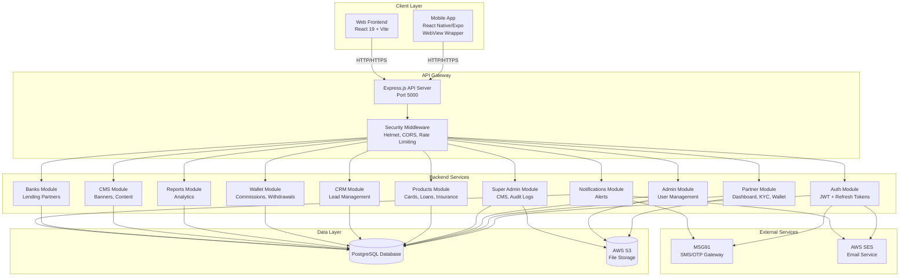
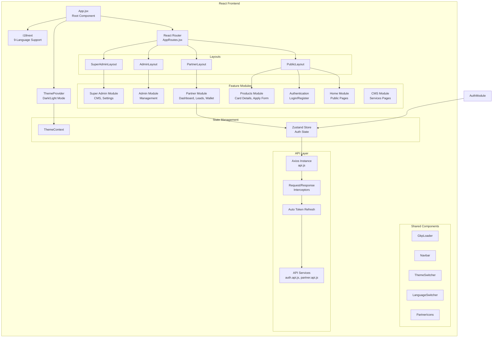
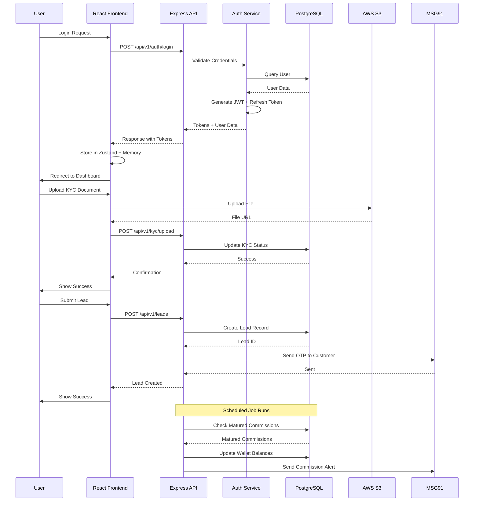
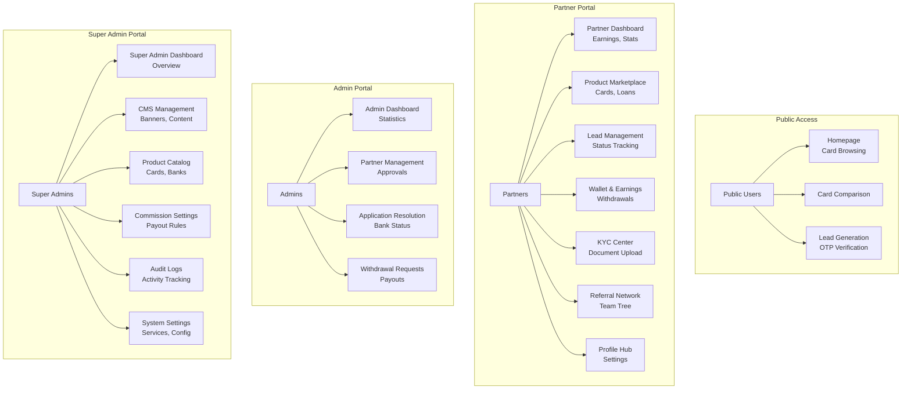

# GharKaPaisa Architecture Diagram

## High-Level System Architecture



## Frontend Architecture



## Backend Architecture

```mermaid
graph TB
    subgraph "Express.js Server"
        Server[server.js<br/>Entry Point]
        
        subgraph "Middleware"
            Security[Security Middleware<br/>Helmet, CORS, XSS Clean]
            RateLimit[Rate Limiting]
            BodyParser[Body Parser<br/>JSON, URL-encoded]
            Sanitizer[Data Sanitizer<br/>Mongo Sanitize]
            Logger[Morgan Logger<br/>Winston]
            Error[Error Handler]
        end
        
        subgraph "Routes"
            APIRouter[/api/v1 Router]
            AuthRoute[/auth Routes]
            PartnerRoute[/Partners Routes]
            AdminRoute[/admin Routes]
            SuperAdminRoute[/superadmin Routes]
            ProductRoute[/products Routes]
            WalletRoute[/wallet Routes]
            CRMRoute[/leads, applications Routes]
            CMSRoute[/cms, services Routes]
        end
        
        subgraph "Controllers"
            AuthController[Auth Controller]
            PartnerController[Partner Controller]
            AdminController[Admin Controller]
            SuperAdminController[Super Admin Controller]
            ProductController[Product Controller]
            WalletController[Wallet Controller]
            CRMController[CRM Controller]
            CMSController[CMS Controller]
        end
        
        subgraph "Services"
            AuthService[Auth Service]
            PartnerService[Partner Service]
            WalletService[Wallet Service]
            CommissionService[Commission Service]
            KYCService[KYC Service]
            NotificationService[Notification Service]
            ReportService[Report Service]
        end
        
        subgraph "Database Layer"
            DBConfig[Database Config<br/>Connection Pool]
            Migrations[Migrations]
            Seeders[Seeders]
            Procedures[Stored Procedures]
            Triggers[Triggers]
            Views[Views]
        end
        
        subgraph "Scheduled Jobs"
            CommissionJob[Commission Release Job]
            ReportJob[Report Generation Job]
        end
    end
    
    Server --> Security
    Security --> RateLimit
    RateLimit --> BodyParser
    BodyParser --> Sanitizer
    Sanitizer --> Logger
    Logger --> APIRouter
    APIRouter --> AuthRoute
    APIRouter --> PartnerRoute
    APIRouter --> AdminRoute
    APIRouter --> SuperAdminRoute
    APIRouter --> ProductRoute
    APIRouter --> WalletRoute
    APIRouter --> CRMRoute
    APIRouter --> CMSRoute
    
    AuthRoute --> AuthController
    PartnerRoute --> PartnerController
    AdminRoute --> AdminController
    SuperAdminRoute --> SuperAdminController
    ProductRoute --> ProductController
    WalletRoute --> WalletController
    CRMRoute --> CRMController
    CMSRoute --> CMSController
    
    AuthController --> AuthService
    PartnerController --> PartnerService
    WalletController --> WalletService
    WalletController --> CommissionService
    PartnerController --> KYCService
    SuperAdminController --> NotificationService
    AdminController --> ReportService
    
    AuthService --> DBConfig
    PartnerService --> DBConfig
    WalletService --> DBConfig
    CommissionService --> DBConfig
    KYCService --> DBConfig
    NotificationService --> DBConfig
    ReportService --> DBConfig
    
    DBConfig --> Migrations
    DBConfig --> Seeders
    DBConfig --> Procedures
    DBConfig --> Triggers
    DBConfig --> Views
    
    Server --> CommissionJob
    Server --> ReportJob
    CommissionJob --> DBConfig
    ReportJob --> DBConfig
    
    Error --> Server
```

## Data Flow Diagram



## User Role & Access Control



## Technology Stack Summary

### Frontend
- **Framework**: React 19.2.6 with Vite 8.0.12
- **Routing**: React Router DOM 7.17.0
- **State Management**: Zustand 5.0.14
- **HTTP Client**: Axios 1.17.0 with interceptors
- **Internationalization**: i18next 26.3.1 (9 languages)
- **Charts**: Recharts 3.8.1
- **Icons**: React Icons 5.4.0
- **Security**: React Google reCAPTCHA 3.1.0

### Backend
- **Runtime**: Node.js with Express 4.18.2
- **Database**: PostgreSQL 8.11.3 (pg driver)
- **Authentication**: JWT 9.0.3 + bcrypt 6.0.0
- **File Upload**: Multer 1.4.5-lts.1 with AWS S3
- **Security**: Helmet 7.1.0, CORS 2.8.5, express-rate-limit 7.1.5
- **Validation**: express-validator 7.3.2
- **Logging**: Winston 3.11.0 + Morgan 1.10.0
- **Email**: Nodemailer 6.9.7 + AWS SES
- **SMS**: Twilio 6.0.2 + MSG91
- **Scheduling**: node-cron 4.2.1
- **Date/Time**: dayjs 1.11.10

### Mobile
- **Framework**: React Native 0.81.5 with Expo 54.0.33
- **Navigation**: React Navigation 7.x
- **WebView**: react-native-webview 14.0.1
- **OTP**: @msg91comm/sendotp-react-native 2.1.0

### Infrastructure
- **Storage**: AWS S3 (documents, images, banners)
- **Email**: AWS SES / Nodemailer
- **SMS**: MSG91 / Twilio
- **Database**: PostgreSQL (relational data)

## Key Features by Module

### Authentication Module
- JWT-based authentication with refresh token rotation
- Role-based access control (PARTNER, ADMIN, SUPER_ADMIN)
- OTP verification via MSG91
- Password reset functionality
- Session management with auto-refresh

### Partner Module
- Dashboard with earnings analytics
- Lead management and tracking
- Wallet and commission system
- KYC document upload and verification
- Referral network management
- Profile and settings

### Admin Module
- Partner approval workflow
- Application status management
- Withdrawal request processing
- Lead resolution and tracking

### Super Admin Module
- CMS for banners and content
- Product and bank management
- Commission configuration
- Audit logging
- System settings
- Report generation

### CRM Module
- Lead generation from public site
- Customer relationship management
- Application status tracking
- Bank integration

### External Integrations
- MSG91: SMS OTP verification
- AWS S3: Secure file storage
- AWS SES: Email notifications
- PostgreSQL: Persistent data storage

---

## Latest Codebase Report

### Project Structure Overview

The GharKaPaisa project is organized into three main applications:

#### Backend (Express.js + PostgreSQL)
- **Location**: `backend/`
- **Entry Point**: `src/server.js`
- **Total Files**: 199 items
- **Main Dependencies**: 41 production packages

**Backend Structure**:
```
backend/src/
├── config/          (3 items) - Configuration files
├── constants/       (5 items) - Application constants
├── data/            (1 item)  - Static data
├── database/        (4 items) - Database migrations, seeders
├── jobs/            (2 items) - Scheduled jobs (cron tasks)
├── middleware/      (8 items) - Express middleware
├── modules/         (138 items) - Feature modules
├── routes/          (2 items) - API route definitions
├── server.js        - Main server entry point
├── services/        (5 items) - Business logic services
├── templates/       (18 items) - Email templates
└── utils/           (6 items) - Utility functions
```

**Backend Modules** (21 modules):
- **admin** (9 items) - Admin management
- **analytics** (2 items) - Analytics and reporting
- **auth** (9 items) - Authentication & authorization
- **banks** (6 items) - Bank/lending partner management
- **banner** (6 items) - Banner management
- **cms** (12 items) - Content management system
- **crm** (19 items) - Customer relationship management
- **customer** (5 items) - Customer management
- **location** (2 items) - Location services
- **marketing** (2 items) - Marketing tools
- **notifications** (7 items) - Notification system
- **partner** (16 items) - Partner portal functionality
- **payment** (2 items) - Payment processing
- **products** (11 items) - Product catalog (cards, loans)
- **reports** (7 items) - Report generation
- **sbi-credit-card** (3 items) - SBI card integration
- **super-admin** (8 items) - Super admin features
- **support** (2 items) - Customer support
- **team** (3 items) - Team management
- **wallet** (7 items) - Wallet and commission system

#### Frontend (React 19 + Vite)
- **Location**: `frontend/`
- **Entry Point**: `src/main.jsx`
- **Total Files**: 203 items
- **Main Dependencies**: 13 production packages

**Frontend Structure**:
```
frontend/src/
├── app/             (8 items) - App configuration
├── assets/          (0 items) - Static assets
├── components/      (30 items) - Reusable components
├── config/          (1 item)  - Configuration files
├── contexts/        (2 items) - React contexts
├── hooks/           (2 items) - Custom hooks
├── layouts/         (4 items) - Page layouts
├── main.jsx         - Application entry point
├── modules/         (128 items) - Feature modules
├── routes/          (3 items) - Route definitions
├── services/        (6 items) - API services
└── utils/           (2 items) - Utility functions
```

**Frontend Modules** (10 modules):
- **admin** (11 items) - Admin dashboard
- **authentication** (5 items) - Login/register
- **cms** (6 items) - CMS pages
- **customer** (3 items) - Customer features
- **home** (32 items) - Homepage and public pages
- **notifications** (1 item) - Notification components
- **partner** (41 items) - Partner portal
- **products** (8 items) - Product pages
- **public** (1 item) - Public routes
- **super-admin** (20 items) - Super admin dashboard

**Frontend Components** (30 components):
- Avatar, Button, Card, Form, Input, Modal, Navbar, Pagination, Search, Sidebar, Skeleton, Table, Toast
- ThemeSwitcher, LanguageSwitcher, Loader
- AnnouncementBanner, PartnerBannerCarousel, PartnerMobileBottomNav
- Chatbot, Razorpay integration
- Footer, Icon, common components

#### Mobile (React Native + Expo)
- **Location**: `mobile/`
- **Entry Point**: `App.js`
- **Total Files**: 21 items
- **Main Dependencies**: 10 production packages

**Mobile Structure**:
```
mobile/
├── App.js           - Main app component
├── components/      (1 item)  - Reusable components
├── config/          (1 item)  - Configuration
├── screens/         (12 items) - App screens
├── android/         - Android native code
├── assets/          - Static assets
└── app.json         - Expo configuration
```

### Database Schema

The PostgreSQL database contains the following main tables (as per DATABASE_SCHEMA.md):

**Core Tables**:
- **users** - User accounts and authentication
- **partners** - Partner information and KYC
- **admins** - Admin accounts
- **super_admins** - Super admin accounts
- **roles** - Role definitions
- **permissions** - Permission definitions

**Business Tables**:
- **products** - Financial products (cards, loans)
- **banks** - Lending partner banks
- **leads** - Customer leads
- **applications** - Loan/card applications
- **wallets** - Partner wallets
- **transactions** - Financial transactions
- **commissions** - Commission records
- **withdrawals** - Withdrawal requests

**Content Tables**:
- **banners** - Marketing banners
- **services** - Service pages content
- **notifications** - Notification records
- **audit_logs** - System audit trail

**Support Tables**:
- **support_tickets** - Customer support
- **referrals** - Referral relationships
- **teams** - Team structures
- **locations** - Geographic data

### API Endpoints Summary

**Authentication** (`/api/v1/auth`):
- POST `/register` - User registration
- POST `/login` - User login
- POST `/logout` - User logout
- POST `/refresh-token` - Refresh access token
- POST `/forgot-password` - Password reset request
- POST `/reset-password` - Password reset confirmation
- POST `/verify-otp` - OTP verification

**Partner** (`/api/v1/partners`):
- GET `/dashboard` - Partner dashboard stats
- GET `/profile` - Partner profile
- PUT `/profile` - Update profile
- POST `/kyc/upload` - Upload KYC documents
- GET `/leads` - Get partner leads
- POST `/leads` - Create new lead
- GET `/wallet` - Wallet balance
- POST `/withdrawal` - Request withdrawal
- GET `/referrals` - Referral network
- GET `/earnings` - Earnings history

**Admin** (`/api/v1/admin`):
- GET `/dashboard` - Admin dashboard
- GET `/partners` - List all partners
- PUT `/partners/:id/approve` - Approve partner
- GET `/applications` - List applications
- PUT `/applications/:id/status` - Update application status
- GET `/withdrawals` - Withdrawal requests
- PUT `/withdrawals/:id/process` - Process withdrawal

**Super Admin** (`/api/v1/superadmin`):
- GET `/dashboard` - Super admin dashboard
- GET `/cms/banners` - Manage banners
- POST `/cms/banners` - Create banner
- PUT `/cms/banners/:id` - Update banner
- DELETE `/cms/banners/:id` - Delete banner
- GET `/products` - Manage products
- POST `/products` - Create product
- PUT `/products/:id` - Update product
- GET `/commissions/settings` - Commission settings
- PUT `/commissions/settings` - Update settings
- GET `/audit-logs` - System audit logs

**Products** (`/api/v1/products`):
- GET `/cards` - List credit cards
- GET `/cards/:id` - Card details
- GET `/loans` - List loans
- GET `/loans/:id` - Loan details
- POST `/compare` - Compare products

**CRM** (`/api/v1/leads`):
- POST `/public` - Public lead submission
- GET `/:id` - Get lead details
- PUT `/:id/status` - Update lead status

**CMS** (`/api/v1/cms`):
- GET `/services` - Public services pages
- GET `/banners/public` - Public banners

### Key Features Implementation Status

**Implemented Features**:
✅ JWT-based authentication with refresh tokens
✅ Role-based access control (PARTNER, ADMIN, SUPER_ADMIN)
✅ Partner dashboard with analytics
✅ Lead management system
✅ Wallet and commission system
✅ KYC document upload
✅ Referral network
✅ Admin approval workflow
✅ Application status tracking
✅ Withdrawal processing
✅ CMS for banners and content
✅ Product catalog management
✅ Commission configuration
✅ Audit logging
✅ Multi-language support (9 languages)
✅ Dark/Light theme
✅ OTP verification via MSG91
✅ Email notifications via AWS SES
✅ File storage via AWS S3
✅ Scheduled commission release jobs
✅ Report generation

### Technology Stack Versions

**Frontend**:
- React: 19.2.6
- Vite: 8.0.12
- React Router DOM: 7.17.0
- Zustand: 5.0.14
- Axios: 1.17.0
- i18next: 26.3.1
- Recharts: 3.8.1
- Lucide React: 1.25.0
- React Icons: 5.4.0
- Framer Motion: 12.42.2

**Backend**:
- Node.js Express: 4.18.2
- PostgreSQL (pg): 8.11.3
- JWT: 9.0.3
- Bcrypt: 6.0.0
- Multer: 1.4.5-lts.1
- AWS SDK S3: 3.400.0
- AWS SDK SES: 3.1068.0
- Helmet: 7.1.0
- CORS: 2.8.5
- Express Rate Limit: 7.1.5
- Winston: 3.11.0
- Morgan: 1.10.0
- Node-cron: 4.2.1
- Dayjs: 1.11.10
- Razorpay: 2.9.6
- PDFKit: 0.19.1
- ExcelJS: 4.4.0

**Mobile**:
- React Native: 0.81.5
- Expo: 54.0.33
- React Navigation: 7.x
- React Native WebView: 14.0.1
- MSG91 SendOTP: 2.1.0
- Axios: 1.16.1

### Security Features

**Implemented Security Measures**:
- Helmet.js for HTTP headers security
- CORS configuration
- Rate limiting (express-rate-limit)
- XSS protection (xss-clean)
- NoSQL injection protection (express-mongo-sanitize)
- Input validation (express-validator)
- Password hashing with bcrypt
- JWT token authentication
- Refresh token rotation
- Secure file upload with S3 presigned URLs
- Environment variable configuration

### Development Scripts

**Backend**:
```bash
npm start          # Start production server
npm run dev        # Start development server with nodemon
npm run migrate    # Run database migrations
npm run seed       # Seed database
npm run seed:cards # Seed credit cards data
```

**Frontend**:
```bash
npm run dev        # Start development server (Vite)
npm run build      # Build for production
npm run preview    # Preview production build
npm run lint       # Run ESLint
```

**Mobile**:
```bash
npm start          # Start Expo development server
npm run android    # Run on Android
npm run ios        # Run on iOS
npm run web        # Run on web browser
```

### Current Status

**Project Health**:
- ✅ Backend: 199 files, 41 dependencies
- ✅ Frontend: 203 files, 13 dependencies
- ✅ Mobile: 21 files, 10 dependencies
- ✅ Database: PostgreSQL with comprehensive schema
- ✅ Documentation: 5 major documentation files
- ✅ All three applications are actively maintained

**Active Modules**:
- 21 backend modules covering all business domains
- 10 frontend modules with 128 feature files
- 30 reusable frontend components
- 12 mobile screens
- 18 email templates
- Scheduled jobs for commission processing

**Integration Points**:
- MSG91 for SMS/OTP
- AWS S3 for file storage
- AWS SES for email
- Razorpay for payments
- PostgreSQL for data persistence

---

*Report generated on August 22, 2026*
