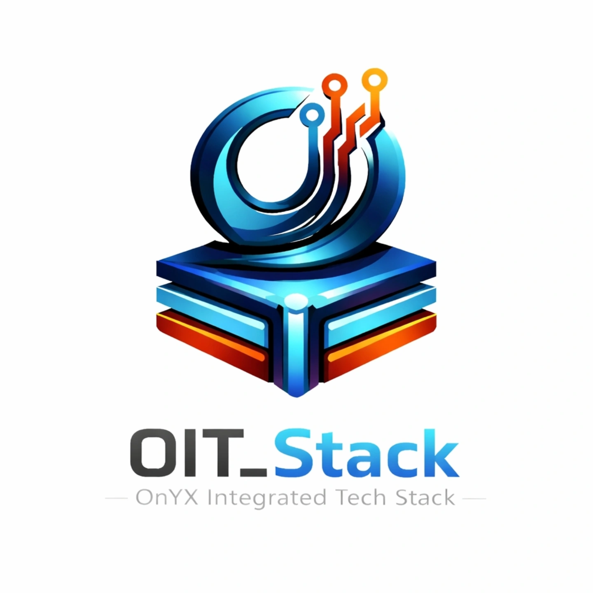

# OIT_Stack - OnYX Integrated Tech Stack



## Overview
**OIT_Stack** is a full-stack platform designed for enterprise consulting and strategic political analytics. It features a modern frontend for data visualization and a robust Node.js/MongoDB backend for handling complex election datasets.

## Project Structure

```text
oits-project/
├── backend/                # Node.js & Express API
│   ├── config/             # Database configuration
│   ├── controllers/        # API request handlers
│   ├── models/             # Mongoose schemas
│   ├── routes/             # API endpoints
│   ├── scripts/            # Database utility and migration scripts
│   ├── .env.example        # Template for environment variables
│   ├── package.json        # Backend dependencies
│   └── server.js           # Main entry point
├── frontend/               # Client-side Application
│   ├── assets/             # Images, logos, and media
│   ├── css/                # Stylesheets
│   ├── js/                 # Client-side logic
│   └── *.html              # Web pages
├── docs/                   # Project documentation
├── .gitignore              # Git ignore rules
├── README.md               # Project overview and setup
└── render.yaml             # Render deployment configuration
```

## Features
- **Dynamic Data Visualization**: Real-time charts for election results (2009-2024).
- **Modern UI/UX**: Clean, responsive design with micro-animations and glassmorphism.
- **Scalable Backend**: MongoDB-backed API with optimized constituency data fetching.
- **De-duplication Logic**: Intelligent record merging for candidate data across multiple years.

## Setup Instructions

### Prerequisites
- Node.js (v18+)
- MongoDB (Atlas or Local)

### Backend Setup
1. Navigate to the `backend` directory:
   ```bash
   cd backend
   ```
2. Install dependencies:
   ```bash
   npm install
   ```
3. Configure environment variables:
   Create a `.env` file based on `.env.example`:
   ```bash
   MONGODB_URI=your_mongodb_connection_string
   PORT=3000
   ```
4. Start the server:
   ```bash
   npm start
   ```

### Frontend Setup
The frontend is served automatically by the backend at `http://localhost:3000`. 

Alternatively, you can open `frontend/index.html` directly in a browser or use a live server extension.

## Deployment
The project is configured for deployment on **Render**.
1. Connect your repository to Render.
2. The `render.yaml` file will automatically configure the `oit-stack-backend` service.
3. Ensure the `MONGODB_URI` environment variable is set in the Render dashboard.

## License
© 2026 OIT_STACK - OnYX Integrated Tech Stack. All Rights Reserved.

